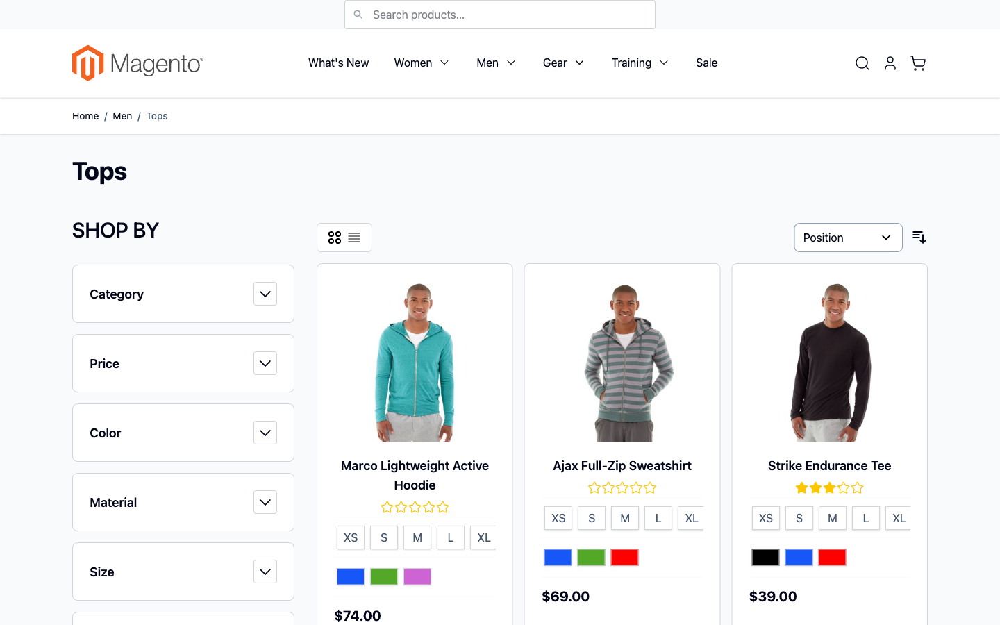

# Magento — Portfolio

A collection of Magento 2 + Hyvä modules and themes I've built to show different architectural angles on the same stack. Each subfolder is a standalone, installable project with its own README, license and full source.

The goal of this repo is not to bundle a "kitchen sink" — it's to show **how I make trade-offs** between backend, frontend, performance and UX work on Hyvä.

## Projects

| Folder | Approach | What it demonstrates |
|---|---|---|
| [`hyva-quick-view/`](hyva-quick-view/) | Full Magento 2 module — PHP controller + ViewModel + Hyvä `.phtml` + Alpine modal | End-to-end backend → frontend slice: routed JSON action, ViewModel, layout XML, Alpine focus-trapped modal |
| [`hyva-mega-menu/`](hyva-mega-menu/) | Hyvä child theme + companion module | Idiomatic theme/module split — `theme/` handles rendering, `module/` ships the EAV attribute + ViewModel for the featured-image slot |
| [`hyva-compare-drawer/`](hyva-compare-drawer/) | Client-side UX widget — Alpine store + `localStorage` | When server round-trips aren't worth it: persisted state, cross-tab sync via `window.storage`, drag-to-reorder |
| [`hyva-graphql-search/`](hyva-graphql-search/) | Headless instant search against stock Magento GraphQL | API-first frontend: debounce, `AbortController` for race-free queries, in-memory cache, keyboard nav |
| [`hyva-lazy-images/`](hyva-lazy-images/) | Performance — `<picture>` with AVIF/WebP/LQIP + IntersectionObserver | Core Web Vitals work: CLS=0 via explicit dimensions, AVIF-first srcsets, LQIP base64 placeholders |

## Live demo (Magento 2.4.8-p4 + Hyvä 1.4)

The portfolio is wired into a real Magento storefront with Magento sample data (Luma catalog, 2,040 products). 4 of the 5 modules are active and verified:

| | Module | What's shown |
|---|---|---|
|  | hyva-graphql-search | Search input at the very top of the header — injected into Hyvä's `header.container` |
|  | hyva-quick-view | Modal opens with real product (Joust Duffle Bag) — full Hyvä-rendered body, focus-trapped, `aria-modal` |
|  | hyva-compare-drawer | Floating drawer bottom-right, three products added, `localStorage` persistence — survives reload and cross-tab sync |

`hyva-lazy-images` is installed and visible in **Stores → Configuration → scr1be → Lazy Images** but isn't actively rendering picture elements in the demo (the CDN passthrough is left unconfigured — there's no point spinning up imgproxy for a screenshots-only demo).

`hyva-mega-menu` is a known compat gap on Hyvä 1.4 — see that subfolder's README for the rewrite path. The demo runs `Hyva/default` so the rest of the storefront is unaffected.

## Why this layout

Each project sits in its own folder with a complete Magento module structure (`registration.php`, `composer.json`, `etc/`, `view/`, etc.). You can copy any single folder into `app/code/Scr1be/` (or `app/design/frontend/Scr1be/` for the theme inside `hyva-mega-menu/`) or `composer require` it from a local path — they don't depend on each other.

The `hyva-mega-menu/src/` folder contains both a `theme/` and a `module/` — they ship together as one repo because the theme depends on the module's ViewModel.

## Install any one of them

```bash
# from your Magento 2 root
composer config repositories.scr1be path /path/to/Magento/hyva-quick-view/src
composer require scr1be/hyva-quick-view:@dev
bin/magento module:enable Scr1be_HyvaQuickView
bin/magento setup:upgrade
```

(Replace `hyva-quick-view` with whichever folder you want. For `hyva-mega-menu/`, point Composer at both `src/theme/` and `src/module/` paths.)

## Stack across all projects

- **Backend:** PHP 8.2+, Magento 2.4.6+
- **Frontend:** [Hyvä Theme](https://hyva.io) 1.3+, Alpine.js 3, Tailwind CSS 3
- **No legacy:** no jQuery, no RequireJS, no KnockoutJS, no UI components

## About

Senior Magento 2 / Hyvä engineer, 12+ years of building e-commerce. These repos are a snapshot of the kind of work I do — happy to walk through any of them.

— Andrii Reznichenko · [github.com/reznichenkoandrey](https://github.com/reznichenkoandrey)

## License

Every subproject is MIT-licensed. See the `LICENSE` file inside each folder.
