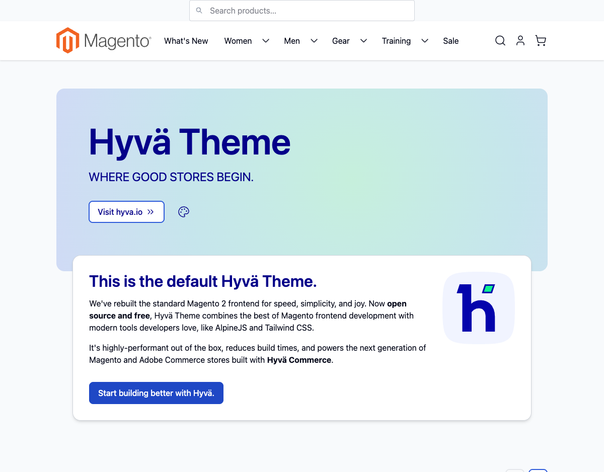
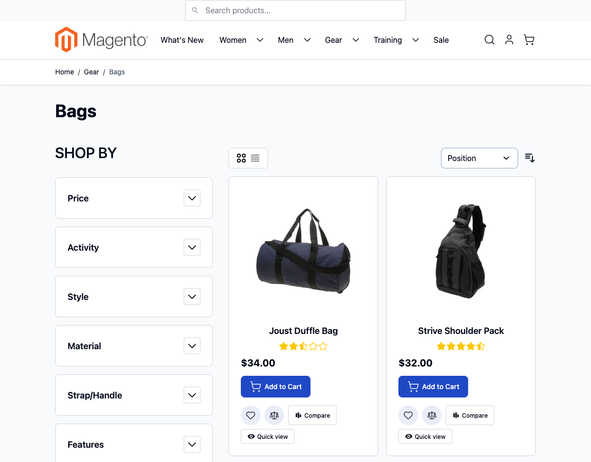
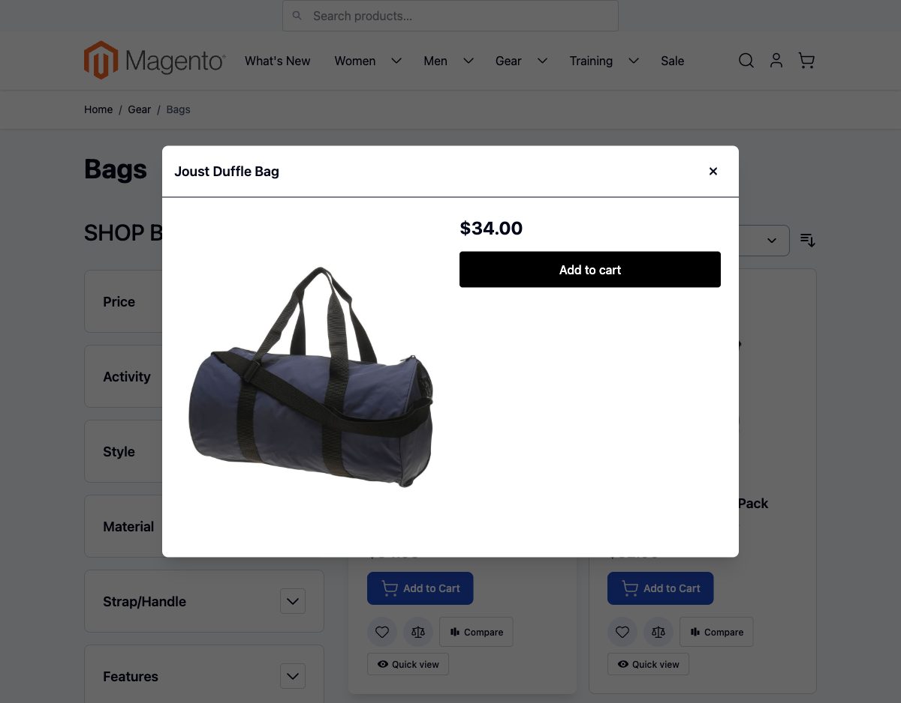
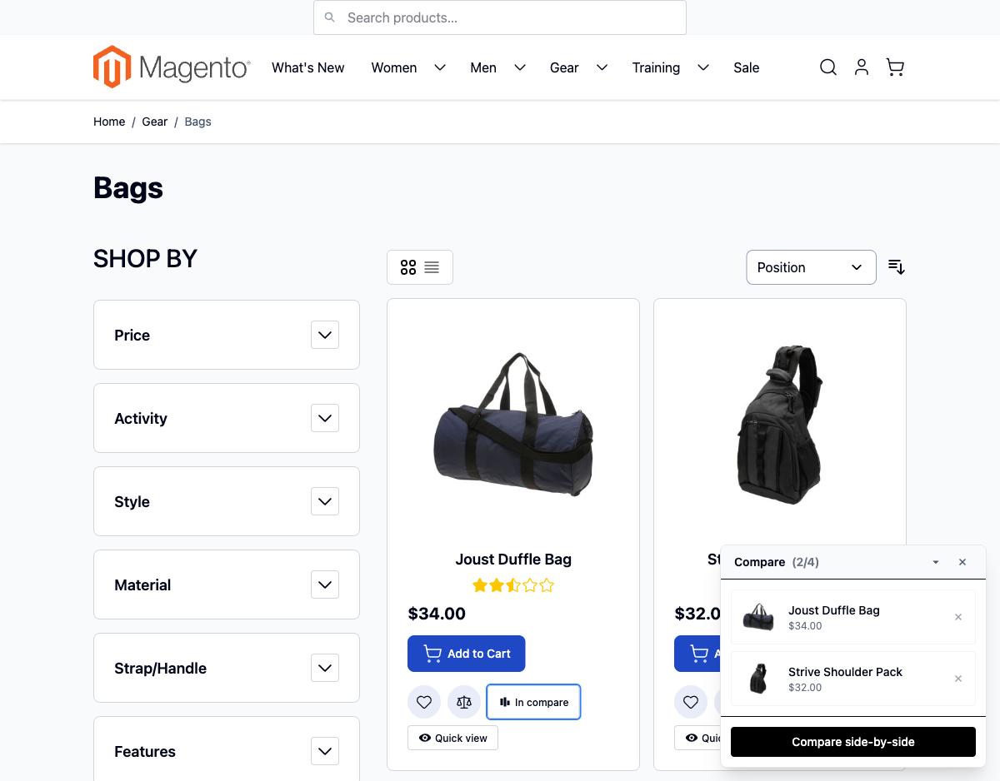
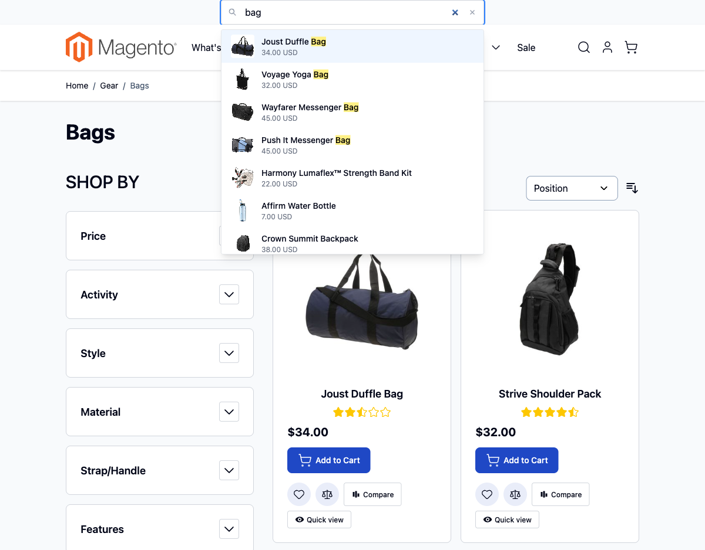
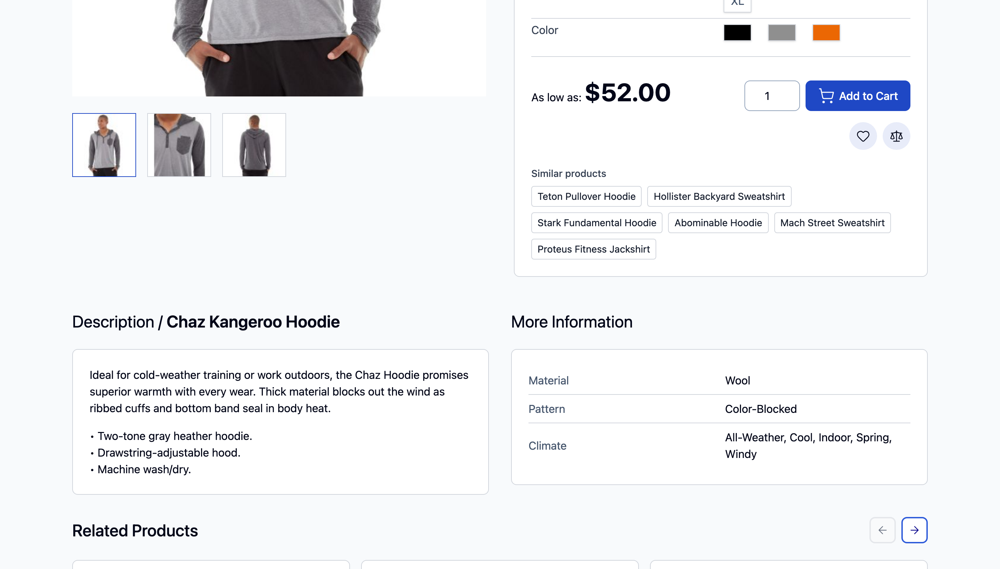

# Magento — Portfolio

A collection of Magento 2 + Hyvä modules and themes I've built to show different architectural angles on the same stack. Each subfolder is a standalone, installable project with its own README, license and full source.

The goal of this repo is not to bundle a "kitchen sink" — it's to show **how I make trade-offs** between backend, frontend, performance and UX work on Hyvä.

## Projects

| Folder | Approach | What it demonstrates |
|---|---|---|
| [`hyva-quick-view/`](hyva-quick-view/) | Full Magento 2 module — PHP controller + ViewModel + Hyvä `.phtml` + Alpine modal | End-to-end backend → frontend slice: routed JSON action, ViewModel, layout XML, Alpine focus-trapped modal |
| [`hyva-mega-menu/`](hyva-mega-menu/) | One server-rendered tree, relocated between two docks by `matchMedia` | Desktop Miller columns and a mobile accordion from a single DOM tree — L1/L2 as real anchors, L3 from a JSON island, strictly CSP-safe Alpine |
| [`hyva-compare-drawer/`](hyva-compare-drawer/) | Client-side UX widget — Alpine store + `localStorage` | When server round-trips aren't worth it: persisted state, cross-tab sync via `window.storage`, drag-to-reorder |
| [`hyva-graphql-search/`](hyva-graphql-search/) | Headless instant search against stock Magento GraphQL | API-first frontend: debounce, `AbortController` for race-free queries, in-memory cache, keyboard nav |
| [`hyva-lazy-images/`](hyva-lazy-images/) | Performance — `<picture>` with AVIF/WebP/LQIP + IntersectionObserver | Core Web Vitals work: CLS=0 via explicit dimensions, AVIF-first srcsets, LQIP base64 placeholders |

Eighteen further projects — from a silent anti-carding guard to a curated-category engine, a headless
API suite and a CMS-content-as-code toolkit — are listed with their briefs in
[`ROADMAP.md`](ROADMAP.md), and their sources are in this repository alongside the five above.

## Live demo (Magento 2.4.8-p4 + Hyvä 1.4)

The portfolio runs on a real Magento storefront with sample data (Luma catalog, 2,046 products),
all thirty modules enabled. Screenshots are from that install, not mockups:

| | Module | What's shown |
|---|---|---|
|  | hyva-mega-menu | The header nav rendered from one tree — real anchors, docked to the desktop bar. The same tree is the mobile drawer's accordion; nothing is duplicated in markup or in JS |
|  | hyva-product-card + quick-view + compare-drawer | Every card carries the same ViewModel-fed data the GraphQL layer serves, plus the two injected buttons in Hyvä's `catalog.list.item.addto` slot |
|  | hyva-quick-view | Modal over a real product, body rendered by Magento and fetched as JSON — focus-trapped, `aria-modal`, form key and `uenc` handled the way Hyvä's own add-to-cart forms do |
|  | hyva-compare-drawer | Floating drawer with `localStorage` persistence, per-item removal and an LRU cap; the card button flips to "In compare" from the same Alpine store |
|  | hyva-graphql-search | Debounced autocomplete over stock Magento GraphQL — eight matches for "bag", thumbnails and prices from the same query, match highlighting done by escaping text first and injecting `<mark>` after |
|  | product-families | A family row derived from the catalogue, not from manual linking. The kill switch ships off and the key is a merchant decision — here it is `material`, and the page proves itself: *More Information* reads Wool, and *Teton Pullover Hoodie* (Wool, Fleece, Nylon) is in the row because it shares that one value |

Earlier screenshots of the same three storefront modules, taken on the previous install, are kept in
[`demo-screenshots/`](demo-screenshots/) as `01`–`05`.

`hyva-lazy-images` is installed and visible in **Stores → Configuration → scr1be → Lazy Images** but isn't actively rendering picture elements in the demo (the CDN passthrough is left unconfigured — there's no point spinning up imgproxy for a screenshots-only demo).

## Why this layout

Each project sits in its own folder with a complete Magento module structure (`registration.php`, `composer.json`, `etc/`, `view/`, etc.). You can copy `src/` into `app/code/Scr1be/<Module>/` or `composer require` it from a local path — no project depends on another.

Three of them ship more than one module, because the parts have different blast radii: `headless-api-suite/` (six), `store-toolkit/` (three) and `content-as-code/` (two). There each module is its own directory under `src/` with its own `composer.json`, and `src/composer.json` is a metapackage that pulls in the whole set. Every one of them installs on its own; the single intra-suite dependency is `coupon-ticket`, which registers a porter into `content-transfer`'s engine.

## Install any one of them

```bash
# from your Magento 2 root
composer config repositories.scr1be path /path/to/Magento/hyva-quick-view/src
composer require scr1be/hyva-quick-view:@dev
bin/magento module:enable Scr1be_HyvaQuickView
bin/magento setup:upgrade
```

(Replace `hyva-quick-view` with whichever folder you want. For the three multi-module projects, point the path repository at `src/*` and require either the metapackage — `scr1be/headless-api-suite`, `scr1be/store-toolkit`, `scr1be/content-as-code` — or a single module out of the set.)

## Stack across all projects

- **Backend:** PHP 8.2+, Magento 2.4.6+
- **Frontend:** [Hyvä Theme](https://hyva.io) 1.3+, Alpine.js 3, Tailwind CSS 4 — except the three that ship a Tailwind stylesheet (`hyva-mega-menu`, `hyva-product-card`, `hyva-product-slider`), which need **Hyvä 1.4+**: Tailwind 4 landed in theme 1.4.0, and the still-maintained 1.3 line is still on Tailwind 3
- **No legacy:** no jQuery, no RequireJS, no KnockoutJS, no UI components

## About

Senior Magento 2 / Hyvä engineer, 12+ years of building e-commerce. These repos are a snapshot of the kind of work I do — happy to walk through any of them.

— Andrii Reznichenko · [github.com/reznichenkoandrey](https://github.com/reznichenkoandrey)

## License

Every subproject is MIT-licensed. See the `LICENSE` file inside each folder.
