# Admin Grid Toolkit

Three back-office defects that nobody files a ticket about, because in each case the wrong behaviour
looks enough like the right one to survive a decade of releases.

A merchant exports a report and opens it in a spreadsheet, and the customer is called
`O&#039;Brien`. An order grid with 400,000 rows takes as long to count as it takes to read, and the
count is a number nobody even looks at. An admin reorders for a customer on the phone, and the new
order is called `000000173-1` — which is not a new order number at all, it is what Magento calls the
first *edit* of order 173.

None of the three are related. All three are one plugin, in the admin area, on a core seam that has
been stable since 2.4.0 — which is why they ship as one module instead of three.

| Part | What it covers |
|---|---|
| `Model\Export\ValueDecoder` | The transform: what a rendered grid cell has to lose to become a value again |
| `Plugin\Grid\DecodeExportedValues` | Where it happens — the one method only the export path calls |
| `Model\Grid\CountSelectDejoiner` | The select surgery, and every question that has to be answered before a join may leave |
| `Plugin\Grid\DejoinGridCount` | The count select in, the count select out |
| `Plugin\Sales\MintFreshIncrementIdOnReorder` | One session key, absent for exactly one call |

## Why these three

They share a deployment, not a subject. Each is a defect a merchant reports as three separate
support tickets over two years, each is small enough that fixing it alone is hard to justify, and an
installation that has hit one of them is usually about to hit the other two. What they do not share
is a reason to be switched on together, so each has its own flag and its own kill-switch.

They also share a shape. All three are core doing something deliberate in a context where the
deliberate thing is wrong: escaping a value that is going into a file rather than a page, preserving
a FROM clause that no longer has any columns to produce, and treating a session key as "there is a
previous order" when it means "there is a previous order and this is a revision of it". None of them
is a bug in the sense of a mistake in a line of code, which is exactly why none of them has ever been
fixed upstream.

## What's interesting (and what's just baseline)

| Choice | Why | Honest classification |
|---|---|---|
| The export fix hooks `renderExport()`, which nothing but an export calls | Un-escaping HTML is a dangerous transform to make available anywhere near a rendered page. Hooking the one method whose only caller is `getRowFieldExport()` makes "this can never reach a response body" a property of the wiring instead of a promise in a comment | The actual insight |
| Tags are stripped **before** entities are decoded | At that point every angle bracket from the row's data is still an entity, so the only real tags are the renderer's own. Decoding first turns a shopper's literal `<b>` into a tag, and `strip_tags()` then eats it | Architectural, and silently destructive if reversed |
| The de-join works from an allowlist rather than "is this join used?" | Core's own `Select::resetJoinLeft()` answers the second question. A LEFT JOIN matching several rows still multiplies `COUNT(*)`, so removing it changes the total rather than just producing it faster, and nothing in the SQL says which kind of join it is | The decision that keeps the fix honest |
| An unqualified column in the WHERE is checked against the joined table's columns | `addFieldToFilter()` renders a grid filter with no table qualifier, so a filter on a joined column names nothing an alias check could match | The gap that makes the naive version wrong |
| …and that check is exact rather than merely cautious | A column present in both the main table and the joined table would make the grid's own query ambiguous and MySQL would refuse to run it. Because the grid runs, a bare name found in the joined table cannot belong to the main one | The part worth reading twice |
| The reorder plugin is `around`, and restores the flag it removed | The flag has three other readers, one of which decides whether the admin is allowed to retry a save that failed. A `before` plugin can unset it and can never put it back | Architectural, and the reason this is not a one-liner |
| The allowlist lives in `di.xml`, not in the admin | It is an assertion about a join's cardinality. That belongs in a diff someone reviews, not in a textarea a support agent edits at 2am | Opinionated |
| Every unanswerable question keeps the join | An undescribable table, a union, a nested select, a raised exception — all of them return the select core built | Baseline, and the difference between a slow grid and a wrong one |
| Nothing here is store-scoped | All three act on the admin application, where store scope resolves to the admin store. A per-store field would be editable and unreachable | Baseline, and a common way to ship a knob that does nothing |
| A `Phrase` returned by a renderer is left alone | It is a translated literal, not row data. Decoding it would change the type core's callers were handed for no gain | Baseline |

## Architecture

```mermaid
flowchart TD
    subgraph fix1["Fix 1 — the export path"]
        EXPORT["Export CSV / Excel XML"]
        GETCSV["Widget\\Grid\\Extended::getCsv()"]
        FIELD["Grid\\Column::getRowFieldExport()"]
        RENDER["Renderer::renderExport()<br/>→ render() → escapeHtml()"]
        PLUGIN1["Plugin\\Grid\\DecodeExportedValues<br/>after renderExport()"]
        DECODE["ValueDecoder<br/>breaks → space · strip tags · decode"]
        FILE["Hoodies &amp; Sweatshirts"]

        EXPORT --> GETCSV --> FIELD --> RENDER --> PLUGIN1 --> DECODE --> FILE
        FRAME["frame_callback<br/>(runs after, out of reach)"]
        FIELD -.-> FRAME
    end

    subgraph fix2["Fix 2 — the pager's count"]
        PAGER["Grid pager asks for the total"]
        COUNTSQL["AbstractDb::getSelectCountSql()<br/>resets ORDER · LIMIT · COLUMNS · GROUP"]
        FROMKEPT["FROM survives — every join runs again"]
        PLUGIN2["Plugin\\Grid\\DejoinGridCount<br/>after getSelectCountSql()"]
        G1{"alias in the<br/>allowlist?"}
        G2{"named in WHERE,<br/>HAVING or COLUMNS?"}
        G3{"a column of its table<br/>unqualified in there?"}
        G4{"another surviving<br/>join needs it?"}
        STRIP["setPart(FROM, …)<br/>— the join is gone"]
        KEEP["the select core built"]

        PAGER --> COUNTSQL --> FROMKEPT --> PLUGIN2 --> G1
        G1 -->|no| KEEP
        G1 -->|yes| G2
        G2 -->|yes| KEEP
        G2 -->|no| G3
        G3 -->|yes| KEEP
        G3 -->|no| G4
        G4 -->|yes| KEEP
        G4 -->|no| STRIP
    end

    subgraph fix3["Fix 3 — the reorder's increment id"]
        ENTRY["Admin → Reorder"]
        INIT["AdminOrder\\Create::initFromOrder()<br/>writes session 'reordered'"]
        SUBMIT["createOrder()"]
        PLUGIN3["Plugin\\Sales\\MintFreshIncrementIdOnReorder<br/>around createOrder()"]
        UNSET["'reordered' removed"]
        BEFORE["beforeSubmit()<br/>sees no previous order"]
        SEQ["increment id from<br/>the store's order sequence"]
        RESTORE["finally: 'reordered' restored<br/>— ACL, Cancel and the payment blocks still read it"]

        ENTRY --> INIT --> SUBMIT --> PLUGIN3 --> UNSET --> BEFORE --> SEQ --> RESTORE
    end
```



### 1. The export that carries markup instead of values

A legacy grid renders its export through the same renderers it renders the page with:

```php
// Magento\Backend\Block\Widget\Grid\Column\Renderer\AbstractRenderer
public function renderExport(DataObject $row)
{
    return $this->render($row);
}
```

and `render()`, for the default text renderer, ends in `escapeHtml()`. That is correct for a `<td>`
and wrong for a file. An ampersand arrives as `&amp;`, an apostrophe as `&#039;`, a quotation mark as
`&quot;`, and a column the grid declared editable arrives as its entire form control — a `<div>`, a
`<span>` and an `<input>` — because that is what `render()` returns for an editable column.

These renderers are marked `@deprecated 100.2.0 in favour of UI component implementation`, and the
deprecation is why the defect is still here: nobody fixes a class that is on its way out. Except that
in 2.4.8 it is not on its way out anywhere a merchant exports from. Every grid under **Reports** is
still a `Widget\Grid\Extended` — Ordered, Bestsellers, Coupons, Tax, Invoiced, Refunded, Shipping,
Products in Carts, Product Views, Downloads — and the export button is on all of them.

The plugin hooks `renderExport()` and nothing else, and that is the entire safety argument. `render()`
feeds an HTML page, where escaping is the point; `renderExport()` has exactly one caller,
`Grid\Column::getRowFieldExport()`, reached only from the export actions. Nothing this plugin returns
can end up in an admin response body, so un-escaping here cannot become a stored-XSS vector in a grid.
It is declared on the abstract renderer so it binds to every subclass, including the ones that
override `renderExport()` themselves — plugin configuration is inherited by descendants, so one
declaration covers core's renderers and any a third-party grid ships.

The transform runs in a fixed order, and the order is the whole design:

1. **Line breaks become spaces.** A `<br/>` is a renderer stacking two values in one cell. Dropping it
   silently glues them together — `Main WebsiteMain Website Store`. A space is chosen over a newline
   because a newline inside a quoted CSV field is legal but renders differently in every spreadsheet
   that opens it, and the cell is a concatenation rather than prose.
2. **Tags are stripped, before anything is decoded.** Every angle bracket that came from the row's
   data is still an entity at this point, so the only real tags in the string are the renderer's own.
   An editable column reduces to the text of its `<span>`; an action link reduces to its label.
3. **Entities are decoded last.** `Hoodies &amp; Sweatshirts` becomes `Hoodies & Sweatshirts`, and
   `&lt;b&gt;` — which the shopper typed — stays `<b>` rather than becoming a tag that step 2 would
   have eaten.

Anything with no tag and no entity is returned byte for byte, which matters more than it sounds: the
store-view renderer indents a store tree with leading spaces and joins it with `\r\n`, and that
whitespace is data, not markup.

One asymmetry is worth stating plainly rather than hiding. Magento's escaper calls
`htmlspecialchars(..., double_encode: false)`, so a value that literally contained the five characters
`&amp;` escapes to exactly what a single `&` escapes to. The distinction is destroyed before this
module is ever called, and nothing downstream can reconstruct it. Decoding is the inverse of an escape
that is not injective, and there is a unit test that says so.

### 2. The count that drags every join through it

Every grid pager asks its collection for a total, and every collection answers like this:

```php
// Magento\Framework\Data\Collection\AbstractDb
public function getSelectCountSql()
{
    $countSelect = clone $this->getSelect();
    $countSelect->reset(Select::ORDER);
    $countSelect->reset(Select::LIMIT_COUNT);
    $countSelect->reset(Select::LIMIT_OFFSET);
    $countSelect->reset(Select::COLUMNS);
    // …GROUP is folded into COUNT(DISTINCT …) if there is one
}
```

ORDER, LIMIT, COLUMNS and GROUP are reset. FROM is not. Every join a module added to render a column
therefore runs again for a query whose only output is a number — and unlike the page query, which is
limited to twenty rows, the count runs across the whole filtered set. Add three columns from three
modules to an order grid, and the pager is the most expensive query on the page by a wide margin.

MySQL will not save you here. MariaDB's optimiser eliminates a LEFT JOIN it can prove contributes
nothing; MySQL 8 has no equivalent transform and executes what it is given. The same schema, the same
grid and the same data behave differently on the two engines, which is a good way to lose an afternoon.

Core does ship the surgery. `Magento\Framework\DB\Select::resetJoinLeft()` walks the FROM part,
checks each LEFT JOIN against the columns, the WHERE and the other joins' conditions, and drops the
ones nothing refers to. Nothing in core calls it on a count select, and it is still not the right tool
here: it removes *every* unused LEFT JOIN, and a join matching more than one row per main row
multiplies `COUNT(*)`. Removing that join does not make the count faster, it makes it *different* —
and it is the pager, so nobody notices until someone reconciles a report against it.

That single fact is why this module works from an explicit list. Naming a correlation name in
`di.xml` is a reviewable assertion that the join matches at most one row per order, and it is the one
thing no amount of SQL inspection can establish. Everything else is inspected rather than assumed. A
join stays if:

- **its alias or its table name is named** in the count's WHERE, HAVING or remaining column
  expression. The column expression matters because a grid with a `GROUP BY` has its grouping columns
  folded into `COUNT(DISTINCT …)` by core before the plugin ever sees the select;
- **one of the joined table's own columns appears unqualified** in the WHERE or HAVING.
  `addFieldToFilter()` renders a grid filter as a bare quoted identifier — a filter on a joined
  column reads `` `eta_date` >= '2026-01-01' `` and names nothing an alias check could match. This
  check is exact rather than merely cautious: a column present in both the main table and the joined
  table would make the grid's own query ambiguous and MySQL would refuse to run it, so a bare name
  found in the joined table's columns cannot be the main table's. Qualified references are removed
  from the text before the search, so `` `main_table`.`status` `` does not keep a join whose table
  happens to have a `status` column of its own;
- **another surviving join depends on it.** Removing one join can promote the next into that
  position, so this runs to a fixed point rather than once;
- **anything at all could not be established** — a union, a derived table, a schema the connection
  cannot describe, an exception from any part of the analysis. All of them return the select core
  built, unmodified. The FROM part is written once, after every candidate has been cleared, so a
  failure halfway through cannot leave a half-rewritten query behind.

The joined table's column list comes from `describeTable()`, which answers from Magento's DDL cache
after the first call — the cost is paid once per table per cache lifetime, not once per grid page.

The module ships with an **empty allowlist**, and is therefore inert until someone fills it in.
Vanilla `sales_order_grid` has no LEFT JOINs; shipping a populated list would be guessing at somebody
else's schema. See *Measuring it* below for how to find out whether your installation has anything to
gain.

### 3. The reorder that thinks it is an edit

`AdminOrder\Create::initFromOrder()` records how the order-create page was entered:

```php
$session->setData($order->getReordered() ? 'reordered' : 'order_id', $order->getId());
```

An **edit** writes `order_id`. A **reorder** writes `reordered`. Two thousand lines later, both are
read by the same condition on the way to submitting the quote:

```php
// AdminOrder\Create::beforeSubmit()
if ($this->getSession()->getReordered() || $this->getSession()->getOrder()->getId()) {
    $orderData = [
        'original_increment_id'   => $originalId,
        'relation_parent_id'      => $oldOrder->getId(),
        'relation_parent_real_id' => $oldOrder->getIncrementId(),
        'edit_increment'          => $oldOrder->getEditIncrement() + 1,
        'increment_id'            => $originalId . '-' . ($oldOrder->getEditIncrement() + 1),
    ];
    $quote->setReservedOrderId($orderData['increment_id']);
}
```

That branch is right for an edit and wrong for a reorder. A reorder is a *new* order for the same
items — the original is untouched, still open, still shipping. What it gets instead is the original's
increment id with an edit suffix, a `relation_parent` pointing at an order it did not replace, and an
admin order view that describes it as a revision. `afterSubmit()` then cancels the old order only when
`order_id` is set, so the reorder leaves both orders live and linked as if one superseded the other.

There is a second-order consequence that turns the cosmetic problem into a hard failure. The suffix is
computed from the *original* order's `edit_increment`, and nothing on the reorder path ever increments
it. Reorder the same order twice and both attempts compute `-1`; `sales_order` carries a unique
constraint over `(increment_id, store_id)`, so the second reorder does not produce a confusing order
number, it produces a database error the admin cannot do anything about.

The fix is to make the reorder look like what it is: no previous order in the session, so core takes
the plain path and the quote's reserved id comes from the store's order sequence — exactly what the
storefront's own reorder does.

**`around`, and this is the case `around` is actually for.** The flag has to be absent while core runs
and present again afterwards. That is a scoped mutation with a restore, not a decision about arguments
or a return value; a `before` plugin could unset it and could never put it back.

Putting it back is not tidiness. The flag has three other readers, and each has to keep working:

- **`Order\Create::_getAclResource()`** maps the `save` action to `Magento_Sales::reorder` while the
  flag is set, and to `Magento_Sales::create` otherwise. Authorization is resolved in `dispatch()`,
  long before this plugin runs, so the current request is unaffected — but a save that throws (a
  declined payment, a validation error) leaves the admin on the create page to try again, and the
  retry is a fresh request that resolves the ACL again. A role granted reorder but not create would be
  locked out of finishing its own reorder by a permanent unset.
- **`Order\Create\Cancel`** reads it to send the admin back to the order they came from.
- **The vault and PayPal admin blocks** read it to find the customer behind the payment form.

On the successful path the restore is immediately irrelevant, because `Order\Create\Save` calls
`clearStorage()` on the next line. That is the point: the plugin's effect is narrowed to core's submit,
and the session is left exactly as it was found.

Two behaviours are preserved deliberately. **Order edits still walk the suffix path** — the check for
`order_id` steps aside for them, because there the lineage is the correct description of what happened.
And **the edit check reads the session key directly** rather than calling `getOrder()->getId()` the way
core does; the two answer the same question and only one of them loads an order from the database to
ask it.

## Design decisions

- **Three fixes, one module, three switches.** They are unrelated defects with a shared deployment.
  Bundling them behind a single flag would force a merchant who wants the export fix to also accept a
  change to how orders are numbered.
- **The allowlist is code, not configuration.** It asserts something about a join's cardinality that
  the module cannot verify. That assertion belongs in a diff someone reviews. The `di.xml` block
  carries the reasoning next to the empty array so the next person has it in front of them.
- **One allowlist serves every grid the plugin is wired to.** Correlation names are matched against
  the FROM of the select actually in hand, so an alias that exists only on the invoice grid can never
  match while counting orders. Per-grid lists would be ceremony without a failure mode to prevent.
- **No numbers are quoted for the de-join.** The module ships inert, and the win is entirely a
  function of your joins and your row count. A benchmark from a machine that is not yours, on a schema
  that is not yours, would be decoration. *Measuring it* below produces the number for your
  installation instead.
- **The frame callback is out of scope.** `getRowFieldExport()` applies a grid's `frame_callback`
  *after* the renderer, so a callback that emits markup is beyond this plugin's reach. Hooking the
  column instead would have covered it — and would also have overridden grid authors who are handed an
  `$isExport` flag and chose what to do with it. Being outside the renderer's contract is their
  decision to make.
- **Nothing is logged on the happy path.** A reorder that got a fresh increment id is visible as the
  order's increment id, and a de-joined count is visible in the query log. The only log lines this
  module writes are the two "I could not analyse this, so I changed nothing" warnings, which are the
  ones somebody would actually go looking for.
- **The de-join rewrites the select in place.** The object is a clone core made for this one query and
  handed straight back; cloning it again to avoid mutating an argument would be ceremony around a
  value nobody else holds.
- **No data patches, no schema, no ACL beyond the config section.** The module adds no table, no
  column and no attribute. Uninstalling it is `module:disable`.

## What gets shipped

```
src/
├── registration.php
├── composer.json                                   # scr1be/admin-grid-toolkit
├── etc/
│   ├── module.xml
│   ├── config.xml                                  # defaults — all three fixes on
│   ├── acl.xml                                     # Scr1be_AdminGridToolkit::config
│   └── adminhtml/
│       ├── di.xml                                  # all three plugins + the join allowlist
│       └── system.xml                              # master switch + one per fix
├── Model/
│   ├── Config.php                                  # default scope, master switch folded in
│   ├── Export/
│   │   └── ValueDecoder.php                        # breaks → space · strip tags · decode
│   └── Grid/
│       └── CountSelectDejoiner.php                 # the select surgery and its guards
├── Plugin/
│   ├── Grid/
│   │   ├── DecodeExportedValues.php                # after renderExport()
│   │   └── DejoinGridCount.php                     # after getSelectCountSql()
│   └── Sales/
│       └── MintFreshIncrementIdOnReorder.php       # around createOrder()
├── i18n/en_US.csv
└── Test/Unit/                                      # 6 PHPUnit classes, 51 tests
```

## Install

```bash
# from your Magento 2 root
composer config repositories.scr1be path /path/to/Magento/admin-grid-toolkit/src
composer require scr1be/admin-grid-toolkit:@dev
bin/magento module:enable Scr1be_AdminGridToolkit
bin/magento setup:upgrade
bin/magento setup:di:compile
```

Two of the three fixes work as soon as the module is enabled. The third — the count de-join — needs an
allowlist, which is a `di.xml` edit rather than a setting:

```xml
<type name="Scr1be\AdminGridToolkit\Model\Grid\CountSelectDejoiner">
    <arguments>
        <argument name="removableJoins" xsi:type="array">
            <item name="delivery_eta" xsi:type="string">delivery_eta</item>
        </argument>
    </arguments>
</type>
```

The value is the **correlation name** — what the joining module passed to `joinLeft()`, and what the
select's FROM part is keyed by — not the table name. Put a name here only once you are satisfied the
join matches at most one row per order.

## Configuration

**Stores → Configuration → scr1be → Admin Grid Toolkit**

| Setting | Scope | Default | Notes |
|---|---|---|---|
| Enable toolkit | default | Yes | Master switch. Off is core behaviour for all three |
| Export legacy grid values, not their HTML | default | Yes | Affects the CSV and Excel XML files only — never a rendered page |
| Drop allowlisted joins from the order grid count | default | Yes | Governs whether the analysis runs at all; with an empty allowlist it does nothing either way |
| Give an admin reorder its own increment ID | default | Yes | Order edits are unaffected |

Default scope only, deliberately — see the note in `system.xml`.

## Measuring it

The de-join is the one fix worth measuring rather than trusting, and the measurement is two queries.

**Does this installation have anything to gain?** Look at what the order grid's count actually runs.
With the module disabled, open the order grid and read the query log (`bin/magento dev:query-log:enable`,
or MySQL's general log). The count is the one selecting `COUNT(*)`. If its FROM has nothing but
`sales_order_grid`, you are done — vanilla Magento has no joins here and there is nothing to remove.

**If there are joins**, take that query and compare it against the same query without them:

```sql
-- what core runs
EXPLAIN ANALYZE SELECT COUNT(*) FROM sales_order_grid AS main_table
    LEFT JOIN delivery_eta AS eta ON eta.order_id = main_table.entity_id;

-- what the module runs
EXPLAIN ANALYZE SELECT COUNT(*) FROM sales_order_grid AS main_table;
```

`EXPLAIN ANALYZE` (MySQL 8.0.18+) reports actual time and actual row counts per operator, so the
difference is a measurement rather than an estimate. What changes is the plan shape: the join
disappears from the plan entirely, and with it one index lookup per row of the filtered set. On a grid
of a few thousand orders that is not worth a module; the shape of the win is linear in row count, and
it is the installation with six figures of orders and three third-party grid columns that notices.

Run the filtered case too — apply a grid filter and repeat — because that is where the guards decide
to keep a join, and a de-join that only fires on the unfiltered grid is worth knowing about before you
report the improvement to anyone.

## Demo notes

On a stock **Magento 2.4.8 + Hyvä 1.4 + Luma sample data** storefront. All three are admin-side, so
the theme is irrelevant to every step below.

**Fix 1 — the export.**

1. Admin → Catalog → Products → edit *Chaz Kangeroo Hoodie* and set its name to
   `Chaz Kangeroo Hoodie "Pro" & O'Brien`. Save. Three of the characters Magento escapes, in one
   product name.
2. On the storefront, add that product to the cart. (Reports → Products in Carts reads live quote
   items; no order is needed.)
3. Admin → Reports → Marketing → **Products in Carts** → Export → **CSV**. Open the file. The Product
   column reads `Chaz Kangeroo Hoodie &quot;Pro&quot; &amp; O&#039;Brien`.
4. Enable the module (or set *Export legacy grid values* to Yes and flush the config cache) and export
   again: `Chaz Kangeroo Hoodie "Pro" & O'Brien`. The Excel XML export changes with it — both formats
   go through the same `getRowFieldExport()`.
5. Confirm the safety property while you are there: the grid **page** is unchanged, because nothing
   this module does is on `render()`.

**Fix 2 — the count.** Vanilla `sales_order_grid` has no LEFT JOINs, so the module has nothing to
remove and the honest demo is the measurement above. To watch the surgery happen, add a join with a
scratch module — this belongs in a throwaway `app/code/Demo/GridJoin`, never in this one:

```php
// Demo\GridJoin\Plugin\AddDemoJoin::afterGetSelect() on the order grid collection
$select->joinLeft(['eta' => $this->resource->getTableName('demo_delivery_eta')], 'eta.order_id = main_table.entity_id', []);
```

With `eta` in the allowlist, the pager's count runs without the join while the grid page still renders
its column. Filter the grid on a column of the joined table and the count keeps the join — that is the
unqualified-column guard doing its job, and it is the behaviour to check before trusting the fix on a
real schema.

**Fix 3 — the reorder.** Luma sample data ships orders, or place one on the storefront.

1. Set *Give an admin reorder its own increment ID* to **No**, flush the config cache, and reorder:
   Admin → Sales → Orders → open an order → **Reorder** → Submit Order. The new order is
   `<original>-1`, its Order View shows it as related to the original, and the original is still open.
2. Reorder the *same* order again. It fails — both attempts compute the same `-1` suffix and
   `sales_order` has a unique key over `(increment_id, store_id)`.
3. Set the flag back to **Yes**, flush the config cache, and reorder that order twice more. Both go
   through, both get their own increment id from the store's sequence, and neither claims a
   relationship to the original.
4. Check the case that has to keep working: Admin → Sales → Orders → open an order → **Edit** →
   Submit. It still becomes `<original>-1`, the original is still cancelled, and the Order View still
   shows the lineage. The module has no opinion about edits.

## Tests

```bash
# from your Magento 2 root
# path follows your install method — Composer package:
vendor/bin/phpunit -c dev/tests/unit/phpunit.xml.dist vendor/scr1be/admin-grid-toolkit/Test/Unit

# …or, if you copied the module into app/code instead:
vendor/bin/phpunit -c dev/tests/unit/phpunit.xml.dist app/code/Scr1be/AdminGridToolkit/Test/Unit
```

51 tests across six classes, covering the parts that can actually be wrong.

The decoder is tested on the five escapes Magento produces, on renderer markup (an editable column's
form control, an action link, both spellings of a line break), on the values that must come back byte
for byte — including the store-view tree whose leading spaces are data — on decoding being a single
pass, and on the non-injective escape, where the test asserts the ambiguity rather than pretending it
away.

The de-joiner is the class with something to get wrong, and it gets the most: a join removed, a join
kept for each of the five ways a count can still refer to it, a qualified column of another table
*not* keeping it, a join another surviving join depends on, a chain that leaves together, an inner
join and a main table that are never candidates, a union that stops the analysis, an undescribable
table that keeps its join and logs, and the shipped empty allowlist inspecting nothing at all.

The reorder plugin is tested on what core sees at the moment it decides: the flag absent for a
reorder, present for an edit, present when the fix is off, and restored after the submit throws —
which is the case the ACL retry depends on.

The plugins themselves are tested for what they are: three-line hand-offs with a kill-switch and a
type guard. The DI wiring, the config XML and the ACL are configuration, and they are covered by the
demo walkthrough rather than by mocks.

## Compatibility

| | Version |
|---|---|
| PHP | 8.2, 8.3, 8.4 |
| Magento 2 | 2.4.6, 2.4.7, 2.4.8 |
| MySQL | 8.0+ (MariaDB eliminates some of these joins on its own — see fix 2) |

No Hyvä dependency and no storefront code: every interceptor is declared in `etc/adminhtml/di.xml`,
and none of the three types it hooks is instantiated in the storefront, REST or GraphQL stacks.

All three seams are load-bearing rather than incidental, which is what makes them safe to hook.
`renderExport()` is the single entry point every legacy grid export goes through, and the class
carrying it is deprecated rather than moving. `getSelectCountSql()` is what every collection in the
framework answers a pager with. The session keys `reordered` and `order_id` are written by one line of
`initFromOrder()` and read by four places across three modules, none of which could be changed without
changing all of them. Written for Magento Open Source; nothing here touches an entity's link field, so
the Commerce staging caveat that applies to catalog modules does not apply.

## License

MIT — see [LICENSE](LICENSE).
