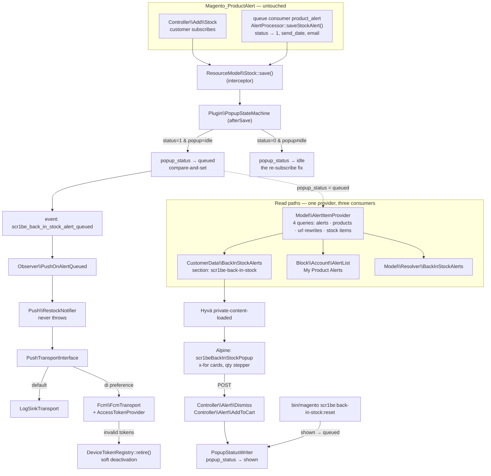

# Back In Stock

Magento already knows which customers are waiting for which products. It has a table for it, a cron
job that watches stock, and an email template. What it does not have is anything that happens *after*
the email — no record the customer can look at, no acknowledgement, no second channel, and nothing at
all on the storefront. The alert is fire-and-forget: one message, sent once, into an inbox.

This module keeps the alert alive past the email. **One extra column** on the core table turns
"notified" into a small state machine; a customer-data section and a Hyvä popup put the restocked
products in front of the customer the next time they arrive, with inline and bulk add-to-cart; a "My
Product Alerts" account page and a GraphQL query make the whole subscription list visible for the
first time; and an optional push channel reaches a customer who is not on the site at all.

Everything is built on `product_alert_stock`. There is no shadow table of alerts, no second
subscription mechanism, and no replacement for the emails core already sends.

| Part | What it covers |
|---|---|
| `etc/db_schema.xml` | One column on somebody else's table, and one table of our own |
| `Model\AlertState` | The two state machines, and where each of them is written |
| `Plugin\PopupStateMachine` | The `afterSave` that fixes core's re-subscribe, and the event it dispatches |
| `Model\AlertItemProvider` | Four queries, whatever the number of alerts |
| `Model\ResourceModel\PopupStatusWriter` | Compare-and-set transitions, and the WHERE clause that is a security boundary |
| `CustomerData\BackInStockAlerts` | Per-customer data on a full-page-cached document, and the honest ceiling of that |
| `Controller\JsonPostAction` | The form-key check Magento's own CSRF validator skips for XHRs |
| `Controller\Alert\AddToCart` | One endpoint for the single button and the bulk one, with composites reported rather than guessed |
| `Block\Account\AlertList` | The list core never gave the customer |
| `Model\Resolver\BackInStockAlerts` | The same list, for a client that is not a storefront |
| `Model\Push\*` | A transport interface, a log sink, and FCM HTTP v1 with self-healing token cleanup |

## Why this exists

Three problems, in the order a customer meets them.

**The email is the only artefact, and it is the one thing that might not arrive.** A back-in-stock
alert is the highest-intent message a shop sends: the customer asked for it by name. It is also sent
to an address that may have a promotions tab, a spam filter, or a two-week-old unread count. Core's
answer to a missed alert is nothing at all — `Magento\ProductAlert\Model\Mailing\AlertProcessor::saveStockAlert()`
sets `send_date`, increments `send_count`, sets `status` to `1` and saves, and from that moment the
row is inert. The customer can come back to the site the same afternoon, browse the category the
product is in, and be told nothing.

**The subscription is invisible.** There is no account page for stock alerts, no counter, no list.
`Magento\ProductAlert\Controller\Add\Stock` adds a success message and redirects; the only route back
is the unsubscribe link at the bottom of the email that has not arrived. A customer with six alerts
outstanding has no way to find out that they have six alerts outstanding.

**The state machine has a hole in it, and the hole is silent.** This one is worth walking through,
because the whole plugin exists for it, and because it is the shape of bug that survives a code
review. `Magento\ProductAlert\Model\ResourceModel\Stock::_beforeSave()` handles re-subscription by
looking the row up, merging it into the object and resetting the status:

```php
if ($object->getId() === null && $object->getCustomerId() && $object->getProductId() && $object->getWebsiteId()) {
    if ($row = $this->_getAlertRow($object)) {
        $object->addData($row);
        $object->setStatus(0);
    }
}
```

`addData($row)` brings **every** column of the old row back, including any column another module has
added — and then only `status` is reset. So a module that tracks its own notion of "already dealt
with" alongside core's gets a row where core says *armed* and the extra column still says *finished*.
Nothing errors. The alert fires again, the email goes out again, and the second surface never
appears — for that customer, for that product, forever.

## What's interesting (and what's just baseline)

| Choice | Why | Honest classification |
|---|---|---|
| One column on core's table, not a table of our own | The popup state and the alert state have to be read and written together, and a join is a second thing that can disagree. Declarative schema merges the column into `Magento_ProductAlert`'s table and takes it away again on uninstall | The design decision the rest follows from |
| Three popup states, not a boolean | `idle → queued → shown` is what makes "core re-armed the alert" a transition the plugin can act on. A boolean "seen" flag has nowhere to put the reset | Opinionated, and the thing a boolean version gets wrong |
| The transitions are compare-and-set | Two application servers running the same mail run both decide to queue the same alert. `UPDATE … WHERE popup_status = :from` is what makes one of them the winner, and the affected-row count is how the push channel avoids sending twice | Baseline, and easy to leave out |
| The plugin dispatches an event instead of pushing | Push is one `events.xml` away from not existing, and the notification is sent exactly as often as the state actually changes | Opinionated |
| Four queries per popup, regardless of card count | The obvious implementation asks the price model, the review helper, the stock registry and the url finder per product. On six cards that is twenty-four queries on a surface whose entire promise is that it appears instantly | The section with the numbers |
| The endpoints implement `CsrfAwareActionInterface` | Magento's default CSRF validator waives the form key for any POST carrying `X-Requested-With` | Baseline everywhere, absent almost everywhere |
| Composites are reported as skipped, not guessed at | A card has no `super_attribute` map. A button that posts an incomplete cart line is worse than a link to the page that can complete it | Baseline, and commonly got wrong |
| Quantity rules are loaded and enforced twice | Once in the stepper so the customer never sees an unsellable number, once in the controller because the stepper is in the browser | Baseline |
| No `sections.xml` | Hyvä's private-content bootstrap refetches *every* section and never reads the invalidation map. Shipping one would be configuration that looks load-bearing and is not | The finding that surprised me |
| The popup is removed from three specific layout handles | Same three storefront actions `Magento_Csp` treats as payment pages, and the import map goes with the dialog rather than being left behind | Opinionated |
| Push has a log-sink default | The whole path — registry, state machine, observer, message — is exercisable with no Firebase project and no outbound request | The reason the demo works |
| Device tokens are keyed by SHA-256, not by the token | A fixed-width unique key that upserts cleanly, and the index is not a copy of the secret | Baseline |
| A refused token is deactivated, not deleted | The same browser comes back with the same token after a service-worker reinstall, and the row carries the customer association and the reason | Opinionated |
| Only *permanent* refusals retire a token | A 503 is Google having a bad minute. Retiring on it quietly unsubscribes real customers, a few outages in | The distinction the naive version misses |
| The GraphQL query returns skus, not images | Everything storefront-shaped — a resized image, a taxed price, a formatted currency — belongs to `products()`, where core already does it correctly | Opinionated, and argued below |

## Architecture



### 1. One column, and why it is on somebody else's table

```xml
<table name="product_alert_stock" resource="default" engine="innodb" comment="Product Alert Stock">
    <column xsi:type="smallint" name="popup_status" … default="0"/>
    <index referenceId="SCR1BE_BACK_IN_STOCK_CUSTOMER_ID_WEBSITE_ID_POPUP_STATUS" indexType="btree">
        <column name="customer_id"/><column name="website_id"/><column name="popup_status"/>
    </index>
</table>
```

Declarative schema merges every module's declaration of a table name into one definition, so this
file *contributes* a column rather than shadowing the table. `Magento_ProductAlert` is in the
module's `<sequence>` so its declaration is read first, and `db_schema_whitelist.json` lists only the
column and the index — which is what makes `setup:upgrade` take them away again when the module is
removed, leaving core's table as it found it.

The index exists because the provider's only query is `(customer_id, website_id, popup_status)` with
the last one pinned to a single value, and every index core puts on that table is single-column.

The state machine reads:

| `status` (core) | `popup_status` (ours) | Means |
|---|---|---|
| 0 | 0 (idle) | Subscribed, waiting for stock |
| 1 | 1 (queued) | The product came back and the customer has not acknowledged it |
| 1 | 2 (shown) | Acknowledged: dismissed, or added to the cart |
| 0 | 2 (shown) | **Impossible, and the reason the plugin exists.** Core produces this row on every re-subscription; left alone it means the popup can never be queued for that alert again |

### 2. The plugin: where, when, and the bug

**Where.** `Magento\ProductAlert\Model\ResourceModel\Stock::save()`. Every writer reaches it:
`Magento\ProductAlert\Controller\Add\Stock::execute()` builds a `Magento\ProductAlert\Model\Stock`
and calls `save()` on it, and `AlertProcessor::saveStockAlert()` does the same to an alert it loaded
from a collection. Both go through `AbstractModel::save()` → `$this->getResource()->save($this)`, and
the resource model came from the object manager, so it is an interceptor.

An observer would have been the other option and is worse here: `Magento\ProductAlert\Model\Stock`
sets no `_eventPrefix`, so the only events its save dispatches are `model_save_after` and
`core_abstract_save_after` — global events that fire for every model in the system and would have to
be filtered with an `instanceof` on each one.

**When.** `after`, not `before` or `around`. The interesting state is *produced inside* core's
`_beforeSave()`, which runs after any `beforeSave` plugin — before it runs, the object holds four ids
and no status at all. `after` is the first moment the merged row and the reset status are both
visible.

**The fix.** Two guarded transitions, each a single `UPDATE`:

```php
if ($status === ALERT_SENT && $popupStatus === POPUP_IDLE) {
    // the alert just fired: owe the customer a popup, and tell the push channel
}
if ($status === ALERT_ARMED && $popupStatus !== POPUP_IDLE) {
    // core re-armed the alert; whatever the popup state was, it describes a subscription that is over
}
```

Neither goes through the model. Saving it would rewrite every column of a row that belongs to core —
and, more importantly, would re-enter the interceptor and therefore this plugin. A targeted `UPDATE`
has no plugins on it and cannot recurse.

The write is a compare-and-set (`WHERE popup_status = :from`), and its affected-row count is the
return value. That is what makes the "alert queued" event fire exactly once even when two application
servers process the same mail run — the loser of the race gets `0` rows and sends nothing.

One small piece of bookkeeping that is easy to miss: after syncing the in-memory object the plugin
calls `setHasDataChanges(false)`. `AbstractDb::save()` lowers that flag on the way out and
`AbstractModel::setData()` raises it again whenever the value differs; leaving it raised turns the
next `save()` of the same object from a no-op into a full row rewrite.

### 3. Four queries, whatever the number of cards

`AlertItemProvider` is the whole read side, and its shape is the point.

```
1. SELECT alert_stock_id, product_id, send_date FROM product_alert_stock
   WHERE customer_id = ? AND website_id = ? AND popup_status = 1
   ORDER BY send_date DESC, alert_stock_id DESC LIMIT n

2. one product collection, with three joins bolted on before it loads

3. one url_rewrite lookup for the whole page, from addUrlRewrite()'s _afterLoad hook

4. SELECT … FROM cataloginventory_stock_item WHERE product_id IN (…)
```

The alert rows are read raw rather than through `Magento\ProductAlert\Model\ResourceModel\Stock\Collection`,
because that collection exists to hydrate alert *models* so the mail run can save them back, and
everything downstream of here wants three scalars and then joins the interesting data on from the
catalogue.

The second query is where the enrichment happens, and every join is a core call:

- **Price** — `Collection::addPriceData($customerGroupId, $websiteId)`. Core's
  `_productLimitationPrice()` joins `catalog_product_index_price` for that group and website and
  selects `price`, `tax_class_id`, `final_price`, `minimal_price`, `min_price`, `max_price` and
  `tier_price`. It is an **inner** join, which is also the website filter: a product with no index row
  for this website and group falls out of the collection entirely. That is deliberate — a card with no
  price on it is worse than no card, and the alert row survives for when the product comes back.
- **Reviews** — `Magento\Review\Model\ResourceModel\Review\Summary::appendSummaryFieldsToCollection()`,
  the same call `Magento\Review\Observer\CatalogProductListCollectionAppendSummaryFieldsObserver`
  makes on a category listing. It left-joins `review_entity_summary` and `IFNULL`s both columns to
  zero. It also checks `isLoaded()` and silently does nothing on a loaded collection, which is why
  the call order in `loadProducts()` matters.
- **Salability** — `Magento\CatalogInventory\Model\ResourceModel\Stock\Status::addStockDataToCollection($collection, false)`.
  The `false` chooses a left join, so an out-of-stock product still comes back and renders without a
  buy button rather than disappearing. `Magento_InventoryCatalog` wraps that method with
  `AdaptAddStockDataToCollectionPlugin`, which takes the same flag and points the join at the stock
  index of the current website — so the one call is correct on single- and multi-source installations
  alike, and the resulting column is `is_salable` either way.
- **URLs** — `addUrlRewrite()`. This one is not a join: it sets a flag, and the collection's
  `_afterLoad()` runs a single `findAllByData()` over `url_rewrite` for every product on the page and
  stamps `request_path` onto each. That is the third query, and it is worth it — without it
  `Product\Url::getUrl()` does its own `findOneByData()` per product, which is one query per card.

The fourth query is `StockItemRepositoryInterface::getList()` with a `setProductsFilter()` criteria.
One trap in it is worth naming: `setScopeFilter()` takes the *stock item's* `website_id`, which is not
the website the customer is on. `Magento\CatalogInventory\Model\Configuration::getDefaultScopeId()`
returns `0` and every stock item is written against it, so asking for the real website id returns
nothing at all. The items come back as `Magento\CatalogInventory\Model\Stock\Item`, whose
`getMinSaleQty()` and `getQtyIncrements()` already fold in the `use_config_*` fallbacks — so the rules
arrive resolved rather than as a pair of "value plus whether to believe it".

Badges are derived from what is already loaded and nothing else. A badge that needs its own query is
six queries on a six-card popup.

### 4. The section, and its honest ceiling

The popup renders inside a full-page-cached document, so the block contributes markup and the
customer's alerts arrive as customer data. What is worth being precise about is *when*.

Hyvä's private-content bootstrap (`Hyva_Theme::page/js/private-content.phtml`) calls
`customer/section/load` with an **empty** `sections` parameter, and
`Magento\Customer\Controller\Section\Load::execute()` reads an empty parameter as `null` and returns
every section. Hyvä has no per-section invalidation map and never reads one — which is why this
module ships no `sections.xml`. Three things trigger a refetch:

1. the `private_content_version` cookie changing, which
   `Magento\Framework\App\PageCache\Version::process()` does on **every POST request**;
2. the local-storage copy expiring — Hyvä stamps a `mage-cache-timeout` entry with the cookie
   lifetime setting, or `3600` seconds when that is unset;
3. an explicit `reload-customer-section-data` event — which is what the popup fires after adding to
   the cart.

So a restock that happens while the customer is away reaches them on their next POST, on their next
visit after the cached section expires, or on their next login — not within seconds. That is the
ceiling of any section-based surface, it is stated here rather than glossed over, and it is precisely
the gap the push channel exists to cover.

The section source has one further job: **never to fail**. Every section on the page is assembled by
one controller call, so an exception thrown while building this one turns the whole response into a
400 — which empties the minicart, the wishlist counter and the welcome message on every page of the
site. An empty section is the only acceptable failure mode, and there is a test for it.

### 5. The popup

`x-for` over the cards, a quantity stepper, an add-to-cart per card, an add-everything button, and a
per-card dismissal. Four details are load-bearing:

**The import map is in `head.additional`.** A document may install exactly one, and only before the
first module script begins loading. Hyvä loads Alpine as a module from `before.body.end`, so a map
printed anywhere below that is a map the browser rejects. The dialog itself goes in
`before.body.end`, so its fixed-position overlay is not trapped inside a stacking context created by
a sticky header.

**No `x-model`.** Hyvä says why in its own helper file, next to the `hyva.safeParseNumber()` it ships
as the replacement: the directive is unusable under a strict CSP. The quantity field is `:value` plus
a change handler, and the handler floors whatever arrives to the product's own rules — minimum,
increment, ceiling — so a typed `5` on a product that sells in twos becomes `6` before it is sent.

**Composites get a link, not a button.** A configurable needs a `super_attribute` map and a bundle
needs its options; the card has neither. `AbstractType::isComposite()` is `true` on
`Magento\ConfigurableProduct\Model\Product\Type\Configurable`, `Magento\Bundle\Model\Product\Type` and
`Magento\GroupedProduct\Model\Product\Type\Grouped`, and `hasRequiredOptions()` covers custom options
on anything else — the two are treated as one case because the remedy is the same. Those cards render
**Choose options** and link to the product page, and the bulk endpoint reports them as `skipped` so
the popup can keep them on screen after everything else has gone into the cart.

**The component never touches `window`.** Refreshing customer data, trapping focus and releasing it
arrive as a three-method bridge object, which is what lets the whole thing be driven from
`node --test` with no DOM.

### 6. The endpoints, and the CSRF hole they close

All three POST endpoints — dismiss, add-to-cart and device registration — implement
`CsrfAwareActionInterface` through one shared base class, and it is not belt and braces.
`Magento\Framework\App\Request\CsrfValidator::validateRequest()` reads, in full:

```php
$valid = !$request->isPost()
    || $request->isXmlHttpRequest()
    || $this->formKeyValidator->validate($request);
```

Any POST carrying `X-Requested-With: XMLHttpRequest` is waved through **without a form key**, on every
controller in Magento that does not implement that interface. The header is not a secret; treating its
presence as proof of same-origin intent is the assumption CSRF tokens exist to avoid. Implementing
`validateForCsrf()` returns a non-null value, which the same method short-circuits on, so these
endpoints are checked either way — and `createCsrfValidationException()` answers 403 with JSON rather
than core's default 302 to the referer, which `fetch()` would follow silently and hand the caller some
other page's HTML to parse.

The second boundary is the WHERE clause. Alert ids arrive from a browser and address rows in a table
shared by every customer on the installation, so the customer and website ids are part of every
`UPDATE` rather than something the caller is trusted to have checked. `AddToCart` goes further: it
re-reads the *session's* queued alerts and intersects the request with them, so a forged id does not
resolve to a product at all.

`AddToCart` saves the quote before it marks anything as seen. Marking first and failing second would
take the popup away from a customer whose cart never changed.

### 7. The account page, and the login redirect it does not implement

`Controller\Account\Alerts` implements `Magento\Customer\Controller\AccountInterface` and nothing
else. `Magento_Customer/etc/frontend/di.xml` puts `Magento\Customer\Controller\Plugin\Account` on that
interface, and its `aroundExecute()` calls `$this->session->authenticate()` for any action not in its
allow-list — which is how every account page in Magento gets its redirect.

One detail is worth knowing before naming an action in a custom route: that plugin's `isActionAllowed()`
matches the **action name alone**, not the full route, against a list containing `index`, `login`,
`create` and friends. An account controller called `Index` in any module's own route is therefore
public. This one is called `Alerts`.

The page groups the alerts by state — back in stock now, waiting for stock, already seen — and
unsubscribing reuses core's own `Magento\ProductAlert\Controller\Unsubscribe\Stock`, which is an
`HttpPostActionInterface` taking a `product` parameter and deletes through
`Magento\ProductAlert\Model\Stock::deleteCustomer()`. Reusing it keeps the delete on the single code
path a future core change would keep working. `StockAll` does *not* declare a request method, so core
would accept a link for it; the template posts anyway, because a GET that deletes every alert a
customer holds is one prefetching browser extension away from being a bug report.

Visiting the page does not dismiss anything. It is a `GET`.

### 8. GraphQL

```graphql
{
  scr1beBackInStockAlerts {
    product_sku
    state
    restocked_at
    price
    badges { code label }
  }
}
```

Authorised through `$context->getExtensionAttributes()->getIsCustomer()`, and the customer group is
read from the customer the *token* identifies rather than from a storefront session — otherwise
`addPriceData()` would price the response for whoever the session belongs to.

There is deliberately no image url and no formatted price in the response. Both are decisions about
presentation in the current storefront scope: an image resized against the active theme's `view.xml`,
a currency formatted for a store, a price run through the customer session's tax address. A headless
client asks `products(filter: {sku: {in: [...]}})` for those, where core's own resolvers already do it
for the client's store — and duplicating them here would produce a second, subtly different answer.

### 9. The push channel

Everything behind `Api\PushTransportInterface`, whose default implementation writes to
`var/log/scr1be_back_in_stock_push.log`. That is not a stub: it is what a shop runs while it decides
whether it wants push at all — the registry fills up, the state machine fires, the observer builds a
message, and the log says exactly who would have been notified and with what. The token is truncated
to eight characters in the log line, because it is a credential for pushing to somebody's device.

**The registry.** `scr1be_push_device_token`, keyed by the SHA-256 of the token rather than by the
token. A registration is one `INSERT … ON DUPLICATE KEY UPDATE`, whether the browser is new or has
been presenting the same token on every page load for a year. Two columns in the update list are
deliberate:

- `customer_id` is overwritten unconditionally, *including with null*. A browser that registers as a
  guest after having registered as a customer has been logged out of, and a row that kept the old
  customer id would push one person's alerts to whoever is using the machine now.
- `is_active` goes back to `1`. The transport's refusal was a snapshot; a registration is current.

Guests may register, because the sequence that actually happens is: permission is granted on a
product page, the account is created afterwards. Refusing until there is a customer id means asking
for notification permission a second time after login, which is the request browsers are least likely
to grant twice. The endpoint answers 404 when the channel is switched off, so no tokens accumulate
for something nothing reads.

**FCM HTTP v1.** The transport signs an RFC 7523 assertion with the service account's private key,
exchanges it for an access token, and caches the token until shortly before it expires. That is
`openssl_sign()` and one form POST — about forty lines — which is why there is no `google/auth`
dependency here. The cache key carries a fingerprint of the credentials, so rotating the service
account invalidates the token minted with the old one instead of serving it for another hour.

One request per token, on purpose: HTTP v1 removed the legacy API's `registration_ids` array, its
batch replacement is a hand-assembled multipart document, and the topic alternative needs the client
to have subscribed to a topic this server does not control. A customer has two or three devices, not
two thousand.

**Self-healing, carefully.** FCM answers a token that no longer belongs to a live installation with
`UNREGISTERED` and one that was never a token with `INVALID_ARGUMENT`. Those two — plus `NOT_FOUND` —
are the only responses this transport treats as permanent, and only they come back through
`PushResult::$invalidTokens` for the registry to retire. A 429, a 503, a timeout and an HTML error
page from a proxy are all transient by definition; retiring on those would quietly unsubscribe real
customers a few outages in. A missing service account retires nothing either — a misconfiguration is
not evidence about anybody's device.

Nothing in the push path throws. The caller is an observer inside the alert mail run, which is holding
a half-built email; a push notification is never worth taking that down.

## Install

```bash
# from your Magento 2 root
composer config repositories.scr1be-back-in-stock path /path/to/Magento/back-in-stock/src
composer require scr1be/back-in-stock:@dev
bin/magento module:enable Scr1be_BackInStock
bin/magento setup:upgrade
bin/magento setup:static-content:deploy -f   # only outside developer mode
bin/magento cache:flush
```

With no `installer-paths` configured, Composer puts the package in `vendor/scr1be/back-in-stock/` —
that is the path the Tests section below assumes. If you would rather copy the module in by hand,
`src/` goes to `app/code/Scr1be/BackInStock/` and everything else is the same.

`setup:upgrade` adds one column to `product_alert_stock` and creates `scr1be_push_device_token`.
Nothing renders and nothing is sent until the popup is switched on.

## Configuration

**Stores → Configuration → scr1be → Back In Stock**

| Setting | Scope | Default | Notes |
|---|---|---|---|
| Restock Popup → Enabled | store view | No | Off: no popup, no import map, no customer-data section. Core's alert emails are unaffected either way |
| Restock Popup → Products in the popup | store view | 6 | 1–24; outside that it falls back to 6. Also how many alert rows the provider reads, so it is the popup's whole cost |
| Restock Popup → Low stock badge below | store view | 5 | Quantity at or under which a card carries "Only n left". **0 switches the badge off** |
| Push → Enabled | website | No | Also gates the device-registration endpoint, which answers 404 while it is off |
| Push → Notification title | store view | Back in stock | The body is the product name |
| Push → Firebase project ID | website | — | Blank uses the `project_id` inside the service account |
| Push → Firebase service account JSON | website | — | `type="obscure"` plus the `Encrypted` backend model — the pairing core uses for `Magento_NewRelicReporting`'s API key. Encrypted at rest, rendered back as asterisks. Only `client_email` and `private_key` are required |

The popup settings are store-scoped because a popup is storefront copy; the push settings are
website-scoped because a Firebase project is an installation credential and a device token is
registered against a website.

To send real notifications, point the transport at FCM:

```xml
<!-- app/etc/di.xml, or your own module -->
<preference for="Scr1be\BackInStock\Api\PushTransportInterface"
            type="Scr1be\BackInStock\Model\Push\Fcm\FcmTransport"/>
```

### CLI

```bash
bin/magento scr1be:back-in-stock:reset --customer=jane@example.com
bin/magento scr1be:back-in-stock:reset --customer=jane@example.com --website=base
bin/magento scr1be:back-in-stock:reset --all
```

Moves dismissed popups (`status = 1`, `popup_status = 2`) back to queued so they show again. It never
touches an alert core has not marked sent — re-queueing one that never fired would put a card for an
out-of-stock product in front of a customer. There is no bare form: on a production database that
would re-open a popup for everyone who has ever dismissed one, so `--all` has to be spelled out.

## Demo notes

On a stock **Magento 2.4.8 + Hyvä 1.4 + Luma sample data** storefront. The one thing to know before
starting: Luma ships with everything in stock, so the demo begins by taking something out of it.

1. **Set up.** Switch the popup on (*Stores → Configuration → scr1be → Back In Stock*), and make sure
   *Stores → Configuration → Catalog → Inventory → Product Alerts → Allow Alert When Product Comes
   Back in Stock* is **Yes** — that is core's switch for the subscribe link, and without it there is
   nothing to subscribe to.
2. **Create the alert.** Use a simple product that is visible on its own. **Joust Duffle Bag**
   (`24-MB01`) is the safe pick: `module-catalog-sample-data`'s `products_gear_bags.csv` has no
   `visibility` column, so every bag imports as Catalog, Search. Avoid the fitness-equipment simples —
   `products_gear_fitness_equipment_ball.csv` and `…_strap.csv` set `visibility` to `1`, Not Visible
   Individually, so they have no product page to subscribe from.

   Set the bag's quantity to 0 and stock status to *Out of Stock*, reindex, and open its page as a
   logged-in customer. Hyvä renders core's link from
   `Magento_ProductAlert/templates/product/stock.phtml`, which shows it when `!$product->isAvailable()`
   and the config flag is on: **Notify me when this product is in stock**. Click it.
3. **Watch nothing happen.** Reload the storefront. No popup: the alert is armed (`status = 0`,
   `popup_status = 0`) and the product is still out of stock. This is the state the module spends most
   of its life in, and it costs one indexed select per customer-data fetch.
4. **Bring it back.** Put the quantity back to 100, set *In Stock*, reindex, then run the alert job —
   both halves of it:

   ```bash
   bin/magento cron:run --group=default
   bin/magento queue:consumers:start product_alert --max-messages=1
   ```

   Two commands because core splits the work: `Magento\ProductAlert\Model\Observer::process()` only
   collects the customer ids and publishes them, and `Magento_ProductAlert/etc/queue_consumer.xml`
   declares the `product_alert` consumer that actually runs `AlertProcessor` and sends the mail. That
   split is also why this module's plugin is registered globally rather than in `etc/frontend/di.xml`:
   the save that sets `status = 1` happens inside a consumer process, not in a web request.

   Core sends its email (check Mailhog if Warden is in front of it) and sets `status = 1`. The
   `afterSave` plugin queues the popup on the same save.
5. **The popup.** Reload any storefront page as that customer. Because step 4 changed nothing in the
   browser, the section may still be the cached one — either wait out the TTL, or do what a customer
   does and log out and back in, which is a POST and therefore a new
   `private_content_version`. The popup opens bottom-centre on mobile, centred on desktop, with the
   product, its price, its rating and a quantity stepper.
6. **Add it to the cart without leaving the page.** Click **Add to Cart**. The card goes, the minicart
   counter updates — that is the `reload-customer-section-data` event — and the alert moves to
   `popup_status = 2`. Reload: no popup. That is the acknowledgement core has no way to record.
7. **Replay it.** ```bin/magento scr1be:back-in-stock:reset --customer=<your test email>``` prints
   `1 alert re-queued.` and the popup is back on the next page load. This is how to get the rest of
   the walkthrough without re-running steps 2–4.
8. **The composite path.** Repeat steps 2–4 for a composite. Any of them works, and all of them are
   slower to set up than a simple product, because the parent only stops being salable once its
   members do — on a configurable such as *Chaz Kangeroo Hoodie* that means taking every variant out
   of stock. The payoff is the card: it renders **Choose options** and a link to the product page
   instead of a buy button, and **Add everything to cart** leaves that one card behind while
   everything else goes in. That is `skipped` coming back from the endpoint, not a client-side guess.
9. **The bug, reproduced.** With the popup dismissed (`popup_status = 2`), go back to the product page
   and click **Notify me** again. Core re-arms the alert. Check the row:

   ```sql
   SELECT status, popup_status FROM product_alert_stock WHERE customer_id = ? AND product_id = ?;
   ```

   It reads `0, 0`. Now disable the plugin (comment out the `<plugin>` element in `etc/di.xml`,
   `bin/magento cache:clean config`) and do the same thing: `0, 2`. Take the product out of stock and
   back in, run cron, and the second row never produces a popup again. That is section 2, on a
   database.
10. **The account page.** **My Account → My Product Alerts**. Every alert the customer holds, in three
    groups, with the dates and a **Stop watching** form per row. Subscribe to two more products
    without restocking them to see the *Waiting for stock* group fill up — the state core never showed
    anyone.
11. **The push channel, without Firebase.** Switch *Push → Enabled* on and register a device from the
    browser console on any storefront page — `BASE_URL` and `hyva` are both Hyvä globals, so there is
    no form key to copy out of anywhere:

    ```js
    fetch(`${BASE_URL}scr1be_backinstock/device/register`, {
        method: 'POST',
        headers: { 'Content-Type': 'application/x-www-form-urlencoded' },
        credentials: 'include',
        body: new URLSearchParams({
            form_key: hyva.getFormKey(),
            token: crypto.randomUUID().repeat(2),
            platform: 'web',
        }),
    }).then((r) => r.json()).then(console.log)   // {success: true}
    ```

    Drop the `form_key` line and it answers `403` — that is section 6, in one keystroke. Then reset
    and re-fire an alert, and:

    ```bash
    tail -n 1 var/log/scr1be_back_in_stock_push.log
    ```

    One JSON line with the title, the product name, the product url and a truncated token. Every part
    of the real path ran; only the last hop was a file.
12. **The checkout exclusion.** Put something in the cart with a popup queued and open
    `/checkout`. No dialog, and no import map in the head — `view-source:` and search for
    `scr1be-back-in-stock`; there is nothing there.
13. **GraphQL.** With a customer token:

    ```graphql
    { scr1beBackInStockAlerts { product_sku state restocked_at price badges { code label } } }
    ```

    The same three states the account page groups by, as an enum.

## Tests

```bash
# from your Magento 2 root
# path follows your install method — Composer package:
vendor/bin/phpunit -c dev/tests/unit/phpunit.xml.dist vendor/scr1be/back-in-stock/Test/Unit

# …or, if you copied the module into app/code instead:
vendor/bin/phpunit -c dev/tests/unit/phpunit.xml.dist app/code/Scr1be/BackInStock/Test/Unit
```

140 tests over 16 classes, 254 assertions, aimed at the parts that can actually be wrong.

The state machine gets the most of them, because it is the class the module is named after: a
brand-new subscription that must change nothing, a mail run that queues an alert and announces it, the
same mail run losing a race and announcing nothing, and the re-subscribe case in both of its forms —
over a dismissed popup and over an unseen one. Plus the dirty flag, which is the kind of detail that
turns a one-column update into a full row rewrite three months later.

Then the seams, which is where third-party contracts drift. `PopupStatusWriter` for the exact WHERE
clauses — the compare-and-set, the customer scoping that stops a forged id reaching somebody else's
row, and the `status = 1` guard on the CLI reset. `AlertReader` for the ordering that keeps the cards
from reshuffling between page loads and for the integer casts the `===` comparisons in the state
machine depend on. `DeviceTokenWriter` for the upsert column set, including the two fields whose
presence in the update list is the whole guest/logout behaviour.

`FcmTransport` gets a class of its own for the classification — three permanent refusals, four
transient ones, a network exception, one dead token beside a live one, and the payload shape that puts
the click target under `webpush` where a service worker will find it. `RestockNotifier` for never
throwing and for the early returns that make a switched-off channel free. `BadgeResolver` for the
rounding artefact that would render "-0%", for an empty date attribute that is not a date, and for a
missing stock row that is not "the last one just sold".

The section source is tested for the one thing that matters beyond delegation: that it returns an
empty section rather than throwing, because an exception there is a 400 on the whole customer-data
response and an empty minicart on every page of the site.

`TemplateContractTest` covers the four cross-file renames that fail silently — the component name in
`x-data` against the adapter's constant, the config element against the selector, the section key
against `etc/frontend/di.xml`, and the import map against `package.json`. It also checks that every
method the template calls exists on the component.

The JavaScript has its own specs, run with Node's built-in test runner:

```bash
# from the module root — vendor/scr1be/back-in-stock/, or app/code/Scr1be/BackInStock/
npm test        # node --test "Test/Js/*.test.js"
```

No dependencies to install: `package.json` declares none, and its `exports` map is the Node half of
the import map the page ships, so the specs import exactly the specifiers the browser resolves.

Three files: the adapter (config parsing, `alpine:init` timing, the `{once: true}` listener, the
component name, the bridge to `window`), the component (receiving section data, the quantity stepper
against min/max/increment/decimal, dismissal, single and bulk add-to-cart, and the skipped-card path),
and the HTTP client (the `alert_ids[]` and `qty[id]` encoding PHP reads, the form key, and turning
every failure mode into a value rather than a rejected promise).

The layout XML, the `di.xml` and the system configuration are configuration — covered by the demo
walkthrough above, not by mocks.

## Design decisions

**Both date columns are UTC, and that is worth checking rather than assuming.** `add_date` is written
by core's `_beforeSave()` through `DateTimeFactory::create()->gmtDate()`, and `send_date` by
`AlertProcessor::saveStockAlert()` through PHP's `date()`. They agree because `app/bootstrap.php`
calls `date_default_timezone_set('UTC')` before anything else runs, so the process timezone is UTC and
the two functions return the same string. The account page renders both through
`AbstractBlock::formatDate()`, which converts to the store's timezone.

**The low-stock badge reads the legacy stock item quantity.** It comes from
`cataloginventory_stock_item.qty`, which the provider already loads for the quantity rules — so the
badge is free. On a genuine multi-source installation, where salable quantity is a computed thing
rather than a column, that number is the wrong one to show and the badge should be re-pointed at
`Magento\InventorySalesApi\Api\GetProductSalableQtyInterface`. That is a per-source query per product,
which is the trade: the module ships the free version and says so, rather than shipping a
per-card query for a feature most single-source shops would not notice.

**The popup shows queued alerts, not "everything back in stock".** An alert whose popup was dismissed
does not come back when the product goes out of stock and returns again — unless the customer
re-subscribes, which is exactly what the re-subscribe reset is for. Re-showing on every restock would
turn a service into a nag, and the account page is where the full history lives.

**No `sections.xml`, and it took reading two files to be sure.** `Magento_Customer/etc/di.xml` builds
the invalidation map into a `SectionInvalidationConfigData` virtual type and injects it into exactly
two consumers, `Magento\Customer\Block\SectionConfig` and `Magento\Customer\Block\SectionNamesProvider`
— blocks that publish it to Luma's client side. Hyvä's private-content bootstrap asks
`customer/section/load` for everything and never consults a map. Shipping the file would be
configuration that looks load-bearing and is not; the popup instead fires
`reload-customer-section-data`, which is the event Hyvä's own bootstrap binds.

**Push is triggered by a state transition, not by a cron sweep.** A sweep needs a watermark or a
ledger — a second piece of state that can drift from the first. The compare-and-set the popup already
needs is exactly the "exactly once" primitive a notification wants, so the event rides on it. The cost
is that the send happens inside the alert mail run; the mitigation is that the transport is an
interface, and the one-line change a busy shop makes is to point it at a queue publisher.

**The device-registration endpoint is not a Web API.** It is a frontend controller with a form key,
because it is called from a page by a browser that already has a session, and a `webapi.xml` route
would mean either an anonymous public write endpoint or a token flow for something a guest has to be
able to do.

**Nothing replaces core's email.** The module adds surfaces; it does not touch
`Magento\ProductAlert\Model\Email`, the templates, the cron schedule or the queue consumer. A shop
that disables the popup and the push channel is left with stock Magento behaviour and one unused
column.

## Compatibility

| | Version |
|---|---|
| PHP | 8.2, 8.3, 8.4 |
| Magento 2 | 2.4.6, 2.4.7, 2.4.8 |
| Hyvä Theme | 1.4 for the popup; the account page, GraphQL, the CLI and the push channel have no theme surface |

The popup is Hyvä-specific in one way that matters: it listens for `private-content-loaded` and calls
`hyva.getFormKey()` and `hyva.trapFocus()`. All three are Hyvä's — `Magento_Customer/js/customer-data.js`
never dispatches that event name — so on a Luma storefront the markup renders and the component never
receives anything. The block is switched off with the popup setting rather than by theme detection,
which is the honest control for a feature that belongs to one theme.

The account page, the unsubscribe forms and the alert list are semantic HTML with Tailwind utility
classes and no JavaScript, so they render on either theme; only the Tailwind classes would need
replacing.

`ext-openssl` is a hard requirement because the FCM transport signs a JWT with it, and `ext-json`
because the whole module talks JSON. Both are standard on any Magento host. There are no paid or
third-party module dependencies.

## License

MIT — see [LICENSE](LICENSE).
