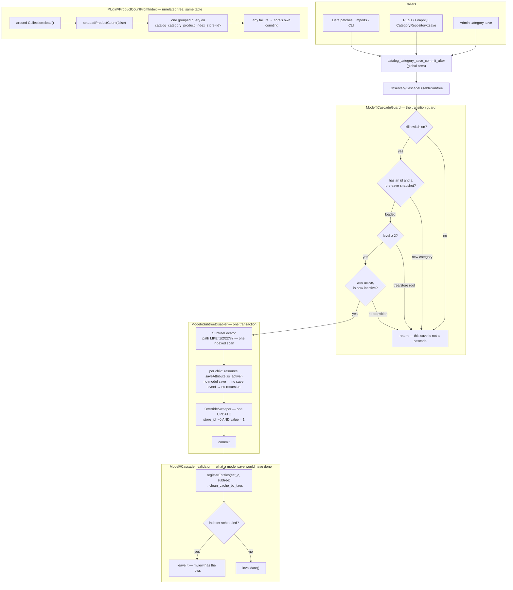

# Category Cascade

Disabling a category in Magento disables exactly one row. Its children stay enabled, keep their url
rewrites, keep answering on their own URLs, and keep showing up anywhere a block renders a category
list by id rather than by walking the tree. The merchant sees the parent vanish from the menu and
reasonably concludes the branch is gone. It is not.

This module makes the obvious thing true: switching a category off switches off everything below
it, in one transaction, without the cascade re-entering itself, and without the write path that
would make a fifty-category subtree take a minute. It also fixes the reason nobody enjoys opening
the admin category tree on a large catalog — a product count that costs one query per anchor
category.

| Part | What it covers |
|---|---|
| Observer on `catalog_category_save_commit_after` | Every caller: admin, REST, data patches, imports, CLI |
| `Model\CascadeGuard` | The one transition worth acting on, out of every category save in the installation |
| `Model\SubtreeDisabler` | Indexed path walk, attribute-only writes, one transaction |
| `Model\ResourceModel\OverrideSweeper` | The single UPDATE that stops a store view from keeping a child alive |
| `Model\CascadeInvalidator` | Cache tags always, indexers only where they are not already being fed |
| `Plugin\...\ProductCountFromIndex` | One grouped index query instead of one query per anchor category |

## Why this exists

Two problems that look unrelated and are not: they are both consequences of the category tree being
a materialised path in a table nobody reads recursively.

The first is the cascade. Every Magento build eventually grows a "we're pulling this whole section
for the season" workflow, and every one of them starts with a merchant disabling the parent and
being surprised. The workaround is a mass action on a grid the admin does not have, so it ends up
being done by hand, one category at a time, and it ends up half done.

The second is the count. `Collection::loadProductCount()` runs one grouped query for the non-anchor
categories and then **one query per anchor category**, each joining the category-product pivot
against the descendant paths of that category. Anchoring is the default, so on a real tree that is
a query per node, and it is why the category page is the slowest screen in the admin long before
anything else is.

The interesting part of the first problem is not "write is_active = 0 to the children". It is that
the obvious way to do it — loop over the children and save each one — dispatches a category save
event per child, which re-enters the observer that started the loop, which loops over that child's
children. The cascade has to write category rows without saving categories, and then owes the
system everything a save would have done on its way out.

## What's interesting (and what's just baseline)

| Choice | Why | Honest classification |
|---|---|---|
| Attribute-only writes instead of model saves | No save event is dispatched, so the cascade has no path back into itself — there is no recursion flag in this module because there is nothing for one to catch | The actual insight |
| One UPDATE for conflicting per-store overrides | Without it a cascade run in the default scope is silently wrong on exactly the store views that carry an override — the failure mode nobody sees in staging | The bug most implementations of this ship with |
| Indexers invalidated only when they are *not* scheduled | A scheduled index is already being fed by mview triggers on the tables this writes; invalidating swaps a partial reindex for a full one | Opinionated, and the opposite of what most modules do |
| `save_commit_after`, not `save_after` | The parent is durable, so the cascade can open its own transaction and fail without taking the admin's save with it | Architectural |
| Re-enabling deliberately does not cascade | See [Design decisions](#design-decisions) | Opinionated |
| Level ≥ 2 | Cascading from a store root is how a catalog gets deleted by one careless click | Baseline, and cheap to get wrong |
| `around load()` for the count, not `around loadProductCount()` | `load()` is the only seam that can cancel core's counting before it costs anything, and it leaves `loadProductCount()` free for the failure fallback to call without re-entering this plugin | Architectural, and the place where the usual folklore about same-class calls is wrong |
| Fail-quiet, log loudly | A commit-after observer that throws turns a successful save into an error page | Baseline |
| Count falls back to core's own counting on any failure | Never worse than stock, in exchange for a `try` block | Baseline |

## Architecture



### 1. Why the cascade runs after the commit

`catalog_category_save_commit_after` fires from `AbstractModel::afterCommitCallback()`, once the
category's own transaction has committed. Two things follow from that, and both are the reason this
is the right seam rather than `catalog_category_save_after`:

- The parent row is already durable. The cascade can open a transaction of its own and fail without
  rolling back the save the admin actually asked for. A `save_after` observer shares the model's
  transaction, so a deadlock forty categories deep would undo the one write the merchant watched
  succeed.
- Everything the save does on its way out — url rewrite generation, indexer row updates — has
  already run. The subtree writes land on a settled tree instead of racing core's own post-save
  work.

The observer is registered in the global `etc/events.xml`, not in `adminhtml`. Categories are saved
by REST, by GraphQL, by data patches, by the import module and by CLI tooling, and a cascade that
only fires when a human clicks Save is a cascade with holes in exactly the places bulk operations
live.

The price of running after the commit is that the observer cannot report failure to the caller. By
the time it runs, the response is on its way out; throwing would show the merchant an error for a
save that succeeded, and on the REST path it would turn a 200 into a 500 *after* the write. So a
broken cascade is logged and swallowed, and the catalog is left exactly where core put it — parent
off, children untouched, which is where a merchant would be without this module installed.

### 2. The transition guard

`catalog_category_save_commit_after` fires for every category save in the installation: renames,
position drags, image uploads, an import touching one attribute, a data patch running at deploy.
Exactly one of those is a cascade, and `Model\CascadeGuard` is the cheapest possible filter for it —
it answers before a single row is read.

Four conditions, in the order that rejects fastest:

1. **Kill-switch**, read in the scope of the saved category. A category saved in a store view is a
   store-scoped decision, so the setting that governs it has to be readable per store view.
2. **Not new.** A category created in this request already has an id by the time the commit
   callback runs, so `isObjectNew()` alone does not recognise it. The reliable marker is the missing
   pre-save snapshot: `_origData` is only populated by a load, so a null snapshot means the model
   was never loaded, which means nothing was disabled — it was created.
3. **Level ≥ 2.** Level 0 is the tree root and level 1 is a store's root category. Neither is a
   merchandising decision, and cascading from one would rewrite every category row in the catalog.
   If `level` is missing from a hand-assembled save, it is recomputed from the path, which cannot
   be missing — the tree cannot be written without it.
4. **Enabled → disabled**, read from both halves defensively. A save that does not carry `is_active`
   at all is not a transition; a snapshot without `is_active` means the previous state is unknown,
   and unknown resolves to "do nothing".

### 3. Attribute-only writes, and why there is no recursion flag

The obvious implementation — load each child through `CategoryRepository` and save it — works
exactly once. The first child's save dispatches `catalog_category_save_commit_after`, the observer
runs again, and a three-level subtree re-enters the cascade once per node until the request dies.
The usual patch for that is a static "already running" flag, which works and leaves the module
with a piece of state that has to be right in every exit path, including the failing ones.

`Magento\Catalog\Model\ResourceModel\AbstractResource::saveAttribute()` writes a single attribute
value straight through the resource model. No model save, no `beforeSave`/`afterSave`, no event.
The cascade has no path back into itself, which is why this module has no re-entrancy flag: there
is nothing for one to catch.

The subtree itself comes from the materialised path. Magento stores ancestry as `1/2/22`, so "every
descendant of this category" is a prefix match — one indexed range scan on
`catalog_category_entity.path`, no recursion and no per-level round trip. Paths are digits and
slashes only, so the `LIKE` pattern needs no escaping. The exact path does not match `<path>/%`, so
the saved category is never inside its own subtree.

Children that are already disabled in the target scope are skipped. Writing them again would be a
pointless row update and would pad the log with categories the merchant disabled themselves.

The cost of bypassing the model is honest and is paid in section 6: attribute-only writes skip the
cache and indexer work a save would have done, so the module has to do it explicitly.

### 4. The per-store override sweep

`is_active` is store-scoped, and this is where a cascade that looks correct in the admin turns out
to be wrong on one storefront.

Disabling a child in the default scope writes the `store_id = 0` row. Any store view that carries
its own `is_active = 1` override still resolves to enabled, so that child stays live on that
storefront under a parent that is gone. Nothing in the admin tree shows it, because the tree the
merchant is looking at is scoped to All Store Views.

Every one of those overrides has to go, and there is no reason to visit them one row at a time:
they are identified by attribute, store scope, value and id set, which is one `WHERE` clause and one
`UPDATE`. Three details in it are deliberate:

- **The sweep covers the whole subtree**, not just the children that were written. A child already
  disabled by default can still carry an enabling override — that child needs no save and does need
  the sweep.
- **Values are set to 0, not deleted.** A deleted row silently re-inherits whatever the default
  scope says later; a row set to 0 is a per-store decision the merchant can still see and flip back,
  which is the same shape the admin would have produced by hand.
- **It runs only when the cascade itself ran in the default scope.** A cascade inside a store view
  writes that store's rows directly, and the other store views are separate decisions.

The saved category's own overrides are left alone. That one is a judgement call rather than an
obvious rule: rewriting other stores' values for the record the admin was looking at would silently
override an explicit per-store decision on the very screen they made it on. The children are
different — a cascade that leaves a child enabled in one store view is not a cascade.

### 5. One transaction

A half-cascaded tree is worse than an uncascaded one, because the admin has no way of telling which
half ran. The walk, every attribute write and the sweep are wrapped in one transaction.

`saveAttribute()` opens a transaction of its own, and Magento's adapter reference-counts them: the
inner `commit()` calls only decrement, and the outer `commit()` here is the one that makes anything
durable. The same counting is why a failure is safe — an inner `rollBack()` marks the whole stack
rolled back, so the outer commit cannot succeed on a partial write.

### 6. Invalidation: what the model save would have done

Bypassing the model means owing two things.

**Cache tags.** Category pages and blocks are cached under `cat_c_<id>` tags, so the whole subtree
is registered on the indexer cache context and cleaned with one `clean_cache_by_tags` dispatch —
one BAN that evicts exactly the pages that changed and leaves the rest of a warm FPC alone. The
saved parent goes in with them: its own page still lists the children that just disappeared.

**Indexers, but only some of them.** `catalog_category_product` is invalidated when it runs in
"Update on Save" mode, because nothing else is going to notice writes that never went through a
model. When it is scheduled, it is deliberately left alone: mview triggers on the tables this module
writes have already captured these rows into the changelog, and a partial reindex will consume them
within the minute. Marking it invalid would replace that with a full rebuild — on a real catalog,
the difference between a minute and an hour, triggered by the cheapest edit in the admin.

The flat category index gets the same treatment, and only when flat is actually enabled. Leaving an
unused indexer showing "Reindex required" is noise no reindex explains.

Failures here are logged as their own kind of incident. A cascade that committed and failed to
invalidate is fixed with a cache flush; a cascade that never wrote anything is fixed by saving the
category again. Collapsing them into one log line would cost a merchant the difference.

### 7. The admin confirm prompt

The prompt exists because a cascade is invisible before it happens: the admin sees one category on
screen and no indication that saving it will rewrite forty rows.

The block publishes two facts the browser cannot work out on its own — how many *enabled*
subcategories exist, and whether this category was enabled when the page rendered — into a hidden
element's data attributes. An ES module loaded from a `src` attribute reads them. No inline script,
no inline handler, nothing for a strict CSP to reject, and no RequireJS or jQuery pulled in for a
prompt.

The listener is bound to the document in the **capture** phase. The Save button belongs to a UI
component that binds its own click handler, so the listener has to win the race to run before that
handler starts the AJAX save; binding to the document also means the button can be rendered at any
point in the form's asynchronous render without the listener having to wait for it. It fires only
when the category *was* enabled and the form's toggle is now off — the same transition the
server-side guard checks, so the prompt and the cascade agree on what a cascading save is.

The dialog is `window.confirm()`, which is a deliberate downgrade from Magento's own modal. The
modal is asynchronous: intercepting the click would mean cancelling it, awaiting an answer and
re-dispatching it, which is how double submits get written. A synchronous dialog either lets the
click through or does not. The prompt is a courtesy in any case — every condition it checks is
re-checked server side, so a browser that never runs the file gets the same cascade, just without
the warning.

### 8. The tree product count: one query instead of one per anchor

Core's counting is described above; the replacement is one grouped query against
`catalog_category_product_index_store<id>`.

The index already encodes the rule core recomputes per category: an anchor category has a row for
every product below it, a non-anchor category only for its direct assignments. Counting rows per
`category_id` therefore reproduces core's anchor/regular split for free — the difference is that
core asks once per anchor category and this asks once for the whole tree.

**Where the plugin goes matters more than what it does.** `load()` is the outermost public method
the tree calls, which makes it the seam that can *cancel* the counting rather than run after it has
already cost what it costs. It also keeps the fallback path honest: when the indexed count fails
this plugin calls `loadProductCount()` to run exactly the counting it suppressed, and had it hooked
that method instead, the fallback would have re-entered itself.

Worth stating plainly, because the opposite is repeated constantly: a same-class `$this->` call
**does** go through the interceptor. The generator overrides every public non-final, non-static
method of the target class, and `$this->` dispatches virtually against the interceptor instance, so
`_loadProductCount()`'s inner `$this->loadProductCount(...)` would have hit a plugin on that method.
The reason not to hook it is recursion, not invisibility. Only `self::`/`static::`/`parent::`,
private/final/static methods and objects constructed before interception bootstraps actually escape
the chain. The paired `before`
plugin on `setLoadProductCount()` exists because the flag it writes has no public getter — the
plugin has to observe the setter to know whether counting was asked for at all, and taking over for
a collection that never asked would add a query to every category collection in the application.

Before proceeding, the plugin adds `all_children` and `is_anchor` to the select, exactly as core's
`load()` would have. That keeps the loaded items identical with or without the plugin, and it keeps
the fallback path able to run core's counting, which reads `is_anchor` off the items.

Four conditions have to hold or the plugin steps aside completely:

- counting was requested, and the setting is on;
- the collection is scoped to a real store view — All Store Views has no index table, and picking a
  store view for it would answer a question the admin did not ask;
- the store's index table exists;
- the index is trustworthy: valid, **or** scheduled. An invalidated update-on-save index has nothing
  feeding it until someone reindexes, so its numbers would be fiction; a scheduled one is current to
  within a cron run whatever its validity flag says between partial reindexes.

And if the query fails anyway, the plugin runs exactly the counting it suppressed and logs a
warning. Never worse than stock.

## Design decisions

- **Re-enabling does not cascade.** A merchant who disabled "Women" last month and disabled two of
  its subcategories the month before has expressed two decisions. Turning the parent back on is not
  a request to undo the other one, and a cascade that reverses itself would silently republish
  categories nobody asked to republish — a worse failure than an extra click. The asymmetry is the
  whole reason the guard tests a transition rather than a state.
- **The count is not the same number core produces, on purpose.** Core counts rows in the
  `catalog_category_product` pivot: assignments, including disabled products, products outside the
  store's website and products not visible in the catalog. The index counts what the storefront
  would actually list in that store view. For an admin looking at a tree scoped to one store, the
  second number is the more useful one — and it is the reason this reads the index rather than
  running a cheaper grouped query over the pivot.
- **Fail-quiet, log loudly.** Everything after the commit is best-effort and logged. The one thing
  the module refuses to do is convert a successful category save into an error the merchant has to
  interpret.
- **Only an external `load()` is intercepted.** A collection that loads itself lazily through
  iteration keeps core's counting — correct, just slow. In the admin tree, which is the case this
  exists for, `Tree::addCollectionData()` calls `load()` explicitly.
- **The subtree is loaded in one collection.** No batching. Real category trees are hundreds of
  nodes, not millions, and a chunked walk would trade a bounded memory win for a partial-failure
  story the transaction currently makes impossible.
- **`WeakMap` for the per-collection flag.** Under an application server the plugin instance
  outlives the request; a plain array keyed by object hash would hold every category collection ever
  loaded alive behind it.
- **No mass action, no CLI.** The cascade is a consequence of a save, so it belongs on the save. A
  "disable this branch" button is a different feature with a different confirmation story.

## What gets shipped

```
src/
├── registration.php
├── composer.json                                   # scr1be/category-cascade, type magento2-module
├── etc/
│   ├── module.xml
│   ├── config.xml                                  # defaults — everything on
│   ├── acl.xml                                     # Scr1be_CategoryCascade::config
│   ├── events.xml                                  # global: catalog_category_save_commit_after
│   ├── di.xml                                      # count plugin + the dedicated log wiring
│   └── adminhtml/system.xml                        # kill-switch, prompt, logging, count source
├── Model/
│   ├── Config.php                                  # store-scoped cascade settings, default-scope count setting
│   ├── CascadeGuard.php                            # the transition guard
│   ├── SubtreeLocator.php                          # indexed path walk, store-scoped
│   ├── SubtreeDisabler.php                         # attribute-only writes, one transaction
│   ├── CascadeResult.php                           # what the cascade did
│   ├── CascadeInvalidator.php                      # cache tags + selective indexer invalidation
│   ├── CascadeLog.php                              # var/log/category_cascade.log
│   └── ResourceModel/
│       ├── OverrideSweeper.php                     # the single per-store UPDATE
│       └── IndexedProductCount.php                 # one grouped query on the index store table
├── Observer/
│   └── CascadeDisableSubtree.php                   # wiring + two failure boundaries
├── Plugin/Catalog/ResourceModel/Category/
│   └── ProductCountFromIndex.php                   # around load(), before setLoadProductCount()
├── Block/Adminhtml/Category/
│   └── CascadeConfirm.php                          # the two facts the prompt needs
├── view/adminhtml/
│   ├── layout/catalog_category_edit.xml
│   ├── templates/category/cascade-confirm.phtml    # hidden data carrier + module script tag
│   └── web/js/cascade-confirm.js                   # capture-phase confirm, CSP-safe
├── i18n/en_US.csv
└── Test/Unit/                                      # 7 test classes
```

## Install

```bash
# from your Magento 2 root
composer config repositories.scr1be path /path/to/Magento/category-cascade/src
composer require scr1be/category-cascade:@dev
bin/magento module:enable Scr1be_CategoryCascade
bin/magento setup:upgrade
bin/magento setup:di:compile
```

No schema, no data patches, nothing to migrate — the module writes to core's own category tables and
reads core's own index.

## Configuration

**Stores → Configuration → scr1be → Category Cascade**

| Setting | Scope | Default | Notes |
|---|---|---|---|
| Cascade disable to subcategories | store view | Yes | Master kill-switch, read in the scope the category was saved in. Off means core behaviour: a parent can be disabled while its children stay enabled |
| Confirm before a cascading save | store view | Yes | The admin prompt. Off leaves the server-side cascade untouched |
| Log cascades | store view | Yes | One line per cascade in `var/log/category_cascade.log`. Failures are logged either way |
| Count products from the category index | default | Yes | One grouped index query instead of one query per anchor category. Only applies to a tree scoped to a single store view |

## Demo notes

On a stock **Magento 2.4.8 + Hyvä 1.4 + Luma sample data** storefront. Luma's tree is small — about
forty categories — so the cascade is visible immediately and the count improvement shows up as a
query count rather than as wall clock. Both are worth measuring the honest way.

1. **A two-level cascade.** Catalog → Categories, store switcher on *All Store Views*. Open
   **Women** (it has *Tops* and *Bottoms*, and those have six children between them). Set **Enable
   Category** to No and press Save. The prompt names the number of enabled subcategories below it;
   confirm. When the page comes back, walk the tree: every descendant is disabled.
2. **The storefront agrees.** `/women.html` and `/women/tops-women.html` both stop resolving, and
   the Hyvä menu drops the whole branch. Before this module, the second URL still rendered a
   category page.
3. **The log.**

   ```bash
   tail -n 1 var/log/category_cascade.log
   ```

   One `INFO` line with `category_id`, `store_id`, `subtree_size`, the `disabled_ids` array and
   `cleared_store_overrides`.
4. **Re-enabling does not cascade.** Turn *Women* back on and save. Its children stay disabled, and
   nothing is written to the log — the guard rejected the save because it is not a disable
   transition. This is the documented asymmetry, not a bug.
5. **The per-store override.** Re-enable *Tops* and its children. Switch the tree to a specific
   store view, open *Tops*, untick **Use Default Value** on Enable Category and leave it *Yes* —
   that writes a store override. Switch back to All Store Views, disable *Women*, save. Switch to
   the store view again: *Tops* is disabled there too, and the log line shows
   `cleared_store_overrides: 1`. Without the sweep, that category is live on that storefront under a
   parent that no longer exists.
6. **The level guard.** Try the same on *Default Category* (level 1). Nothing cascades, nothing is
   logged, and the catalog survives.
7. **The count, measured.**

   ```bash
   bin/magento dev:query-log:enable
   # open Catalog → Categories with the store switcher on a store view, expand the tree
   grep -c 'catalog_category_product' var/debug/db.log
   ```

   Then set *Count products from the category index* to No, flush the config cache and repeat. The
   stock path issues one query per anchor category; the module's path issues one for the tree. On
   Luma that is single digits versus dozens — on a catalog with a few thousand categories it is the
   difference between the screen loading and the screen timing out.
8. **The fallbacks are real.** With the store switcher on *All Store Views*, the counts come from
   core's own counting — there is no index table for the admin scope. Same with
   `bin/magento indexer:set-mode realtime catalog_category_product` followed by
   `bin/magento indexer:reset catalog_category_product`: an invalidated update-on-save index is not
   trusted, and the numbers stay core's.
9. **The kill-switch.** Set *Cascade disable to subcategories* to No, flush the config cache, and
   step 1 leaves the children alone. Nothing else about the module changes.

## Tests

```bash
# from your Magento 2 root
# path follows your install method — Composer package:
vendor/bin/phpunit -c dev/tests/unit/phpunit.xml.dist vendor/scr1be/category-cascade/Test/Unit

# …or, if you copied the module into app/code instead:
vendor/bin/phpunit -c dev/tests/unit/phpunit.xml.dist app/code/Scr1be/CategoryCascade/Test/Unit
```

Seven classes covering the parts that can actually be wrong: the transition guard in all of its
outcomes (kill-switch, freshly created category, both root levels, re-enable, no-op save, a save
without the attribute, a snapshot without it, and the path fallback for a missing level), the
disabler skipping already-disabled children, sweeping the whole subtree only in the default scope,
and rolling the whole transaction back on a failed write; the invalidator's one-BAN registration,
its scheduled/unscheduled decision, the flat-index condition and its survival of an unreadable
indexer; the sweeper's exact `WHERE`; the observer's two failure boundaries and its
nothing-changed short circuit; and the count plugin's five step-aside conditions, its suppression of
core counting, absent categories counting as zero and the fall back to core when the index query
throws. The layout XML, the DI wiring and the template are configuration — they are covered by the
demo walkthrough above, not by mocks.

## Compatibility

| | Version |
|---|---|
| PHP | 8.2, 8.3, 8.4 |
| Magento 2 | 2.4.6, 2.4.7, 2.4.8 |
| Hyvä Theme | any (no storefront surface of its own) |

The module has no storefront templates: the storefront effect is entirely core's, because a disabled
category is a disabled category whatever renders it. The only frontend file is an admin ES module.

Written for Magento Open Source, where the category link field is `entity_id`. On Commerce with
staging enabled the link field is `row_id`, and the override sweep would need the row ids rather
than the entity ids it takes today — a small change, but an untested one, so it is called out rather
than claimed.

## License

MIT — see [LICENSE](LICENSE).
