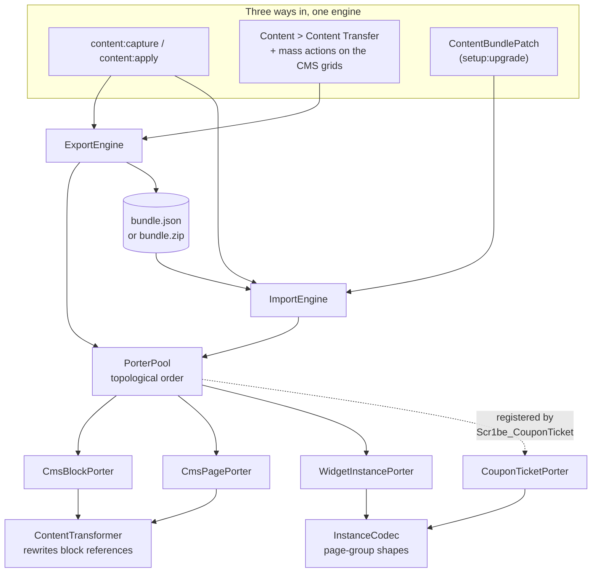

# Content as Code

CMS content that lives in git. `bin/magento content:capture` writes the store's pages, blocks and
widget placements to a JSON file you commit; `bin/magento content:apply` replays it on staging, on
production, on a colleague's laptop. Re-capture unchanged content and the file comes back
byte-identical, so `git diff` shows the content that moved and nothing else.

Two modules:

| Module | What it owns |
|---|---|
| `Scr1be_ContentTransfer` | The porter interface and pool, the bundle format, the capture/apply commands, the admin export page and the data-patch base class. Ships porters for CMS pages, CMS blocks and widget instances. |
| `Scr1be_CouponTicket` | A CMS widget that renders a cart price rule's coupon as a tear-off ticket — and a fourth porter, registered from outside the engine, that makes the widget's rule reference portable. |

They are separate because the second one is the demonstration, not the product. The engine has no
idea coupon tickets exist; the widget module joins the pool and claims its own widget type in six
lines of its own `di.xml`. Delete it and the engine keeps working.

Every claim below about Magento's own behaviour was checked against the source in `vendor/` rather
than recalled, and the file is named where it matters.

## Why this exists

Content is the one part of a Magento store that has no deployment story. Code goes through git,
schema goes through declarative XML, config goes through `app/etc/config.php` — and the homepage
gets rebuilt by hand on every environment, or moved by a database dump that drags the customer table
along with it. The "just export the CMS tables" instinct fails on contact with three specific
things, and those three things are what this module is:

**Ids do not survive the trip.** A CMS page's `content` column is not markup, it is markup plus
`{{widget}}` directives whose parameters are autoincrement values from the install they were written
on. Copy the row and the page renders a different block, or nothing. A widget instance carries a
`theme_id` and a comma-separated `store_ids`; a page carries a `custom_theme`. None of those numbers
mean the same thing twice.

**Identifiers are not unique.** `cms_page.identifier` and `cms_block.identifier` carry a plain btree
index in `Magento_Cms/etc/db_schema.xml` — `CMS_PAGE_IDENTIFIER`, `CMS_BLOCK_IDENTIFIER`, neither
unique — because one `home` page per store view is how a multi-store catalogue is meant to look. Key
a bundle on the identifier alone and one of the two disappears silently.

**All-or-nothing is the wrong failure mode.** Wrap 200 entries in a transaction and the one bad
widget on entry 137 costs you the 136 that were fine and the 63 nobody reached. What you want is the
opposite: apply everything that can be applied, name what could not, exit non-zero, fix one entry,
re-run. That only works if a second run over content that already landed is a no-op — which is what
the format is built for and why `skip` is the default mode.

## Architecture



### The porter interface

One interface, six methods, and no knowledge of what a payload contains:

```php
interface PorterInterface
{
    public function getCode(): string;                              // 'cms_block'
    public function getLabel(): string;
    public function getDependencies(): array;                       // ['cms_block']
    public function summarize(Selection $selection): array;         // for the admin picker
    public function capture(Selection $selection): array;           // EntryInterface[]
    public function exists(EntryInterface $entry): bool;            // for --dry-run
    public function apply(EntryInterface $entry, ImportMode $mode): Outcome;
}
```

The payload is a plain array on purpose. A porter owns the shape of its own payload and nothing else
reads it — the engine sorts entries, writes them, and hands them back. Typing the payload would mean
the engine knowing about CMS pages, which is the one thing this design avoids.

**Ordering comes from declared dependencies, not from a `sort_order` integer.** `cms_page` declares
`['cms_block']` because a page that embeds a block by identifier needs the block to exist first.
Integers let two modules agree on `10` and disagree on reality; a graph makes the constraint
explicit and a cycle an exception rather than a coin flip. `PorterPool::getSorted()` is a
three-colour depth-first sort, with ties broken alphabetically so two installs whose `di.xml` files
merged in a different order still produce the same bundle.

`exists()` is separate from `apply()` so that `--dry-run` can predict per entry without a write path
that takes a "don't actually write" flag. A flag like that is one careless `if` away from writing,
and the run where that gets noticed is the one on production.

### The bundle format

```json
{
    "manifest": {
        "format": 1,
        "stores": [],
        "counts": { "cms_block": 4, "cms_page": 2, "widget_instance": 1 }
    },
    "entries": [
        {
            "porter": "cms_block",
            "identifier": "footer-links",
            "payload": {
                "identifier": "footer-links",
                "title": "Footer links",
                "content": "…",
                "is_active": true,
                "stores": []
            }
        }
    ]
}
```

**There is no timestamp in the manifest, deliberately.** A capture that produces a byte-identical
file when nothing changed is the entire point of putting content in git: a re-capture shows the
content that moved and nothing else. A `generated_at` field would make every capture dirty and train
everyone to ignore the diff. When it was captured is a question the commit already answers, better.

Three things make byte-stability actually hold:

1. **Volatile columns are not captured.** `cms_page.creation_time` and `update_time` are
   `CURRENT_TIMESTAMP` columns; autoincrement ids are the reason this module exists. Neither
   travels.
2. **Everything is sorted.** Porters run in dependency order, entries are sorted by identifier
   inside each porter, store codes are sorted, widget placements are sorted by group and container.
   Collection order is whatever the database felt like returning.
3. **The encoder is pinned.** `json_encode()` is called directly with
   `JSON_PRETTY_PRINT | JSON_UNESCAPED_SLASHES | JSON_UNESCAPED_UNICODE`, rather than through
   `Magento\Framework\Serialize\Serializer\Json`, whose `serialize()` is `json_encode($data)` with
   no flags at all: one line, every slash escaped, `Ü` as `Ü`. Right for a cache value, wrong
   for a file a human reviews in a pull request.

`--zip` writes the same documents exploded — `manifest.json` plus `<porter>/<slug>.json` per entry —
for reviewing a 300-entry capture as the four files that changed. Entry names and their order are a
pure function of the bundle; the archive's *bytes* are not, because zip records a modification time
per entry. Commit the JSON form if you want git to show you nothing when nothing changed.

`Magento\Framework\Archive\Zip` is not used: its `pack()` is `$zip->addFile($source)` for exactly
one file, and `addFile()` with no local-name argument stores the entry under the source's own path.
A multi-entry archive with controlled names is outside what it does.

### Bundle keys

An entry's `identifier` is what import matches on, so it has to be stable and unique on both sides.

**CMS pages and blocks** use `identifier`, plus a sorted store-scope suffix when they are not
assigned to all store views: `about-us`, `home@de`, `home@de+fr`. Import matches on the identifier
*and* the store set, because that is what the key means — and because the schema does not make the
identifier alone unique.

**Widget instances have no identifier column at all.** `Magento_Widget/etc/db_schema.xml` declares
`instance_id`, `instance_type`, `theme_id`, `title`, `store_ids`, `widget_parameters` and
`sort_order`, and nothing else. The key is synthesised as `<widget class basename>--<title slug>` —
`block--homepage-hero` — and import matches on type + title + theme, the same triple. That keeps the
key honest: two instances that collide on it are two instances the importer could not have told
apart either, and the capture says so rather than inventing a `-2` suffix that would move on the
next run.

### Reference rewriting, and what it refuses to rewrite

`ContentTransformer` walks the `{{widget}}` and `{{block}}` directives in a page or block's content.
Its directive pattern mirrors the opening half of
`Magento\Framework\Filter\Template::CONSTRUCTION_PATTERN`; the closing-tag half is deliberately
dropped, because this rewrites parameters inside an opening tag and must not consume what a
block-level directive wraps.

**`block_id` is rewritten.** For `Magento\Cms\Block\Widget\Block` — the `cms_static_block` widget
declared in `Magento_Cms/etc/widget.xml` — and for the deprecated `Magento\Cms\Block\Block`, a
numeric `block_id` becomes the block's identifier. Both classes end up calling
`$block->setStoreId($storeId)->load($blockId)`, and `Magento\Cms\Model\ResourceModel\Block` loads by
`identifier` whenever the value it is handed is not numeric. So the rewrite needs no counterpart on
import: the value stays an identifier forever, and works.

**`page_id` on a CMS Page Link is only warned about.** Swapping it for an identifier is tempting and
half-broken. `Magento\Cms\Block\Widget\Page\Link::getHref()` resolves it through
`Magento\Cms\Helper\Page::getPageUrl()`, which loads by identifier and would work — but `getTitle()`
and `getLabel()` go to `Magento\Cms\Model\ResourceModel\Page::getCmsPageTitleById()`, whose `where`
binds `(int)$id`. An identifier casts to `0`, the title comes back empty, and the result is a
working link with no text unless `anchor_text` was filled in. A rewrite that produces an invisible
link on a customer's homepage is worse than a warning.

**A reference to a block that does not exist here is warned about and left alone.** The bundle is
still worth having, and the operator is the only one who can decide what the reference should have
been.

`capture` prints every rewrite individually — `cms_page/home: block_id 12 -> "footer-links"` — and
lists the warnings after the summary table. "17 references rewritten" is not reviewable; a list of
17 lines is.

### Two columns the page porter refuses to carry

`layout_update_xml` and `custom_layout_update_xml` are captured as warnings, not data.
`Magento\Cms\Model\PageRepository::validateLayoutUpdate()` throws
`InvalidArgumentException('Custom layout updates must be selected from a file')` for any save where
either column is non-empty and differs from what is already persisted — which is every possible save
of a new page carrying one. That check is deliberate hardening: arbitrary layout XML is an
arbitrary-block-instantiation primitive. Routing around it through the resource model would turn
this module into a way to reintroduce that hole a bundle at a time.

`layout_update_selected` — the file-based replacement — does travel, and that is what the warning
points at. Not in the same save as the rest of the page, though: `Magento\Cms\Model\Page::beforeSave()`
ends with `validateLayoutSelectedFor($this)`, which throws when the value is set and the page has no
id **or** the file is not among the ones available for it. The first half makes creating a page that
carries a selection impossible in one save. So the porter saves the page, then applies the selection
through `Magento\Cms\Model\Page\CustomLayoutRepositoryInterface` — core's own path for it. A target
install that has the page but not the layout file gets the page plus a note on the outcome, not a
failed entry: the page landed, and calling that a failure sends the operator looking for something
that is not wrong.

### The widget page-group trap

Reading and writing a widget instance's placements are not symmetrical, and getting it wrong loses
data silently.

`Magento\Widget\Model\ResourceModel\Widget\Instance::_afterLoad()` sets `page_groups` to the raw rows
of `widget_instance_page`: `page_id`, `page_group`, `layout_handle`, `block_reference`, `page_for`,
`entities`, `page_template`.

`Magento\Widget\Model\Widget\Instance::beforeSave()` expects something else entirely — a list where
each element has a `page_group` key naming the group, plus a nested array **under that name** holding
`page_id`, `layout_handle`, `for`, `block`, `template` and `entities`. That is the shape the admin
form posts. Hand `beforeSave()` the rows you loaded and it finds no
`$pageGroup[$pageGroup['page_group']]`, writes an empty `page_groups`, and the widget saves
successfully with every placement removed.

`InstanceCodec` owns both conversions and is the reason `CouponTicketPorter` needs no inheritance to
get them right. Two more details it handles:

- **Instances are loaded one at a time.** `_afterLoad($object)` is reached through
  `AbstractDb::load()`, and a collection never calls it — `AbstractCollection::_afterLoad()` sets
  orig data on each item and dispatches its load events, and that is all. Capturing straight out of
  a collection yields instances with no placements at all. The collection finds ids; each instance
  is then loaded properly.
- **`page_id` is dropped on import.** It is the primary key of `widget_instance_page`, not a CMS
  page. Setting it empty keeps the placement out of `page_group_ids`, so `_afterSave()` removes the
  instance's existing rows and inserts fresh ones — which is what makes *replacing* an instance
  produce exactly the placements in the bundle rather than the union of old and new.

### Caches are invalidated by the engine, on purpose

`Magento\Widget\Model\Widget\Instance` invalidates `block_html`, `layout` and `full_page` on save
through its `relatedCacheTypes` constructor argument — but that argument is supplied only by
`Magento_Widget/etc/adminhtml/di.xml` and `Magento_PageCache/etc/adminhtml/di.xml`. Its declared
default is `[]`, and `_invalidateCache()` is guarded by `count($this->_relatedCacheTypes)`.

`Magento\Framework\Console\Cli` loads no area's DI configuration: it contains neither a
`setAreaCode()` call nor a `ConfigLoader`, and core commands that need one arrange it themselves —
`Magento\Indexer\Console\Command\AbstractIndexerCommand` is the pattern, calling
`$this->objectManager->configure($configLoader->load($area))` by hand. This module's commands only
set the area *code*, through `State::setAreaCode()`, which sets the config scope and nothing else. So
a widget instance written by `content:apply` gets the global-scope object and invalidates nothing.

`ImportEngine` therefore invalidates the three types itself, once, and only when something was
actually written. On the second and every later deploy, every entry is skipped, nothing is
invalidated, and the storefront's cache survives a run that confirmed nothing changed.

### Three entry points, one engine

**Console.**

```bash
bin/magento content:capture var/content/homepage.json --store=default --porter=cms_block
bin/magento content:apply var/content/homepage.json --dry-run
bin/magento content:apply var/content/homepage.json --replace
```

**Admin.** *Content > Elements > Content Transfer* lists everything the pool can see, filtered by
store view, ticked across types, exported as one bundle. The CMS page and block grids each get an
"Export to Content Bundle" mass action. A mass action can answer with a file because of how the grid
submits: `mageUtils.submit()` in `lib/web/mage/utils/misc.js` builds a real `<form>`, stamps
`window.FORM_KEY` into it and calls `form.submit()` — an ordinary top-level POST, so a
`Content-Disposition: attachment` response downloads the bundle and leaves the grid where it was.

**Setup patch.** The base class in `Model/Patch/ContentBundlePatch.php` is twelve lines to subclass:

```php
class InstallLandingPages extends ContentBundlePatch
{
    protected function getBundlePath(): string
    {
        return 'app/code/Acme/Landing/bundle/pages.json';
    }
}
```

`setup:upgrade` runs it, so content lands in the same release as the code that expects it. It
defaults to `ImportMode::Skip`, which means it is idempotent *by itself* rather than by Magento's
`patch_list` bookkeeping — the distinction that matters the day somebody restores a database from a
build where the patch had not yet run. It throws on any failed entry: a patch that logged the
failure and returned would be recorded as applied and never retried, leaving a half-installed module
that looks installed.

## The coupon ticket widget

The demonstration entity, and a widget worth having on its own.

**Four author-facing parameters and no fifth**: which cart price rule, a headline, a line of small
print, and which of the two templates. Everything a customer reads off the ticket — the discount,
the dates, who it applies to, the code itself — is read from the rule. There is deliberately no
"discount text" field: the day it exists is the day it disagrees with the rule it sits next to.

`TicketReader` uses the model rather than `RuleRepositoryInterface`, because the repository's DTO has
no way to reach the coupon code, and because the two layers do not agree on how to spell a coupon
type — `Magento\SalesRule\Api\Data\RuleInterface::COUPON_TYPE_SPECIFIC_COUPON` is the string
`'SPECIFIC_COUPON'`, while the model and the `coupon_type` column behind it use
`Magento\SalesRule\Model\Rule::COUPON_TYPE_SPECIFIC = 2`. The code lives on
`Magento\SalesRule\Model\Coupon`, reached through `Rule::getPrimaryCoupon()`.

A widget pointing at a deleted or disabled rule renders nothing at all — not an error, not an empty
frame. A storefront that shouts about a misconfigured widget shows customers a stack trace where a
discount should be.

### The eligibility check is FPC-safe

The obvious implementation reads the customer session, and the obvious implementation hands whoever
warmed the cache their answer to everybody else. The correct source is
`Magento\Framework\App\Http\Context`, and it works because the page cache key is derived from it:
`Magento\Framework\App\PageCache\Identifier::getValue()` hashes the request's vary cookie or
`Context::getVaryString()`, and `Magento\Customer\Model\App\Action\ContextPlugin::beforeExecute()`
writes the customer group id into that context on every action. Group 1 and group 3 get different
cached pages by construction.

`ContextPlugin` passes `GroupManagement::NOT_LOGGED_IN_ID` as the *default*, and `Context::getData()`
drops values equal to their default before hashing — so guests share one cache entry, which is
right, and is why a missing context value is read as "guest" rather than as an error.

The code is withheld from a customer the rule does not apply to. It would be sitting in the markup
otherwise, and a code that is visible and then rejected at checkout is worse for the customer than no
code at all. The discount and the dates are still shown, with a line explaining the offer belongs to
a different customer group.

`getCacheKeyInfo()` is overridden to add the group, the rule and the store. The base implementation
returns `[$this->getNameInLayout()]` and nothing else. Block HTML caching only engages when the block
has a `cache_lifetime` — `AbstractBlock::_loadCache()` short-circuits on
`getCacheLifetime() === null` — and this block never sets one; but the day somebody gives it a
lifetime should not be the day coupon codes start leaking between customer groups.

### The clipboard module

One ES module, no import map, no build step. A widget rendered mid-page cannot promise that a map
was installed in the document head before any module loaded, and the component is small enough that
splitting it would buy nothing else. Both templates emit
`<script type="module" src="…">`; a module graph is keyed by resolved url, so two ticket widgets on
one page cost one fetch and one evaluation.

`createClipboard(win)` is the seam. `navigator.clipboard` is undefined outside a secure context and
`writeText` rejects when the document is not focused or permission is denied — all normal conditions
rather than bugs, all reported as a failed copy. The code is `select-all` text in both templates
regardless, which is exactly what the failure message points at.

### The fourth porter

`CouponTicketPorter` is what the pool exists for. `Scr1be_ContentTransfer` knows nothing about coupon
tickets; this module's `di.xml` does two things and neither of them touches the engine:

```xml
<type name="Scr1be\ContentTransfer\Model\PorterPool">
    <arguments>
        <argument name="porters" xsi:type="array">
            <item name="coupon_ticket" xsi:type="object">…\CouponTicketPorter</item>
        </argument>
    </arguments>
</type>

<type name="Scr1be\ContentTransfer\Model\Porter\WidgetInstancePorter">
    <arguments>
        <argument name="claimedTypes" xsi:type="array">
            <item name="coupon_ticket" xsi:type="string">Scr1be\CouponTicket\Block\Widget\Ticket</item>
        </argument>
    </arguments>
</type>
```

The claim lives in the claiming module, so the generic porter skips instances somebody else is
responsible for. Uninstall this module and both lines go with it: the generic porter picks the
instances back up and captures them with a raw numeric rule id, which is the correct degraded
behaviour rather than a crash.

What it does that the generic porter cannot: the widget's `rule_id` parameter is
`salesrule.rule_id`, an autoincrement. Captured as-is it points at whatever rule happens to hold that
id on the target — quite possibly a live discount with different terms, which is a worse outcome
than a broken widget. So the payload carries the **rule name** instead and the numeric id leaves
entirely; keeping both would invite an importer, or a person, to prefer the id. Rule names are not
unique either, so a name matching more than one rule is reported rather than guessed at.

## Design decisions

| Decision | Why |
|---|---|
| Per-entry isolation instead of one transaction | A 200-entry bundle that fails atomically on entry 137 leaves the deploy with nothing. Idempotent format + precise failures beats atomicity here. |
| `skip` is the default, `--replace` must be typed | A bundle that runs on every deploy forever must not silently revert an administrator's edit at 3am. |
| No admin importer | Applying a bundle is a deploy-time operation. It belongs in the release that ships the code depending on it, next to the code — not in a form somebody can point at production. Export is in the admin because *producing* the file is authoring work. |
| The admin page ships no JavaScript | A `GET` form for the filter and a `POST` form for the export. The only thing script would buy is a "select all in this section" checkbox; the cost would be something to break when the admin bundle changes and something to whitelist when a CSP policy tightens. |
| Store **codes** in the bundle, ids in the database | Ids are assigned in setup order and differ between installs. A code is typed once by a human and never changes. |
| A capture warns and continues; an apply fails loudly | A bundle with one dangling reference is still worth having. An import that quietly dropped an entry is not. |
| Bundle paths are relative to the Magento root, not `var/` | The destination that makes this worth having is inside a module, committed next to the code. A capture that can only write to `var/` is a capture somebody has to move by hand. |

## What gets shipped

```
src/
├── composer.json                          # metapackage: both modules
├── ContentTransfer/
│   ├── Api/
│   │   ├── PorterInterface.php            # the extension point
│   │   └── Data/EntryInterface.php
│   ├── Model/
│   │   ├── PorterPool.php                 # registry + topological sort
│   │   ├── ExportEngine.php               # selection -> bundle, deterministically ordered
│   │   ├── ImportEngine.php               # bundle -> install, per-entry isolation
│   │   ├── ImportMode.php  Outcome.php  ImportReport.php  Selection.php  Summary.php
│   │   ├── StoreScope.php  ThemeResolver.php  Slug.php
│   │   ├── Bundle.php
│   │   ├── Bundle/
│   │   │   ├── Manifest.php               # format version, scope, counts — no timestamp
│   │   │   ├── JsonCodec.php              # the document format
│   │   │   ├── ZipCodec.php               # the exploded form
│   │   │   ├── EntryNamer.php             # readable + injective archive paths
│   │   │   └── BundleStorage.php          # root-relative file access
│   │   ├── BundleDownload.php             # capture -> streamed download
│   │   ├── Content/
│   │   │   ├── ContentTransformer.php     # directive rewriting, and what it refuses
│   │   │   ├── BlockIdentifierMap.php
│   │   │   └── RewriteResult.php
│   │   ├── Porter/
│   │   │   ├── CmsBlockPorter.php
│   │   │   ├── CmsPagePorter.php
│   │   │   ├── WidgetInstancePorter.php
│   │   │   └── StoreScopedKey.php
│   │   ├── Widget/InstanceCodec.php       # the two page-group shapes
│   │   └── Patch/ContentBundlePatch.php   # data-patch base class
│   ├── Console/Command/
│   │   ├── CaptureCommand.php  ApplyCommand.php  AreaState.php
│   ├── Controller/Adminhtml/
│   │   ├── Transfer/{Index,Export}.php
│   │   └── MassExport/{AbstractMassExport,Page,Block}.php
│   ├── Block/Adminhtml/Transfer/Picker.php
│   ├── etc/                               # module, di, acl, adminhtml routes + menu
│   ├── view/adminhtml/                    # layout, picker template, two ui_component merges
│   ├── i18n/en_US.csv
│   └── Test/Unit/                         # 8 suites
└── CouponTicket/
    ├── Block/Widget/Ticket.php
    ├── Model/
    │   ├── Ticket.php  TicketReader.php  Eligibility.php
    │   ├── Source/CartPriceRule.php
    │   └── Porter/CouponTicketPorter.php
    ├── etc/                               # module, di (pool + claim), widget.xml
    ├── view/frontend/
    │   ├── templates/widget/{ticket,ticket-compact}.phtml
    │   └── web/js/coupon-ticket.js
    ├── package.json                       # exports map for the specs
    ├── i18n/en_US.csv
    └── Test/{Unit,Js}/
```

## Install

Both modules are independent of each other in the sense that the engine works alone; the widget
requires the engine. Pick one install method and use its paths throughout, including for the test
commands below.

### From this repository (what the demo storefront does)

```bash
mkdir -p app/code/Scr1be
cp -R /path/to/Magento/content-as-code/src/ContentTransfer app/code/Scr1be/ContentTransfer
cp -R /path/to/Magento/content-as-code/src/CouponTicket    app/code/Scr1be/CouponTicket

bin/magento module:enable Scr1be_ContentTransfer Scr1be_CouponTicket
bin/magento setup:upgrade
bin/magento setup:di:compile
bin/magento cache:flush
```

### With Composer

The metapackage pulls in both. This repository sets no `installer-paths`, so the packages land under
`vendor/scr1be/`:

```bash
composer require scr1be/content-as-code
# -> vendor/scr1be/content-transfer, vendor/scr1be/coupon-ticket

bin/magento module:enable Scr1be_ContentTransfer Scr1be_CouponTicket
bin/magento setup:upgrade
bin/magento setup:di:compile
bin/magento cache:flush
```

No storefront rebuild is needed for the engine. The coupon ticket's markup uses Hyvä's Tailwind
utility classes, so if you run a purge-based Tailwind build, add the module to its content paths and
rebuild:

```bash
cd app/design/frontend/<Vendor>/<theme>/web/tailwind && npm run build:prod
```

## Configuration

There is none, and that is deliberate: everything this module does is a decision taken per run, on
the command line or in the form, not a setting somebody flips in one environment and forgets in
another.

Access is controlled through ACL, under **Content**:

| Resource | Grants |
|---|---|
| `Scr1be_ContentTransfer::transfer` | Seeing the Content Transfer page and what content exists. |
| `Scr1be_ContentTransfer::export` | Producing and downloading a bundle, including through the grid mass actions. |

Two resources rather than one, because auditing the store's content inventory and downloading every
byte of it are different privileges.

## Commands

### `content:capture <output>`

| Option | Meaning |
|---|---|
| `--store`, `-s` | Store view code. Repeatable. Omit for every store view. |
| `--porter`, `-p` | Content type: `cms_block`, `cms_page`, `widget_instance`, `coupon_ticket`. Repeatable. |
| `--identifier`, `-i` | One entry, as `porter:key` — e.g. `cms_page:about-us`. Repeatable. |

The output path is relative to the Magento root. A `.zip` extension writes the exploded archive;
anything else writes the single JSON document.

```bash
# everything, into a file you commit
bin/magento content:capture app/code/Acme/Landing/bundle/content.json

# one store view, blocks only
bin/magento content:capture var/content/de-blocks.json --store=de --porter=cms_block

# one page and the blocks it needs
bin/magento content:capture var/content/home.zip -i cms_page:home -p cms_block
```

### `content:apply <bundle>`

| Option | Meaning |
|---|---|
| `--replace`, `-r` | Overwrite entities that already exist. Without it they are left exactly as they are. |
| `--dry-run` | Report what would happen and write nothing. |

Exit code is `1` if any entry failed, so a deploy step that runs this stops the pipeline. Entries
skipped because they already exist are not failures — on the second deploy, "everything skipped" is
the expected, successful outcome.

## Tests

PHP: 105 tests, 177 assertions, all green.

```bash
# Composer install — the package's own PSR-4 map is registered by Composer
vendor/bin/phpunit -c dev/tests/unit/phpunit.xml.dist vendor/scr1be/content-transfer/Test/Unit
vendor/bin/phpunit -c dev/tests/unit/phpunit.xml.dist vendor/scr1be/coupon-ticket/Test/Unit

# app/code install — the root package's psr-0 fallback covers app/code/
vendor/bin/phpunit -c dev/tests/unit/phpunit.xml.dist app/code/Scr1be/ContentTransfer/Test/Unit
vendor/bin/phpunit -c dev/tests/unit/phpunit.xml.dist app/code/Scr1be/CouponTicket/Test/Unit
```

The `*Factory` classes the tests mock — `RuleFactory`, `CouponFactory`, `InstanceFactory` — do not
exist as files; `dev/tests/unit/framework/autoload.php` registers a `GeneratedClassesAutoloader` with
a `FactoryGenerator`, which produces them on demand. Nothing extra is needed for that to work.

What the suites cover, and why each is worth having:

| Suite | The thing it protects |
|---|---|
| `PorterPoolTest` | Dependency order, alphabetical tie-breaking, cycle detection, unsatisfiable dependency, diamond graphs. |
| `JsonCodecTest` | Byte-identical re-encoding, one key per line, unescaped slashes and unicode, capture diagnostics staying out of the file, refusal of a future format version. |
| `EntryNamerTest` | Clean identifiers used verbatim; lossy ones staying distinct; the same input always producing the same archive path. |
| `ContentTransformerTest` | Every rewrite and every refusal above, including that a `block_id` on an unrelated widget is left alone. |
| `InstanceCodecTest` | Both page-group shapes, the dropped `page_id`, placement sorting, and every key `beforeSave()` reads without an `isset()` guard being present. |
| `ImportEngineTest` | Per-entry isolation, dependency order over file order, unknown-porter entries failing loudly, caches invalidated exactly once on a write and never on an all-skip run or a dry run. |
| `StoreScopeTest` | Store 0 ↔ the empty list, sorted codes, a store deleted after the assignment, an unknown code throwing. |
| `SelectionTest` / `StoreScopedKeyTest` | Empty-means-everything semantics; scope suffixes. |
| `EligibilityTest` | Group from the HTTP context, string-typed context values, string-typed group ids from the database, guests, and a rule with no groups applying to nobody. |
| `TicketReaderTest` | Every discount action's wording, `to_percent` not being described as a discount off, dates trimmed to the day, and the code withheld from an ineligible customer. |
| `TemplateContractTest` | The cross-file contracts nothing else checks: the Alpine component name in both templates, every template `widget.xml` offers existing, the block's default template being one of them, every member the templates bind to existing on the component, and the `package.json` exports map pointing at the file the browser loads. |

JavaScript:

```bash
cd src/CouponTicket && npm test    # node --test "Test/Js/*.test.js"
```

`coupon-ticket.test.js` covers the component (successful copy, rejected copy, the reset timer, a
second click not inheriting the first click's timer, teardown) and the seam (the clipboard adapter
rejecting rather than throwing when the API is absent, and `register()` binding the right component
name once). **These specs were written and reviewed but not executed** — the shell this was built in
permits `node --version` and nothing else. Their cross-file half is mirrored by
`TemplateContractTest`, which does run and passes.

## Demo notes

On a Magento 2.4.8 + Hyvä 1.4 install with Luma sample data. Every fixture named below was read out
of the sample-data packages in this repository, so the numbers should match what you see.

**Capture the store.** Luma's fixtures are four CMS pages (`home`, `about-us`, `customer-service`,
`privacy-policy-cookie-restriction-mode`), seventeen CMS blocks and seventeen widget instances —
plus whatever core's own install patches created:

```bash
bin/magento content:capture var/content/luma.json
```

**The widget parameter rewrite is the headline, and Luma demonstrates it for free.**
`Magento\WidgetSampleData\Model\CmsBlock` creates every sample widget instance with
`setWidgetParameters(['block_id' => $block->getId()])` — a raw autoincrement, sitting in
`widget_instance.widget_parameters` where no scan of anybody's markup would find it. The capture
prints one line per instance:

```
  rewrote widget_instance/block--footer-links: block_id 7 -> "footer_links_block".
```

(The number will differ on your install — that is the whole point.) Open the bundle and look at the
`widget_instance` entries: every `block_id` is now an identifier a different install can resolve.

**The warnings are real too.** Thirteen of those seventeen instances are placements with
`for: specific` whose `entities` column holds a category id — the sample-data installer resolves a
url key to an id with `getCategoryByUrlKey($urlKey)->getId()` and stores the number. Those cannot be
made portable, and the capture says so, once per placement, after the summary table.

**Prove the round trip is byte-stable.** Run the same capture into a second file and `diff` them:
nothing. Then change a block's title in the admin, capture again, and diff: one line.

**Prove the import is idempotent.**

```bash
bin/magento content:apply var/content/luma.json --dry-run   # every row says "skipped"
bin/magento content:apply var/content/luma.json             # same, and no cache is invalidated
```

Then delete the `footer_links_block` CMS block in the admin and re-run `--dry-run`: that row flips to
"created", the widget instance that renders it stays "skipped", and a real run puts the block back
with its identifier intact — which is what makes the widget find it again.

**See the directive rewrite.** Sample data has no `{{widget}}` block references in page content, so
make one: edit the *About us* page, insert a **CMS Static Block** widget pointing at *Footer Links
Block*, save, then `bin/magento content:capture var/content/about.json -i cms_page:about-us`. The
console prints a `cms_page/about-us: block_id … -> "footer_links_block"` line and the bundle carries
the identifier where the WYSIWYG had put a number.

**See the mass action.** *Content > Blocks*, tick three rows, choose **Export to Content Bundle**
from the Actions menu. The bundle downloads and the grid stays where it was, selection intact.

**Place a coupon ticket.** Create a cart price rule with a specific coupon code (`Marketing > Cart
Price Rules`), a percentage discount and the *General* customer group only. Then *Content > Blocks >
Add New Block*, and in the editor insert the **Coupon Ticket** widget pointing at that rule. Put the
block on the homepage. The ticket shows the discount and the expiry read from the rule; the copy
button copies the code; and logging in as a customer in a different group shows the discount with
"This offer applies to a different customer group" and no code in the markup at all — view source to
confirm.

**Watch the widget travel.** With the ticket placed, `bin/magento content:capture
var/content/tickets.json -p coupon_ticket` prints `rule_id 3 -> "Spring sale"` and writes the rule's
name where the id was. On an install that has a rule with that name, `content:apply` links it back;
on one that does not, the entry fails with a message naming the rule to create.

## License

MIT — see [LICENSE](LICENSE).
