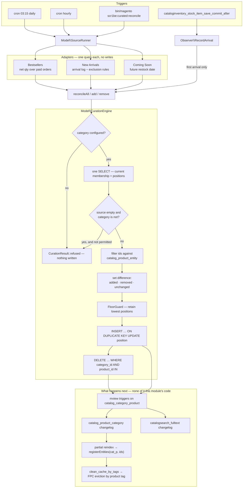

# Curated Categories

Every shop ends up with a Bestsellers page, a New In page and a Coming Soon page, and every one of
them starts as a spreadsheet somebody updates on a Monday. The obvious fix — a module per page —
produces three modules that each re-solve the same four problems badly: how to write a hundred
category assignments without a hundred category saves, what to do when the rule matches nothing, how
not to flush the whole page cache afterwards, and how to see what a rule *would* do before it does
it.

This is the other shape. One batch engine owns the writes and all four of those answers; three
adapters own nothing but a query. Adding a fourth kind of curated page is a class with one method.

| Part | What it covers |
|---|---|
| `Api\CurationEngineInterface` | `reconcileAll` / `add` / `remove`, returning added, removed and unchanged |
| `Model\CurationEngine` | One SELECT, one upsert, one delete — for a feed of any size |
| `Model\FloorGuard` | The SEO floor: a curated category may shrink, it may not become an empty page |
| `Model\ResourceModel\CategoryMembership` | The only code in the module that touches the pivot |
| `Model\Source\Bestsellers` | Net quantity over paid orders in a rolling window, nightly |
| `Model\Source\NewArrivals` | First-in-stock log, event-driven with an hourly self-heal, plus exclusion rules |
| `Model\Source\ComingSoon` | A restock-date attribute, and the dated line it puts on the product page |
| `Console\Command\ReconcileCommand` | `--dry-run` for every adapter, because a rule is invisible until it has already run |

## Why this exists

Three problems, in the order they bite.

**Writing category membership is expensive in exactly the wrong way.** Look at what the service
contracts actually do. `Magento\Catalog\Model\CategoryLinkRepository::save()` — the one that adds a
single product to a single category — loads the category through `CategoryRepositoryInterface`, loads
the product through `ProductRepositoryInterface`, reads `getProductsPosition()`, puts one entry into
it and calls **`$category->save()`**. `deleteByIds()` does the same for a removal. So a reconcile that
adds six products and drops six costs twelve category loads, twelve product loads and twelve full
category saves — twelve rounds of every `catalog_category_save_*` observer in the installation,
for a merchandising page.

The other door is worse for this job, not better:
`CategoryLinkManagement::assignProductToCategories($productSku, array $categoryIds)` is keyed by
product and *replaces that product's entire category list*, so using it to fill one curated category
would strip its members out of every other category they belong to.

The table underneath all of that is `catalog_category_product`: four integer columns — `entity_id`,
`category_id`, `product_id`, `position` — with a composite primary key over the first three and
foreign keys onto the product and category rows. Nothing about reconciling a merchandising feed needs
more than an upsert and a delete against it.

**A rule that matches nothing is indistinguishable from a rule that means nothing.** An attribute
gets renamed, an order-status set falls out of use, an exclusion rule is one character wrong — and
the feed comes back empty. Applied literally, that empties a live category, and the merchant finds
out from the SEO report six weeks later. Every module that writes category membership on a schedule
needs an opinion about this, and "do what the source said" is not one.

**The cache.** Writing the pivot behind the repository's back means owing the system whatever the
repository would have done. The usual answer is a cache flush, which throws away a warm full-page
cache every night at three because twenty-four products changed places. The better answer turns out
to require no code at all, and is the most interesting thing in this module — see section 3.

## What's interesting (and what's just baseline)

| Choice | Why | Honest classification |
|---|---|---|
| The engine never touches the cache | The pivot is an mview-subscribed table. Under Update-on-Schedule the write is already in two changelogs and the partial reindex evicts by product tag; a manual flush would only be blunter and earlier | The actual insight, and the section with the caveat |
| One floor rule serves both call paths | "Retain the lowest positions" and "remove the highest first" are the same sentence read from opposite ends, so there is one class instead of two branches | Architectural |
| The empty-source refusal is separate from the floor | They fail differently: the floor is a shortfall, an empty source is a symptom. Collapsing them would hide the symptom behind a page that still has four products on it | The bug most implementations of this ship with |
| `insertOnDuplicate(..., ['position'])` rather than delete-then-insert | A re-rank costs one integer write instead of churning the primary key and putting the same product in the changelog twice | Baseline, and cheap to get wrong |
| Arrivals are recorded on the stock item, not the product | A product is created months before it is buyable; the stock item's save is the exact moment the answer changes | Architectural |
| First arrival wins, enforced by the storage | A restock is not an arrival. Doing it with a read-then-write would race; doing it with a no-op conflict clause cannot | Opinionated, and the conflict clause is a trap — see section 5 |
| Exclusion rules evaluated in PHP, not pushed into the WHERE | The candidate list is already capped, and a mistranslated EAV filter is a silent wrong answer rather than a slow one | Opinionated |
| Product ids filtered against `catalog_product_entity` before writing | The pivot's foreign key means one stale id does not skip a row, it aborts the whole upsert | Baseline |
| `--dry-run` takes the identical path, minus two statements | A second implementation of "what would happen" is a second thing that can be wrong | Baseline, and the reason the CLI exists |

## Architecture



### 1. Three statements, whatever the feed size

`reconcileAll()` reads the category's current membership once, computes the delta in memory and
issues at most two writes:

```sql
SELECT product_id, position FROM catalog_category_product WHERE category_id = ?

INSERT INTO catalog_category_product (category_id, product_id, position) VALUES …
  ON DUPLICATE KEY UPDATE position = VALUES(position)

DELETE FROM catalog_category_product WHERE category_id = ? AND product_id IN (…)
```

The upsert is the interesting one. A product already in the category costs an update of a single
integer, not a delete followed by an insert — which would churn the composite primary key and, on a
table two mview views subscribe to, put the same product into the changelog twice for no change at
all. Both writes chunk at five hundred rows, so a ten-thousand-product feed is twenty statements
rather than ten thousand and no statement approaches `max_allowed_packet`.

Positions are the source's ranking, one-based and gapless. Nothing preserves a member's old
position across a full reconcile: on a ranked feed the position *is* the rank, and a stale member
outranking today's number one is the one failure a ranked page cannot survive.

Before the upsert, the desired ids are intersected with `catalog_product_entity` in one query. The
pivot carries a foreign key onto that table, so a single id for a product that has since been deleted
does not skip a row — it aborts the whole statement. That is not hypothetical for the bestsellers
source: `sales_order_item.product_id` is a plain integer with no constraint behind it, so order
history keeps naming products long after they are gone. The arrival log cascades on delete and the
exclusion filter reads a live collection, so for those two the check is guarding a race — a product
deleted between the source's query and the engine's write — rather than a stale row.

### 2. Two guards that look like one and are not

**The floor** answers "the source came back short". **The refusal** answers "the source came back
empty". They are deliberately different mechanisms, because collapsing them produces a module that
reports success while its rule is broken: an empty feed would trip the floor, four products would
stay on the page, and nothing would be obviously wrong for a month.

The floor's rule is one sentence: *the members kept back are the ones with the lowest position.* On
a full reconcile that keeps whatever ranked highest the last time the source was healthy. On the
incremental `remove()` path it is the same statement from the other end — removal starts at the
highest position and works up. One class, one implementation, both paths. Ties break on product id,
because a category assigned by hand has every row at position 0 and a floor whose survivors depend
on sort-implementation detail would flap between identical runs.

The floor is clamped to a minimum of one on the way out of configuration. It is not a setting a
merchant can zero, because a curated category that can be emptied is the thing the guard exists to
prevent; the way to stop curating a category is to switch its source off.

The refusal is off-by-default configurable — *Let an empty source clear its category*. Switching it
on says "an empty feed is an instruction", and the floor steps aside with it. Leaving those two
coupled matters: permission to empty the category is worth nothing if four products come straight
back.

Both guards report through the same object. `CurationResultInterface` exposes `added`, `removed` and
`unchanged` — three disjoint sets that partition the outcome — plus `retainedByFloor`, which
overlaps `unchanged` and names the products that would have gone on the source's ranking alone.
That fourth set is the difference between a merchant seeing "the feed is short" and seeing nothing.

### 3. Why there is no cache invalidation in this module

This is the part worth reading the source for, and the part with a caveat.

Writing the pivot behind the repository's back normally means owing the system a cache eviction. It
does not here, because the pivot is not a private table:

- `Magento\Catalog\Model\Indexer\Product\Category` (indexer id `catalog_product_category`) subscribes
  to `catalog_category_product` on `product_id` — `vendor/magento/module-catalog/etc/mview.xml`.
- `catalogsearch_fulltext` subscribes to the same table on the same column —
  `vendor/magento/module-catalog-search/etc/mview.xml`.

So under Update-on-Schedule, the mview trigger puts every product this module touches into two
changelogs. When cron consumes them, `Magento\Framework\Mview\View::update()` calls
`$action->execute($ids)`, which for the category indexer reaches
`Magento\Catalog\Model\Indexer\Category\Product::execute()` — that registers the ids on the indexer
cache context, and `Magento\Catalog\Model\Indexer\Product\Category::registerEntities()` registers
them under `Magento\Catalog\Model\Product::CACHE_TAG`, which is `cat_p`. The plugin
`Magento\Indexer\Model\Processor\CleanCache` wraps `updateMview()` and flushes that context
afterwards, dispatching `clean_cache_by_tags`; `Magento\PageCache\Observer\FlushCacheByTags` picks it
up and cleans the built-in full page cache by matching those tags.

The result is a targeted eviction of exactly the pages carrying `cat_p_<id>` for the products whose
membership changed — arrived at without a single line of cache code in this module, and strictly
better than the `$cacheManager->clean(['cat_c'])` most schedulers reach for.

**The caveat, stated plainly.** Those tags are product tags. A category listing page's cache entry
carries `cat_c_p_<categoryId>` (from `Magento\Catalog\Block\Product\ListProduct::getIdentities()`)
plus `cat_p_<id>` for each product it actually listed
(`Magento\Catalog\Model\Product::getIdentities()`). So:

- **Removals evict the curated page.** It listed that product, so it carries that product's tag.
- **A run that only adds does not.** The page never listed the new product, so it does not carry its
  tag, and the cached copy survives until something removes a member or the entry expires.

In practice a ranked, capped feed reaches its cap and then every addition is paired with a removal,
which is why the gap is narrow rather than theoretical-only. It is still a gap, and the honest
description of this design is "no manual invalidation, at the price of one cache cycle on a
pure-addition run" — not "invalidation solved". A shop that cannot accept that should run the
reconcile and then evict `cat_c_p_<categoryId>` itself; the engine returns the category id on every
result for exactly that purpose.

Under Update-on-Save none of the above happens, and the consequence is bigger than a stale cache: with
no changelog there is no partial reindex, so `catalog_category_product_index_store<id>` — the table a
category listing is actually built from — never learns about the write at all, and the storefront
shows the old membership until someone reindexes. The module is designed for scheduled indexing, the
install section says so, and this is the reason.

### 4. Bestsellers: what people kept, not what they ordered

Magento ships `sales_bestsellers_aggregated_daily`, unique on (`period`, `store_id`, `product_id`) and
carrying `qty_ordered` with a precomputed `rating_pos`. This does not use it. Its metric is quantity
*ordered*, so an order placed and cancelled the same afternoon still ranks — and for a page customers
shop from, the number that matters is what people kept.

One grouped query over `sales_order_item` joined to `sales_order`, ranking on
`SUM(qty_ordered − qty_canceled − qty_refunded)`. `COALESCE` on the two subtrahends is not decoration:
both columns are nullable, and one NULL would make the whole expression NULL and drop the product
out of the ranking silently.

Three conditions carry the correctness:

- **Paid states only** — `processing` and `complete`. `pending_payment` is a shopper who reached the
  payment page, `canceled` is a sale that did not happen, `closed` is one that was fully refunded.
- **`parent_item_id IS NULL`** — a configurable order writes two rows, the configurable and the simple
  it resolved to, and the parent is the one a shopper can reach from a category page. The child is
  normally Not Visible Individually, so counting it would rank a product no listing renders and leave
  the configurable out of its own bestsellers page.
- **No store filter** — `catalog_category_product` has no store column, so membership is global and
  the ranking behind it has to be. A per-store bestsellers list is a real feature and it is not one
  this table can express.

The window boundary is computed as *now* in the configured locale, then converted to UTC, because
`sales_order.created_at` is a TIMESTAMP column. Thirty days means thirty days as the merchant
experiences them, compared against rows as MySQL stores them.

### 5. New Arrivals: two clocks, and a conflict clause worth staring at

"New" has no answer in the core schema. `catalog_product_entity.created_at` is when the row was
written, which on an ERP-fed catalogue is months before the product goes on sale and identical for
the whole import batch. `news_from_date` is a flag somebody has to remember to set. What actually
marks an arrival is the first time the product could be bought, and nothing records it — so this
module does, in `scr1be_curated_arrival`: one row per product, `product_id` as the primary key.

The observer listens to `cataloginventory_stock_item_save_commit_after`.
`Magento\Framework\Model\AbstractModel::afterCommitCallback()` dispatches
`<_eventPrefix>_save_commit_after` with `<_eventObject>` as the payload key, and
`Magento\CatalogInventory\Model\Stock\Item` declares those as `cataloginventory_stock_item` and
`item`. Commit-after rather than save-after for the usual reason: the row is durable, so nothing the
observer gets wrong can roll back the write that triggered it. Registered globally, not in
`adminhtml`, because stock is written by REST, by the import module and by whatever an ERP calls, and
an arrival log that only fills in when a human clicks Save is an arrival log with holes in exactly
the places bulk updates live.

**Only the first arrival does anything.** Every stock write reaches this observer, including the one
an order placement makes when it decrements quantity, so after the arrival is stamped the product's
membership is the hourly reconcile's business. Otherwise the checkout path would carry a category
membership read.

**The conflict clause.** "Insert and never update" is expressed as
`insertOnDuplicate($table, $row, ['product_id'])` — a conflict clause that writes the primary key
back to itself. The intuitive spelling, an empty field list, does the opposite of what it reads
like: `Magento\Framework\DB\Adapter\Pdo\Mysql::insertOnDuplicate()` replaces an empty `$fields` with
*every* column, so it would overwrite `arrived_at` on every restock and destroy the one fact the
table exists to hold. There is a unit test whose entire job is to keep someone from simplifying that
line back.

**The hourly cron is a self-heal, not the primary path.** The observer already puts a product on the
New page within a request of it becoming buyable. What the cron catches is what an event cannot:
products ageing out of the window, an import run with events disabled, a request that died between
the stock write and the category write.

**Exclusion rules** are three columns in a dynamic-rows grid — attribute code, operator, value —
combined by All or Any. Seven operators, with comparison semantics that are loose on purpose: the
admin types strings, EAV hands back option ids and numeric strings, and `"42" === 42` would make
every numeric rule match nothing. `gt`/`lt` are the exception and refuse a non-numeric operand
rather than coercing "Blue" to zero and excluding the catalogue. An empty rule set excludes nothing
under *both* modes — the vacuous-truth reading of "all rules match" would empty the category the
moment somebody saved a blank form.

Because exclusions are applied to what the query already picked, the query over-fetches by a factor
of three and the slice happens afterwards. That is a heuristic and is documented as one: a rule set
that rejects more than two thirds of every window still produces a short feed, and at that point the
floor is what keeps the page alive.

### 6. Coming Soon: one date, three effects

The adapter is driven by `scr1be_restock_date`, a global-scope datetime attribute installed by a data
patch. A merchant who knows when the container lands types it into the product and gets three things
at once: the product on a Coming Soon page, a dated line on its own page, and both of them
disappearing by themselves the morning the date passes. Nothing has to be un-set, which matters,
because the thing nobody ever does is go back and clear a flag.

The query is a product collection rather than raw SQL, because
`addAttributeToFilter($code, ['date' => true, 'from' => …])` is the only thing in Magento that knows
how EAV datetimes are stored and compared. Core builds the same shape —
`Magento\Catalog\Block\Product\NewProduct::_getProductCollection()` filters `news_from_date` with a
`['date' => true, …]` condition against a boundary formatted from `$this->_localeDate->date()`.
Reimplementing that against `catalog_product_entity_datetime` is how a module ends up a day out for
half the year. The boundary is the start of today rather than the current time: a delivery landing
this afternoon should not vanish from the page at midnight.

The PDP line is a ViewModel whose show/hide rule is *identical* to the adapter's — a restock date
that has not passed — because a product on the Coming Soon page whose detail page says nothing, and a
detail page promising a date for a product the category dropped this morning, are the two ways this
feature is normally broken, and both come from the page and the feed asking slightly different
questions. The template asks once and renders nothing when the answer is empty.

The message is admin-written with three tokens: `{date}`, `{days}` (*today* / *in 1 day* / *in 12
days*) and `{weekday}`. Braces rather than `%1` positions because the person editing it is not
counting arguments, and an unknown token left visible in the sentence is a mistake somebody can see
and fix. It is the one store-scoped setting in the module — a storefront string legitimately differs
per store view, whereas nothing that feeds the engine can, because the table it writes has no store
column.

### 7. The CLI, and why `--dry-run` is the point

```
bin/magento scr1be:curated:reconcile [<source>] [--dry-run] [--verbose-ids]
```

A merchandising rule is written in an admin form and its effect is invisible until it has already
replaced the contents of a category. So `--dry-run` takes the identical path a cron run takes, up to
and not including the two write statements — what the table prints is what the run would have done,
not a second implementation's opinion of it.

With no argument it runs every enabled source; named, it runs that one even if it is switched off,
because somebody who typed the code meant that source. Exit codes are for the pipeline that will
eventually run this: zero when every selected source completed, one when any of them threw. A
*refused* run prints its reason and still exits zero — the guards did their job, and a deployment
should only fail on something that actually broke.

## Design decisions

- **No admin grid, no per-category UI.** Three sources, three config groups. A grid of curation rules
  is a different product with a different persistence story, and the moment it exists somebody wants
  rule ordering, per-store overrides and a preview — none of which the pivot table can honour.
- **The engine reports membership, not ordering.** A product that stays a member but moves from rank
  four to rank nine appears in `unchanged`. Positions are always rewritten to the source's ranking;
  reporting the moves as well would need a fourth bucket that nobody would read.
- **The arrival log is seeded from `created_at`, and that is an approximation.** Without a backfill,
  New Arrivals is blind for a whole window on any catalogue that was already live. The seed patch is
  one `INSERT … SELECT` with IGNORE, and the README says out loud that `created_at` is when the row
  was written rather than when the product became buyable. From installation onwards the observer
  records the real thing, and the seeded rows age out on their own.
- **Sources are global, deliberately.** Every setting that feeds the engine is read in the default
  scope, and the admin form offers no website or store switches on those groups, because
  `catalog_category_product` has no store column and a per-store setting would be a promise the
  storage cannot keep. Two store views running the same reconcile would overwrite each other.
- **The attribute column of the exclusion grid is free text.** A real catalogue has several hundred
  product attributes and a select of them is unusable. The cost is a typo silently matching nothing,
  which is turned into a warning in the log rather than an exception in cron.
- **`user_defined => false` on the restock attribute.** The module reads that code by name in three
  places; letting an admin delete it from the attribute grid would break the adapter and the PDP
  notice with no warning anywhere.
- **The runner does not catch.** Cron wants to log and continue so the rest of its group still runs;
  the CLI wants to report and exit non-zero. Swallowing in the runner would take that choice away
  from both, so the two callers each state their own policy.
- **Written for Magento Open Source.** The pivot is keyed by `entity_id`; on Commerce with staging
  enabled the category link field is `row_id`, and the membership queries would need the row ids
  rather than the entity ids they take today. Small, untested, and therefore called out rather than
  claimed.

## What gets shipped

```
src/
├── registration.php
├── composer.json                                  # scr1be/curated-categories, type magento2-module
├── etc/
│   ├── module.xml
│   ├── config.xml                                 # every adapter ships off, with no category
│   ├── acl.xml                                    # Scr1be_CuratedCategories::config
│   ├── db_schema.xml                              # scr1be_curated_arrival
│   ├── db_schema_whitelist.json
│   ├── events.xml                                 # global: cataloginventory_stock_item_save_commit_after
│   ├── crontab.xml                                # nightly bestsellers, hourly arrivals + coming soon
│   ├── di.xml                                     # source pool, two cron virtual types, log wiring, CLI
│   └── adminhtml/system.xml
├── Api/
│   ├── CurationEngineInterface.php                # reconcileAll / add / remove
│   ├── CurationSourceInterface.php                # what an adapter has to answer
│   └── Data/
│       ├── CurationTargetInterface.php
│       └── CurationResultInterface.php
├── Model/
│   ├── Config.php                                 # default scope everywhere but the storefront message
│   ├── CurationEngine.php                         # the three verbs and both guards
│   ├── FloorGuard.php                             # retain the lowest positions
│   ├── CurationTarget.php · CurationResult.php    # immutable in, immutable out
│   ├── SourcePool.php                             # di.xml registry, type-checked on construction
│   ├── SourceRunner.php                           # the four lines cron and the CLI share
│   ├── CurationLog.php                            # var/log/curated_categories.log
│   ├── ResourceModel/
│   │   ├── CategoryMembership.php                 # the only code that touches the pivot
│   │   ├── BestsellerRanking.php                  # one grouped query over the order tables
│   │   └── ArrivalIndex.php                       # first-arrival-wins, enforced by the conflict clause
│   ├── Source/
│   │   ├── AbstractSource.php                     # enabled, target, window boundaries
│   │   ├── Bestsellers.php · NewArrivals.php · ComingSoon.php
│   ├── Exclusion/
│   │   ├── Rule.php · RuleSet.php                 # seven operators, All/Any
│   │   ├── RuleReader.php                         # dynamic rows → typed rules, malformed rows dropped
│   │   └── ProductFilter.php                      # default-scope values, unknown attributes logged
│   └── Config/Source/                             # category picker, match mode, operators
├── Block/Adminhtml/Form/Field/
│   ├── ExclusionRules.php                         # the dynamic-rows grid
│   └── OperatorSelect.php                         # the select column renderer
├── Observer/RecordArrival.php                     # stamp the arrival, add on the first one only
├── Cron/ReconcileSources.php                      # one class, two schedules via virtual types
├── Console/Command/ReconcileCommand.php           # --dry-run, --verbose-ids, honest exit codes
├── Setup/Patch/Data/
│   ├── AddRestockDateAttribute.php                # scr1be_restock_date, global scope
│   └── SeedArrivalLog.php                         # one INSERT … SELECT IGNORE
├── ViewModel/ArrivalNotice.php                    # {date} · {days} · {weekday}
├── view/frontend/
│   ├── layout/catalog_product_view.xml            # after product.info.stockstatus
│   └── templates/product/view/arrival-notice.phtml
├── i18n/en_US.csv
└── Test/Unit/                                     # 19 test classes, 162 tests
```

## Install

```bash
# from your Magento 2 root
composer config repositories.scr1be path /path/to/Magento/curated-categories/src
composer require scr1be/curated-categories:@dev
bin/magento module:enable Scr1be_CuratedCategories
bin/magento setup:upgrade
bin/magento setup:di:compile
```

`setup:upgrade` creates `scr1be_curated_arrival`, installs the **Expected Restock Date** product
attribute and seeds the arrival log from `catalog_product_entity.created_at`.

The module is built for scheduled indexing. If the catalogue indexers are on Update on Save, the
reconcile still writes correctly but nothing feeds a changelog, so cache eviction does not happen —
see section 3:

```bash
bin/magento indexer:set-mode schedule catalog_category_product catalog_product_category catalogsearch_fulltext
```

## Configuration

**Stores → Configuration → scr1be → Curated Categories**

| Setting | Scope | Default | Notes |
|---|---|---|---|
| Let an empty source clear its category | default | No | No: an empty feed is refused and logged. Yes: it empties the category, and the floor steps aside with it |
| Log every reconcile | default | Yes | One line per run in `var/log/curated_categories.log` with the affected ids. Refusals and failures are logged either way |
| *(per source)* Enabled | default | No | Nothing runs until a merchant switches it on and picks a category |
| *(per source)* Category | default | — | Store roots are deliberately not offered. Membership is replaced on every run, so point it at a category nobody curates by hand |
| *(per source)* Products | default | 24 | 1–1000; outside that it falls back to 24 |
| Sales / arrival window (days) | default | 30 | 1–365; outside that it falls back to 30 |
| *(per source)* Minimum products kept | default | 4 (1 for Coming Soon) | The SEO floor. Clamped to at least 1 — it cannot be switched off, only the source can |
| Exclude when | default | Any | Any: separate bans, one match is enough. All: one compound ban, every condition must hold |
| Exclusion rules | default | — | Attribute code / operator / value, evaluated in the default scope |
| Product page notice | **store view** | `Expected back in stock on {date} — {days}.` | Tokens `{date}`, `{days}`, `{weekday}`. Blank to show nothing |

## Demo notes

On a stock **Magento 2.4.8 + Hyvä 1.4 + Luma sample data** storefront. Create three empty categories
first — *Bestsellers*, *New In*, *Coming Soon*, anywhere under the Default Category — so nothing the
sample data curates by hand gets overwritten.

1. **Dry run before anything is switched on.** Enable Bestsellers, point it at *Bestsellers*, leave
   everything else default, then:

   ```bash
   bin/magento scr1be:curated:reconcile bestsellers --dry-run --verbose-ids
   ```

   The table prints the plan and writes nothing. If the Added column is `0`, the sample orders are
   older than the 30-day window — widen *Sales window* to 365 and run it again. That is the honest
   demo of the window, not a defect.
2. **The real run.** Drop `--dry-run`. Open the category on the storefront: the products are ordered
   by net quantity sold, best first. Then:

   ```bash
   tail -n 1 var/log/curated_categories.log
   ```

   One `INFO` line with the added, removed and floor-retained ids.
3. **The empty-source refusal.** Set *Sales window* to 1 day (a shop with no orders yesterday), flush
   the config cache and run the command again. It prints
   `source returned no products while the category has 24 member(s); refusing to empty it`, exits
   zero, and the category is untouched. Set *Let an empty source clear its category* to Yes, run it
   once more, and now it empties. Set it back.
4. **The floor.** Restore the window, then set *Products* to 2 and *Minimum products kept* to 6. The
   run reports two added and four kept by floor: the page holds six even though the ranking only
   asked for two, and the four retained are the lowest positions from the previous run.
5. **New Arrivals, event-driven.** Enable it against *New In*. The arrival log was seeded from
   `catalog_product_entity.created_at`, so every Luma product already carries the sample-data install
   date — widen *Arrival window* until the feed fills, then reconcile.

   To watch the *event* path rather than the cron path, you need a product the seed never saw:
   create a new simple product with a quantity above zero and stock status In Stock, and save. Saving
   the product runs `Magento\CatalogInventory\Observer\SaveInventoryDataObserver`, which persists the
   stock item through its repository, which commits through
   `Magento\Framework\Model\ResourceModel\Db\AbstractDb::save()` and therefore fires
   `cataloginventory_stock_item_save_commit_after`. The product is in *New In* on the next page load,
   with no cron run in between. Save it again and nothing further happens — the observer acts on the
   first arrival only, which is why an order placement decrementing stock costs nothing.
6. **Exclusion rules.** Add one row — attribute `sku`, operator *contains*, value `WSH` — and reconcile:

   ```bash
   bin/magento scr1be:curated:reconcile new_arrivals --dry-run --verbose-ids
   ```

   Every women's short drops out of the plan. Switch *Exclude when* to All and add a second,
   contradictory rule (`color` *is* `nonsense`) — nothing is excluded, because All needs both.
   Mistype the attribute as `skew` and run again: the plan is unchanged and
   `var/log/curated_categories.log` carries a warning naming the unknown attribute rather than a
   stack trace.
7. **Coming Soon, end to end.** Enable it against *Coming Soon*. Open a product, set **Expected
   Restock Date** to a fortnight out and save, then:

   ```bash
   bin/magento scr1be:curated:reconcile coming_soon
   ```

   The product is in the category, and its detail page shows *Expected back in stock on … — in 14
   days.* directly under the availability line. Set the date to yesterday, reconcile again: it leaves
   the category and the line disappears — no flag to clear.
8. **The cache behaviour, measured.** With `catalog_product_category` on schedule and the built-in FPC
   enabled, warm a curated category page, run a reconcile that removes a product, then
   `bin/magento cron:run --group=index`. The page comes back uncached without any flush. Then do the
   same for a run that only *adds* — the page stays cached until the next removal. That is the
   documented limit in section 3, and it is worth seeing rather than taking on trust.
9. **Nothing is per-store.** Switch the config scope to a store view: the engine groups have no
   switches, and only *Coming Soon — storefront message* does. That is the store-column argument made
   visible in the form.

## Tests

```bash
# from your Magento 2 root
# path follows your install method — Composer package:
vendor/bin/phpunit -c dev/tests/unit/phpunit.xml.dist vendor/scr1be/curated-categories/Test/Unit

# …or, if you copied the module into app/code instead:
vendor/bin/phpunit -c dev/tests/unit/phpunit.xml.dist app/code/Scr1be/CuratedCategories/Test/Unit
```

162 tests over 19 classes, 279 assertions, aimed at the parts that can actually be wrong.

The engine, against a real `FloorGuard` rather than a mock: the three-way split, positions handed out
by rank with floor-retained members after the block, both refusals, the dry run touching nothing, the
incremental append landing after the current tail, and the normalisation of duplicates, strings and
non-positive ids that arrive from a `fetchCol`. The floor guard on its own for the property the
engine depends on — lowest positions retained regardless of input order, ties broken deterministically,
and complete withdrawal at floor zero.

The two seams where a framework contract lives: `CategoryMembership` for the exact `insertOnDuplicate`
field list, the chunking boundary, the scoped delete and the foreign-key filter preserving ranking;
`ArrivalIndex` for the conflict clause that makes first-arrival-wins true, which is the single line in
the module that most looks like it could be simplified and most cannot. `BestsellerRanking` for the
three WHERE clauses that are the query's correctness, and `ComingSoon` for the `['date' => true,
'from' => …]` shape it borrows from core.

The rule engine as pure functions: every operator against strings, option ids, decimals, absent
values and non-numeric operands; All and Any including the empty-set override; and the reader
discarding malformed rows rather than defaulting them. `ProductFilter` for the default-scope read and
for surviving a mistyped attribute code.

The wiring that has a policy: the observer's first-arrival-only rule and its refusal to throw out of
a commit-after callback; the cron's one-failure-does-not-stop-the-next contract; the CLI's exit codes,
including a refusal that prints its reason and still succeeds.

The layout XML, the `di.xml` and the template are configuration — covered by the demo walkthrough
above, not by mocks.

## Compatibility

| | Version |
|---|---|
| PHP | 8.2, 8.3, 8.4 |
| Magento 2 | 2.4.6, 2.4.7, 2.4.8 |
| Hyvä Theme | 1.4 for the PDP notice; the engine has no storefront surface at all |

The product-page notice is inserted after `product.info.stockstatus`, inside `product.info` — both
block names read out of Hyvä 1.4's own `Magento_Catalog/layout/catalog_product_view.xml`, which is
the version this was written against. Its markup is semantic HTML with Tailwind utility classes and
no Alpine: it renders on a Luma storefront too, unstyled but correct, and there is nothing in it for
a strict CSP to reject.

## License

MIT — see [LICENSE](LICENSE).
