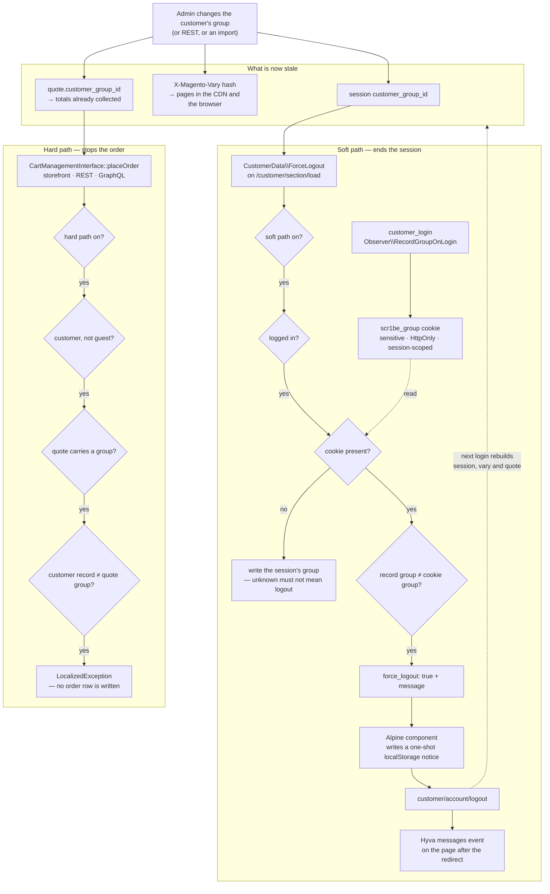

# Customer Group Guard

An admin moves a customer from Retail to Wholesale. In Magento that is one column on one row, and
nothing else in the installation notices. The customer's session keeps the group it authenticated
with, so every page they load is still the one the CDN cached for Retail. Their cart keeps the group
it was created with, so its totals are still Retail totals. When they check out, the order is
written at Retail prices — hours after the merchant believes they changed them.

There is no core event for "this session is now wrong", and there is nothing that could reach into a
CDN and evict one browser's pages. So this module does the only thing that reliably ends a stale
session: it signs the customer out, and it refuses to turn a stale cart into an order in the
meantime.

| Part | What it covers |
|---|---|
| `Model\GroupCookie` | The group this browser has been served under — written at login, and nothing else rewrites it |
| `CustomerData\ForceLogout` | The soft path's decision, on an uncacheable request, delivered through private content |
| `view/…/js/force-logout.js` | The Alpine component that acts on it, and the notice that survives the redirect |
| `Model\PlaceOrderGuard` | The hard path's decision: cart group against customer record, before an order exists |
| `Plugin\Quote\BlockStaleGroupPlaceOrder` | One hook covering the storefront checkout, REST and GraphQL |

## Why this exists

The group a customer is priced under is not stored in one place. It is stored in four, and only one
of them is the customer record:

- the **session**, which is what `getCustomerGroupId()` answers and what tier prices resolve against;
- the **HTTP context vary hash**, which is what the full-page cache and any CDN in front of it key
  the customer's pages under;
- the **quote row**, which is what the cart's totals were collected for and what the order will be
  written with;
- and the **customer record**, which is the only one an admin edits.

Changing the fourth does not change the first three. Magento has a notification path that refreshes
some session data on the customer's next frontend request, and it is worth knowing about, but it
does not help here for two reasons: it cannot touch pages that are already cached under the old
group's vary hash, and it does not rewrite a quote that was built before the change. The customer
carries on browsing prices that are no longer theirs, in a cart that will price the order the same
way.

The honest observation is that there is no surgical fix. Re-pricing the session in place would leave
the browser and the CDN holding pages for the old group, and re-pricing the cart under the customer
would change totals they had already agreed to without telling them. Ending the session is blunt,
but it is the only operation that invalidates all four copies at once — a new login rebuilds the
session, mints a new vary hash, and reassigns the quote.

## What's interesting (and what's just baseline)

| Choice | Why | Honest classification |
|---|---|---|
| The comparison is against a **cookie**, not the session's group | The session's group is the value core itself rewrites. Once it has, session and database agree while every cached page still belongs to the group before the change — the module would report "all fine" at the exact moment it is least fine | The actual insight |
| The cookie is never written on a cacheable response | Login is a redirect and section load is uncacheable, so no CDN can ever hand one customer's group cookie to another. That property is a consequence of *where* the two writes happen, so it is stated rather than assumed | Architectural, and a security property worth naming |
| A missing cookie heals from the session instead of forcing a logout | The other reading of "unknown" signs out every logged-in customer the moment the module is deployed | The decision most implementations get wrong in the deploy window |
| Two enforcement layers, not one | The soft path is eventually consistent by construction — it fires when customer data next reloads. Money is not something to be eventually consistent about | The reason the module is not just a section source |
| The section payload carries no group id | Section data lands in localStorage. It says something changed and what to tell the shopper, never which group | Baseline, and cheap to get wrong |
| The component is published as a global function, not registered with `Alpine.data()` | `alpine:init` may already have fired by the time a deferred module runs; `x-data` is not evaluated until the document is ready. A published name is immune to load order, a registration is not | Architectural, and silently theme-dependent if you get it wrong |
| The private-content listener is attached at module scope, not from `init()` | `private-content-loaded` does not replay for listeners that arrive late | Baseline, and the usual cause of "it works on a hard refresh" |
| No `sections.xml` | It maps *storefront actions* to invalidation, and nothing the shopper does can change this section's answer | Opinionated, and it is why the latency bound is documented rather than hidden |
| The quote's group is read through `DataObject`, not a getter | `CartInterface` does not publish it, and `getCustomer()` answers from the customer repository — comparing the database with itself | Easy to get wrong in a way that quietly always passes |
| An unreadable customer record never blocks anything | A repository that cannot answer is an infrastructure problem; refusing an order over one makes it a customer-facing one | Baseline |

## Architecture



### 1. The cookie, and why it is not the session

The value the soft path compares is not "what group is this customer in" — that is the half it reads
from the database. It is **"what group has this browser been served under"**, and the session is a
bad source for it.

Magento rewrites the session's own `customer_group_id` in more than one place: the notification path
that refreshes customer data after an admin edit, and the VAT-based automatic group assignment that
runs when an address is saved. After either of those, the session and the customer record agree —
and every page the browser is holding, plus every page the CDN has under this session's vary hash,
still belongs to the group before the change. A session-versus-database comparison reports "nothing
to do" at precisely the moment there is most to do.

A cookie written once at login is a value nothing else in the installation touches. It is
deliberately not refreshed while the session runs: the moment it starts tracking the session it
starts agreeing with it, and the property that makes it useful is gone.

Three things about how it is written are decisions rather than defaults:

- **Sensitive, not public.** `setSensitiveCookie()` guarantees `HttpOnly` and sets `Secure` from the
  current request, so neither is something this module could get wrong. Nothing in the browser reads
  the value — the comparison happens in PHP — so there is no reason for script to be able to reach
  it, and no way for a mistake in the JavaScript to desynchronise it.
- **Scoped like the session cookie.** Path and domain come from the session configuration. A
  mismatched pair on a multi-domain installation produces a write that succeeds, a read that finds
  nothing, and a delete that silently leaves the original in place.
- **A browser-session cookie.** There is no duration to tune. If the browser restarts and drops it
  while Magento's own session cookie survives, the section source heals it on the next request; that
  costs one comparison cycle, not a logout.

The value is untrusted input, so it is validated as digits and anything else reads as absent. Group
0 is a real group id in Magento — `NOT LOGGED IN` — which makes a lenient `(int)` cast on garbage a
comparison that can accidentally succeed. Nothing that costs money depends on the cookie in any
case: the hard path never reads it, so the worst a shopper can do by editing their own cookie is
sign themselves out, or decline to be signed out and be refused at checkout instead.

### 2. What "CDN-critical" means here, concretely

This is the part that works perfectly in local development and silently does nothing in production
if it is not checked.

**The cookie has to reach the origin.** Fastly, CloudFront and any Varnish configuration with a
cookie allowlist forward only the cookies they are told about. `/customer/section/load` is
uncacheable, so stock Magento VCL passes it through with its cookies intact — but a hand-tuned
allowlist will not include a name it has never seen. If it is stripped, the section source finds no
cookie, heals it on every request, and never fires. The symptom is a soft path that produces no
logouts and no errors; the fix is one entry in the allowlist.

**The cookie must not enter the cache key.** It is per-customer. Keying cached pages on it would
shatter the hit rate into one entry per shopper, which is a worse outcome than the problem this
module solves.

**It is never written on a cacheable response**, and that is a property of where the two writes
happen rather than a rule that has to be enforced separately. Login is a redirect and section load
is explicitly uncacheable, so there is no response carrying this `Set-Cookie` that a shared cache
could store and replay to a second visitor.

**`Secure` follows the request, not the browser's address bar.** Behind a TLS-terminating CDN
talking plain HTTP to the origin, Magento only knows the request was secure if the offloader header
is configured. Without it the cookie is issued without `Secure` — a downgrade rather than a
breakage, but one worth catching in the same review as the allowlist.

### 3. The healing write

The section source writes the cookie when it finds none. It is the module's one side effect in a
read path, and the alternative is worse.

"No cookie" means unknown, and unknown has exactly two readings. Treat it as a mismatch and every
logged-in customer is signed out the moment the module is deployed, and again every time a browser
restart drops the cookie. Record what the browser is currently being served under and start
comparing from there, and the cost is one comparison cycle in exchange for being correct from then
on.

The value written is the **session's** group, not the customer record's — the session's group is
what the pages this browser holds were rendered under. If the session is itself already stale, the
next section load sees the difference and the soft path fires one cycle later, which is exactly
right.

### 4. Why the soft path cannot be the whole module

Customer data reloads on its own schedule: after login, after an action that invalidates a section,
and when the customer-data cache cookie expires — an hour on stock settings. A change made by an
admin invalidates nothing, because the admin is not in the shopper's session and has no way to
signal it. So the soft path's honest bound is "within the customer-data lifetime, and immediately
after anything that reloads sections", and a shopper who goes straight from a cached category page
to checkout can beat it.

That gap is not closed by making the section cleverer. It is closed by putting the second check
where the money is, which is what the place-order guard is for. The two layers answer different
questions — the soft path fixes the *state*, the hard path protects the *order* — and neither is a
weaker version of the other.

### 5. The place-order guard

`CartManagementInterface::placeOrder()` is the last step every checkout has in common: the
storefront checkout reaches it through the payment-information REST call, a headless client calls it
directly, and the GraphQL `placeOrder` mutation ends there too. One `before` plugin covers all
three, and keeps covering checkout implementations written after this module.

`before` rather than `around` because the guard either throws or returns — there is nothing to do
with a callable, and a `before` plugin physically cannot swallow a core exception or rewrite the
order id core hands back.

The comparison is the quote's own `customer_group_id` column against the customer record.
`CartInterface` does not publish that column, so it is read through `DataObject`; the tempting
alternative, `getCustomer()->getGroupId()`, answers from the customer repository and would be
comparing the database with itself — a guard that passes every time and looks entirely correct.

Three cases step aside, and each is a decision:

- **Guests.** A guest cart carries `NOT LOGGED IN` and has no customer record that could contradict
  it. There is nothing here an admin can change underneath them.
- **A quote with no group.** That is an unanswerable question, not a mismatch. Core assigns one on
  its own way to the order.
- **A customer that cannot be read.** Unknown resolves to "allow", for the same reason everywhere
  else in this module.

Refusal throws a `LocalizedException`, which every caller already understands: the REST layer turns
it into a 400 with the message, the GraphQL resolver wraps it into a clean error, and the storefront
checkout shows it. The cart is left completely intact — reloading it lets core reassign the group,
and signing out and back in, which the soft path is asking for anyway, rebuilds it from scratch. A
guard that "fixed" the state by emptying the cart would be destroying the one artefact the shopper
cares about.

### 6. The storefront component

The template renders a hidden element and a `<script type="module">`. There is no inline script and
no inline handler, the logout URL travels as a `data-` attribute rather than inside a generated
script block, and the only Alpine expression on the page is the factory call itself.

**The component is published as a global function, not registered with `Alpine.data()`.** A deferred
module can execute either side of a theme's Alpine bundle, which means `alpine:init` may already
have fired by the time this file runs — and a registration into a boot that has finished is a
component that never mounts. `x-data`, on the other hand, is not evaluated until Alpine walks the
DOM once the document is ready, which is after every deferred module has run. Publishing a name is
immune to load order; registering one is not.

**The private-content listener is attached at module scope**, not from the component's `init()`.
`private-content-loaded` is dispatched during page load and does not replay, so a listener that
waits for Alpine can miss the only dispatch of the page. The last payload is kept for whoever
subscribes afterwards, and — for the page that serves its sections from storage without dispatching
anything at all — the adapter reads `mage-cache-storage` directly. Any surprise in that storage
entry reads as "no sections", so the worst case is waiting for the next event.

**The notice is a one-shot `localStorage` key.** The message has to survive a full-page redirect to
the logout route, so it cannot live in component state; it must not survive a second one, so it
cannot live in a cookie something would have to be taught to clear. It is read and deleted in one
step, and relayed into Hyvä's messages event on whichever page the logout route ended up on — the
component never needs to know which page that is. The copy itself is translated in PHP and travels
in the section payload, because a string assembled in JavaScript is a string no translator will ever
see.

The redirect latches on the first accepted payload. Customer data can arrive more than once on a
page, and a second redirect mid-navigation is how a logout turns into a loop.

## Design decisions

- **Signing the customer out is the point, not a fallback.** It is the only operation that
  invalidates the session, the vary hash, the browser's cached pages and the quote in one move.
  Anything more surgical leaves at least one of the four holding old prices.
- **The cookie is a hint; the guard is the guarantee.** The soft path depends on a browser value, a
  CDN passing it through and a JavaScript file running. The hard path depends on none of those. That
  is why the thing a shopper can tamper with is also the thing that cannot cost anyone money.
- **No admin exemption on the place-order guard.** Admin order creation builds its quote from the
  customer's current group, so the two agree and the guard never fires. An area check would be a
  branch that exists to be untested.
- **No dedicated log file.** A refused checkout is rare and support-visible; it belongs in
  `system.log` next to everything else support already greps. A file of its own would be one more
  thing to remember to look in. Cookie failures are logged the same way and never propagate — a
  login this module broke would be a worse outcome than a soft path that did not fire.
- **The section is registered in `di.xml` and nowhere else.** `sections.xml` maps storefront actions
  to invalidation, and no storefront action changes this answer. Listing one anyway would suggest a
  freshness guarantee that does not exist; the bound is documented in section 4 instead.
- **The logout observer takes no `Config`.** Switching the guard off has to stop it acting, not stop
  it tidying up. A cookie that outlives the setting that created it is a stale comparison waiting for
  the day someone switches the feature back on.
- **No group ids in the payload, and no group ids in the message.** Section data is stored in the
  browser. "Your group changed" is all the shopper needs and all the module is willing to write
  there.

## What gets shipped

```
src/
├── registration.php
├── composer.json                                   # scr1be/customer-group-guard
├── package.json                                    # ES module scope + the JS spec runner
├── etc/
│   ├── module.xml
│   ├── config.xml                                  # defaults — both paths on
│   ├── acl.xml                                     # Scr1be_CustomerGroupGuard::config
│   ├── di.xml                                      # the place-order plugin, global
│   ├── adminhtml/system.xml                        # master switch + one per path
│   └── frontend/
│       ├── di.xml                                  # the customer-data section source
│       └── events.xml                              # customer_login, customer_logout
├── Model/
│   ├── Config.php                                  # store-scoped, master switch folded in
│   ├── GroupCookie.php                             # sensitive cookie: read, write, clear
│   ├── GroupResolver.php                           # the customer record's group, null on failure
│   └── PlaceOrderGuard.php                         # the hard path's decision ladder
├── CustomerData/
│   └── ForceLogout.php                             # the soft path's decision + the healing write
├── Observer/
│   ├── RecordGroupOnLogin.php
│   └── ClearGroupOnLogout.php
├── Plugin/Quote/
│   └── BlockStaleGroupPlaceOrder.php               # before placeOrder(): storefront, REST, GraphQL
├── ViewModel/
│   └── ForceLogout.php                             # the two FPC-safe values the template needs
├── view/frontend/
│   ├── layout/default.xml
│   ├── templates/force-logout.phtml
│   └── web/js/
│       ├── force-logout.js                         # the component — pure, specced
│       └── force-logout-register.js                # the browser adapter and the published name
├── i18n/en_US.csv
└── Test/
    ├── Unit/                                       # 9 PHPUnit classes
    └── Js/force-logout.spec.js                     # node --test, no dependencies
```

## Install

```bash
# from your Magento 2 root
composer config repositories.scr1be path /path/to/Magento/customer-group-guard/src
composer require scr1be/customer-group-guard:@dev
bin/magento module:enable Scr1be_CustomerGroupGuard
bin/magento setup:upgrade
bin/magento setup:di:compile
```

No schema and no data patches — the module adds no columns and no attributes. It writes one cookie
and reads core's own tables.

Behind a CDN, add `scr1be_group` to the forwarded-cookie allowlist and keep it out of the cache key.
See section 2 for what happens if you do not.

## Configuration

**Stores → Configuration → scr1be → Customer Group Guard**

| Setting | Scope | Default | Notes |
|---|---|---|---|
| Enable guard | store view | Yes | Master switch. Off is core behaviour: the customer keeps browsing, and checking out, under the group they signed in with |
| Sign the customer out after a group change | store view | Yes | The soft path — section source, cookie and Alpine component. Off leaves the place-order guard as the only enforcement |
| Refuse orders placed from a stale cart | store view | Yes | The hard path. Off means a stale cart can still become an order at the old group's prices |

Both paths are store-scoped because a multi-store installation routinely runs one storefront with a
group ladder worth enforcing and one without.

## Demo notes

On a stock **Magento 2.4.8 + Hyvä 1.4 + Luma sample data** storefront. Luma ships the four default
groups (`NOT LOGGED IN`, `General`, `Wholesale`, `Retailer`), which is all this needs; a catalog
price rule or a tier price scoped to `Wholesale` makes the price difference visible on screen.

1. **Set the stage.** Register a customer on the storefront and add something to the cart. In a
   second browser (or the same one in a private window) open the admin, and put a tier price or a
   catalog rule on a product for the `Wholesale` group so the change is visible.
2. **The cookie exists.** In the storefront browser's dev tools, Application → Cookies:
   `scr1be_group` holds the group id the customer signed in with, flagged `HttpOnly`. Nothing on the
   page can read it, which is the intent.
3. **Change the group.** Admin → Customers → All Customers → the customer → Account Information →
   Group → `Wholesale` → Save.
4. **The soft path.** Back on the storefront, force a customer-data reload — the reliable way is to
   add anything to the cart, which invalidates sections. The page reloads sections, the section
   source finds the mismatch, and the browser is redirected to the logout route. The message bar on
   the page that follows explains why. Signing back in, prices are the `Wholesale` ones and
   `scr1be_group` holds the new id.
5. **Watch it decide.** With the network tab open, the `/customer/section/load` response contains
   `scr1be_force_logout` with `force_logout: true` and a message — and nothing else. No group ids
   land in the browser.
6. **The hard path, on its own.** Set *Sign the customer out after a group change* to **No** and
   flush the config cache, then repeat from step 1. This time nothing happens while the customer
   browses — that is the soft path being off — and the refusal comes at the end: fill in checkout,
   press **Place Order**, and the order is refused with "Your account changed while you were
   shopping." No order row is written, and `var/log/system.log` carries one warning line with the
   quote id and both group ids. Reload the cart and place the order again: it goes through.
7. **The same refusal over REST.** With a customer token, `POST
   /rest/V1/carts/mine/payment-information` on the stale cart returns a 400 with the same message.
   The GraphQL `placeOrder` mutation returns it as an error. One plugin, three transports.
8. **Guests are untouched.** Check out as a guest with both settings on. Nothing in the module fires
   — there is no customer record behind a guest cart to disagree with.
9. **The healing write.** Delete `scr1be_group` from dev tools while signed in and reload. The next
   `/customer/section/load` re-issues it with the session's group and reports `force_logout: false`.
   A missing cookie is unknown, and unknown is not a reason to sign anyone out.
10. **The kill-switch.** Set *Enable guard* to No, flush the config cache, and repeat step 3: the
    customer browses and checks out at the old group's prices, which is stock Magento behaviour.

## Tests

```bash
# PHP — from your Magento 2 root
# path follows your install method — Composer package:
vendor/bin/phpunit -c dev/tests/unit/phpunit.xml.dist vendor/scr1be/customer-group-guard/Test/Unit

# …or, if you copied the module into app/code instead:
vendor/bin/phpunit -c dev/tests/unit/phpunit.xml.dist app/code/Scr1be/CustomerGroupGuard/Test/Unit

# JavaScript — from the module's src/ directory, no install step
node --test Test/Js/force-logout.spec.js
```

Nine PHPUnit classes cover the parts that can actually be wrong: the master switch gating both paths
in every combination; the cookie's digit validation across six malformed values, its scoping on both
the write and the delete, and both failures being logged rather than raised; the resolver's
unknown-on-failure contract; the soft path's full ladder including the healing write and the promise
that the payload never carries a group id; the hard path's five step-aside conditions, its refusal,
and the `DataObject` fallback; both observers, including the login event arriving in either customer
shape; the plugin's hand-off and its silence on an unknown cart; and the view model's two
FPC-safe reads.

The JavaScript spec runs on Node's built-in test runner with no dependencies and no DOM. The
component is written against a `browser` seam and two Alpine magics, so a recorder object and a
two-line stub are the whole harness — which is also why the component lives in a file rather than
inside the template. It covers the redirect, the payloads that must not trigger one (missing
section, `force_logout: false`, the string `"false"` a mangled storage round trip can leave behind,
a missing logout URL), the single-redirect latch, and the notice being consumed exactly once.

Layout XML, the DI wiring and the template are configuration — they are covered by the demo
walkthrough above, not by mocks.

## Compatibility

| | Version |
|---|---|
| PHP | 8.2, 8.3, 8.4 |
| Magento 2 | 2.4.6, 2.4.7, 2.4.8 |
| Hyvä Theme | 1.3+ for the message bar; everything else is theme-agnostic |

The backend is pure core: a customer-data section, two observers and one plugin on a service
contract. The only Hyvä-specific line is the message dispatch, which uses the theme's own helper
when it is present and falls back to the `messages-loaded` event it dispatches. On a Luma theme both
guards still work — the logout happens, the explanation is the only thing missing.

Written for Magento Open Source. Nothing here touches an entity's link field, so the Commerce
staging caveat that applies to catalog modules does not apply to this one.

## License

MIT — see [LICENSE](LICENSE).
