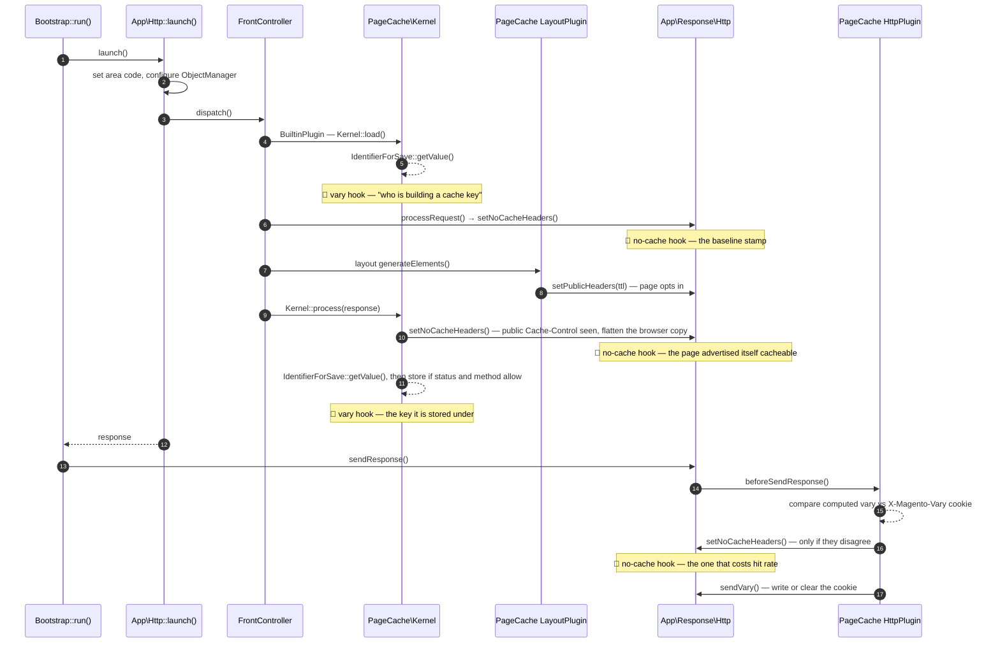

# FPC Inspector

A cacheability debugging tool for Magento 2. It answers the two questions every Magento developer
eventually has to answer about the full page cache, and that the platform gives you no way to ask:

1. **What put a non-empty value into the vary string?** — the reason this URL is stored under a
   dozen different cache entries instead of one.
2. **Who forced `pragma: no-cache`?** — the reason this page is never stored at all.

It answers them by hooking the two methods where those decisions actually become visible, and
writing a structured JSON record to its own log file. Nothing is inferred from response headers
after the fact; every record is taken at the moment the decision was made, with the call stack of
whoever made it.

Off by default. It is a lamp you switch on over one page for a few minutes, not a monitor.

## Why this exists

Full page cache problems are silent. Nothing errors, nothing warns; the site is simply slower than
it should be, and the hit rate is a number in a dashboard rather than a stack trace. The two failure
modes look identical from outside — a page that misses every time and a page that is stored under so
many keys it may as well not be cached — and the usual debugging routine is to bisect modules until
it stops.

The information you need exists, briefly, inside two method calls. `Context::getVaryString()` knows
exactly which context keys survived core's filter, because it just filtered them.
`Response\Http::setNoCacheHeaders()` knows exactly which `Cache-Control` it is about to flatten,
because the value is still there when it is called. Both facts are gone a microsecond later. This
module writes them down.

It is also the smallest project in this portfolio by feature count and the one that required the
most reading of core, which is the point: a debugging tool that reports a plausible-sounding wrong
answer is worse than no tool at all.

## Question 1 — what put a value into the vary string

`Magento\Framework\App\Http\Context` is a bag of key/value pairs, each registered with a *default*.
`getVaryString()` hashes the pairs that differ from their default — everything else is discarded
before hashing, and if nothing survives, the method returns `null` and the page is cached unvaried.
The filter that decides this lives in `getData()`, and it is two conditions long:

```php
// vendor/magento/framework/App/Http/Context.php
foreach ($this->data as $name => $value) {
    if ($value && $value != $this->default[$name]) {
        $data[$name] = $value;
    }
}
```

Both conditions surprise people:

- **The first test is truthiness, not difference.** A key set to `0`, `''`, `false` or `[]` never
  fragments the cache regardless of its default. This is why `customer_logged_in` is invisible for
  guests and appears the instant someone signs in.
- **The second comparison is loose.** `'0'` and `0` are the same value here, and so are `1` and
  `true`. A key can look different from its default in a `var_dump` and still be completely inert.

A vary record reproduces that filter key by key and reports both lists: `contributors`, the keys that
reached the hash, and `inert`, the keys that were dropped and why. Each entry also carries a
`setter` — a pointer to the core code known to write that key in 2.4.8, offered as a place to start
looking:

| Context key | Written by |
|---|---|
| `customer_group`, `customer_logged_in` | `Magento\Customer\Model\App\Action\ContextPlugin::beforeExecute` |
| `store`, `current_currency` | `Magento\Store\App\Action\Plugin\Context::updateContext` (currency also `Magento\Store\Model\Store::setCurrentCurrencyCode`) |
| `product_list_order`, `product_list_dir`, `product_list_mode`, `product_list_limit` | `Magento\Catalog\Plugin\Framework\App\Action\ContextPlugin::beforeDispatch`, and the getters on `Magento\Catalog\Block\Product\ProductList\Toolbar` |
| `tax_rates` | `Magento\Tax\Model\App\Action\ContextPlugin::beforeExecute` |
| `weee_tax_region` | `Magento\Weee\Model\App\Action\ContextPlugin::beforeExecute` |
| `PERSISTENT` | `Magento\Persistent\Model\Plugin\PersistentCustomerContext::beforeGetVaryString` |

Anything not on that list is reported as unknown rather than guessed at. The table is a hint; the
record is the evidence.

## Question 2 — who forced `pragma: no-cache`

`setNoCacheHeaders()` replaces `Cache-Control` with `no-store, no-cache, must-revalidate, max-age=0`
and back-dates `expires` by a year. On an ordinary storefront request core calls it from more than
one place, and **only one of those is a problem** — which is precisely why "the response has
no-cache headers" is not a diagnosis:

| Caller | What it means |
|---|---|
| `Magento\Framework\App\FrontController::processRequest()` | No-cache is the *default* state of a Magento response — this fires at the top of every dispatch. A page becomes cacheable later, when `Magento\PageCache\Model\Layout\LayoutPlugin::afterGenerateElements()` sets public headers on a layout that reports itself cacheable. A record from here means nothing on its own. |
| `Magento\Framework\App\PageCache\Kernel::process()` | Called the moment `process()` sees a public `Cache-Control` — before the status-code and request-method checks that decide whether the entry is actually written. It is flattening the copy going to the browser, not refusing to cache: a record from here means the page **advertised** itself as cacheable, and `will_cache` on the same line says whether the rest of the conditions hold. |
| `Magento\PageCache\Model\App\Response\HttpPlugin::beforeSendResponse()` | Fires when the computed vary string and the `X-Magento-Vary` cookie disagree. This runs during `sendResponse()`, which `Bootstrap::run()` calls only after `launch()` has returned, so the built-in cache has already decided by then; what these headers change is what every cache *downstream* of PHP is told. |
| `Magento\CatalogSearch\Controller\Result\Index::execute()` | Search result pages opt out explicitly, right before `renderLayout()`. Not a bug, and not something a plugin hunt will ever explain. |
| `Magento\Store\App\FrontController\Plugin\RequestPreprocessor::aroundDispatch()` | A base-URL redirect response. If you see this, you are not debugging the page you think you are. |

Each record carries the flattened call stack, so the three that fire on the same page are three
readable lines rather than one ambiguous symptom.

One Hyvä-specific wrinkle worth knowing while reading headers in a browser:
`Hyva\Theme\Plugin\Theme\RemoveNoStoreHeaderPlugin` declares a before/after pair on this same method
and, when `system/full_page_cache/bfcache` is on and the response was public, removes the `no-store`
directive again afterwards. The header on the wire is therefore not always the header
`setNoCacheHeaders()` produced — another reason to record at the call site rather than at the edge.

## Where the hooks sit



## What a record looks like

One JSON line per event in `var/log/fpc_inspector.log`. Monolog writes a readable summary as the
message and the structured record as the context:

```
[2026-08-13T09:14:02.117845+00:00] fpcInspector.INFO: vary 7f3ac9d2 on /gear/bags.html?product_list_order=price from customer_group, product_list_order {"request_id":"9c41ab07","seq":1,…}
```

The context, formatted:

```json
{
  "request_id": "9c41ab07",
  "seq": 1,
  "channel": "vary",
  "uri": "/gear/bags.html?product_list_order=price",
  "method": "GET",
  "store": "default",
  "currency": "USD",
  "vary": "7f3ac9d2…",
  "vary_cookie": null,
  "vary_matches_cookie": false,
  "cookie_action": "set",
  "contributors": [
    {
      "key": "customer_group",
      "value": "1",
      "default": "0",
      "setter": "Magento\\Customer\\Model\\App\\Action\\ContextPlugin::beforeExecute"
    },
    {
      "key": "product_list_order",
      "value": "price",
      "default": "position",
      "setter": "Magento\\Catalog\\Plugin\\Framework\\App\\Action\\ContextPlugin::beforeDispatch or …"
    }
  ],
  "inert": [
    {
      "key": "customer_logged_in",
      "value": "false",
      "default": "false",
      "setter": "Magento\\Customer\\Model\\App\\Action\\ContextPlugin::beforeExecute",
      "ignored_because": "value is falsy, so core drops it before hashing"
    }
  ],
  "will_cache": {
    "verdict": "no",
    "reason": "Cache-Control does not match public + s-maxage, so Kernel::process() returns without storing",
    "cache_control": "no-store, no-cache, must-revalidate, max-age=0",
    "http_status": 200,
    "backend": { "cache_type_enabled": true, "application": "built-in", "configured_ttl": 86400 }
  },
  "stack": [
    "Magento\\PageCache\\Model\\App\\Request\\Http\\IdentifierForSave::getValue (vendor/magento/module-page-cache/Model/App/Request/Http/IdentifierForSave.php:52)",
    "Magento\\Framework\\App\\PageCache\\Kernel::load (vendor/magento/framework/App/PageCache/Kernel.php:133)",
    "Magento\\PageCache\\Model\\App\\FrontController\\BuiltinPlugin::aroundDispatch (…)"
  ]
}
```

### Reading a record

| Field | What it tells you |
|---|---|
| `request_id` / `seq` | Both channels stamp the same short id, so one page load's records grep out of a busy file together, in order. |
| `channel` | `vary` or `no-cache` — which hook wrote the line. |
| `store` / `currency` | Read out of the HTTP context, not the store manager: the values the cache key was built from, which is not always what the page thinks it is showing. |
| `vary` | The computed vary string. `null` means the context is empty and the page is cached unvaried — the good case. |
| `vary_cookie` | The `X-Magento-Vary` the browser sent, read off the request the same way core reads it. |
| `vary_matches_cookie` | Strict comparison, mirroring core's. `false` is the exact condition under which `HttpPlugin` stamps no-cache on this response. |
| `cookie_action` | What `sendVary()` is about to do: `set`, `delete` or `none`. A request that rewrites the cookie is a request whose successor will behave differently. |
| `contributors` | The keys that reached the hash. This is the answer to question 1. |
| `inert` | The keys that did not, and why. This is the answer to "why is my key *not* varying the cache", which is asked just as often. |
| `will_cache` | Would the built-in cache store this response, as it stands right now — with the reason, the `Cache-Control` in force, the status code, and which caching application is configured. |
| `stack` | The caller, with interception plumbing removed. This is the answer to question 2. |

`will_cache` is a snapshot, not a prediction. A record taken before layout generation reads `no` on
a page that ends up cached perfectly well, because no-cache is where every response starts. Read it
together with the stack: the same `no` means opposite things depending on who is asking.

## Design decisions

**The cookie is not a cache key — not in 2.4.8.** The widely repeated story is that Magento loads
from the cache using the `X-Magento-Vary` cookie and saves using the freshly computed vary string,
so a stale cookie splits the two. That was true of `Magento\Framework\App\PageCache\Identifier`,
which prefers the cookie and falls back to the computed value. It is not what runs: Magento_PageCache's
`etc/di.xml` makes `Magento\PageCache\Model\App\Request\Http\IdentifierForSave` the preference for
`IdentifierInterface`, and its `etc/frontend/di.xml` passes that same class as `Kernel`'s
`identifierForSave` argument — so `Kernel::load()` and `Kernel::process()` hash the same inputs, both
from the computed vary string. (Confirmed against this repo's own compiled DI: both of `Kernel`'s
identifier arguments resolve to `IdentifierForSave`.) The cookie's real job is to be a tripwire in
`HttpPlugin::beforeSendResponse()`, and that is what this module reports. The older `Identifier`
survives as the class `IdentifierForSave` borrows its marketing-parameter list from, and as the
GraphQL cache's plugin target.

Worth knowing while you are in there: the cache key is more than the vary string. When the built-in
cache is the active application, `IdentifierStoreReader::getPageTagsWithStoreCacheTags()` also folds
the user-agent design exception and the `MAGE_RUN_TYPE` / `MAGE_RUN_CODE` server values into the hash
before it is taken. This module reports the vary string, because that is the part a merchant's own
code influences.

**`after` on the vary string, `before` on the no-cache stamp.** The two hooks want opposite ends of
their calls. The vary string only exists once core has filtered and hashed, so `after` is the only
position that has an answer — and `before` would be actively misleading, because Magento_Persistent
installs its own `beforeGetVaryString()` plugin that writes a key into the context on the way in.
The no-cache stamp is the reverse: the interesting value is the `Cache-Control` about to be
destroyed, and `after` would read back the same flattened header on every line. Neither hook uses
`around` — an `around` on a method called several times per request would leave a closure between
core and its own implementation for the lifetime of the install to observe something a read can
already see.

**De-duplication by call site, not by value.** `getVaryString()` is called several times per
request, `setNoCacheHeaders()` up to three. Logging every call buries the interesting event under
copies of itself; logging only the first throws away the caller list, which is half the answer. The
fingerprint is (channel, value, top stack frame): one line per distinct call site, plus a fresh line
the moment a call site produces a value not yet seen. A vary string that changes mid-request is
exactly the bug worth catching, and this policy makes it two adjacent lines instead of a silent
overwrite.

**A re-entrancy guard, because the hooks can call each other.** The no-cache hook asks the HTTP
context for its vary string to describe the response it is looking at. That call goes through the
interceptor the vary hook is attached to — plugins fire on any call that dispatches against the
interceptor instance, including from another plugin. Without a guard the module would record its own
question as somebody else's answer, with a stack rooted inside itself. Recording is therefore a
critical section: while one record is being assembled, the other channel stands down.

**Configuration is read in the default scope only, and the admin form says so.** Both hooks fire
while the front controller is still dispatching — the same window in which Magento_Store's dispatch
plugin is resolving which store the request belongs to. A store-scoped read there would either
answer for the wrong store or drag store resolution forward, which is an unacceptable side effect
for a tool whose entire job is to observe without disturbing. So the section offers no
website/store switches rather than promising a scope it cannot honour.

**Frontend area only.** Both questions are about the storefront full page cache; adminhtml and the
CLI have no full page cache to explain. Extending to GraphQL is a matter of copying
`etc/frontend/di.xml` to `etc/graphql/` — deliberately not done, because the GraphQL cache identifier
composes its key from more than the storefront does and the records would need a shape of their own
to stay honest.

**It never throws.** Both hooks wrap their work in a `try`/`finally`, report failures to the module's
own log and hand the value back untouched; the failure reporter swallows its own failure in turn. A
debugging tool that takes the storefront down with it is worse than no debugging tool. In the same
spirit, the after-plugin types its `$result` as `mixed` rather than `?string`: generated interceptors
carry no `declare(strict_types=1)`, so a narrower parameter type would let PHP's weak-mode coercion
rewrite a value this module only meant to observe.

**Its own log file.** The workflow is "turn it on, reload one page, tail the file, turn it off", and
every unrelated notice interleaved into that file costs the reader a scroll. It also makes cleaning
up after a session a single `rm`.

## What gets shipped

```
src/
├── registration.php
├── composer.json                            # type: magento2-module
├── etc/
│   ├── module.xml                           # sequenced after Magento_PageCache
│   ├── config.xml                           # defaults — off
│   ├── acl.xml                              # Scr1be_FpcInspector::config
│   ├── di.xml                               # dedicated Monolog channel + handler
│   ├── frontend/di.xml                      # the two hooks, frontend only
│   └── adminhtml/system.xml                 # the admin form
├── Model/
│   ├── Config.php                           # default-scope settings, clamped stack depth, URI filter
│   ├── RecordingGate.php                    # the four questions asked before any work happens
│   ├── RequestScope.php                     # correlation id, de-duplication, re-entrancy flag
│   ├── RecordBuilder.php                    # the shared record shape
│   ├── Recorder.php                         # summary line + structured context
│   └── Inspector/
│       ├── VaryBreakdown.php                # re-runs core's filter, key by key, with reasons
│       ├── CacheVerdict.php                 # Kernel::process()'s conditions, evaluated read-only
│       └── StackTrace.php                   # backtrace minus interception plumbing
├── Plugin/
│   ├── LogVaryString.php                    # after Context::getVaryString()
│   └── LogNoCacheHeaders.php                # before Response\Http::setNoCacheHeaders()
├── i18n/en_US.csv
└── Test/Unit/                               # 10 PHPUnit classes
```

No schema, no data patches, no storefront output. The module adds nothing to the database and
renders nothing.

## Install

```bash
# from your Magento 2 root
composer config repositories.scr1be path /path/to/Magento/fpc-inspector/src
composer require scr1be/fpc-inspector:@dev
bin/magento module:enable Scr1be_FpcInspector
bin/magento setup:upgrade
bin/magento setup:di:compile
```

Installing it changes nothing on its own — the master switch is off, and with it off both hooks
return on their first line.

If an admin other than a full-privilege one should reach the settings, grant **System → User Roles →
*role* → Role Resources → Stores → Settings → Configuration → FPC Inspector**.

## Configuration

**Stores → Configuration → scr1be → FPC Inspector**

| Setting | Default | Notes |
|---|---|---|
| Record cacheability decisions | **No** | Master switch. Off, nothing is read and nothing is written |
| Only record these URIs | *(empty)* | Comma-separated substrings matched against the request URI. Empty records every storefront request, which on a live catalogue is a lot of lines per second. Matched literally, so a pasted URL full of `?` and `.` narrows rather than widens |
| Call stack frames per record | 12 | Frames kept after interception plumbing is stripped. Clamped to 1–50 in PHP whatever is stored |
| Record vary-string builds | Yes | Question 1's channel |
| Record no-cache stamps | Yes | Question 2's channel |

Default scope only, by design — see *Design decisions*.

## Runbook

The module is built for a five-minute window, not for continuous operation.

**Enable**

1. Set *Only record these URIs* to the one page you are investigating first — e.g.
   `/gear/bags.html`. Do this before flipping the master switch, not after.
2. Set *Record cacheability decisions* to **Yes**.
3. `bin/magento cache:flush config`.

**Reproduce**

4. `bin/magento cache:flush full_page` so the first request is a guaranteed miss.
5. `tail -f var/log/fpc_inspector.log` in one terminal.
6. Load the page in a browser — twice. The first load is the miss that stores it; the second is the
   one that tells you whether the key it was stored under is the key it is looked up under.
7. Repeat as the persona that misbehaves: signed out, then signed in, then with a sort order
   applied. The `request_id` groups each load.

**Read**

8. Ask question 1 first: on the `vary` lines, is `contributors` empty? If it is, the page is cached
   unvaried and the problem is elsewhere. If it is not, every key listed is a multiplier on the
   number of cache entries this URL occupies.
9. Then question 2: on the `no-cache` lines, look at the top stack frame. `FrontController` is
   noise. `Kernel::process` means the page did reach public headers — read `will_cache` on that same
   line for whether the entry was then written. `HttpPlugin::beforeSendResponse` — with
   `vary_matches_cookie: false` beside it — is the finding.
10. Anything in `contributors` whose `setter` reads *unknown* is a third-party module writing to the
    context, and the fastest thing to grep for next.

**Disable**

11. Set *Record cacheability decisions* back to **No**, `bin/magento cache:flush config`.
12. `rm var/log/fpc_inspector.log`.

### Log growth, and what ends up in the file

With no URI filter this writes several lines per storefront request, each a few kilobytes with the
stack included. On a catalogue under real traffic that is tens of megabytes per hour, and the module
does no rotation of its own — it appends to one file. Set the URI filter, and treat "turn it off" as
part of the procedure rather than as cleanup.

On content: records carry the request URI, the store and currency the cache key was built from, the
vary hashes, and the context values themselves — including whatever a third-party module has written
into the context, truncated at 120 characters per value. That is ordinary cache-keying data rather
than customer records, but `tax_rates` and `weee_tax_region` do describe a shopper's tax geography,
so the file deserves the same handling as any other application log rather than being pasted into a
ticket wholesale.

## Demo notes

On a stock **Magento 2.4.8 + Hyvä 1.4 + Luma sample data** storefront, running the built-in cache in
developer mode (so Magento's own `X-Magento-Cache-Debug: HIT/MISS` header is present to check the
records against — `BuiltinPlugin` only emits it in developer mode).

1. **The good case first, so you know what healthy looks like.** Filter to `/gear/bags.html`, flush
   the full page cache, and load the category page as a guest. The `vary` records show
   `contributors: []` and `vary: null` — the whole context is inert. `customer_logged_in` is `false`,
   and `customer_group` is the string `'0'` for a guest (`ContextPlugin` registers
   `GroupManagement::NOT_LOGGED_IN_ID`, which is `0`, as its default), so it fails core's truthiness
   test before the comparison is even reached. The `no-cache` records are
   `FrontController::processRequest` (noise) and `Kernel::process` (the page reached public headers).
   Reload: `X-Magento-Cache-Debug: HIT`, and the records thin out to a single `vary` line whose stack
   tops out at `Kernel::load` — a hit never reaches the layout stack, so nothing sets public headers
   and nothing calls `Kernel::process`.

2. **Make the cache fragment, on purpose.** Sign in as Veronica Costello
   (`roni_cost@example.com`, Luma's customer fixture) and load the same page. Now `contributors`
   lists `customer_group` with a non-zero value against its default of `0`, `vary` is a hash instead
   of `null`, `vary_cookie` is `null` on the first signed-in request and `vary_matches_cookie` is
   `false`. Two records tell the story together: the `no-cache` line whose stack tops out at
   `HttpPlugin::beforeSendResponse`, and the `vary` line's `cookie_action: set`. That pair is the
   signature of "the browser had the wrong vary cookie, so this response was told not to be cached
   anywhere downstream" — and it is expected on the *first* varied request, which is why the second
   load is the one worth reading.

3. **The sort-order trap, which is the one people actually hit.** Out of the box the toolbar keys
   are not in the context at all: `Magento\Catalog\Model\Product\ProductList\ToolbarMemorizer`
   consults `catalog/frontend/remember_pagination`, which ships as `0`. Turn it on — Stores →
   Configuration → Catalog → Catalog → Storefront → *Remember Category Pagination* → **Yes** — flush
   config, then sort the category by price. `product_list_order` now appears in `contributors`, and
   every additional sort/direction/limit/mode combination a shopper touches multiplies that URL's
   cache entries. The module makes the multiplier visible; the decision about whether it is worth it
   is still a merchant's.

4. **A page that opts out.** Filter to `/catalogsearch/result/` and search for anything. The
   `no-cache` record's stack tops out at
   `Magento\CatalogSearch\Controller\Result\Index::execute`, and `will_cache.verdict` is `no`. There
   is no module to hunt: core does not cache search results, and the record says so in one line
   rather than in an afternoon.

5. **Prove the guard rails.** With the URI filter set to `/gear/bags.html`, load any other page —
   nothing is written. Set the master switch to **No** and reload the filtered page — nothing is
   written. Both checks happen before any work is done, which is what makes leaving the module
   installed on a production system defensible.

## Tests

```bash
# from your Magento 2 root — path follows the install method above (Composer path repository)
vendor/bin/phpunit -c dev/tests/unit/phpunit.xml.dist vendor/scr1be/fpc-inspector/Test/Unit

# …or, if you copied the module into app/code instead:
vendor/bin/phpunit -c dev/tests/unit/phpunit.xml.dist app/code/Scr1be/FpcInspector/Test/Unit
```

Ten classes, aimed at the places where an observer can quietly become a participant:

- **`LogVaryStringTest` / `LogNoCacheHeadersTest`** — the seam against Magento's interception
  contract, and the tests that matter most. That an after plugin hands its value back byte-for-byte
  including `null` and including a type nothing in core would return; that a shut gate costs nothing
  at all; that the re-entrancy flag is up *before* the no-cache hook asks the context for a vary
  string, not merely before the record is written; and that a throw inside record assembly is
  reported rather than propagated and never leaves the guard latched.
- **`VaryBreakdownTest`** — that the filter is a faithful copy of core's, loose comparison and all.
  A strict comparison here would report keys as cache-fragmenting that core silently discards, which
  is the failure mode a debugging tool can least afford.
- **`CacheVerdictTest`** — the decision ladder in order, including that "no response in scope" is
  reported as `unknown` rather than `no`. Conflating those two sends the reader looking for a
  culprit that does not exist.
- **`RecordBuilderTest`** — the cookie semantics: a first visit, a stale cookie, a settled session, an
  empty-string cookie, and a context that went empty while a cookie was still on the request.
- **`StackTraceTest`** — that interception plumbing is dropped (including the closure, under both
  PHP 8.3 and 8.4 naming), that an application closure is *not*, that the depth limit counts
  surviving frames rather than raw ones, and that `capture()` — not just `flatten()` — names the real
  caller, since every de-duplication fingerprint in the module is built from its first frame.
- **`ConfigTest`, `RecordingGateTest`, `RequestScopeTest`, `RecorderTest`** — the clamps, the gate
  order, the de-duplication policy, and the summary lines.

`di.xml`, `system.xml` and `acl.xml` are configuration; they are covered by the runbook and the demo
notes, not by mocks.

## Compatibility

| | Version |
|---|---|
| PHP | 8.2, 8.3, 8.4 |
| Magento 2 | 2.4.6, 2.4.7, 2.4.8 |
| Hyvä Theme | not required — this module has no storefront surface |
| Caching application | Built-in and Varnish. Every record names which one is configured |

The `will_cache` verdict reproduces the conditions in `Kernel::process()`, which is the **built-in**
cache's decision. With Varnish selected, `Kernel::process()` never runs and the same headers are read
by the VCL instead — the record still reports the headers and the reason honestly, and names
`varnish` as the application, but the final decision then belongs to a machine this module cannot
see. The vary channel is unaffected: the vary string is computed in PHP either way.

Written for Magento Open Source. Nothing here touches an entity's link field, so the Commerce staging
caveat that applies to catalog modules does not apply to this one.

## Troubleshooting

**The log file is not created.** Nothing has been recorded yet. Check, in order: the master switch is
**Yes**, the config cache was flushed after saving, the URI filter actually matches the URL you are
loading (it is a literal substring of the full request URI, query string included), and the request
is a storefront one — the hooks are declared in `etc/frontend/di.xml` and do not exist in adminhtml.

**Records appear, but never from `Kernel::process`.** The page is not being stored. Read the
`will_cache.reason` on the `no-cache` line: if it says `Cache-Control does not match public +
s-maxage`, nothing ever promoted the page to public headers, which means the layout reported itself
non-cacheable — a `cacheable="false"` block somewhere in the handles for that page.

**Reloading produces one lonely `vary` record and nothing else.** That is a cache hit, and it is the
answer rather than a failure: `Kernel::load()` still builds a key — which is the record you are
seeing — but the response comes out of the cache without reaching layout generation, so nothing sets
public headers and `Kernel::process()` is never called. Flush `full_page` to record another miss.

**Every record shows `will_cache.verdict: no` on a page you know is cached.** Check the stack. A
record taken from `Kernel::load` happens before the controller has produced any headers, and no-cache
is where every response starts.

**`setup:di:compile` fails after installing.** Make sure `Magento_PageCache` is enabled — it is
declared in `<sequence>`, but verify it in `app/etc/config.php`.

## License

MIT — see [LICENSE](LICENSE).
