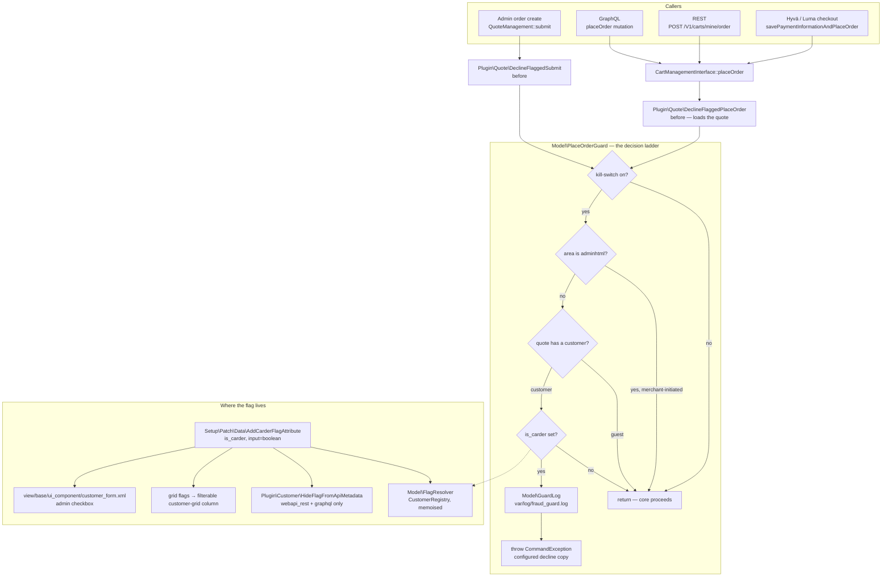

# Fraud Guard

Card testing works because a checkout is a free, fast, honest oracle: feed it a stolen card
number, read the answer. The usual response — block the account, show "your account has been
suspended" — makes the oracle *more* useful, because now the attacker knows exactly which of their
identities is burnt and simply registers another.

This module flags a customer and then lies to them. Their place-order attempt comes back with an
ordinary decline, thrown as the same exception class a real gateway decline throws. No gateway is
contacted, no order row is written, nothing in the response distinguishes it from a card the bank
turned down. The merchant sees a line in `var/log/fraud_guard.log`; the attacker sees a Tuesday.

| Part | What it covers |
|---|---|
| `before` plugin on `CartManagementInterface::placeOrder` | Every storefront path — Hyvä/Luma checkout, REST, GraphQL — and therefore every gateway |
| `before` plugin on `QuoteManagement::submit` | Direct-submit callers: admin order create, subscriptions, ERP importers |
| `is_carder` customer attribute + `customer_form` override + grid column | The merchant-facing half: one checkbox, one filterable grid column |
| Metadata plugin, `webapi_rest` + `graphql` only | Keeps `GET /V1/customers/me` from handing the flag straight back to the attacker |

## Why this exists

Every merchant who takes cards eventually gets a night where the order grid fills with £1.00
attempts from one account. The tooling that ships in the box does not help: Magento has no concept
of a customer you want to *silently* fail, and every third-party answer is either a paid fraud
score or a rule engine that announces itself.

The interesting constraint is not "how do I block someone" — it is **"how do I block someone
without telling them"**, and that constraint reaches further into the codebase than it first
looks. It decides where the hook goes (one choke point, before any gateway), what exception type
is thrown (the one a gateway throws), what the response body must not contain (a distinguishable
error code), and — the part most implementations miss — that the flag itself must not be readable
through the customer API the attacker is already authenticated against.

## Threat model

**What this stops.** An attacker with a registered account running card numbers through checkout.
After the flag is set, every attempt costs them a full checkout round trip and returns a decline
that carries no information about the card. The oracle stops answering, and it does so without
announcing that it stopped.

**What it deliberately does not stop, and why:**

- **Guests.** A guest quote has no customer entity, so there is nothing to flag. The honest fix is
  not "flag guests too" — it is a different mechanism entirely: a velocity guard keyed on IP,
  billing fingerprint and failed-authorization count, with its own storage and its own decay
  window. That is a second module, not a checkbox on this one. Until it exists, this module's
  answer to guest carding is "close guest checkout while under attack".
- **A new account.** Flagging is manual and per-customer, so an attacker who registers again
  starts clean. That is inherent to a manual flag and is the reason the velocity guard above is
  the natural phase 2 rather than a nice-to-have.
- **Timing.** A real gateway decline takes a network round trip; this one returns immediately. An
  attacker measuring response latency across many attempts can see the difference. Closing it
  means an artificial delay, which means holding a PHP worker hostage for the length of a fake
  gateway call — a self-inflicted denial of service on exactly the request an attacker can issue
  cheaply. The gap is left open on purpose; it is a real gap, and it is the cheaper side of the
  trade.

**What is admitted, not hidden:** by the time `placeOrder` runs, the checkout has already assigned
the payment method to the quote. Assignment is a local write — no authorization, no tokenization,
no money movement — so no gateway is contacted and the card is never presented anywhere. Moving
the interception earlier would mean one hook per payment method, which is the maintenance trap
this module exists to avoid.

## What's interesting (and what's just baseline)

| Choice | Why | Honest classification |
|---|---|---|
| Throw `Magento\Payment\Gateway\Command\CommandException` | It is the class a real gateway decline throws, so every handler downstream — the REST wrapper, the GraphQL resolver, a payment module's own `catch` — treats it identically | The actual insight in the module |
| Hook `CartManagementInterface::placeOrder` | The one point every storefront checkout converges on, so gateway count stops mattering | Architectural |
| Second hook on `QuoteManagement::submit` | Catches direct-submit callers the first hook never sees (admin order create, ERP, subscriptions). It also re-fires on a normal checkout — same-class calls *do* go through the interceptor — which the idempotent guard makes a no-op | Architectural, and the place where the usual folklore is wrong |
| Metadata plugin hiding `is_carder` from `webapi_rest` / `graphql` | Without it, a flagged attacker reads their own flag from `GET /V1/customers/me` | The bug most implementations of this ship with |
| Flag read through `CustomerRegistry`, not `custom_attributes` | The line above is exactly why: the repository path is filtered in the areas checkout runs in | Consequence of the line above, and the reason it is safe |
| `before`, not `around` | The guard either throws or does nothing; a `before` plugin physically cannot swallow a core exception or rewrite the order id | Baseline discipline |
| Fail-open on lookup errors | See [Design decisions](#design-decisions) | Opinionated |
| Area check for the admin exemption | A merchant placing an order by hand for a flagged customer is the false-positive recovery path | Baseline |
| Decline copy in `system.xml`, store-view scoped | The copy has to *match the merchant's own gateway* and their locale; this is the one thing no default can get right | Opinionated |

## Architecture



### 1. Two hooks, and why exactly two

`Magento\Quote\Api\CartManagementInterface::placeOrder()` is where the Hyvä/Luma checkout, a raw
REST call and the GraphQL `placeOrder` mutation all end up. Hooking there once means the module
never needs to know which payment methods are installed — including ones installed after it.

`Magento\Quote\Model\QuoteManagement::submit()` covers what the first hook cannot see: code that
submits a quote *directly* — the admin order-create flow, subscription modules, ERP importers,
migration scripts.

It is worth being precise about the thing everyone gets wrong here. A same-class call **does**
re-enter the plugin chain: the generated interceptor overrides every public non-final, non-static
method of its target (`Interception/Code/Generator/Interceptor.php::_getClassMethods()`), and
`$this->submit(...)` inside `placeOrder()` dispatches virtually against that interceptor instance,
not against the original class body. The popular "internal calls bypass plugins" rule of thumb
holds only for `self::`/`static::`/`parent::`, private/final/static methods, and objects built
before interception bootstraps.

So on a storefront checkout both plugins run — and that is fine by construction, not by accident.
A flagged customer never reaches the inner `submit()`, because the `placeOrder()` guard has already
thrown; exactly one attempt is logged. An unflagged customer hits a memoized no-op the second time.
The guard is deliberately written to be idempotent so this ordering cannot produce a double log
line or a double lookup.

The first plugin loads the quote itself, with `get()` rather than `getActive()`. Two reasons.
`QuoteRepository` keeps a per-request identity map and core's own `placeOrder()` opens with
`getActive($cartId)` — so the load warms the cache core is about to read and the guard adds no
query to a checkout. And cart *state* is core's judgement to make: turning an inactive-cart error
into a fraud decline would be the guard leaking into a code path that has nothing to do with it.

### 2. The exception type is the feature

Throwing `LocalizedException` would work — `PaymentInformationManagement` re-wraps its message
into `CouldNotSaveException` verbatim, and the GraphQL resolver copies the message into
`errors[].message`. But `CommandException` is what `Magento\Payment` throws when a gateway command
fails, and using the same class buys real indistinguishability rather than a message that merely
looks similar:

- Any payment module with a `catch (CommandException $e)` handles this exactly as it handles a
  decline from its own gateway.
- The GraphQL error `code` lands on `UNDEFINED` — which is also where a genuine gateway decline
  lands, because core's message-to-code table only covers cart and shipping errors. A distinct
  code would have been a fingerprint.
- Logging and monitoring that bucket declines by exception class bucket this with the real ones.

The message itself is merchant-authored, store-view scoped, and defaults to plausible bank
wording. It is the one string that has to match the merchant's actual gateway, so it is the one
thing this module refuses to hardcode.

### 3. The flag the attacker cannot see

A user-defined customer EAV attribute is automatically published in the `custom_attributes` array
of `CustomerInterface`. A flagged carder is an authenticated customer. So without a countermeasure
they can call `GET /V1/customers/me`, read `is_carder: 1`, and learn everything the silent decline
was designed not to tell them. This is the failure mode that makes most implementations of this
idea decorative.

There is a tempting non-fix. Magento excludes *system* attributes from custom-attribute metadata,
so `'system' => true` on the attribute hides it. It also breaks the admin form: the customer save
controller populates through `DataObjectHelper::populateWithArray()`, which only accepts keys the
custom-attribute metadata still knows about, so the checkbox silently stops saving. The attribute
therefore has to be non-system, and the leak has to be closed somewhere else.

`Plugin\Customer\HideFlagFromApiMetadata` closes it at the right seam:
`CustomerInterface::getCustomAttributesCodes()` resolves through
`CustomerMetadataInterface::getCustomAttributesMetadata()`, so filtering there means the attribute
is never populated onto the data object in the first place. Nothing to strip out of a finished
response, nothing cached wrong, and the shared repository instance is left untouched. It is wired
in `etc/webapi_rest/di.xml` and `etc/graphql/di.xml` only — `adminhtml` keeps the metadata, which
is what makes the checkbox save.

That filtering is also why `Model\FlagResolver` reads the customer *model* through
`CustomerRegistry` instead of `CustomerRepositoryInterface::getById()->getCustomAttribute()`: the
repository path is filtered in exactly the two areas checkout runs in. The model carries the raw
EAV row. It costs nothing extra either — `PlaceOrderGuard` reaches the customer id through
`Quote::getCustomer()`, which has already put that customer in the same registry.

### 4. Failing open, on purpose

If the flag cannot be read — the customer row is unreadable, the registry throws — the guard
allows the order and logs an error. The alternative, failing closed, converts any transient
storage problem into a store-wide checkout outage. That is a far larger incident than the one this
module prevents, and it would be triggered by exactly the conditions under which core is about to
fail on its own anyway. The failure is loud in the log rather than loud on the storefront.

The one place this is *not* silent: lookup failures are logged regardless of the "log blocked
attempts" setting. A merchant who turned attempt logging off asked for less noise about carders,
not for silence about a guard that stopped working.

## Design decisions

- **The flag is admin-UI-managed, not API-managed.** Hiding `is_carder` from the customer API in
  `webapi_rest` means an integration cannot read *or* write it over REST either. For an anti-fraud
  flag that is the correct default — the set of systems that should be able to mark a customer as
  a suspected carder is "an admin with backend access", and widening it later is a deliberate
  decision someone should have to make on purpose.
- **On by default.** The master switch defaults to on because the module does nothing at all until
  an admin ticks the box on a specific customer. The switch exists to be turned *off* in a hurry
  when a merchant suspects a false positive is costing real orders.
- **No fraud scoring.** No velocity counters, no BIN lists, no ML. This is a manual flag with an
  invisible enforcement path, which is a small, verifiable thing. Automatic detection is the
  velocity guard described in the threat model, and it belongs in its own module with its own
  storage and its own false-positive story.
- **No customer-facing notification, ever.** No email, no account banner, no order-status entry.
  Every one of those is a channel that tells the attacker the flag exists.
- **The request-scoped memo implements `ResetAfterRequestInterface`.** Under an application server
  the object graph outlives the request, and a merchant who flags a customer must not have to wait
  for a worker recycle for the flag to take effect.
- **IP and user agent in the log.** They are the two fields that make a series of attempts legible
  as a series — the same data the web server's access log already holds, recorded next to the
  event that makes it meaningful.

## What gets shipped

```
src/
├── registration.php
├── composer.json                            # scr1be/fraud-guard, type magento2-module
├── etc/
│   ├── module.xml
│   ├── config.xml                           # defaults, incl. the fallback decline copy
│   ├── acl.xml                              # Scr1be_FraudGuard::config
│   ├── di.xml                               # both quote plugins + the dedicated log wiring
│   ├── webapi_rest/di.xml                   # metadata plugin — area-scoped on purpose
│   ├── graphql/di.xml                       # same, for the GraphQL area
│   └── adminhtml/system.xml                 # kill-switch, decline copy, attempt logging
├── Model/
│   ├── Config.php                           # store-scoped settings, blank-copy fallback
│   ├── FlagResolver.php                     # CustomerRegistry read, memoised, resettable
│   ├── PlaceOrderGuard.php                  # the decision ladder + the CommandException
│   └── GuardLog.php                         # var/log/fraud_guard.log
├── Plugin/
│   ├── Quote/DeclineFlaggedPlaceOrder.php   # before placeOrder — all storefront paths
│   ├── Quote/DeclineFlaggedSubmit.php       # before submit — direct-submit callers
│   └── Customer/HideFlagFromApiMetadata.php # after getCustomAttributesMetadata
├── Setup/Patch/Data/
│   └── AddCarderFlagAttribute.php           # is_carder + form assignment + grid flags
├── view/base/ui_component/customer_form.xml
├── i18n/en_US.csv
└── Test/Unit/                               # 7 test classes
```

## Install

```bash
# from your Magento 2 root
composer config repositories.scr1be path /path/to/Magento/fraud-guard/src
composer require scr1be/fraud-guard:@dev
bin/magento module:enable Scr1be_FraudGuard
bin/magento setup:upgrade
bin/magento setup:di:compile
bin/magento indexer:reindex customer_grid
```

The `customer_grid` reindex is not optional: the grid reads a flat table, and the new column only
appears in it after the indexer has run once.

## Configuration

**Stores → Configuration → scr1be → Fraud Guard**

| Setting | Scope | Default | Notes |
|---|---|---|---|
| Enable guard | store view | Yes | Master kill-switch. Off means flagged customers check out normally |
| Decline message | store view | Bank-decline wording | Set this to match your gateway's own decline copy, per locale. Blank falls back to the built-in default |
| Log blocked attempts | store view | Yes | One line per blocked attempt in `var/log/fraud_guard.log`. Errors from the guard itself are logged either way |

Flagging a customer: **Customers → All Customers → edit → Account Information → Flagged for card
testing**. The same field is a filterable column on the customer grid, so "show me everyone I have
flagged" is one filter.

## Demo notes

On a stock **Magento 2.4.8 + Hyvä 1.4 + Luma sample data** storefront. Use the offline
`checkmo` (Check / Money order) method — the point is that the guard never reaches a gateway, so
you do not need one configured to see it work.

1. **Flag a customer.** Customers → All Customers → *Veronica Costello* → Account Information →
   tick **Flagged for card testing** → Save. Back on the grid, add the **Flagged for card testing**
   column from the column chooser and filter it to *Yes* — one row.
2. **Check out as her.** Log in on the storefront, add anything to the cart, go through checkout
   and press *Place Order*. The order fails with your configured decline copy. Confirm what did
   *not* happen: Sales → Orders has no new row, and the quote is still active, so her cart is
   intact — as it would be after a genuine decline.
3. **Confirm it is the same shape as a gateway decline.** Compare the response to one from a
   payment method configured to fail. Both surface through `CouldNotSaveException` with the
   message preserved; both are `CommandException` underneath.
4. **The log.**

   ```bash
   tail -n 1 var/log/fraud_guard.log
   ```

   One `WARNING` line with `customer_id`, `customer_email`, `quote_id`, `store_id`, `items_count`,
   `ip` and `user_agent`.
5. **GraphQL path.** Same customer, same result, no separate wiring:

   ```graphql
   mutation { placeOrder(input: { cart_id: "…" }) { errors { message code } } }
   ```

   The message is your decline copy and the code is `UNDEFINED` — which is exactly where a real
   gateway decline lands, because core's message-to-code table only covers cart and shipping
   errors.
6. **The flag is not readable by the attacker.** With her customer token:

   ```bash
   curl -s -H "Authorization: Bearer $TOKEN" https://example.test/rest/V1/customers/me \
     | grep -c is_carder
   ```

   `0`. Remove `etc/webapi_rest/di.xml`, flush the config cache, and it becomes `1` — which is the
   version of this module that does not actually work.
7. **The admin exemption.** Sales → Orders → Create New Order → pick the same flagged customer →
   place the order. It succeeds: the guard steps aside for anything merchant-initiated, which is
   the false-positive recovery path.
8. **The kill-switch.** Set *Enable guard* to No, flush the config cache, and step 2 completes
   normally. Nothing about the customer record changed.

## Tests

```bash
# from your Magento 2 root
# path follows your install method — Composer package:
vendor/bin/phpunit -c dev/tests/unit/phpunit.xml.dist vendor/scr1be/fraud-guard/Test/Unit

# …or, if you copied the module into app/code instead:
vendor/bin/phpunit -c dev/tests/unit/phpunit.xml.dist app/code/Scr1be/FraudGuard/Test/Unit
```

Seven classes covering everything that can actually break: the decision ladder in all six of its
outcomes (kill-switch, admin exemption, unresolved area, guest, unflagged, flagged), the exception
*type* and message, the memo and its reset, fail-open on a broken lookup, the blank-copy fallback,
the attempt-log gate and its user-agent handling, both plugin delegations including the
unknown-cart path, and the metadata filter including the re-indexing that keeps the API response a
JSON array. The data patch, the UI-component XML and the DI wiring are configuration — they are
covered by the demo walkthrough above, not by mocks.

## Compatibility

| | Version |
|---|---|
| PHP | 8.2, 8.3, 8.4 |
| Magento 2 | 2.4.6, 2.4.7, 2.4.8 |
| Hyvä Theme | any (no frontend surface) |

The module has no templates, no JavaScript and no theme dependency — it is backend only, and works
identically on Luma, Hyvä or a headless frontend. The customer-form field uses Magento's own UI
components, which are unchanged by Hyvä.

## License

MIT — see [LICENSE](LICENSE).
