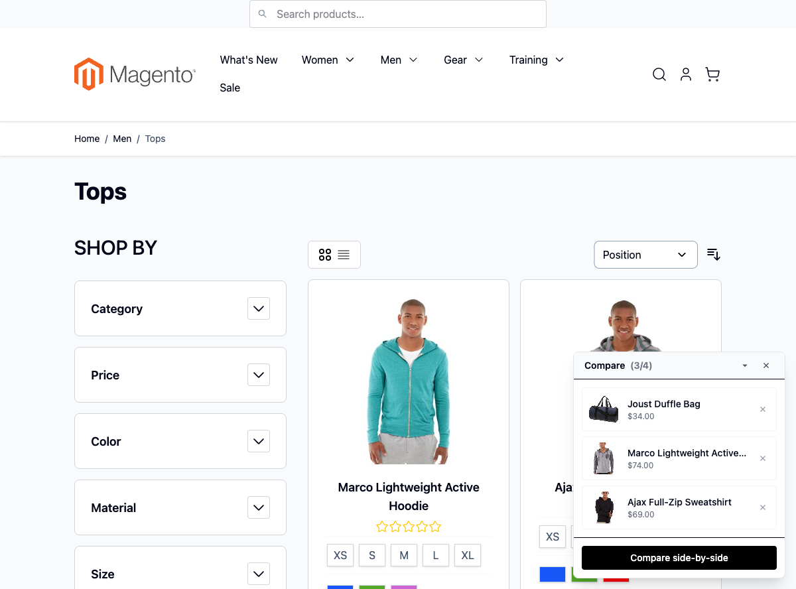
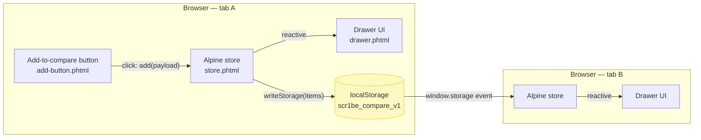
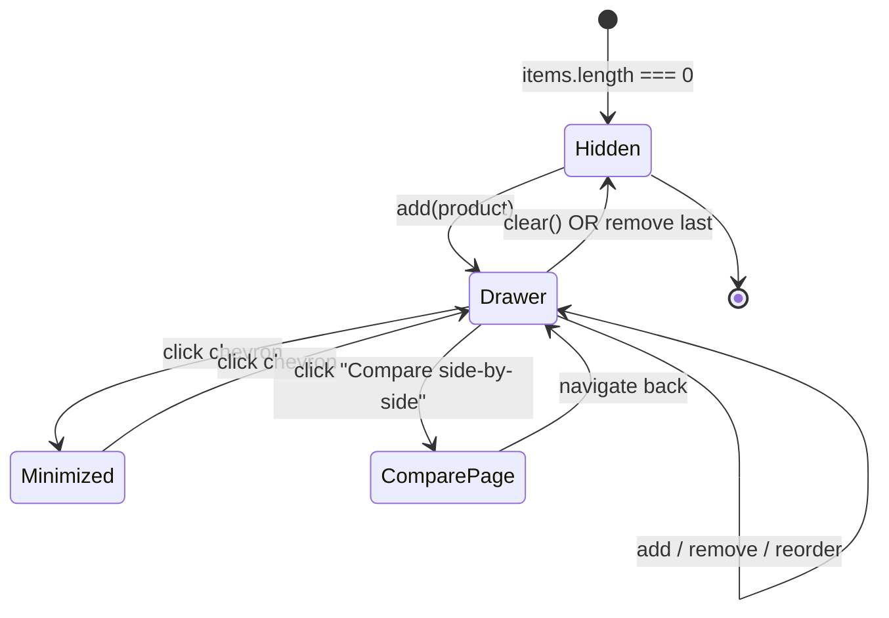

# Hyvä Compare Drawer

A floating "compare products" drawer for Magento 2 + Hyvä — **100% client-side**. State lives in `localStorage`, persists across sessions and tabs, never touches the database, never hits an API endpoint, never serializes through the customer session.

The point of this project: show how to build genuinely useful e-commerce UX without round-tripping to PHP. Compare is mostly a UI/UX concern — the server doesn't need to care which products a guest is comparing, and the guest doesn't need a server round-trip to add or remove one.

## Why this exists

Both stock Magento 2 (Luma) and Hyvä's default theme already implement a compare list — server-side, using the `Magento\Catalog\Model\Product\Compare` pipeline tied to either the customer or the visitor session. That implementation is correct, complete, and slow: every add/remove is an XHR, every render goes through the layout cache, the data lives in a session table on the database server, and the comparison page is a full page reload.

This module is in the portfolio to show **the opposite design choice**: when a feature is purely about UI continuity, treat it that way. The trade-offs are explicit (no cross-device sync, no logged-in continuity unless you layer one on), but for the 80% of storefront traffic that is guest, this approach is dramatically simpler and faster.

## What's interesting (and what's just baseline)

| Choice | Why | Honest classification |
|---|---|---|
| State in `localStorage` keyed `scr1be_compare_v1` | Versioned key so a future v2 schema change can read+migrate v1 instead of nuking customer state | Architectural |
| Cross-tab sync via `window.storage` event | Native browser event — fires in tab B when tab A writes the same key. Free WebSocket-style sync | Not novel, but rare in M2 codebases |
| LRU cap at 4 items | Drag a 5th in → oldest shifts off. Mirrors how real shoppers think about compare | UX detail |
| Drag-and-drop reorder via `@dragstart`/`@drop` | Native HTML5 DnD, no library. Order persists into storage immediately | Baseline |
| `Alpine.store('compare', { … })` global registration | One store serves drawer + add buttons + compare page — single source of truth | Standard Hyvä |
| Compare page is also client-rendered | Its controller and route exist only to serve an empty shell at `/scr1be-compare`; every row is rendered from the same `$store.compare` the drawer reads, so the page needs no server-side product fetch and cannot disagree with the drawer | Architectural |
| Respects `prefers-reduced-motion` via Tailwind `motion-safe:` | Tiny but real a11y win | Baseline (often skipped) |

## Live in the demo storefront



Three real products added to the compare list — Joust Duffle Bag ($34), Marco Lightweight Active Hoodie ($74), Ajax Full-Zip Sweatshirt ($69). State persists in `localStorage` keyed `scr1be_compare_v1`, survives reload, syncs across tabs, drag-and-drop reorder works.

## Architecture



## State lifecycle



## UI preview

```text
Drawer (expanded)             Drawer (minimized)
┌──────────────────────┐      ┌──────────────────────┐
│ Compare (3/4)  ▼  ✕  │      │ Compare (3/4)  ▲  ✕  │
├──────────────────────┤      └──────────────────────┘
│ [img] T-shirt    $25 ╳│
│ [img] Hoodie    $59 ╳│
│ [img] Jeans     $79 ╳│
├──────────────────────┤
│ ┌──────────────────┐ │
│ │ Compare side-by-side │
│ └──────────────────┘ │
└──────────────────────┘
```

## Install

```bash
composer require scr1be/hyva-compare-drawer
bin/magento module:enable Scr1be_HyvaCompareDrawer
bin/magento setup:upgrade
bin/magento setup:di:compile
```

## Usage

### Add button on product cards (auto)

Nothing to wire by hand. `default.xml` injects the store and the drawer into every page's `before.body.end`, and `catalog_list_item.xml` adds the button to Hyvä's `catalog.list.item.addto` container, so every product card gets one — on category pages, in search results, in sliders and on the compare page itself.

### Trigger from custom code

Anywhere in your `.phtml` templates:

```html
<button type="button"
        @click="$store.compare.add({
            id: <?= (int) $product->getId() ?>,
            name: '<?= $escaper->escapeJs($product->getName()) ?>',
            image: '<?= $escaper->escapeJs($block->getImage($product, 'product_small_image')->getImageUrl()) ?>',
            url: '<?= $escaper->escapeJs($product->getProductUrl()) ?>',
            price: '<?= $escaper->escapeJs($block->getProductPriceHtml($product)) ?>'
        })">
    Compare
</button>
```

### Read the state from anywhere

```html
<span x-text="$store.compare.count"></span>
<template x-for="item in $store.compare.items"> … </template>
```

## API reference

### Alpine store: `$store.compare`

| Property | Type | Description |
|---|---|---|
| `items` | `Array<{id, name, image, url, price}>` | Current list |
| `minimized` | bool | Drawer collapsed state |
| `max` | number (4) | LRU cap — adding past this shifts oldest out |
| `count` | getter, number | `items.length` |
| `isVisible` | getter, bool | `items.length > 0` |

| Method | Description |
|---|---|
| `init()` | Wires `window.storage` cross-tab listener — called once by Alpine |
| `has(productId)` | Whether a product is already in the list |
| `add(product)` | Append (or shift LRU if at cap); writes to localStorage |
| `remove(productId)` | Remove by id; writes to localStorage |
| `clear()` | Empty the list |
| `reorder(fromIndex, toIndex)` | Drag-and-drop reorder; persists order |

### Storage schema

```json
{
    "key": "scr1be_compare_v1",
    "value": [
        { "id": 42, "name": "T-shirt", "image": "/media/…", "url": "/t-shirt.html", "price": "$25.00" },
        …
    ]
}
```

Versioned key (`_v1`) so a v2 schema can `JSON.parse` v1 and migrate instead of corrupting.

## Trade-offs

| Aspect | Server-side compare (stock) | This drawer |
|---|---|---|
| Add/remove latency | Full XHR + session write | `setItem` (sync, ~0ms) |
| Cross-device sync | Yes (via customer account) | No (would need a sync layer) |
| Survives clearing browser data | Yes | No |
| Compare page render | Full Magento render | Empty shell + client-side render from the store |
| Code surface | DB table + repo + service + REST + GraphQL + admin | One JS file |

For logged-in continuity, layer a `$watch('items', syncToServer)` on top — sync runs once per change, server-side compare list becomes the canonical store for logged-in users only.

## What gets shipped

```
src/
├── registration.php
├── composer.json
├── Block/
│   └── CompareButton.php                   # extends core's Item\Block for the addto slot
├── Controller/Index/Index.php              # the /scr1be-compare page
├── etc/
│   ├── module.xml                          # depends on Magento_Catalog + Hyva_Theme
│   └── frontend/routes.xml                 # frontName: scr1be-compare
└── view/frontend/
    ├── layout/
    │   ├── default.xml                     # injects store + drawer into before.body.end
    │   ├── catalog_list_item.xml           # the button into catalog.list.item.addto
    │   └── scr1be_compare_index_index.xml  # the compare page's own handle
    └── templates/
        ├── store.phtml                     # Alpine.store registration + cross-tab sync
        ├── drawer.phtml                    # the floating drawer UI
        ├── add-button.phtml                # toggle button on every product card
        └── compare-page.phtml              # side-by-side page, rendered from the store
```

## Notes on Hyvä CSP compatibility

`store.phtml` and `add-button.phtml` both contain inline `<script>` blocks. On CSP-strict storefronts add this after each closing `</script>`:

```php
<?php
/** @var \Hyva\Theme\Model\ViewModelRegistry $viewModels */
$hyvaCsp = $viewModels->require(\Hyva\Theme\ViewModel\HyvaCsp::class);
$hyvaCsp->registerInlineScript();
?>
```

## Compatibility

| | Version |
|---|---|
| PHP | 8.2, 8.3, 8.4 |
| Magento 2 | 2.4.6, 2.4.7, 2.4.8 |
| Hyvä Theme | 1.3.x, 1.4.x |
| Alpine.js | 3.x |
| Browsers | Chrome/Firefox/Safari/Edge last 2 versions. HTML5 DnD = no iOS Safari before 15.4 — drag/drop falls back to read-only display there. |

## Troubleshooting

**Drawer never appears** → check that `before.body.end` is rendered on your page type (CMS pages sometimes omit it). Re-injecting via your theme's `default.xml` is fine.

**Cross-tab sync doesn't fire** → both tabs must be on the same origin (`www.example.com` vs `example.com` is different storage scopes).

**Items disappear after a deploy** → `localStorage` survives cache flushes and deploys. If users report drops, check that your storefront didn't rotate the storage key (`scr1be_compare_v1` is hardcoded; don't change it).

**Conflict with another `$store.compare`** → namespaced; if another module also calls `Alpine.store('compare', …)`, last one wins. Rename our store via the `store.phtml` template if needed.

## License

MIT — see [LICENSE](LICENSE).
