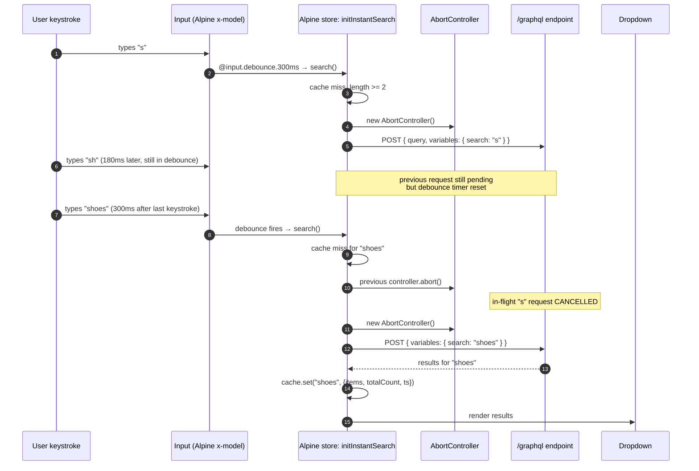
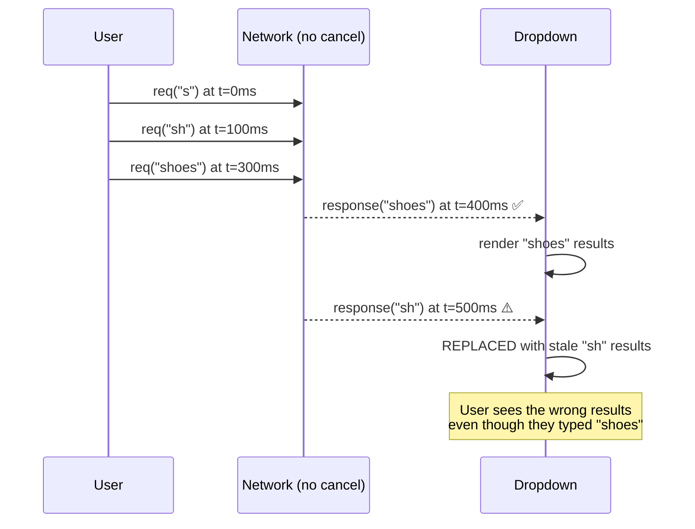

# Hyvä GraphQL Instant Search

Headless instant-search bar for Magento 2 + Hyvä. Queries the **stock** Magento GraphQL `products` endpoint directly from Alpine.js, with debounce, request cancellation, keyboard navigation, term highlighting and in-memory result caching.

No custom REST controller, no Elasticsearch-specific code, no third-party search service. Just the API Magento already ships, used the way it was designed to be.

## Why this exists

Stock Hyvä ships a quick-search form that posts to `/catalogsearch/result/` and reloads the page. Instant search — autocomplete as you type — exists in a number of community modules, but most either:
- introduce an external service (Algolia, Klevu), or
- spin up a custom REST endpoint that duplicates `QuickSearchInterface` and ships its own product schema

This module makes a different argument: **Magento's GraphQL surface is already a perfectly good search endpoint** if you treat the client as the renderer. It goes through the same `\Magento\Search\Model\QueryFactory` and the same Elasticsearch backend that the full search page uses — same relevance, same stop-words, same admin synonyms. The only thing this module adds is good frontend behavior around it.

## What's interesting (and what's just baseline)

| Choice | Why | Honest classification |
|---|---|---|
| Direct fetch to `/graphql` | One endpoint to authorize in WAF rules. Browser tooling already understands it | Strategic, not novel |
| Client picks the fields (`uid`, `url_key`, `small_image`, `price_range`) | REST `/V1/search` returns the whole product schema — 5–10× the payload for the same dropdown | Architectural |
| `AbortController` cancels in-flight requests on every new keystroke | Classic race-condition fix — without this, network reordering shows stale results | **Concrete senior-level thing** |
| `Map<query, {items, totalCount, timestamp}>` cache, 5 min TTL | Toggling between already-typed queries is instant; doesn't survive page navigation (it shouldn't) | Architectural — small effort, big perceived speed |
| 300 ms debounce via `@input.debounce.300ms` | Alpine native — no custom debounce wrapper | Standard Hyvä |
| `<mark>` highlighting via `textContent` escape + `RegExp` | XSS-safe — `escape()` runs before regex replace; matches `i` and `g` flags | Baseline, often done wrong |
| Keyboard nav (↑/↓ + Enter + Esc) with `aria-*` | Combobox a11y baseline — `role="combobox"`, `aria-autocomplete`, `aria-controls`, `aria-expanded`, `aria-selected` | Baseline (often skipped) |
| `Alpine.data('initInstantSearch', …)` registration | Official Hyvä convention since 1.3.4 — CSP-friendly, no global `instantSearch()` factory leak | Modern Hyvä |

## Live in the demo storefront


The search input is the topmost element in the header — injected via `<referenceContainer name="header.container">` with `before="-"` so it sits above Hyvä's logo + native menu. On typing, it fires the InstantSearch GraphQL query against Magento's stock `/graphql` endpoint with `AbortController` cancelling stale requests.

## Architecture



The race condition the AbortController prevents:



## UI preview

```text
┌────────────────────────────────────────────────┐
│  🔍  shoes                              ✕      │
└────────────────────────────────────────────────┘
   ┌────────────────────────────────────────────────┐
   │ ┌──┐ Running shoes — black                     │
   │ │  │ 89.00 USD                                 │
   │ └──┘                                           │
   │ ┌──┐ Hiking shoes — brown                      │
   │ │  │ 129.00 USD                                │
   │ └──┘                                           │
   │ ┌──┐ Casual shoes — gray                       │
   │ │  │ 59.00 USD                                 │
   │ └──┘                                           │
   ├────────────────────────────────────────────────┤
   │             See all results (37)               │
   └────────────────────────────────────────────────┘
```

Highlighted matching substring rendered with `<mark>`. Active item gets `bg-blue-50` background — keyboard ↑/↓ moves it; Enter follows.

Live screenshots — placeholder until a demo storefront is provisioned.

## Install

```bash
composer require scr1be/hyva-graphql-search
bin/magento module:enable Scr1be_HyvaGraphqlSearch
bin/magento setup:upgrade
```

The module injects its search bar into `header.container` via `default.xml`. To change placement, override the layout XML in your theme.

## The GraphQL query

```graphql
query InstantSearch($search: String!, $pageSize: Int!) {
    products(search: $search, pageSize: $pageSize) {
        total_count
        items {
            uid
            name
            sku
            url_key
            small_image { url label }
            price_range {
                minimum_price {
                    final_price { value currency }
                }
            }
        }
    }
}
```

Field-by-field rationale:

| Field | Why |
|---|---|
| `uid` | Global identifier — survives configurable parent/variant relations correctly |
| `name`, `sku` | Display + analytics tracking |
| `url_key` | Build the product URL client-side without an extra query (configurable in `productUrl()` of the Alpine component if your URL strategy differs) |
| `small_image.url`, `.label` | Thumbnail + alt text |
| `price_range.minimum_price.final_price` | Covers tax + configurable product price-from semantics — `final_price` already includes catalog rules |
| `total_count` | "See all results (N)" footer link |

## Configuration

| Constant (in `search-bar.phtml`) | Default | What it does |
|---|---|---|
| `SCR1BE_PAGE_SIZE` | `8` | Dropdown rows before "See all results" link appears |
| `SCR1BE_CACHE_TTL_MS` | `300000` (5 min) | Map cache lifetime per query string |
| `SCR1BE_MIN_QUERY` | `2` | Skip requests until query >= N chars |
| `debounce.<N>ms` (`@input` modifier) | `300` | Keystroke debounce |

## API reference

### Alpine component: `initInstantSearch`

| State | Type | Description |
|---|---|---|
| `query` | string | Current input value, bound via `x-model` |
| `results` | array | Latest items from the API |
| `totalCount` | number | Server's reported total — drives "See all" footer |
| `loading` | bool | Spinner / Searching… state |
| `error` | string | Empty unless GraphQL returned errors or fetch threw |
| `isOpen` | bool | Dropdown visibility |
| `highlightIndex` | number | Keyboard-focused row (-1 = none) |
| `controller` | AbortController \| null | In-flight request canceller |
| `cache` | Map | `query → {items, totalCount, timestamp}` |

| Method | Description |
|---|---|
| `search()` | Debounced on `@input`; reads cache or hits `/graphql` |
| `reset()` | Clear query + results + close dropdown |
| `close()` | Close dropdown, keep query |
| `onFocus()` | Re-open dropdown if there are buffered results |
| `moveHighlight(±1)` | Keyboard nav, wraps around |
| `followHighlight()` | Enter → navigate to highlighted item or to `/catalogsearch/result/?q=` |
| `productUrl(item)` | `/${url_key}.html` — override here for custom URL schemes |
| `seeAllUrl()` | `/catalogsearch/result/?q=...` — Magento's stock search results page |
| `formatPrice(item)` | `value.toFixed(2) + ' ' + currency` |
| `highlightMatch(text)` | Wrap matching substring with `<mark>` — XSS-safe (escapes first) |

## Multistore note

The GraphQL endpoint URL is built from `$block->getUrl('', ['_secure' => true])`, which respects the current store's base URL. Multistore setups with different domains per store work out of the box. If you've configured a dedicated headless API host (subdomain pattern), hardcode it instead of relying on the block's URL builder.

## What gets shipped

```
src/
├── registration.php
├── composer.json
├── etc/module.xml             # depends on Magento_CatalogGraphQl + Hyva_Theme
└── view/frontend/
    ├── layout/default.xml     # injects the search bar into header.container
    └── templates/
        └── search-bar.phtml   # input + dropdown + Alpine.data registration
```

## Notes on Hyvä CSP compatibility

`search-bar.phtml` contains an inline `<script>` registering the Alpine component. On CSP-strict storefronts, add after the closing `</script>`:

```php
<?php
/** @var \Hyva\Theme\Model\ViewModelRegistry $viewModels */
$hyvaCsp = $viewModels->require(\Hyva\Theme\ViewModel\HyvaCsp::class);
$hyvaCsp->registerInlineScript();
?>
```

## Compatibility

| | Version |
|---|---|
| PHP | 8.2, 8.3, 8.4 |
| Magento 2 | 2.4.6, 2.4.7, 2.4.8 |
| Hyvä Theme | 1.3.x, 1.4.x |
| Alpine.js | 3.x |
| Browsers | `AbortController` widely supported since 2019. IE 11 not supported (no `fetch` either). |

## Troubleshooting

**Dropdown shows but no results** → check the network panel for the GraphQL response. `total_count: 0` means Magento's search index doesn't know your products — re-run `bin/magento indexer:reindex catalogsearch_fulltext`.

**Stale results after typing** → the AbortController fix is in place; if you're still seeing it, ensure you haven't disabled `@input.debounce` by accident in your overrides.

**CORS errors** → GraphQL URL must be on the same origin as the page. If you're testing through a CDN with separate origins, configure CORS on the `/graphql` route via `app/etc/config.php` → `headers.access_control_allow_origin`.

**"See all results" link goes to wrong page** → `seeAllUrl()` defaults to Magento's stock `/catalogsearch/result/?q=…` route. Override in the Alpine component if you have a custom search results page.

## License

MIT — see [LICENSE](LICENSE).
