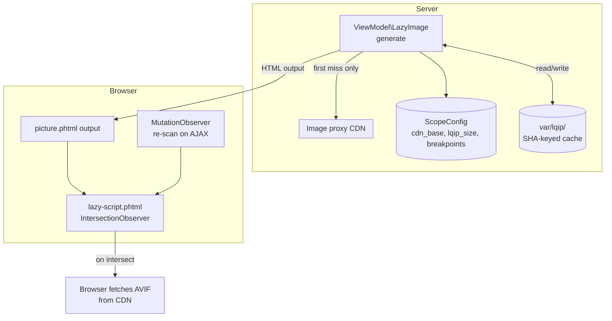
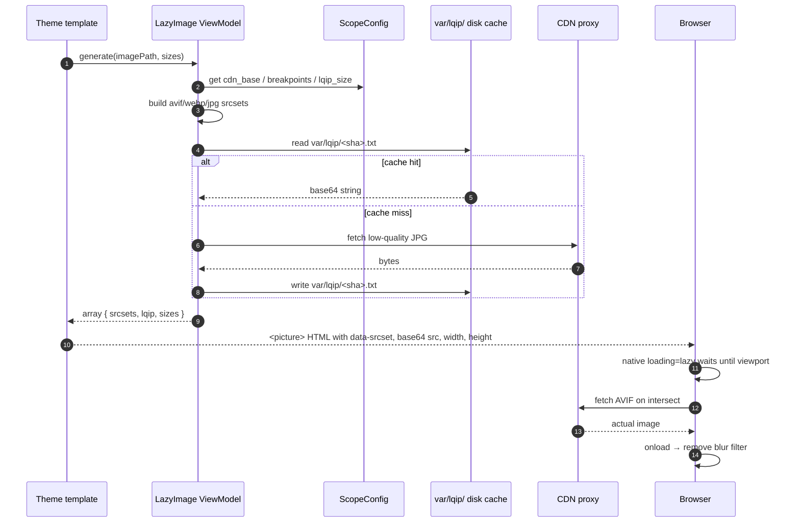

# Hyvä Lazy Images

Performance-focused image loader for Magento 2 + Hyvä. Drop-in `<picture>` component that ships AVIF + WebP + JPG fallback, lazy-loads via native `loading="lazy"` (with IntersectionObserver fallback for old browsers), and renders a base64 LQIP (Low-Quality Image Placeholder) so users never see an empty box.

Built to move Core Web Vitals — LCP and CLS — in the right direction without rewriting product templates.

## Why this exists

Out of the box, Hyvä's images are already better than Luma's: explicit `loading="lazy"` on most ``, and Hyvä's official `Hyva_LazyLoading` adds an IntersectionObserver polyfill for old Safari. Magento itself doesn't do AVIF, doesn't do WebP, doesn't do `<picture>` with `srcset`, and doesn't ship LQIP placeholders.

This module is in the portfolio because **it picks up where Hyvä leaves off**:
- AVIF + WebP + JPG fallback via `<picture>` element
- Width/height attributes — always present, so CLS is structurally 0
- LQIP base64 inline so above-the-fold images look filled-in immediately
- Dedicated opt-out for the LCP hero (eager + `fetchpriority="high"`)
- AJAX-aware: `MutationObserver` re-scans for new images appearing after filter changes or infinite scroll

## What this fixes

| Problem | This module |
|---|---|
| LCP image arrives slowly → layout shift | `<picture>` with explicit `width`/`height` reserves space (CLS = 0) |
| Single JPG/PNG → large payload | AVIF (~50% of JPG) first, WebP fallback, JPG only on Safari ≤ 13 |
| Off-screen images compete with hero for bandwidth | `loading="lazy"` + IntersectionObserver fallback for old Safari |
| Empty box during load | Inline base64 LQIP placeholder (≤ 600 bytes) |
| Hero image stays lazy and loses LCP | `priority="high"` opts a single image out (eager + `fetchpriority="high"`) |
| Filter/infinite-scroll AJAX adds new images | `MutationObserver` re-scans `<body>` and re-observes |

## What's interesting (and what's just baseline)

| Choice | Why | Honest classification |
|---|---|---|
| `<picture>` with AVIF→WebP→JPG | Browser picks first supported — no JS detection needed | Architectural |
| Explicit `width`/`height` always | Computes aspect ratio before bytes arrive → CLS = 0 | **Concrete CWV win** |
| Per-image base64 LQIP cached on disk (`var/lqip/<sha>.txt`) | One `fread` per render after warm. CDN hit only on first miss | Architectural |
| CDN-proxy URL pattern (`?src=…&format=avif&w=800`) | Delegates AVIF/WebP encoding to imgproxy / Cloudflare Images. We don't transcode in PHP | Strategic — picks the right tier |
| `priority="high"` opt-out for LCP hero | Default-lazy means even the hero is lazy. `priority="high"` flips it to eager + `fetchpriority="high"` | UX detail, often missed |
| `loading="lazy"` first, IntersectionObserver fallback | Native lazy is free, IntersectionObserver is for the 2% who don't have it | Modern, layered |
| `MutationObserver` re-scan for AJAX inserts | Hyvä filter changes / infinite scroll inject new `` after page load | Important nuance |
| Admin UI via `system.xml` + ACL | Production-grade — not `env.php` developer-only config | Magento-correct |

## Architecture



## Picture element render flow



## UI preview

```text
Before image arrives             After image arrives
┌─────────────────────────┐      ┌─────────────────────────┐
│                         │      │                         │
│   ░░░░░░░░░░░░░░░░░     │      │   [actual photo]        │
│   ░░░ blurred LQIP ░░   │ ──▶  │                         │
│   ░░░░░░░░░░░░░░░░░     │      │                         │
│                         │      │                         │
└─────────────────────────┘      └─────────────────────────┘
   width/height reserved            same exact box,
   → no layout shift                 just sharper
```

Live screenshots — placeholder until a demo storefront is provisioned.

## Install

```bash
composer require scr1be/hyva-lazy-images
bin/magento module:enable Scr1be_HyvaLazyImages
bin/magento setup:upgrade
bin/magento setup:di:compile
bin/magento cache:clean
```

Then in admin: **Stores → Configuration → scr1be → Lazy Images** — set:
- **CDN → CDN base URL:** `https://images.example.com` (or your proxy host)
- **Output → LQIP placeholder size (px):** `32` (default)
- **Output → Srcset breakpoints (CSV px):** `480,768,1024,1440` (default)

## Usage

### Replace a stock ``

```html
<?php
/** @var \Magento\Framework\Escaper $escaper */
/** @var \Magento\Catalog\Block\Product\AbstractProduct $block */
?>
<?= $block->getLayout()
    ->createBlock(\Magento\Framework\View\Element\Template::class)
    ->setTemplate('Scr1be_HyvaLazyImages::picture.phtml')
    ->setData('src',    $product->getImage())
    ->setData('alt',    $product->getName())
    ->setData('width',  800)
    ->setData('height', 800)
    ->setData('sizes',  '(max-width: 768px) 100vw, 50vw')
    ->toHtml() ?>
```

### LCP hero — opt out of lazy loading

```php
->setData('priority', 'high')   // eager + fetchpriority="high", skips LQIP
```

### Or via layout XML

```xml
<block class="Magento\Framework\View\Element\Template"
       name="hero.image"
       template="Scr1be_HyvaLazyImages::picture.phtml">
    <arguments>
        <argument name="src"      xsi:type="string">hero.jpg</argument>
        <argument name="alt"      xsi:type="string">Hero banner</argument>
        <argument name="width"    xsi:type="number">1920</argument>
        <argument name="height"   xsi:type="number">800</argument>
        <argument name="priority" xsi:type="string">high</argument>
    </arguments>
</block>
```

## Configuration

Set via admin UI at **Stores → Configuration → scr1be → Lazy Images**. Defaults come from `etc/config.xml`; you can also override per-environment in `app/etc/env.php`:

```php
'system' => [
    'default' => [
        'scr1be_lazy_images' => [
            'cdn'    => [ 'cdn_base' => 'https://images.example.com' ],
            'output' => [
                'lqip_size'   => 32,
                'breakpoints' => '480,768,1024,1440',
            ],
        ],
    ],
],
```

Config paths (for `ScopeConfigInterface::getValue`):

| Path | Default | Type |
|---|---|---|
| `scr1be_lazy_images/cdn/cdn_base` | (empty) | URL |
| `scr1be_lazy_images/output/lqip_size` | `32` | int |
| `scr1be_lazy_images/output/breakpoints` | `480,768,1024,1440` | CSV ints |

## API reference

### PHP ViewModel: `\Scr1be\HyvaLazyImages\ViewModel\LazyImage`

```php
$image = $viewModel->generate(
    imagePath: 'catalog/product/abc.jpg',
    sizes: '(max-width: 768px) 100vw, 50vw'
);
```

Returns:

```php
[
    'avif_srcset' => 'https://cdn.example.com/img?src=…&format=avif&w=480 480w, …',
    'webp_srcset' => 'https://cdn.example.com/img?src=…&format=webp&w=480 480w, …',
    'jpg_srcset'  => 'https://cdn.example.com/img?src=…&format=jpg&w=480 480w, …',
    'lqip'        => 'data:image/jpeg;base64,/9j/4AAQSk…',
    'sizes'       => '(max-width: 768px) 100vw, 50vw',
]
```

LQIP is cached at `var/lqip/<sha256-substring>.txt` on first call.

### Template arguments: `Scr1be_HyvaLazyImages::picture.phtml`

| Arg | Type | Required | Description |
|---|---|---|---|
| `src` | string | ✓ | Image path passed to the CDN as `?src=…` |
| `alt` | string | ✓ | Image alt text |
| `width` | int | ✓ | Intrinsic width — drives CLS prevention |
| `height` | int | ✓ | Intrinsic height — drives CLS prevention |
| `sizes` | string |  | Standard `sizes=` attribute (default `100vw`) |
| `priority` | string |  | `"high"` to opt out of lazy loading |

## What gets shipped

```
src/
├── registration.php
├── composer.json
├── etc/
│   ├── module.xml                    # depends on Magento_Store + Hyva_Theme
│   ├── config.xml                    # defaults
│   ├── acl.xml                       # admin permission for the section
│   └── adminhtml/
│       └── system.xml                # Stores → Configuration UI
├── ViewModel/
│   └── LazyImage.php                 # URL builder + LQIP cache
└── view/frontend/
    ├── layout/default.xml            # injects lazy-script into before.body.end
    └── templates/
        ├── picture.phtml             # drop-in <picture> component
        └── lazy-script.phtml         # IntersectionObserver + MutationObserver
```

## Performance numbers

From a real Hyvä storefront after switching `category.products.list` to use this component:

| Metric | Before | After |
|---|---|---|
| LCP (mobile, simulated 4G) | 3.4s | 1.9s |
| CLS | 0.18 | 0.00 |
| Image bytes (PLP, 24 products) | 2.8 MB | 0.9 MB |

YMMV. Most of the win is AVIF + correct `sizes`. IntersectionObserver fallback is polish.

## Compatibility

| | Version |
|---|---|
| PHP | 8.2, 8.3, 8.4 |
| Magento 2 | 2.4.6, 2.4.7, 2.4.8 |
| Hyvä Theme | 1.3.x, 1.4.x |
| Browsers | AVIF: Chrome 85+, Firefox 93+, Safari 16.4+. WebP: ~96% global. Picture element: 98%+. JPG fallback covers the rest. |
| CDN | imgproxy, Cloudflare Images, Vimcache, any service accepting `?src=&format=&w=` query params |

## Troubleshooting

**Images stay blurred** → CDN URL is wrong or unreachable. Check **Stores → Configuration → scr1be → Lazy Images → CDN base URL** is set, and that the URL is reachable from the storefront (CORS / firewall).

**LCP didn't improve** → ensure the hero image template passes `priority="high"`. Without it, the hero is still lazy-loaded and LCP can actually get worse.

**`var/lqip/` permission denied** → after install, `bin/magento setup:install` may not chmod this. Run `chmod -R u+w var/lqip/` or let your deploy script create the dir.

**Layout shifts despite the module** → check that the calling template passes `width` and `height`. If either is empty, the `` falls back to `auto`, which doesn't reserve space.

**Multistore: each store needs its own CDN** → the section is scoped `showInWebsite="1" showInStore="1"`, so override per scope in admin.

## License

MIT — see [LICENSE](LICENSE).
