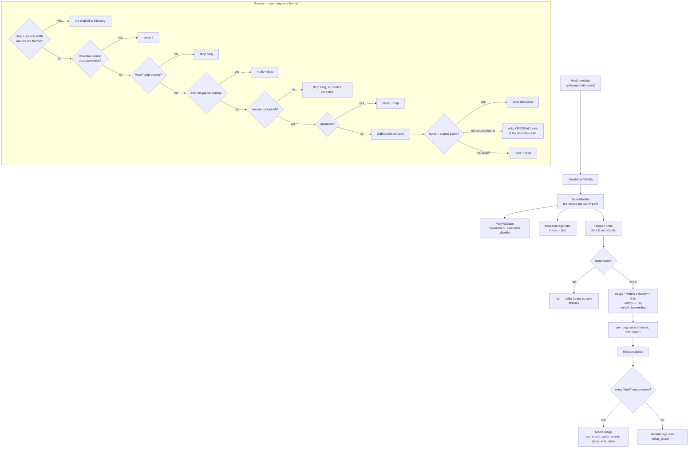

# Hyvä Media

Magento resizes catalog images and nothing else. Everything a merchant uploads through the wysiwyg
editor — homepage banners, category hero art, CMS block illustrations — is served at whatever
dimensions came out of the design tool, to every device, forever. On the pages where that art lives,
it is usually the entire Lighthouse image-delivery budget.

This module gives those images the treatment catalog images already get: a width ladder of cached
derivatives, a parallel WebP ladder, and a srcset payload a template can hand to a `<picture>`.

It is also, deliberately, an exercise in restraint. Every rule below exists because the obvious
version of this module makes some page somewhere *slower*, and it does so silently.

| Promise | Enforced by |
|---|---|
| Never upscales | Rung ladder capped at the source width; a rung at or above it resolves to the original |
| Never pads | Height is derived from the source ratio; nothing is ever letterboxed onto a canvas |
| Never serves a derivative heavier than its source | Byte comparison after every encode, with two different remedies |
| Never re-attempts a failed encode | `.webp.skip` markers, invalidated by source mtime |
| Never serves stale bytes | Derivative mtime compared against source mtime |
| Never turns the first render into a timeout | Per-request encode budget, spent widest-rung-first |

## Why this exists

Magento's image pipeline is attached to the catalog, not to `pub/media`. A product image is served
through `Magento\Catalog\Model\Product\Image\*` — a params builder, a cache, a URL builder. A file at
`pub/media/wysiwyg/home/home-main.jpg` reaches none of that: it is a static asset the platform has no
opinion about, served at upload dimensions to every device.

The usual answers are all worse than they look. A CDN with an image proxy in front of it is the
right answer and the one I reach for when there is a CDN; this module is what you ship when there
is not, or when the art has to be resized before it reaches one. Resizing at upload time loses the
original and forces a re-upload every time the breakpoints change. Doing it in the template with
GD and no cache is a decode per image per request.

So: on demand, cached, and — this is the part that takes the code — bounded.

## What's interesting (and what's just baseline)

| Choice | Why | Honest classification |
|---|---|---|
| Own GD wrapper instead of `Magento\Framework\Image\Adapter\Gd2` | The adapter's format map has no WebP entry, on either the read or the write side, so it throws for the one format this module is for | Forced — see [Design decisions](#1-magentos-image-adapter-cannot-do-this) |
| Header-only dimension probe rather than `getimagesize()` | A bounded read through the filesystem driver, so it survives remote storage — and a `null` that means exactly one thing | Architectural |
| Rungs above ~90% of the source width dropped | A rung within a few percent of the original is a re-encode wearing a smaller number, and the one most likely to come out heavier | The actual insight |
| Original bytes replace a fatter derivative, at the same URL | Well-optimised uploads routinely beat GD. Moving the URL instead would cold-start every CDN edge for that rung | Architectural |
| All-or-nothing WebP srcsets | A partial WebP set still wins format negotiation, then hands a narrow candidate to a wide slot | Non-obvious, and invisible until someone measures |
| `.webp.skip` markers, keyed to the source | A cache that only remembers successes is a retry loop with a filesystem attached | Production discipline |
| Encode budget per request, spent widest-first | The alternative is a hundred-plus decodes in the first request after a deploy | Production discipline |
| Animated GIF detection before any encode | GD takes frame one and reports success — the only failure mode here that produces a *valid* wrong answer | The bug that would have shipped |
| WebP extension appended, not substituted | `banner.jpg` and `banner.png` both collapse onto `banner.webp` under substitution | Small, and permanent once wrong |
| No `<picture>` template | `hyva-lazy-images` owns markup. Two modules writing the same element is how you end up with neither | Scope discipline |

## Architecture



### The ladder

Rung selection is per image, not per site. The configured ladder — `320,480,768,1024,1440,1920` by
default — is filtered against the source:

```
ceiling = floor(sourceWidth × 0.9)
rungs   = configured widths ≤ ceiling
```

A 4000px hero keeps all six. A 1600px banner keeps five (1440 is exactly 90%, 1920 would be an
upscale). A 300px icon keeps none — and rather than skip it, the ladder degenerates to `[300]`,
its own width, where the source-format entry costs nothing (the original *is* that rung) and the
WebP sibling is still worth encoding.

The 90% cap is the rule that is easiest to leave out and most annoying to leave out. Without it a
1500px upload gets a 1440 rung: 96% of the pixels, a full decode-and-encode cycle, a second file on
disk, and a derivative that — because the original was already optimised and GD is merely adequate —
is very often *larger* than what it replaced.

Note what is deliberately absent: the source width is **not** appended as a top rung. It is
tempting, because it guarantees a full-resolution candidate. It is also how a 4000px upload ends up
being downloaded in full by a laptop, because `sizes="100vw"` on a 2× 1440 viewport asks for 2880w
and the browser takes the next rung up. The top of the configured ladder is the merchant's byte
budget, and nothing in this module is allowed to exceed it.

### Rungs are attempted widest-first

The order looks arbitrary until you connect it to the encode budget. Derivatives are produced during
the render that first needs them, so the first request after a deploy — or after a merchant swaps
the homepage art — is the one doing all the work. Ten images × six rungs × two formats is 120 GD
encodes in one request.

The budget (24 encodes by default, shared across the whole page) stops that request from becoming a
timeout. Descending order decides *what a truncated render loses*: the small rungs, which a browser
only picks on a narrow viewport, where the consequence is the next size up rather than nothing.
Ascending order would lose the wide rungs, which is the case that actually shows.

Nothing is lost permanently. The next render continues from where the last one stopped, and after
two or three hits the page is fully warm.

### Two remedies for one problem

"Never heavier than the source" needs a different answer per format, because the two are not
symmetric.

**Source format.** The original bytes are written to the derivative's path. The URL does not move.
The browser picked that URL for, say, the 768w slot and receives an image at the source's full
width — more pixels than advertised, fewer bytes than the derivative would have been. Both halves of
that trade are wins; the only cost is a duplicated file, which is what a cache is.

Keeping the URL stable is the point. The alternative — pointing that rung back at the original's own
URL — sounds tidier and is worse: it makes the srcset's shape depend on a byte comparison, so a
re-upload can silently rewrite the markup, cold-starting CDN edges and browser caches for a rung
whose pixels did not change.

**WebP.** The same trick is unavailable: the bytes behind a `.webp` URL inside a
`<source type="image/webp">` have to actually be WebP. So the rung is dropped — and under
all-or-nothing that drops the entire WebP set, which is exactly why the failure is recorded in a
skip marker rather than rediscovered on the next render.

### All-or-nothing WebP

A WebP set missing its widest rung is worse than no WebP set at all, and the reason is how
`<picture>` negotiates. The browser picks the first `<source>` whose `type` it supports — it does
**not** compare candidates across sources. So a WebP set that stops at 1024w wins the negotiation on
every WebP-capable browser and then serves 1024w into a 1920px slot. Visibly soft, on the widest
screens, only.

So: every rung, or none. When a rung fails, the loop stops attempting WebP entirely for that image
rather than encoding derivatives it has already decided to discard.

### Skip markers

Nothing about a failed WebP encode is transient. GD cannot decode a CMYK JPEG; it will not decode it
next request either. An animated GIF stays animated. A 60 MP source stays 60 MP. Without a record of
the verdict, every one of those costs a full decode attempt per rung per page view, forever, because
the "does the derivative exist" check keeps missing.

`scr1be/media/.webp-skip/<source path>.webp.skip` is a zero-byte file recording it. It is keyed to
the **source**, not to a rung, because every reason a WebP encode fails is a property of the source —
which pairs exactly with all-or-nothing, since one marker check short-circuits the whole ladder.

Invalidation is mtime, same as the derivatives: a marker older than the source is a verdict on bytes
that no longer exist. Re-uploading the image is all it takes to get a fresh attempt.

One thing does **not** set a marker: an exhausted encode budget. Running out of budget says nothing
about the image, and recording it would make a busy page permanently disqualify whichever image
happened to be last on it.

### Cache layout

```
pub/media/
├── wysiwyg/home/hero.jpg                             ← the source, untouched
└── scr1be/media/
    ├── 320/wysiwyg/home/hero.jpg
    ├── 320/wysiwyg/home/hero.jpg.webp
    ├── 768/wysiwyg/home/hero.jpg
    ├── 768/wysiwyg/home/hero.jpg.webp
    ├── …
    └── .webp-skip/wysiwyg/home/hero.jpg.webp.skip    ← only if WebP failed
```

Width-keyed rather than hash-keyed, on purpose. A hashed filename is opaque: "how much disk does the
ladder cost" becomes a code question instead of `du -sh scr1be/media/*`, and "why does this banner
look soft" becomes unanswerable from the URL. The whole tree is one root, so purging is a single
recursive delete.

The WebP extension is **appended** (`hero.jpg.webp`), not substituted. Substitution collapses
`banner.jpg` and `banner.png` in the same folder onto one `banner.webp`, and whichever renders
second serves the other one's pixels under the first one's URL.

## Design decisions

### 1. Magento's image adapter cannot do this

`Magento\Framework\Image\Adapter\Gd2` holds its output and create callbacks in a private static map
keyed by `IMAGETYPE_*`, containing exactly `GIF`, `JPEG`, `PNG`, `XBM` and `WBMP`. `_getCallback()`
throws `InvalidArgumentException('Unsupported image format.')` for anything absent from it. WebP is
absent from both sides of the map, so the adapter can neither open nor write it.

That gap is the whole reason `Model/GdEncoder` exists — the resize itself the adapter would have
handled fine. `GdEncoderTest::testCoreAdapterCannotDoWhatThisClassExistsFor` asserts the premise by
reflection rather than trusting this paragraph, so if a future Magento adds WebP to that map, the
test is where it surfaces.

The second reason is smaller and still decisive: the adapter's `open()` takes a path and calls
`file_exists()` on it. This module works in strings.

### 2. The probe reads headers instead of calling `getimagesize()`

`getimagesize()` takes a filesystem path. Under `Magento_RemoteStorage` that path does not exist in
any sense PHP can use: the module's `etc/di.xml` preferences `Magento\Framework\Filesystem` to a
`Magento\RemoteStorage\Filesystem` whose `directoryCodes` list includes `DirectoryList::MEDIA`, and
`getDirectoryRead()` then returns a directory bound to the remote driver. `getAbsolutePath()` there
is not something the local process can `fopen`.

So the probe goes through `Directory\Read::openFile()` and reads a bounded prefix — 64 KB, sized for
the one format whose dimensions can sit arbitrarily deep. JPEG puts EXIF, ICC profiles and often an
embedded thumbnail ahead of the frame header; PNG, GIF and all three WebP variants answer in under
32 bytes.

Two things fall out of doing it by hand. Under remote storage the read is a range request rather
than a whole object fetch. And a `null` from this probe means exactly one thing — "these bytes are
not a container I can size" — where `getimagesize()`'s `false` conflates unsupported, corrupt and
unreadable.

The parsers are covered against synthetic headers in `HeaderProbeTest`, including the cases that are
easy to get wrong: JPEG's height-before-width ordering, the Huffman table that sits inside the
`0xC0`–`0xCF` marker run without being a frame header, progressive JPEG's `SOF2`, and VP8L's two
adjacent 14-bit `n-1` fields.

### 3. mtime invalidation, not content hashing

A content hash in the path is self-invalidating and would remove this section entirely. It also
moves the URL on every re-upload, and a moved URL is a cold CDN edge and a cold browser cache for an
image that in most re-uploads is visually the same file with new metadata.

Comparing the derivative's mtime against the source's keeps the URL fixed and still refuses stale
bytes. The trade is a one-second granularity: a derivative written in the same second the source
changed is treated as fresh. Touching the source file fixes it, and the alternative — treating
equality as stale — would re-derive the whole ladder on every render for the first second of every
image's life.

### 4. No `<picture>` template

The natural companion here is `hyva-lazy-images`, which owns the `<picture>` element, the loading
strategy, the LQIP placeholder and the `priority="high"` opt-out. Shipping a second `<picture>`
implementation would mean two modules disagreeing about `loading`, `fetchpriority` and `sizes`
defaults, and a template author picking between them.

So this module stops at the payload and the README shows the markup that consumes it. `MediaImage`
is shaped the same way that module's ViewModel shapes its return — flat srcset strings plus the
`sizes` echoed back — so a single `<picture>` partial can take either, with the CDN-backed one
adding AVIF and an LQIP and this one adding intrinsic dimensions.

### 5. No AVIF

GD has had `imageavif()` since PHP 8.1, so this is a choice rather than a limitation. AVIF encoding
at default effort is dramatically slower than WebP for the same image — affordable in a build step,
not affordable inside a request that is already rationing encodes against a page budget. Measure it
on your own hardware before disagreeing; the ratio is large enough that the conclusion holds across
a wide range of answers. AVIF belongs behind an image proxy, which is the tier `hyva-lazy-images`
targets.

## Install

```bash
# from your Magento 2 root
composer config repositories.scr1be path /path/to/Magento/hyva-media/src
composer require scr1be/hyva-media:@dev
bin/magento module:enable Scr1be_HyvaMedia
bin/magento setup:upgrade
bin/magento setup:di:compile
```

The module ships working defaults and needs no configuration to start. `pub/media` must be writable
by the web server user, which it already is on any install that accepts uploads.

## Configuration

**Stores → Configuration → scr1be → Media Derivatives**, guarded by its own ACL resource
(`Scr1be_HyvaMedia::config`) because these fields are a resource budget rather than a preference.

| Path | Default | Notes |
|---|---|---|
| `scr1be_hyva_media/output/enabled` | `1` | Off still returns intrinsic width/height — only the ladder goes away |
| `scr1be_hyva_media/output/widths` | `320,480,768,1024,1440,1920` | Sorted and de-duplicated on read; values outside 16–8192 dropped |
| `scr1be_hyva_media/output/quality` | `82` | 1–100, clamped |
| `scr1be_hyva_media/webp/enabled` | `1` | Requires GD built with WebP |
| `scr1be_hyva_media/webp/quality` | `78` | Lower than the source-format default on purpose |
| `scr1be_hyva_media/limits/max_source_megapixels` | `40` | GD decodes at ~4 bytes/pixel before any resize |
| `scr1be_hyva_media/limits/max_encodes_per_request` | `24` | Shared by every image on the page |

Everything is `showInDefault`/`showInWebsite`/`showInStore` except the limits group, which stops at
website scope — the ceilings protect a PHP worker, and workers are not store-scoped.

## Usage

### The ViewModel

```php
/** @var \Scr1be\HyvaMedia\ViewModel\Media $media */
$media = $block->getData('media_view_model');

$image = $media->getImage('wysiwyg/home/hero.jpg', '(max-width: 768px) 100vw, 50vw');
```

`getImage()` returns a `MediaImage` or `null`. Null means the path was rejected, the file is missing,
or its header did not parse — in every case the caller should fall back to whatever it rendered
before.

```php
$image->src;         // widest candidate, for browsers with no srcset support at all
$image->srcset;      // 'https://…/320/…jpg 320w, https://…/480/…jpg 480w, …'
$image->webpSrcset;  // same ladder in WebP, or '' when incomplete or not applicable
$image->sizes;       // echoed back from the call
$image->width;       // intrinsic source width  — this is what stops layout shift
$image->height;      // intrinsic source height
$image->mimeType;    // 'image/jpeg' — for the fallback <source type="…">
$image->hasWebp();
$image->hasSrcset();
$image->toArray();   // and JsonSerializable, for an Alpine component
```

### Wiring it into a template

```xml
<block name="home.hero" template="Magento_Theme::html/hero.phtml">
    <arguments>
        <argument name="media_view_model" xsi:type="object">Scr1be\HyvaMedia\ViewModel\Media</argument>
    </arguments>
</block>
```

### Minimal `<picture>`

Six lines, no JavaScript, CSP-safe — this is the whole consumer side if you are not using
`hyva-lazy-images`:

```php
<?php
/** @var \Magento\Framework\Escaper $escaper */
/** @var \Scr1be\HyvaMedia\ViewModel\Media $media */
$media = $block->getData('media_view_model');
$image = $media->getImage('wysiwyg/home/hero.jpg', '(max-width: 768px) 100vw, 50vw');
?>
<?php if ($image !== null): ?>
<picture>
    <?php if ($image->hasWebp()): ?>
        <source type="image/webp"
                srcset="<?= $escaper->escapeHtmlAttr($image->webpSrcset) ?>"
                sizes="<?= $escaper->escapeHtmlAttr($image->sizes) ?>">
    <?php endif; ?>
    escapeUrl($image->src) ?>"
         srcset="<?= $escaper->escapeHtmlAttr($image->srcset) ?>"
         sizes="<?= $escaper->escapeHtmlAttr($image->sizes) ?>"
         width="<?= (int) $image->width ?>"
         height="<?= (int) $image->height ?>"
         alt="<?= $escaper->escapeHtmlAttr(__('Seasonal campaign')) ?>"
         loading="lazy"
         decoding="async"
         class="w-full h-auto">
</picture>
<?php endif; ?>
```

`width` and `height` are the two attributes worth being pedantic about: they carry the source's
intrinsic ratio, so the box is reserved before a byte of image arrives and CLS from this element is
structurally zero. They describe the *source*, not the largest derivative — the ratio is what
matters and it is identical across the ladder.

## What gets shipped

```
src/
├── registration.php
├── composer.json
├── etc/
│   ├── module.xml
│   ├── config.xml                    # defaults
│   ├── acl.xml                       # own resource for the section
│   └── adminhtml/system.xml
├── Model/
│   ├── Config.php                    # typed, clamped reads
│   ├── PathValidator.php             # containment + extension allowlist
│   ├── DerivativePath.php            # every path the module writes
│   ├── MediaStorage.php              # the only door to pub/media
│   ├── HeaderProbe.php               # JPEG / PNG / GIF / WebP header parsers
│   ├── AnimatedImageDetector.php     # the silent-failure guard
│   ├── GdEncoder.php                 # the ext-gd seam
│   ├── EncodeBudget.php              # per-request ceiling
│   ├── SkipMarker.php                # .webp.skip read/write
│   ├── Resizer.php                   # one rung, one format, all the rules
│   ├── SrcsetBuilder.php             # the ladder
│   ├── ImageDimensions.php           # value objects
│   ├── SourceImage.php
│   ├── MediaImage.php
│   └── MediaUrl.php
├── ViewModel/Media.php               # the whole public surface
├── i18n/en_US.csv
└── Test/Unit/Model/                  # 133 tests
```

## Tests

```bash
# from your Magento 2 root
# path follows your install method — Composer package:
vendor/bin/phpunit -c dev/tests/unit/phpunit.xml.dist vendor/scr1be/hyva-media/Test/Unit

# …or, if you copied the module into app/code instead:
vendor/bin/phpunit -c dev/tests/unit/phpunit.xml.dist app/code/Scr1be/HyvaMedia/Test/Unit
```

133 tests over 13 classes, 241 assertions, weighted toward the two places where this module can be
wrong without looking wrong.

The first is `HeaderProbe`, tested against hand-assembled headers rather than files GD produced. A
GD fixture would only prove the probe agrees with GD about the formats GD emits; bytes built by hand
can also express a JPEG whose frame header hides behind a 48 KB EXIF block, a Huffman table sitting
in the middle of the SOF marker range, a lossless WebP with its two adjacent 14-bit `n-1` fields, and
a PNG signature followed by the wrong chunk.

The second is `Resizer`, which holds every promise the module makes and holds them as a decision
ladder — so each rung of it gets a test: the identity short-circuit that avoids re-encoding an image
into itself, mtime freshness in both directions, the megapixel refusal that must not spend encode
budget, the exhausted budget that must *not* record a verdict, the animated source, the fatter
derivative in both of its remedies, and the equality case where a tie goes to the original.

`GdEncoder` runs against real GD rather than a mock, because the point of the class is a contract
with an extension — including the alpha case on the identity path, which is where a missing
`imagesavealpha()` quietly fills every transparent pixel black. `MediaStorage` is tested for the
exception-to-null translation the rest of the module depends on, and for closing its file handle on
every path including a failing read. `SrcsetBuilder` covers the rung filter, the descending order,
all-or-nothing, and the per-request memo.

## Demo notes

The storefront in this repo — Magento 2.4.8, Hyvä 1.4, Luma sample data — ships exactly the kind of
art this module is for. `pub/media/wysiwyg/home/` and `pub/media/wysiwyg/collection/` hold the CMS
imagery the Luma home page is built from: seven files, 326 KB, none of them touched by the catalog
pipeline, all of them served at upload dimensions to a phone.

Running the ladder over those seven with default settings:

| Source | Intrinsic | Bytes | Rungs kept | WebP |
|---|---|---|---|---|
| `wysiwyg/home/home-main.jpg` | 1280×460 | 65 KB | 320, 480, 768, 1024 | complete |
| `wysiwyg/home/home-eco.jpg` | 858×274 | 81 KB | 320, 480, 768 | complete |
| `wysiwyg/home/home-pants.jpg` | 417×664 | 37 KB | 320 | complete |
| `wysiwyg/home/home-performance.jpg` | 415×664 | 24 KB | 320 | complete |
| `wysiwyg/home/home-erin.jpg` | 426×372 | 21 KB | 320 | complete |
| `wysiwyg/home/home-t-shirts.png` | 440×199 | 6 KB | 320 | complete |
| `wysiwyg/collection/collection-eco.jpg` | 1280×200 | 92 KB | 320, 480, 768, 1024 | complete |

Bytes that page delivers, picking the rung a 375 CSS px viewport at 2× would request:

| | Bytes | Share of original |
|---|---|---|
| Today — sources as uploaded | 326 KB | 100% |
| Source-format ladder | 167 KB | 51% |
| WebP ladder | 113 KB | 35% |

The 90% cap is visible in the table: 1280px sources stop at 1024 rather than taking a 1440 rung, and
the four sources under 470px keep only the 320 rung, because everything above it would be an upscale.

Two behaviours reproduce on this data without contriving anything:

- **`home-t-shirts.png` at the 320 rung comes back byte-identical to its source.** GD's PNG output
  lost to whatever produced the 5,944-byte original, so the original bytes took the derivative's
  place at the derivative's URL. That is the fatter-than-source rule firing on real sample data,
  which is a better demonstration than any contrived fixture.
- **The second render spends zero encodes.** Every rung is warm, so the whole page costs one `stat`
  per derivative and no decode at all.

To see it on the storefront:

1. Install per above, then point a CMS block at the ViewModel using the `<picture>` snippet.
2. Load the page once and watch `pub/media/scr1be/media/` appear. On a page with many images the
   first load is the cold one and some small rungs will be missing from the srcset. Reload; they
   fill in.
3. Compare DevTools → Network filtered to images at a 375px viewport and at 1440px. The narrow
   viewport is where the ladder earns most of its keep.
4. `du -sh pub/media/scr1be/media/*` gives the disk cost per rung, which is the number worth having
   before the conversation about how many rungs a site actually wants.

Screenshots on the live storefront come with the wave-wide demo pass.

## Compatibility

| | Version |
|---|---|
| PHP | 8.2, 8.3, 8.4 |
| Magento 2 | 2.4.6, 2.4.7, 2.4.8 |
| Theme | Any. See the note below |
| Extensions | `ext-gd` required; WebP output needs GD built with WebP (`imagewebp` present) |
| Storage | Local `pub/media` and `Magento_RemoteStorage` — all I/O goes through the filesystem driver |
| Formats | JPEG, PNG, GIF, WebP in. Source format + WebP out. SVG is refused, not rasterised |

**On the name.** There is no Hyvä dependency here — no template, no Alpine, no `Hyva_Theme` in
`module.xml` or `composer.json`, and the module works unchanged under Luma. Declaring one to match
the folder name would be a lie the dependency resolver enforces on people who do not need it. The
name reflects what it is *for*: a Hyvä storefront where the CMS art is the remaining image budget,
and where `hyva-lazy-images` is already handling everything a CDN can do.

## Troubleshooting

**No `webp_srcset` in the payload** → check for a marker at
`pub/media/scr1be/media/.webp-skip/<path>.webp.skip`. If it is there, one rung failed and took the
set with it; the log carries the reason at `debug` or `warning`. Delete the marker (or re-upload the
source) to retry. If there is no marker, check that `imagewebp()` exists in your PHP build.

**The srcset is short on the first load and complete afterwards** → working as designed. The encode
budget stopped that request; the small rungs arrive over the next render or two. Raise
`max_encodes_per_request` if your PHP timeout has room.

**A derivative is byte-identical to the source** → also working as designed. GD's encoder lost to
whatever produced the original, so the original bytes took the derivative's place rather than
shipping a heavier file.

**Nothing happens at all for one image** → the path is rejected before any work starts. Traversal
segments, backslashes, schemes, unsupported extensions and anything already under
`scr1be/media/` all return `null`. Check the extension first: SVG is deliberately out.

**Animated GIF stays full-size** → deliberate. GD writes stills, so a "derivative" of an animated GIF
would be a valid image of a thing that is supposed to move.

## License

MIT — see [LICENSE](LICENSE).
