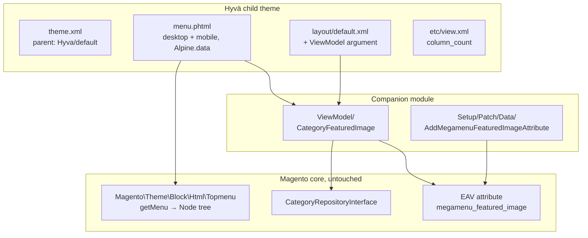

# Hyvä Mega Menu

Responsive mega menu for Magento 2 + Hyvä — desktop dropdown with featured image, mobile slide-in drawer with accordion. Single phtml drives both, single Alpine.js component handles state, Tailwind handles layout via breakpoint utilities.

Ships as a **theme + companion module pair**: the theme handles the rendering, a small module ships the EAV attribute and the ViewModel that exposes it. Honest pragma — a pure-theme implementation can't add EAV attributes, and the featured-image slot needs one. The split is the Magento-idiomatic way to do this.

## Why this exists

Mega menus are a crowded space — `tigren/mega-menu-hyva`, `magefan/menu`, `mageplaza/blog-menu-pro` all do this. This implementation is in the portfolio for three specific things:

1. **Single template, two layouts.** The same `menu.phtml` powers desktop dropdown panels AND mobile drawer accordion. State lives in one Alpine component. Tailwind decides which DOM branch is visible.
2. **The Hyvä-correct theme/module split.** Themes can't add data-model concerns. When a feature needs an EAV attribute, the right pattern is a companion module — even if the visible work is 95% template + JS. This repo demonstrates the split done right.
3. **Reuse of the stock topmenu Node tree.** No custom collection, no DB roundtrip for the menu itself. The featured image is the one piece of additional data — read on demand, cached per-request inside the ViewModel.

## Architecture



## What's interesting (and what's just baseline)

| Choice | Why | Honest classification |
|---|---|---|
| One phtml, two layouts (desktop dropdown + mobile drawer) | Single source of truth for menu copy — easier to audit, easier to translate | Architectural — most modules ship two templates |
| `Alpine.data('initMegaMenu', initMegaMenu)` registration | The official Hyvä convention since 1.3.4 — compatible with CSP-strict storefronts when you add `$hyvaCsp->registerInlineScript()` | Modern Hyvä |
| Theme + module split for one extra data field | EAV attribute can only be created from a module's Setup Patch — themes can't `addAttribute` | Magento-correct |
| Per-request memo in `CategoryFeaturedImage` ViewModel | Menu renders 5–15 top-level categories per page; without the cache we'd hit `CategoryRepositoryInterface::get()` for each | Baseline ViewModel pattern, easy to miss |
| `column_count` via `etc/view.xml` `<var>` | Theme-level config, no admin UI needed for a value that's typically set once per design | Lightweight config approach |

## How it reads category data

Magento's `Magento\Theme\Block\Html\Topmenu::getMenu()` returns a `Magento\Framework\Data\Tree\Node` — recursive structure with `getId()`, `getName()`, `getUrl()`, `getChildren()`. The template walks it directly:

```php
foreach ($block->getMenu()->getChildren() as $level1) {
    foreach ($level1->getChildren() as $level2) {
        foreach ($level2->getChildren() as $level3) {
            // ...
        }
    }
}
```

Featured image lives on the `Magento\Catalog\Model\Category` entity itself, not on the tree node — so the template asks the ViewModel by category id:

```php
$featuredImageUrl = $featuredVm?->getFeaturedImageUrl((int) $node->getId());
```

The ViewModel hits `CategoryRepositoryInterface::get($id)`, reads the `megamenu_featured_image` custom attribute, joins with the media base URL, returns a string. Cached per request.

## What gets shipped

```
src/
├── theme/
│   ├── registration.php           # theme registration: frontend/Scr1be/mega-menu
│   ├── theme.xml                  # parent: Hyva/default
│   ├── composer.json              # type: magento2-theme, requires the module
│   ├── etc/view.xml               # column_count var
│   └── view/frontend/
│       ├── layout/default.xml     # overrides catalog.topnav template + arguments
│       └── templates/html/header/
│           └── menu.phtml         # Alpine.data registration, desktop+mobile
└── module/
    ├── registration.php           # module: Scr1be_MegaMenuAttributes
    ├── composer.json              # type: magento2-module
    ├── etc/module.xml             # depends on Magento_Catalog + Magento_Eav
    ├── Setup/Patch/Data/
    │   └── AddMegamenuFeaturedImageAttribute.php  # creates the EAV attr
    └── ViewModel/
        └── CategoryFeaturedImage.php              # reads the EAV attr
```

## UI preview

```text
Desktop dropdown (open panel)
┌────────────────────────────────────────────────────────────────────┐
│  Home   Men   Women▼   Accessories   Sale                          │
│                ──────                                              │
│                ┌───────────────────────────────────────────────┐  │
│                │ Shirts        Pants         Shoes    ┌─────┐ │  │
│                │  • T-shirts    • Jeans      • Boots  │     │ │  │
│                │  • Polo        • Chinos     • Sneakers│img │ │  │
│                │  • Tank tops   • Trousers   • Sandals │     │ │  │
│                │                                       └─────┘ │  │
│                └───────────────────────────────────────────────┘  │
└────────────────────────────────────────────────────────────────────┘

Mobile drawer
┌─────────────────────┐
│  ☰  Menu            │
├─────────────────────┤
│  Home               │
│  Men             ▼  │
│    └─ Shirts        │
│    └─ Pants         │
│    └─ Shoes         │
│  Women              │
│  Accessories     ▼  │
│  Sale               │
└─────────────────────┘
```

Live screenshots — placeholder until a demo storefront is provisioned.

## Install

```bash
composer require scr1be/hyva-mega-menu
bin/magento module:enable Scr1be_MegaMenuAttributes
bin/magento setup:upgrade
bin/magento cache:clean
cd app/design/frontend/<Vendor>/<theme>/web/tailwind && npm run build:prod
```

Then in admin: **Content → Design → Configuration** → store view → set theme to `Scr1be/mega-menu`.

## Setting featured images

After `setup:upgrade` runs the data patch, every category gets a new field in admin:

> **Catalog → Categories → \<category\> → General → Mega Menu Featured Image**

Upload a square image (400×400 recommended). It only shows on top-level categories — second/third-level categories that have it set are ignored by the template.

## Configuration

| Where | Var | Default | Description |
|---|---|---|---|
| `theme/etc/view.xml` | `column_count` | `4` | Columns in the desktop dropdown panel (last column is reserved for the featured image when present) |
| EAV attribute | `megamenu_featured_image` | `null` | Per-category image (admin UI) |

## API reference

### Alpine component: `initMegaMenu`

| State | Type | Description |
|---|---|---|
| `activePanel` | string \| null | ID of the open dropdown panel, or null when none |
| `mobileOpen` | bool | Mobile drawer visibility |

| Method | Description |
|---|---|
| `open(id)` | Open a panel by id (used on mouseenter) |
| `toggle(id)` | Toggle a panel (used on click) |
| `close()` | Close all panels and the mobile drawer |

### PHP ViewModel: `\Scr1be\MegaMenuAttributes\ViewModel\CategoryFeaturedImage`

| Method | Returns | Description |
|---|---|---|
| `getFeaturedImageUrl(int $categoryId)` | `?string` | Public media URL for the featured image, or `null` if not set / category not found. Memoized per request. |

### Setup patch: `AddMegamenuFeaturedImageAttribute`

Creates EAV attribute on `catalog_category`:
- code: `megamenu_featured_image`
- type: `varchar`, input `image`, backend `\Magento\Catalog\Model\Category\Attribute\Backend\Image`
- scope: store-view
- group: General Information

## Notes on Hyvä CSP compatibility

The `menu.phtml` template ships an inline `<script>` block. On CSP-strict storefronts, add this after `</script>`:

```php
<?php
/** @var \Hyva\Theme\Model\ViewModelRegistry $viewModels */
$hyvaCsp = $viewModels->require(\Hyva\Theme\ViewModel\HyvaCsp::class);
$hyvaCsp->registerInlineScript();
?>
```

Omitted in the shipped template to avoid forcing a `ViewModelRegistry` dependency on stock Hyvä installs.

## Compatibility

| | Version |
|---|---|
| PHP | 8.2, 8.3, 8.4 |
| Magento 2 | 2.4.6, 2.4.7, 2.4.8 |
| Hyvä Theme | 1.3.x, 1.4.x |
| Alpine.js | 3.x |
| Tailwind CSS | 3.x |

## Troubleshooting

**Theme doesn't show in admin Design → Configuration** → run `bin/magento cache:clean` after `setup:upgrade`, then refresh the admin panel.

**Featured image field missing in category admin** → ensure `Scr1be_MegaMenuAttributes` is enabled (`bin/magento module:status Scr1be_MegaMenuAttributes`), then `setup:upgrade` to re-run patches.

**Tailwind classes not applying** → the theme inherits from `Hyva/default`. Rebuild Tailwind in your parent theme's `web/tailwind` directory, **not** in the mega-menu theme itself.

**Featured image breaks layout** → when set, the menu reserves the rightmost column for it, so visible subcategory columns drop from `column_count` to `column_count - 1`. Increase `column_count` in `etc/view.xml` if you want both 4 subcat columns AND an image.

## License

MIT — see [LICENSE](LICENSE).
