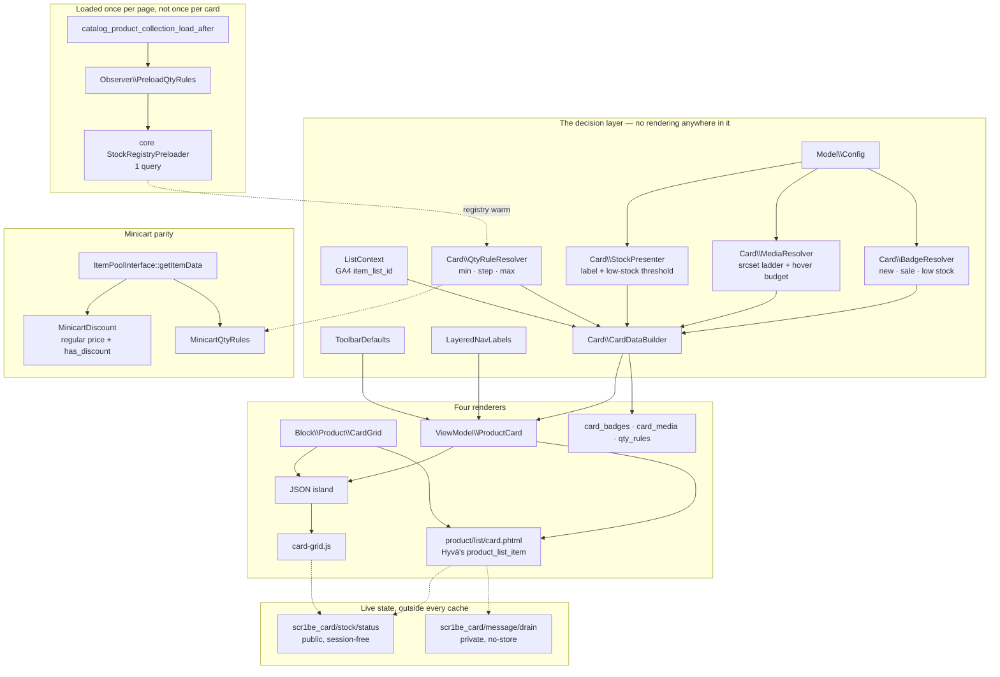

# Hyvä Product Card

A product card is rendered four times on a Magento storefront — by a `.phtml`, by whatever
JavaScript builds the "load more" grid, by a widget on a CMS page, and by GraphQL for the app — and
those four renderings are written by four people at four different times. They drift. The badge
rule that reads `special_price` on the server reads `price_range` on the client; the stepper that
knows about quantity increments on the PDP does not know about them in the drawer; the GA4
`item_list_id` is `category-12` in one place and `Category 12` in another, and the funnel silently
splits in two.

This module has **one** card. Four renderers read it.

| Renderer | Where it lives | What it reads |
|---|---|---|
| Server `.phtml` | `product/list/card.phtml`, the template of Hyvä's `product_list_item` block | `CardData` via the ViewModel |
| Alpine client grid | `product/grid.phtml` + `card-grid.js` | the same `CardData`, as a JSON island |
| Widget | `Block\Product\CardGrid` | delegates to either of the two above |
| GraphQL | `card_badges`, `card_media`, `qty_rules` on `ProductInterface` | the same resolver classes |

## Why this exists

Nobody sets out to write four cards. It happens because the card's *decisions* — is this new, is
this a real discount, how many can you buy, which image, which list — have no home, so each renderer
grows its own copy. The copies are individually reasonable and collectively wrong.

The fix is not a template. It is a layer with the decisions in it and no rendering, and then a rule
that no renderer is allowed to decide anything.

## What's interesting (and what's just baseline)

| Choice | Why | Honest classification |
|---|---|---|
| One `CardData` value object, four consumers | Four renderers cannot disagree if there is nothing to disagree about | The actual point of the module |
| Qty rules read the stock item's *getters*, not its `use_config_*` flags | `Stock\Item::getMinSaleQty()` already resolves the config ladder — including the customer-group dimension a re-implementation drops | The insight most likely to be got wrong |
| Both qty bounds snapped onto the increment ladder *from zero* | Core rejects any quantity that does not divide exactly by `qty_increments`; "minimum 10, increments of 6" starts at 12 | The bug this module was one commit away from shipping |
| Sale badge compares rendered prices, not `special_price` | Most sales are run as catalogue price rules, which never touch that attribute | Architectural |
| Stock endpoint suppresses its own session | A `Set-Cookie` for a page of availability data is the difference between a CDN hit and a hit-for-pass | Architectural — see [The cacheable stock endpoint](#4-the-cacheable-stock-endpoint) |
| `card_badges` et al. registered in core's `fieldToAttributeMap` | Not decoration: without it every GraphQL query selecting them throws | Baseline that is invisible until it 500s |
| Bulk stock preload on collection load-after | 24 stepper lookups become 1, on the storefront *and* in GraphQL | Baseline discipline, frequently skipped |
| Hover images rationed by a per-page ceiling | Every hover image is a second generated file and a second request for a picture most shoppers never see | Opinionated |
| Badge colour lives in CSS keyed on `data-badge` | Lets the client renderer stay inside a strict CSP, and stops the two renderers growing two palettes | Opinionated |
| The card template is a *fork* of Hyvä's | Honest about it; structure reproduced deliberately, and deleting one layout file reverts it | A trade-off, documented below |

## Architecture



## 1. The decision layer

Seven things, each owned by exactly one class.

**Badges.** `new` from the `news_from_date` / `news_to_date` window, evaluated in the store's own
timezone. `sale` from the *rendered* discount — regular price versus final price out of the same
price pool the price box prints from, so catalogue price rules count. `low_stock` only when a real
quantity was measured. Sorted by priority: urgency, then price, then novelty, because a layout with
room for one badge should show the one that changes a decision.

One guard is worth naming. `TimezoneInterface::isScopeDateInInterval()` returns **true** when both
bounds are empty — correct for its own callers, catastrophic here, because every product in the
catalogue has empty news dates. A product with no start date is not new.

**The srcset ladder.** Hyvä 1.4's list image template emits a single `src` with `width`, `height`
and `loading="lazy"`. That is fast and correct and still hands a 360px file to a 640px retina card
and the same 360px file to a 180px phone card. The ladder is the one thing this module adds to that
decision, and it adds it where all four renderers read it.

**The hover image** is rationed. Each one is a second resize target — a second file generated and
cached on disk, and a second request the browser makes for a picture most shoppers never see.
`media/hover_max_products` caps how many cards on one page may pay for one; the budget is spent
per request, not per block, so a page with two grids does not get two budgets. Candidates come from
the media gallery when it is already loaded and from the `image` attribute otherwise — never by
calling `addMediaGalleryData()`, which would turn one page render into a per-card query.

**Stock wording** has one vocabulary and three callers with three different amounts of knowledge:
the listing card knows a boolean, the endpoint knows a quantity, the minicart knows neither.
`salableQty` is nullable precisely so that "not measured" cannot be mistaken for zero — otherwise
every card on a category page would claim the product is nearly gone.

**Quantity rules** are the part most worth reading. The obvious implementation checks
`use_config_min_sale_qty` and branches to `StockConfigurationInterface`. That ladder already exists
inside `Magento\CatalogInventory\Model\Stock\Item`: `getMinSaleQty()` consults
`getUseConfigMinSaleQty()` and, when set, asks
`StockConfigurationInterface::getMinSaleQty($storeId, $customerGroupId)` — i.e. it carries the
customer-group dimension that a hand-rolled version drops. `getMaxSaleQty()`,
`getEnableQtyIncrements()` and `getQtyIncrements()` do the same. So the resolver reads the getters
and adds three things, each of which is a translation rather than a decision.

`getQtyIncrements()` returns `false` when increments are off — that method nulls out any value ≤ 0
before returning — and a stepper cannot step by `false`. A `max_sale_qty` of zero is how the stock
table spells "no ceiling": core gates its own maximum check on
`if ($stockItem->getMaxSaleQty() && $qty > $stockItem->getMaxSaleQty())` in
`StockStateProvider::checkQuoteItemQty()`, so zero disables it, and passing it through as a number
would make every stepper refuse its own first click.

The third is the one worth catching. **A legal quantity is a whole multiple of the increment
measured from zero, not from the minimum.** `StockStateProvider::checkQtyIncrements()` errors unless
the quantity divides exactly by `qty_increments`, so "minimum 10, increments of 6" is not 10, 16, 22
— the smallest buyable quantity is 12. Both bounds are therefore snapped onto the ladder before any
renderer sees them: the minimum up, the maximum down. Core reaches the same conclusion in
`suggestQty()` (`ceil($minQty / $qtyIncrements) * $qtyIncrements`) and Hyvä reaches it in its PDP
quantity template (`ceil($minSalesQty / $step) * $step`) — which is exactly the problem. Two places
already know this; a card that worked it out a third time would be a third chance to get it wrong,
and the failure is invisible until checkout rejects the cart with a message about quantity
increments.

When a product's aligned ceiling lands below its aligned minimum there is no purchasable quantity at
all. That is reported as it is, because inventing a buyable number only moves the rejection.

**The GA4 list context** is derived once per request — search action name, else the registered
`current_category`, else a named fallback — and travels inside the card. An empty `item_list_id`
splits a funnel exactly as effectively as a wrong one.

**The layered-nav label map** comes from `FilterableAttributeListInterface`, the service the layered
navigation itself is built on, with store labels. Core ships no preference for that interface — it
wires the category and search implementations per layer — so `etc/di.xml` picks the category one
(`addIsFilterableFilter()`) and says why: card vocabulary is catalogue-wide, and the search list
narrows to attributes filterable *in search*, which would drop labels on a category page.

**The toolbar default** is whatever `Helper\Product\ProductList::getDefaultSortField()` says — the
exact resolution `Toolbar::getOrderField()` delegates to: the registered `current_category`'s
`default_sort_by` when there is one, otherwise `catalog/frontend/default_sort_by`. Direction is
`ProductList::DEFAULT_SORT_DIRECTION`, the value `Toolbar::$_direction` is initialised to and the one
`getCurrentDirection()` falls back to whenever the memorised direction is absent or not asc/desc.

It travels in the grid payload as `toolbar`. This module does not itself re-sort anything — it
exposes the server's answer so that anything which *does* sort in the browser starts from the same
order the toolbar would have produced. A client-side sort whose idea of "default" differs by so much
as a tie-break reorders the grid after the reader has started reading, which is the most expensive
kind of layout shift there is.

## 2. Four renderers

**Server.** `view/frontend/layout/catalog_list_item.xml` repoints the template of Hyvä's
`product_list_item` block. That one block is how every listing card is drawn —
`Hyva\Theme\ViewModel\ProductListItem::getItemHtml()` looks it up by exactly that name — so category
pages, search results, the compare page and Hyvä's own product slider all arrive through it without
needing a hook each.

**Client.** One `application/json` island and an Alpine component. Same `CardData`, drawn in the
browser instead of on the server: cheap to re-sort, invisible to a crawler. The widget makes that
trade explicit rather than hiding it, and says so in the parameter description.

**Widget.** `Scr1be\HyvaProductCard\Block\Product\CardGrid`, products selected by an ordered SKU
list. Deliberately smaller than a rules engine: `Magento_CatalogWidget` already ships conditions-based
selection, and a second, subtly different "which products" implementation is not something a card
module should own. In server mode it renders each card through `ProductListItem::getItemHtml()` —
the same call Hyvä's own `list.phtml` makes — so a widget card is not a lookalike of a listing card,
it is the same block with the same template and the same block cache.

The block extends `AbstractProduct` rather than `Template` for one specific reason: Hyvä's
`renderItemHtml()` calls `$parentBlock->getProductPrice($product)` before anything else, annotated
there as initialising the special price map on 2.4.8 and newer. A plain `Template` has no such
method and `DataObject::__call()` would quietly answer null.

**GraphQL.** Three fields on `ProductInterface`, resolved by the same classes. See
[the GraphQL section](#5-graphql-and-the-trap-in-it).

## 3. One query instead of twenty-four

Every card asks for its stepper rules, which asks `StockRegistryInterface::getStockItem()`, which on
a cold registry issues a `SELECT` per product. Twenty-four cards, twenty-four round trips, none of
them visible until you turn the query log on.

`catalog_product_collection_load_after` is the right seam for three reasons. It is dispatched from
`Magento\Catalog\Model\ResourceModel\Product\Collection::_afterLoad()`, i.e. *after* pagination, so
the id list is the page and not the category. It carries the collection under the key `collection`.
And every path that renders cards loads that same collection class — listing, search, widget and both
GraphQL data providers — so one observer covers all four renderers. It is registered in the
`frontend` and `graphql` areas, and nowhere else.

The loader is core's own `StockRegistryPreloader`: one criteria-filtered `getList()`, written into
`StockRegistryStorage` under the default scope id. That last detail is what makes it a hit rather
than a hope — `StockRegistry::getStockItem($productId, $scopeId)` reassigns `$scopeId` to
`StockConfigurationInterface::getDefaultScopeId()` on its first line and never looks at what the
caller passed, so there is exactly one key it can read back.

## 4. The cacheable stock endpoint

A card's HTML is cached twice over. Hyvä caches the item block — `renderItemHtml()` sets a
`cache_lifetime` from `hyva_theme_catalog/developer/cache/product_list_item_block_cache_lifetime`,
one hour by default — and the FPC caches the page around it. Both are correct, and both mean the
availability line baked into the HTML is as old as the cache entry.

`GET scr1be_card/stock/status?ids=1,2,3` is how the card gets a current answer without either cache
having to be short-lived. The response is identical for every visitor — no prices, no customer data,
no session — so it can be `public, max-age=N`. Two things had to be true for that:

1. **No session may start.** `SessionManager::start()` opens with
   `if ($this->sessionStartChecker->check())` and does nothing at all when that returns false — no
   `session_start()`, no cookie renewal. Returning false for one route is how core itself keeps
   sessions out of places they would do harm: `Magento\GraphQl\Plugin\DisableSession` does it for the
   GraphQL area, and `Magento\Paypal\Plugin\TransparentSessionChecker` does it for four PayPal return
   URLs by matching `getPathInfo()`. This module's plugin is the same shape, aimed at one path.
2. **The headers must say `public`.** The VCL Magento ships (`module-page-cache/etc/varnish7.vcl`)
   marks any response with `Cache-Control ~ "private"` uncacheable, which is what a Magento
   controller produces if you leave it alone.

The two are connected, and that is the part worth knowing. Without the session suppression the
endpoint would set `PHPSESSID` — and, more expensively, a non-empty HTTP context would make
`Response\Http::sendVary()` write an `X-Magento-Vary` cookie. The same VCL sets `beresp.ttl = 0s`
and `beresp.uncacheable = true` for a response that sets that cookie when the request did not send
one, so the first guest to touch the endpoint would turn it into a two-minute hit-for-pass for
everybody.

The endpoint caps its id list, and sorts it, so that two grids showing the same products in a
different order share one cache entry instead of minting two.

### The flash-message drainer

Magento's flash messages are a *page-load* mechanism. `Checkout\Controller\Cart\Add` pushes "You
added X to your shopping cart." into the session with `addSuccessMessage()` and the next rendered
page prints it — and it does that whether or not the request was an XHR. Only the *response*
differs: `goBack()` branches on `getRequest()->isAjax()` and answers a small JSON body instead of a
redirect, which is why the card sends `X-Requested-With: XMLHttpRequest` rather than following a
302 to download a page it will discard. But there is now no next rendered page, so the message waits
in the session and ambushes the shopper on whatever link they click next. Two adds in a row and the
third page shows both.

`POST scr1be_card/message/drain` takes them out and hands them over. It reuses core's own
`Theme\CustomerData\MessagesProvider` (whose `getMessages()` calls `$messageManager->getMessages(true)`
— the `true` being the clear flag) and the same `InterpretationStrategyInterface` the `messages`
customer-data section uses, so the text after an XHR add is byte-identical to the text after a full
page load, and the queue is empty either way. The card then dispatches Hyvä's own
`messages-loaded` event, which its `Magento_Theme::messages.phtml` binds on `window`.

It is a separate endpoint rather than a section reload because the card's *other* endpoint is
deliberately session-free and CDN-cacheable. The card needs one place where being session-bound and
uncacheable is the point, and one where it is forbidden; mixing them is how private data ends up in
a shared cache. The drain runs *before* the card asks Hyvä to reload customer sections, so the
`messages` section finds an empty queue and nothing is shown twice.

## 5. GraphQL, and the trap in it

```graphql
{
  products(filter: { category_id: { eq: "4" } }, pageSize: 4) {
    items {
      sku
      name
      card_badges { code label priority value }
      card_media { url width height srcset sizes hover_url }
      qty_rules { min step max is_decimal }
    }
  }
}
```

Two pieces of wiring make that work, and the second one is not optional.

**`CardAttributes`, a `CollectionProcessorInterface`.** A resolver-backed field is invisible to the
query builder: nothing in `card_badges` says that the badge decision needs `news_from_date` and a
working price pool. Without it the fields resolve to empty on some queries and populate on others,
depending entirely on which *other* fields the client happened to select — the worst kind of bug,
because it looks like a client-side mistake. `CollectionProcessorInterface` is the right seam
because both entry points run it before `load()`: `DataProvider\Product::getList()` (the
filter/category path) and `DataProvider\ProductSearch::getList()` (the full-text path).

**Three entries in core's `fieldToAttributeMap`.** Core's `AttributeProcessor` walks the same
selected-field list and calls `Collection::addAttributeToSelect()` on every name it does not
recognise, and `Eav\Model\Entity\Collection\AbstractCollection::addAttributeToSelect()` throws
*The "%1" attribute requested is invalid. Verify the attribute and try again.* for a code that is
not an attribute. `card_badges` is not an attribute. So `etc/graphql/di.xml` maps the three field
names to empty arrays: core stops treating them as attribute codes, and `CardAttributes` remains the
only place that decides what they really need.

`qty_rules` needs no attribute at all — it reads the stock registry, which the load-after observer
fills in one query for the whole result set, in the `graphql` area too.

## 6. Minicart parity

A shopper who added a product from a card showing "-30%" and a struck-through price opens the
minicart and finds one number. Nothing is wrong exactly — `Checkout\CustomerData\DefaultItem::
doGetItemData()` returns `product_price` and `product_price_value` and stops — but the drawer
silently drops the only reason they clicked. And a product sold in packs of six has a stepper that
steps by six on the listing, on the PDP, and a minicart input that lets them type 7 and rejects the
cart at checkout with a message about quantity increments.

Both are fixed at one choke point. `ItemPoolInterface::getItemData()` is what the `cart`
customer-data section runs every quote item through, and the *interface* is what Magento_Checkout's
`etc/frontend/di.xml` declares the preference for — so one `after` plugin on the interface reaches
every item renderer in the pool, including per-product-type ones a third party registered.

`after` in both cases, because each plugin appends keys to a finished array: there is no decision to
veto (`before`) and nothing whose execution is conditional (`around`). An `around` here would add
exactly one capability — the capability to break the minicart by forgetting `$proceed`.

The discount comparison carries an epsilon. Percentage catalogue rules land the calculation price a
fraction of a cent under the regular price routinely, and without a tolerance the drawer strikes
through a price identical to the one beside it.

## Design decisions

- **The card template is a fork, and it is labelled one.** Repointing `product_list_item` at our own
  template is the only way to put badges over the image and a stepper next to the button, because
  the slots Hyvä exposes (`addto`, `wishlist`) are all at the bottom of the card. The fork
  reproduces Hyvä's structure deliberately — same `<form>` and add-to-cart action, same child blocks
  in the same order, same `initPriceBox()` wrapper and its JS dependency registration — so
  third-party injections keep working. **After a Hyvä upgrade, diff
  `vendor/hyva-themes/magento2-default-theme/Magento_Catalog/templates/product/list/item.phtml`
  against ours.** Deleting `view/frontend/layout/catalog_list_item.xml` reverts to the stock card;
  the ViewModel layer, the GraphQL fields and the minicart plugins are unaffected by that.
- **CSP: this module's own bindings are dot paths and bare method references only** —
  `x-text="stockLabel"`, `:disabled="isBusy"`, `@click="increment"`, `:data-badge="badge.code"`.
  Where the template reproduces Hyvä's own fragments (`x-data="initPriceBox()"`, the
  `@update-prices-N.window` handler, `initCompareOnProductList()`) it reproduces Hyvä's idiom
  verbatim rather than inventing a divergent one. The badge palette lives in
  `view/frontend/tailwind/module.css` keyed on `[data-badge]` precisely so the client renderer needs
  no computed `:class`.
- **The GA4 index is corrected in the browser.** A Hyvä listing renders one card at a time and never
  tells a card where in the grid it sits, so the server payload carries the same index for every
  card. The DOM knows the answer, so the correction happens there — and the payload still carries a
  server-resolved `item_list_id`, which the browser must never invent.
- **The card image is written by the template, not by Hyvä's image block.** The ladder is the point,
  and the block renders one `src`. The intrinsic dimensions come from the resolved fallback rung so
  the box is reserved before the bytes land.
- **No `IdentityInterface` on the card itself.** Hyvä already sets `cache_tags` from
  `$product->getIdentities()` on the item block. The widget block does declare identities, because
  its `widget.xml` declares a `ttl` (as core's own `products_list` widget does) and a shelf that
  never invalidated on a price change would be worse than one that is not cached at all.
- **No new attributes, no schema, no data patch.** Everything the card shows already exists in the
  catalogue. A module that adds a `is_featured` flag to draw a badge has moved the merchant's problem
  rather than solved it.

## What gets shipped

```
src/
├── registration.php
├── composer.json                       # scr1be/hyva-product-card, type magento2-module
├── package.json                        # ES module exports map + `npm test`
├── etc/
│   ├── module.xml · config.xml · acl.xml · widget.xml · schema.graphqls
│   ├── di.xml                          # the filterable-attribute list choice
│   ├── adminhtml/system.xml
│   ├── frontend/
│   │   ├── di.xml                      # 2 minicart plugins + session suppression
│   │   ├── events.xml                  # catalog_product_collection_load_after
│   │   └── routes.xml                  # scr1be_card
│   └── graphql/
│       ├── di.xml                      # collection processor + fieldToAttributeMap
│       └── events.xml                  # the same bulk preload, headless
├── Model/
│   ├── Config.php                      # every knob, already sanitised
│   ├── Card/
│   │   ├── CardData.php                # the contract all four renderers read
│   │   ├── CardDataBuilder.php         # the only constructor of card state
│   │   ├── BadgeResolver.php · Badge.php
│   │   ├── MediaResolver.php · ImageSource.php
│   │   ├── StockPresenter.php · StockPresentation.php
│   │   └── QtyRuleResolver.php · QtyRules.php
│   ├── ListContext.php                 # GA4 item_list_id / item_list_name
│   ├── LayeredNavLabels.php
│   ├── ToolbarDefaults.php
│   └── Resolver/
│       ├── CardBadges.php · CardMedia.php · CardQtyRules.php
│       └── CollectionProcessor/CardAttributes.php
├── Observer/PreloadQtyRules.php
├── Plugin/
│   ├── Checkout/MinicartDiscount.php · MinicartQtyRules.php
│   └── Session/SuppressStockEndpointSession.php
├── Controller/
│   ├── Stock/Status.php                # public, session-free
│   └── Message/Drain.php               # private, no-store
├── ViewModel/ProductCard.php           # the module's surface for templates
├── Block/
│   ├── CardScripts.php                 # import map + config, head.additional
│   └── Product/CardGrid.php            # the widget
├── view/frontend/
│   ├── layout/catalog_list_item.xml · default.xml
│   ├── templates/product/list/card.phtml
│   ├── templates/product/grid.phtml
│   ├── templates/product/card/scripts.phtml
│   ├── tailwind/module.css
│   └── web/js/                         # card-data · card · card-grid · card-register
├── i18n/en_US.csv
└── Test/
    ├── Unit/                           # 11 classes
    └── Js/                             # 2 specs
```

## Install

```bash
# from your Magento 2 root
composer config repositories.scr1be path /path/to/Magento/hyva-product-card/src
composer require scr1be/hyva-product-card:@dev
bin/magento module:enable Scr1be_HyvaProductCard
bin/magento setup:upgrade
bin/magento setup:di:compile
bin/magento cache:flush
```

The package lands in `vendor/scr1be/hyva-product-card/` — this repository sets no `installer-paths`,
so Composer uses the default vendor location. If you would rather copy the module, it goes to
`app/code/Scr1be/HyvaProductCard/`; the two paths matter when you run the tests below.

Then rebuild the Hyvä theme so the module's Tailwind sources are picked up:

```bash
cd app/design/frontend/<Vendor>/<theme>/web/tailwind
npx hyva-sources && npm run build
```

The module is registered for that build by `app/etc/hyva-themes.json`, which
`Hyva\Theme\Model\HyvaModulesConfig` regenerates on `setup:upgrade` and on every
`module:enable` / `module:disable`. `view/frontend/tailwind/module.css` is the file the build reads
from this module, and the `@source` lines inside it point Tailwind at the templates and the
JavaScript — the JS matters as much as the templates, because the client renderer builds markup that
appears in no `.phtml`.

## Configuration

**Stores → Configuration → scr1be → Product Card.** Everything is store-scoped.

| Setting | Default | Notes |
|---|---|---|
| `general/enabled` | Yes | Off returns every renderer to core's and Hyvä's own data. The GraphQL fields keep resolving, with empty payloads. |
| `badges/new_enabled` | Yes | `news_from_date` / `news_to_date`, store timezone |
| `badges/sale_enabled` | Yes | Rendered final price vs regular price |
| `badges/sale_min_percent` | 5 | A 0.4% rounding artefact is not a sale |
| `badges/low_stock_enabled` | Yes | |
| `badges/low_stock_threshold` | 5 | Only reached where a real quantity exists |
| `media/srcset_widths` | `240,320,480,640` | Sorted, de-duplicated, bounded to 40–2400px, max 6 rungs |
| `media/sizes` | `(min-width: 1280px) 20vw, …` | Must describe your grid, not the image |
| `media/hover_enabled` | Yes | |
| `media/hover_max_products` | 12 | Per page, not per block |
| `stock/endpoint_ttl` | 60 | `public, max-age`. 0 makes the endpoint `no-store`. |
| `analytics/ga4_enabled` | Yes | Adds list context and dispatches `scr1be-card:ga4`. No vendor script is loaded. |

## Using it from a template

```php
/** @var \Scr1be\HyvaProductCard\ViewModel\ProductCard $cardViewModel */
$cardViewModel = $viewModels->require(\Scr1be\HyvaProductCard\ViewModel\ProductCard::class);

$card = $cardViewModel->getCard($product, 'category_page_grid', $index);
$card->getBadges();          // Badge[], priority order
$card->getImage();           // ImageSource: url, srcset, sizes, width, height, hoverUrl
$card->getStock();           // StockPresentation: inStock, label, isLow, salableQty
$card->getQtyRules();        // QtyRules: min, step, max, isDecimal
$card->toArray();            // exactly what the JSON island and GraphQL return

$cardViewModel->getGridPayload($products, 'category_page_grid');   // the island, serialised
$cardViewModel->getToolbarDefaults();                              // ['sort' => …, 'direction' => …]
$cardViewModel->getFilterLabels();                                 // attribute code => store label
```

## Browser events

| Event | Direction | Payload |
|---|---|---|
| `scr1be-card:ga4` | dispatched on `window` | `{event: 'view_item_list' \| 'select_item' \| 'add_to_cart', items: […]}` — also pushed to `window.dataLayer` when one exists |
| `messages-loaded` | dispatched on `window` | Hyvä's own event, `{messages: [{type, text}]}` |
| `reload-customer-section-data` | dispatched on `window` | Hyvä's own event, after an add-to-cart |

## Demo notes

On a stock **Magento 2.4.8 + Hyvä 1.4 + Luma sample data** storefront:

1. **Badges.** Catalog → Products → *Chaz Kangeroo Hoodie* → set `Set Product as New From` to today
   and Advanced Pricing → Special Price to 20% under the price. Reindex
   (`bin/magento indexer:reindex catalog_product_price`) and flush the FPC. The card in
   *Men → Tops → Hoodies & Sweatshirts* now carries **New** and **-20%**, stacked top-left in
   priority order.
2. **The ladder.** View source on a category page and look at one card's ``: `srcset` has one
   rung per configured width and `sizes` is the string from the config. Narrow the viewport, hard
   reload, and the Network panel shows the browser picking a different rung.
3. **Hover.** Hover a card whose product has more than one image — most Luma apparel does. The
   thirteenth card on the page (default ceiling 12) deliberately has no hover image; raise
   `media/hover_max_products` and reload to see it appear.
4. **The stepper.** Advanced Inventory on any product → Minimum Qty Allowed in Shopping Cart 12,
   Enable Qty Increments Yes / Qty Increments 6. The card's stepper now moves 12 → 18 → 24, refuses
   to go below 12, and typing `15` snaps to 12 on blur. Add to cart and open the minicart: the same
   rules arrive there, from the same resolver.
5. **One query, not twenty-four.** `bin/magento dev:query-log:enable` (Magento_Developer, developer
   mode), load a category page with the FPC off, then:

   ```bash
   grep -c 'cataloginventory_stock_item' var/debug/db.log
   ```

   Expect one lookup for the page rather than one per card. Disable the module and repeat to see the
   shape change; the absolute numbers depend on your page size.
6. **The cacheable endpoint.** With a category page open:

   ```bash
   curl -sI 'https://<store>/scr1be_card/stock/status?ids=1,2,3' | grep -iE 'cache-control|set-cookie'
   ```

   Expect `cache-control: public, max-age=60, s-maxage=60` and **no** `Set-Cookie` at all. Comment
   out the plugin in `etc/frontend/di.xml`, recompile, and the `Set-Cookie` line comes back — that
   is the difference between a CDN hit and a hit-for-pass.
7. **The drainer.** Add to cart from a card. The message appears immediately without a page load.
   Now navigate to any other page: it does **not** appear again. Disable the module and repeat to see
   the stock behaviour, where the message follows you.
8. **The widget.** Content → Pages → *Home Page* → Insert Widget → *Product Card Grid (scr1be)*, SKUs
   `24-MB01,24-WB07,24-UG02`, render mode **Server**. Save, flush, and the home page shows three
   cards identical to the listing's. Switch the widget to **Client** and reload: the same three
   cards, now drawn from the JSON island — `view-source:` shows the island where the markup was.
9. **GraphQL.** Run the query from [section 5](#5-graphql-and-the-trap-in-it) against
   `/graphql`. Then, to see why the `fieldToAttributeMap` entries exist, comment them out of
   `etc/graphql/di.xml`, recompile, and re-run: the query fails with *The "card_badges" attribute
   requested is invalid. Verify the attribute and try again.*

## Tests

```bash
# from your Magento 2 root — path follows the install method you chose above.
# Composer package:
vendor/bin/phpunit -c dev/tests/unit/phpunit.xml.dist vendor/scr1be/hyva-product-card/Test/Unit

# …or, if you copied the module into app/code instead:
vendor/bin/phpunit -c dev/tests/unit/phpunit.xml.dist app/code/Scr1be/HyvaProductCard/Test/Unit
```

Eleven PHPUnit classes, covering the behaviour that can actually break: the quantity ladder
(the from-zero alignment of both bounds, a `false` increment, a zero maximum, a decimal step that
does not divide cleanly, crossed bounds, and the memo), the badge decision (the empty-news-date
guard, the discount floor, the priority order, a price pool that has neither price), the stock
vocabulary (an unmeasured quantity, the threshold boundary, out-of-stock never also being low),
the srcset ladder and the page-wide hover budget, the GA4 identity for each page type, the bulk
preload's guards, both minicart plugins including the epsilon, the session-suppression path match,
and the GraphQL collection processor. Value objects, layout XML and `registration.php` are wiring —
covered by the storefront, not by mocks.

The JavaScript ships its own specs, run by Node's built-in runner:

```bash
cd vendor/scr1be/hyva-product-card    # or app/code/Scr1be/HyvaProductCard
npm test
```

`card-data.test.js` covers the pure half — quantity clamping (multiples of the increment from zero, a
minimum that is not itself on the ladder, a ceiling that is not itself a step, crossed bounds,
nonsense rules), stock merging (a missing entry is "no news", not "out of stock"), and the GA4
payloads. `card-register.test.js` covers the adapter: the component
names the templates put in `x-data`, the config element the PHP block writes, `alpine:init` timing
and its `{once: true}`, and the three Hyvä event names — the seam where a rename breaks something
silently. There is no build step and no dev dependency; `package.json` is an exports map so the
specs import exactly what the import map ships.

> **The JS specs were not executed in the session that wrote them.** That environment could run
> `node --version` and nothing else. The quantity algorithm — the half where a mistake reaches the
> checkout — was instead cross-checked by a PHP mirror of `clampQty()` run against the same table
> the spec asserts, and against the bounds the PHP resolver publishes; 18 cases, no failures. The
> rest of the JavaScript is reviewed but unrun. Everything else is green: **67 PHPUnit tests, 112
> assertions**, a parse check across all 42 PHP/phtml files and all 13 XML files. Run `npm test`
> before trusting the JS half.

## Compatibility

| | Version |
|---|---|
| PHP | 8.2, 8.3, 8.4 |
| Magento 2 | 2.4.6, 2.4.7, 2.4.8 |
| Hyvä Theme | 1.3.x, 1.4.x |
| Alpine.js | 3.x |

MSI-aware: `Magento_InventoryCatalog` registers its `adapt_get_stock_status*` plugins on
`StockRegistryInterface`, so the availability this module reads is MSI's answer when MSI is enabled.
The sale-quantity fields come from the stock item row instead, which MSI does not decorate — it
registers no plugin on `StockItemRepositoryInterface` in its `etc/di.xml`.

The decision layer, the observer, the GraphQL fields and the minicart plugins are pure backend and
work on Luma too. Only the card template, the grid template and the JavaScript assume Hyvä; drop
`view/frontend/layout/catalog_list_item.xml` and `default.xml` to run the rest anywhere.

## License

MIT — see [LICENSE](LICENSE).
