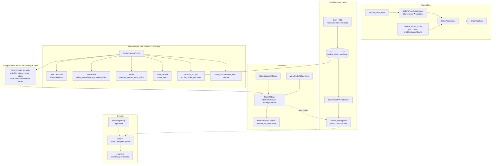

# Hyvä Product Slider

Every Magento build eventually grows a home page like this:

```xml
<block class="Magento\CatalogWidget\Block\Product\ProductsList" name="home.bestsellers">
    <arguments>
        <argument name="conditions_encoded" xsi:type="string">^[`1`:^[`type`:`Magento||CatalogWidget…</argument>
    </arguments>
</block>
```

Four of those, one per shelf, in a layout file. Changing which products appear on the home page is a
deployment. Changing how many appear on a phone is a deployment. Adding a fifth shelf for a campaign
that runs for nine days is a deployment, and so is removing it.

This module moves all of that into the admin: a slider is a row in a table, with a **source** (nine
of them), **per-breakpoint slide counts**, autoplay and loop settings, and store scope. Layout XML
places it by name, or the merchandiser places it themselves with a widget. And each slide can carry a
line of social proof — *"17 minutes ago, Anna from Austin bought this"* — built from real orders,
fetched after the page renders so the carousel itself stays cached.

## What's interesting (and what's just baseline)

| Choice | Why | Honest classification |
|---|---|---|
| Slides are drawn by Hyvä's `product_list_item` block | Whatever the storefront has decided a card looks like is what a slide looks like — including the one `scr1be/hyva-product-card` substitutes into that same block | The reason this module has no card template at all |
| Sources return **ids**, never products | Nine sources cannot each forget to filter out disabled products if none of them filters anything | The actual architecture |
| Sources are over-fetched by 3× | Visibility, status and stock are applied after ranking; asking for exactly the limit renders a half-empty shelf the first time a bestseller sells out | The bug this design is shaped around |
| `getAllIds()` is never used to read a ranked collection | It resets `ORDER` before applying the limit — a "newest first" source would return an arbitrary slice | The trap most likely to be got wrong |
| Recently-bought is a 15-minute cron index, not a query | The honest query is a `GROUP BY` across the two largest tables in the database, on a page that is otherwise served from cache | Architectural |
| Social proof is fetched, not rendered | The carousel is true for an hour, the sentence is true for a minute; baking one into the other makes the whole page uncacheable | Architectural — see [§4](#4-the-fpc-safe-purchase-line) |
| Deals read `catalog_product_index_price`, not `special_price` | Most sales on a real shop are catalogue price rules, which never touch that attribute | Architectural |
| Bestsellers read Magento's aggregated report | It exists, it is indexed by period and store, and the platform already keeps it current | Baseline, with one trap: the store-id filter |
| Slide counts travel as CSS custom properties | `lg:basis-1/7` cannot be produced by a build that scans source files for class names | Opinionated |
| The slider engine is behind an import-map specifier | The carousel is ~150 lines of scroll-snap arithmetic; a project that wants a third-party engine rebinds one specifier | A trade-off, documented [below](#design-decisions) |
| ACL splits save from delete | Deleting a slider silently empties whatever page still points at its identifier | Baseline discipline, frequently skipped |

## Architecture



## 1. A slider is a row

`scr1be_slider` plus a store pivot, declaratively defined, with a repository and service contracts in
front of it. The parts worth naming:

**The identifier is unique across the install**, enforced by a `unique` constraint rather than a
`_beforeSave()` check. CMS blocks allow the same identifier on different stores and pay for it with a
store-sensitive lookup at every call site. Layout XML has no store in its argument list, so a slider
addressed from a layout handle has to resolve the same way everywhere.

**Store scope is a pivot table**, not a column, because a slider genuinely is many-to-many with store
views — the same "New In" runs on three of five stores — and because `store_id = 0` then keeps its
ordinary Magento meaning of "all of them" instead of becoming a fourth kind of value.

**The grid collection is the entity collection.** `UiComponent\DataProvider\SearchResult` would have
covered a plain table, but the listing filters and displays store views, which live in the pivot. So
`ResourceModel\Slider\Grid\Collection` extends the entity collection and inherits its join, its bulk
`_afterLoad()` and its `getSelectCountSql()` fix — the GROUP that the pivot join needs would otherwise
make `COUNT(*)` return the size of the first group, which is always 1. Core's CMS collections strip
the GROUP in exactly the same place.

**Three form fields, one column.** `source_value` means a category id, an attribute set id or a SKU
list depending on `source_type`. The form cannot have one input for that, and the table cannot have
three columns for a value where exactly one is ever set. `Slider\FormDataMapper` is the seam, and it
implements *both* directions on purpose: a mapper that only knew how to save would let the edit form
quietly lose a value that saved correctly. The form switches between the three with `switcherConfig`,
and every rule spells out the full picture — show one, hide the other two — because
`Magento_Ui/js/form/switcher.js` returns early from `applyRule()` on a value mismatch and nothing ever
reverses an earlier action.

## 2. Nine sources, one contract

```php
interface ProductSourceInterface
{
    public function getCode(): string;
    public function getLabel(): string;
    public function isAvailable(): bool;
    public function getProductIds(SliderInterface $slider, int $storeId, int $limit): array;
    public function validateSourceValue(?string $sourceValue): void;
}
```

A source returns **ids, most relevant first**, and stops. It does not load products, does not apply
visibility or stock rules and does not know what a slide looks like. `Slider\ProductProvider` does all
three, once, for every source — because the rule everybody forgets is visibility, and a manual SKU
list pasted from a spreadsheet routinely contains the simple children of configurables, which render
as cards linking to a 404.

| Source | Reads | Ranked by |
|---|---|---|
| **New Products** | `news_from_date` / `news_to_date` | newest window start |
| **Bestsellers** | `sales_bestsellers_aggregated_daily` | summed `qty_ordered` |
| **Deals** | `catalog_product_index_price` | relative discount |
| **Most Viewed** | `report_event` | view count |
| **Recently Bought** | `scr1be_slider_purchase` | most recent purchase |
| **Category** | the category-product index for the store | category position |
| **Attribute Set** | `catalog_product_entity.attribute_set_id` | newest first |
| **Manual SKU List** | `catalog_product_entity.sku` | the order typed |
| **Featured** | `scr1be_featured`, added by a data patch | newest first |

Five of them are worth a paragraph.

**Bestsellers.** The store filter is not cosmetic.
`Magento\Sales\Model\ResourceModel\Report\Bestsellers::aggregate()` first writes one row per real
store and then re-selects those rows `WHERE store_id <> Store::DEFAULT_STORE_ID`, grouped by period
and product, to insert an all-stores roll-up under `store_id = 0`. Summing without the filter counts
every sale twice. The trade-off, stated plainly: this source is only as fresh as the last statistics
refresh, and on a shop that never runs one the table is empty and the slider is empty with it.

**Deals** read the price index rather than the `special_price` attribute, because most sales on a real
shop are catalogue price rules that never touch it. `catalog_product_index_price` carries the answer
all the pricing mechanisms arrive at: `price` alongside `final_price`, per website and per customer
group. Ranking is by *relative* discount, so a 40%-off t-shirt outranks a 5%-off sofa. The customer
group is a configured constant rather than the visitor's own — the slider renders inside a block cache
shared by every visitor, so a per-group product list would be right for whoever warmed it and wrong
for everybody after.

**Most Viewed** has two failure modes that look identical from the storefront, and both are worth
knowing before calling it broken. `report_event` only has rows if somebody is writing them:
`Magento\Reports\Observer\CatalogProductViewObserver::execute()` returns immediately unless
`ReportStatus::isReportEnabled(Event::EVENT_PRODUCT_VIEW)` is true, which reads two flags —
`reports/options/enabled` and `reports/options/product_view_enabled`. And the module can be disabled
outright, in which case the source removes itself from the admin dropdown rather than being offered
and then silently empty. The `event_type_id` is filtered by constant rather than by a join, because
the row is seeded with a fixed id:
`Magento\Reports\Setup\Patch\Data\InitializeReportEntityTypesAndPages` calls `insertForce()` with
`event_type_id => Event::EVENT_PRODUCT_VIEW` and `event_name => 'catalog_product_view'`.

**Category** uses the category-product *index*, not the `catalog_category_product` pivot, and the
difference is anchor categories: the pivot holds only direct assignments, so a slider pointed at
"Women" on the Luma catalogue would come back empty while the category page shows hundreds of
products. The table is resolved through `TableMaintainer::getMainTable($storeId)` rather than named,
because that index is dimensioned by store — hardcoding one name is how a module works on the default
store and returns nothing on the second.

**Manual SKUs** rebuild the order in PHP after the lookup. `WHERE sku IN (…)` answers in storage
order; a `FIELD()` ordering would work on MySQL and quietly stop working on anything else, and the
list is at most a hundred entries. Matching is case-insensitive because `catalog_product_entity.sku`
uses the table's collation, so an admin who typed `24-mb01` should not get an empty carousel. Unknown
SKUs are named in an error at save time and skipped silently at render time — reported where somebody
can fix them, ignored where nobody can.

### The trap in reading a ranked collection

Two sources build an EAV collection, and neither calls `getAllIds()`:

```php
// Magento\Eav\Model\Entity\Collection\AbstractCollection::_getAllIdsSelect()
$idsSelect = clone $this->getSelect();
$idsSelect->reset(\Magento\Framework\DB\Select::ORDER);   // ← here
…
$idsSelect->limit($limit, $offset);
```

A collection sorted by `news_from_date DESC` and read through `getAllIds($limit)` hands back an
arbitrary slice of the matching set rather than the newest of it. For a source whose entire contract
is "ids, most relevant first", that is the whole feature, silently gone. `AbstractSource::
readIdsInOrder()` loads the collection and reads `getColumnValues('entity_id')` instead.

### Over-fetching

The provider asks each source for **three times** the slider's limit, capped at 180 candidates, then
filters and keeps the survivors in the source's order. Filtering happens after ranking — a
bestselling product that went out of stock this morning is still a bestseller — so a slider that asked
for exactly its limit would render half empty. Too high a multiplier and every render sorts a page of
the catalogue; three is the compromise, and it is a constant with a name.

Stock filtering goes through `CatalogInventory\Helper\Stock::addIsInStockFilterToCollection()` rather
than `addInStockFilterToCollection()`. The first routes through
`CatalogInventory\Model\ResourceModel\Stock\Status::addStockDataToCollection()`, which respects
`cataloginventory/options/show_out_of_stock` — so a shop that deliberately lists sold-out products
keeps listing them here — and which `Magento_InventoryCatalog` decorates with
`AdaptAddStockDataToCollectionPlugin`, making the answer MSI's when MSI is on. The second method does
neither.

## 3. The purchase index

One table, `scr1be_slider_purchase`, one row per (store, product) bought inside the window, rebuilt
every fifteen minutes. Two features read it — the Recently Bought source and the social-proof line —
and both would otherwise be a `GROUP BY` across `sales_order_item`, `sales_order` and
`sales_order_address` on every render of a page that is supposed to come out of cache.

The rebuild is two statements and no PHP loop, so its cost scales with the *window* rather than with
the shop:

1. An aggregate `INSERT … ON DUPLICATE KEY UPDATE` recomputing `last_ordered_at` and `purchases` for
   everything sold in the window.
2. An `UPDATE … JOIN` stamping the buyer of that most recent order onto the row. It uses
   `updateFromSelect()`, whose select carries no `from()` — its joins reference the update target's
   alias and its columns become the `SET` pairs. That is the shape core uses in
   `Magento\CatalogRule\Model\Indexer\ProductPriceIndexModifier::modifyPrice()`.

Then one `DELETE` drops rows whose newest order has aged out, which is what makes the index shrink as
well as grow.

Three details in the aggregate matter:

- **`state IN ('processing', 'complete')`.** A `pending_payment` order is a shopper who reached the
  payment page; a `canceled` one is a sale that did not happen; `closed` is fully refunded. None of
  them belongs in "12 people bought this today".
- **`parent_item_id IS NULL`.** A configurable sale writes two rows: the configurable, and the simple
  child carrying `parent_item_id`. The configurable is the one with a listing page, a card and a URL,
  so it is the one a carousel can show. Indexing the child would fill the slider with products whose
  visibility is "Not Visible Individually".
- **`o.store_id`, not `i.store_id`.** The item column is nullable; the order's is not.

The cron takes the **widest** window configured on any store, not the default-scope value. The index
is one table shared by every store, and rebuilding it to 30 days would silently truncate a store
configured for 90 — visible only as a short Recently Bought slider on one store view.

## 4. The FPC-safe purchase line

A slider's HTML is cached twice over: this module's block carries a one-hour lifetime, and the full
page cache keeps the page around it. The sentence *"17 minutes ago, Anna from Austin bought this"* is
true for about a minute. Baking one into the other means choosing which of the two to give up.

So it is not baked in. `Block\Slider` renders an empty, hidden `<p data-scr1be-proof="42">` per slide;
the component fetches `GET scr1be_slider/proof?ids=…` after the page has rendered and writes the text
in. The expensive half stays cached for an hour, the cheap half is a small JSON response with a short
public TTL.

The response is identical for every visitor — no prices, no customer data, no session — which is what
makes `public, max-age` honest. Two things had to be true for that, and they are connected:

1. **No session may start.** `SessionManager::start()` consults `SessionStartChecker::check()`, and
   returning false for one route is how core itself keeps sessions out of places they would do harm:
   `Magento\GraphQl\Plugin\DisableSession` does it for the GraphQL area, and
   `Magento\Paypal\Plugin\TransparentSessionChecker` does it for four PayPal return URLs by matching
   `getPathInfo()`. This module's plugin is the same shape, aimed at one path, registered in the
   frontend area only.
2. **The headers must say `public`.** The VCL Magento ships (`module-page-cache/etc/varnish7.vcl`)
   sets `beresp.uncacheable = true` for any response whose `Cache-Control` matches `private`, which is
   what a Magento controller produces if you leave it alone.

Without the session suppression the endpoint would set `PHPSESSID` and — the more expensive half — a
non-empty HTTP context would make `Response\Http::sendVary()` write an `X-Magento-Vary` cookie. The
same VCL marks a response uncacheable when it sets that cookie for a request that did not send one, so
the first guest to touch the endpoint would turn it into a hit-for-pass for everybody.

The id list is sorted and de-duplicated on both sides — in `buildProofUrl()` so the *url* is
identical, and again in the controller — so two sliders showing the same products in a different order
share one cache entry instead of minting two. It is capped at 60 ids, because a longer list is
somebody walking the catalogue through a cacheable endpoint.

### What the line is allowed to say

Three rules, all deliberate:

- **First name and city only.** The index stores nothing else about a buyer, so there is nothing else
  to leak. Only the first token of `customer_firstname` is used — it is free text and routinely holds
  a full name, and a surname typed into the wrong box must not end up on a public page. A city is kept
  whole, because "New York" must not become "New".
- **Inside a window.** A purchase older than `social_proof/window_hours` produces no line at all.
  "Bought 5 weeks ago" is not proof of anything.
- **Wording on the server.** The sentence is assembled in PHP, in the store's language and timezone,
  and the browser receives finished text — assigned with `textContent`, never `innerHTML`. Both halves
  are switchable, and with both off the line degrades to *"17 minutes ago, someone bought this"*
  rather than disappearing: the useful part of social proof is that it happened, not who it happened
  to.

The serialised shape is `{text, elapsed, purchases}` and nothing else — no order id, no surname, no
absolute timestamp.

## 5. The storefront

**Slides are Hyvä's cards.** `Block\Slider::getItemHtml()` calls
`Hyva\Theme\ViewModel\ProductListItem::getItemHtml()`, which looks up the layout block named
`product_list_item` — the one block every Hyvä listing card is drawn by. So a slide is not a lookalike
of a listing card, it *is* one, with the same block cache and the same third-party injections. And
when `scr1be/hyva-product-card` is installed, that block's template is the card module's, so the
slider gets badges, the srcset ladder and the qty stepper without either module knowing about the
other. This module ships no card template at all.

That is also why `Block\Slider` extends `AbstractProduct` rather than `Template`: Hyvä's
`renderItemHtml()` opens with `$parentBlock->getProductPrice($product)`, annotated there as
initialising the special-price map on 2.4.8 and newer. `AbstractProduct::getProductPrice()` is that
method; a plain `Template` has none, and `DataObject::__call()` would quietly answer null.

**The slide counts are CSS custom properties.** `Block\Slider::getBreakpointStyle()` emits
`--scr1be-slides-mobile:1;--scr1be-slides-tablet:2;…` into a `style` attribute, and `module.css` turns
them into a flex basis inside media queries at Tailwind's own widths — `tailwindcss/theme.css` in
Hyvä 1.4 defines `--breakpoint-sm: 40rem`, `--breakpoint-lg: 64rem` and `--breakpoint-xl: 80rem`.
A `style` attribute rather than a `<style>` element because an element is an inline script's cousin
under CSP and would need a hash registered from inside a block that may be served from cache. The
stylesheet defines all four variables itself, so a hardened `style-src` that drops the attribute
leaves a slider with the default column counts rather than `calc(100% / )`.

**The engine is behind a bare specifier.** `Block\SliderScripts` writes an import map from
`head.additional` — first, because the HTML specification only lets a document install one before the
first module script loads, and Hyvä loads Alpine as a module from `before.body.end`; and from a block
with no cache lifetime, because the map is an inline script whose CSP hash is registered while the
template runs. The map binds `scr1be-product-slider/engine.js` to the shipped scroll-snap engine, and
the aliases are a di.xml argument rather than a constant, so rebinding it is a configuration change.

The engine contract, in full:

```js
createEngine(track, { loop }) -> {
  mount(onChange),   // start listening; call onChange(state) when the visible page changes
  destroy(),         // remove every listener mount() added
  next(), prev(),
  goTo(pageIndex),   // 0-based
  getState()         // { page, pages, perView, atStart, atEnd }
}
```

`track` is touched only through `clientWidth`, `scrollLeft`, `scrollTo`, `querySelectorAll`,
`addEventListener` and `removeEventListener` — which is what lets it be unit-tested against a plain
object instead of a browser.

**CSP.** Every binding in `slider.phtml` is a plain property or a bare method reference —
`x-text` is not used at all, `@click="next"`, `:disabled="prevDisabled"`,
`:data-active="isActive(page)"` — and the active-dot styling is keyed on the `data-active` attribute so
no computed `:class` is needed. The purchase line is written by JavaScript rather than bound, because
the markup around it is cached for an hour and the text in it is not.

**Accessibility.** The track is `tabindex="0"` (a scroll container that a keyboard user cannot scroll
is a list of cards behind glass) with arrow-key handlers; the section carries
`aria-roledescription="carousel"`; the dots are a `tablist` with `aria-selected` and a "2 / 4" label.
Autoplay pauses on hover, on keyboard focus and while the tab is hidden, and **never starts** for a
visitor who asked for reduced motion — automatic movement is the thing that setting is about.

## 6. Caching and invalidation

| Layer | Lifetime | Invalidated by |
|---|---|---|
| `Block\Slider` output | 1 hour, overridable per widget | the tags below |
| Full page cache | the page's own | the same tags, via `PageCache\Observer\FlushCacheByTags` |
| `scr1be_slider/proof` | `social_proof/endpoint_ttl`, public | nothing — it expires |

The block declares three identities, and the first is not redundant. `AbstractModel::afterSave()`
calls `cleanModelCache()`, which cleans by `getCacheTags()` — the model's `$_cacheTag`, the *generic*
`scr1be_slider`. A block tagged only `scr1be_slider_3` would never be matched by that clean, and a
merchandiser's edit would sit behind an hour of block cache. The per-id tag is what the full page
cache invalidates on, because `FlushCacheByTags` resolves tags through `Cache\Tag\Strategy\Identifier`,
which returns the model's `getIdentities()`. The third is `Product::CACHE_TAG`: a slider's membership
is *derived*, so a price change, a stock change or a new product can alter what it shows without the
slider row being touched at all.

The block's cache key carries the customer group and the tax context, because the cached HTML contains
rendered prices.

## Design decisions

- **The brief said Keen Slider; this ships a scroll-snap engine behind a swappable specifier.** The
  Wave 2 rule for this repository is "pure core Magento + Hyvä, no third-party dependencies", and a
  bundled carousel library is exactly that — either vendored into the repository or added to the
  theme's npm build, and in both cases a thing to keep up to date for behaviour the browser now
  implements natively in the compositor. What the library would have bought is the arithmetic in
  `engine-scroll-snap.js`: how many slides fit, how many pages that makes, which page you are on. That
  is one file under 200 lines, it is covered by eighteen specs, and it is behind an adapter contract
  precisely so the decision is reversible: bind `scr1be-product-slider/engine.js` to a Keen adapter in
  `di.xml` and nothing else in the module changes.
- **No card template.** Repointing `product_list_item` is `hyva-product-card`'s job, and doing it here
  as well would be two modules forking the same block. The slider renders through the block and
  inherits whatever answer the storefront already gave.
- **The widget is a subclass with no behaviour.** A widget that re-implemented the rendering would be
  a second answer to "what does a slider look like". It maps one parameter onto the block's
  `identifier` and stops.
- **Slide counts are clamped, not validated.** A count of 0 or 40 has an obviously correct
  interpretation, and refusing the whole save over it helps nobody. What *is* rejected is a slider
  whose widest breakpoint shows **more columns than the slider can ever hold** — the CSS reserves the
  columns either way, so that one renders a row with holes in it. A slider holding exactly one row is
  allowed: it is not a carousel, but it is not broken, and `Block\Slider::isScrollable()` simply
  renders no arrows and no dots for it.
- **One attribute, and it is earned.** Everything a slider can select — new, discounted, bestselling,
  viewed, bought, in a category, in an attribute set — is already recorded somewhere in Magento. "We
  want this on the home page" is not; it is an editorial decision with no other home, so `Featured`
  gets a boolean from a data patch. The patch is a no-op when the attribute already exists, so a shop
  restored from a backup and re-upgraded does not overwrite whatever the merchant configured on it.
- **Deletion is POST-only and separately ACLed.** Deleting a slider silently empties whatever page or
  widget still points at its identifier, and a delete on a GET is one crawler away from an empty grid.
- **`MassStatus` compares the status parameter strictly against `"1"`.** A missing or malformed
  parameter disables rather than enables; publishing content because a URL was truncated is the worse
  failure.

## What gets shipped

```
src/
├── registration.php
├── composer.json                       # scr1be/hyva-product-slider, type magento2-module
├── package.json                        # ES module exports map + `npm test`
├── etc/
│   ├── module.xml · acl.xml · config.xml · crontab.xml · widget.xml
│   ├── db_schema.xml · db_schema_whitelist.json
│   ├── di.xml                          # source pool + grid collection
│   ├── adminhtml/  system.xml · menu.xml · routes.xml
│   └── frontend/   di.xml (session suppression) · routes.xml
├── Api/
│   ├── Data/SliderInterface.php · Data/SliderSearchResultsInterface.php
│   ├── SliderRepositoryInterface.php
│   └── ProductSourceInterface.php
├── Model/
│   ├── Slider.php · SliderRepository.php · SliderValidator.php
│   ├── Config.php · Breakpoints.php
│   ├── ResourceModel/
│   │   ├── Slider.php · Slider/Collection.php · Slider/Grid/Collection.php
│   │   └── PurchaseIndex.php           # the two-statement rebuild
│   ├── ProductSource/                  # Pool + AbstractSource + nine sources
│   ├── Slider/ProductProvider.php · Slider/FormDataMapper.php
│   ├── SocialProof/ProofBuilder.php · Proof.php · RelativeTime.php
│   └── Source/                         # option arrays for the form, grid and widget
├── Cron/RefreshPurchaseIndex.php
├── Setup/Patch/Data/AddFeaturedAttribute.php
├── Controller/
│   ├── Adminhtml/Slider/               # index · new · edit · save · delete · massDelete · massStatus
│   └── Proof/Index.php                 # public, session-free
├── Plugin/Session/SuppressProofEndpointSession.php
├── Ui/
│   ├── DataProvider/SliderDataProvider.php
│   └── Component/Listing/Column/SliderActions.php
├── Block/
│   ├── Slider.php · SliderScripts.php · Widget/Slider.php
│   └── Adminhtml/Slider/Edit/          # save · delete · back
├── ViewModel/SliderView.php
├── view/
│   ├── adminhtml/ layout/ · ui_component/ (listing + form)
│   └── frontend/  layout/default.xml · templates/ · tailwind/module.css
│                  web/js/ slider-register · slider · engine-scroll-snap · social-proof
├── i18n/en_US.csv
└── Test/
    ├── Unit/                           # 11 classes
    └── Js/                             # 3 specs
```

## Install

**Requires Hyvä 1.4 or newer** (`hyva-themes/magento2-theme-module: ^1.4`). The PHP would run on
1.3, but `view/frontend/tailwind/module.css` uses `@source`, a Tailwind 4 directive. Tailwind 4
arrived in `hyva-themes/magento2-default-theme` 1.4.0 (2025-11-10); the 1.3 line is still maintained
and still on Tailwind 3, where that stylesheet does not compile.

```bash
# from your Magento 2 root
composer config repositories.scr1be path /path/to/Magento/hyva-product-slider/src
composer require scr1be/hyva-product-slider:@dev
bin/magento module:enable Scr1be_HyvaProductSlider
bin/magento setup:upgrade
bin/magento setup:di:compile
bin/magento cache:flush
```

The package lands in `vendor/scr1be/hyva-product-slider/` — this repository sets no `installer-paths`,
so Composer uses the default vendor location. If you would rather copy the module, it goes to
`app/code/Scr1be/HyvaProductSlider/`; the two paths matter when you run the tests below.

`setup:upgrade` creates three tables and adds the `scr1be_featured` product attribute. Then rebuild
the Hyvä theme so the module's Tailwind sources are picked up:

```bash
cd app/design/frontend/<Vendor>/<theme>/web/tailwind
npx hyva-sources && npm run build
```

The module is registered for that build by `app/etc/hyva-themes.json`, which
`Hyva\Theme\Model\HyvaModulesConfig` regenerates on `setup:upgrade` and on every `module:enable` /
`module:disable`. `view/frontend/tailwind/module.css` is the file the build reads from this module,
and the `@source` lines inside it point Tailwind at the templates and the JavaScript.

Make sure cron is running — the Recently Bought source and the purchase line are both fed by
`scr1be_slider_purchase_index`, every fifteen minutes.

## Configuration

**Stores → Configuration → scr1be → Product Slider.** Everything is store-scoped.

| Setting | Default | Notes |
|---|---|---|
| `general/enabled` | Yes | Off renders nothing at all — every block and the widget return an empty string, and the proof endpoint answers with an empty payload |
| `sources/bestsellers_window_days` | 30 | How far back the aggregated report is summed |
| `sources/most_viewed_window_days` | 7 | Needs Magento_Reports plus `reports/options/enabled` and `reports/options/product_view_enabled` |
| `sources/deals_customer_group` | NOT LOGGED IN | Whose price index decides that a product is discounted. Leave it alone unless you know why you are changing it |
| `purchase_index/window_days` | 30 | Bounds both the Recently Bought source and the purchase line |
| `social_proof/enabled` | Yes | Global off switch; each slider has its own toggle as well |
| `social_proof/window_hours` | 72 | Older purchases produce no line at all |
| `social_proof/show_name` | Yes | First token of the first name, or nothing |
| `social_proof/show_city` | Yes | Billing city of the most recent paid order |
| `social_proof/endpoint_ttl` | 120 | Sent as `public, max-age`. 0 makes the endpoint `no-store` |

Per-slider settings live on the slider itself, under **Content → Elements → Product Sliders**.

## Placing a slider

Three ways, in increasing order of who gets to decide:

```xml
<!-- Layout XML: the position is a developer decision -->
<referenceContainer name="content.top">
    <block class="Scr1be\HyvaProductSlider\Block\Slider"
           name="home.new"
           template="Scr1be_HyvaProductSlider::slider.phtml">
        <arguments>
            <argument name="identifier" xsi:type="string">home-new</argument>
        </arguments>
    </block>
</referenceContainer>
```

```
<!-- Widget: the position is a merchandiser decision -->
Content → Widgets → Add Widget → "Product Slider (scr1be)"
```

```php
/* ViewModel: the position is a template decision */
$sliderView = $viewModels->require(\Scr1be\HyvaProductSlider\ViewModel\SliderView::class);

if ($sliderView->exists('home-new')): ?>
    <section class="my-12">
        <?= /* @noEscape */ $sliderView->getSliderHtml('home-new') ?>
    </section>
<?php endif;
```

All three render the same block, with the same cache key and the same identities. A slider that does
not exist, is disabled, or is not assigned to the current store renders an empty string in every one
of them.

The widget is an ordinary `widget.xml` declaration with containers and a template parameter, so it
turns up wherever widgets can be inserted — including Page Builder, whose HTML Code element carries an
**Insert Widget…** button. It is deliberately *not* `is_email_compatible`: in an email a carousel is a
column of images with dead arrows.

## Demo notes

On a stock **Magento 2.4.8 + Hyvä 1.4 + Luma sample data** storefront:

1. **Make one.** Content → Elements → Product Sliders → Add New Slider. Title *New In*, identifier
   `home-new`, source **Category**, category *Gear → Bags*, 12 products, 1 / 2 / 4 / 5
   slides. Save, then add the widget to the home page. The shelf appears with Hyvä's own cards in it.
2. **The breakpoints.** Narrow the browser through 80rem, 64rem and 40rem: the column count changes at
   Tailwind's own widths, and the dot count changes with it — the engine re-measures on resize rather
   than trusting the configuration.
3. **The order is the source's.** Switch the slider to **Manual SKU List** with
   `24-WB07,24-MB01,24-UG02` and reload: the slides are in that order, not in id order. Now type a
   SKU that does not exist and save — the error names it.
4. **Over-fetching, visible.** Set the source to **Bestsellers** with 12 products, then disable one of
   the products it shows (Catalog → Products → Enable = No) and flush the cache. The slider still
   holds 12: the twelfth is the next-best seller, not a gap.
5. **`getAllIds()`, the trap.** Set the source to **New Products** and give three products a
   `Set Product as New From` date spread over three weeks. The newest is first. Then, in
   `Model/ProductSource/AbstractSource.php`, swap `readIdsInOrder()` for
   `$collection->getAllIds($limit)` and reload — the order is gone, with no error anywhere.
6. **The purchase line.** Place two orders through the storefront and invoice them (so their state
   becomes `processing`), then run `bin/magento cron:run --group=default` — or wait fifteen minutes.
   Turn on **Show Purchase Line** on the slider, flush, and reload: the line appears *after* the
   cards, and view-source shows it is not in the HTML.
7. **The endpoint is cacheable.** With that page open:

   ```bash
   curl -sI 'https://<store>/scr1be_slider/proof?ids=1,2,3' | grep -iE 'cache-control|set-cookie'
   ```

   Expect `cache-control: public, max-age=120, s-maxage=120` and **no** `Set-Cookie` at all. Comment
   out the plugin in `etc/frontend/di.xml`, recompile, and the `Set-Cookie` comes back — that is the
   difference between a CDN hit and a hit-for-pass.
8. **Invalidation.** Edit the slider's title in the admin and reload the storefront *without* flushing
   anything: the new title is there. Then change a price on a product it shows and reload: the price
   is current too — the block declares `Product::CACHE_TAG` because its membership is derived.
9. **Most Viewed's two failure modes.** Set the source to **Most Viewed** on a fresh install: empty,
   because nothing has logged a view. Turn on Stores → Configuration → General → Reports, browse a few
   products, and it fills. Then `bin/magento module:disable Magento_Reports` and reopen the slider
   form — the option is no longer offered.
10. **Reduced motion.** Turn on autoplay with a 2-second delay, then enable "Reduce motion" in the OS
    accessibility settings and reload. The carousel does not advance on its own, and manual navigation
    jumps rather than animates.

## Tests

```bash
# from your Magento 2 root — path follows the install method you chose above.
# Composer package:
vendor/bin/phpunit -c dev/tests/unit/phpunit.xml.dist vendor/scr1be/hyva-product-slider/Test/Unit

# …or, if you copied the module into app/code instead:
vendor/bin/phpunit -c dev/tests/unit/phpunit.xml.dist app/code/Scr1be/HyvaProductSlider/Test/Unit
```

Eleven PHPUnit classes, covering the behaviour that can actually break: the config clamps (a zero window,
a negative TTL, an absurd cap), the breakpoint arithmetic (clamping, the widest count, the CSS
variable names the stylesheet depends on), the validation ladder (seven kinds of unusable identifier,
the "shows more than it holds" rule, the ordering that keeps a cheap failure away from the database),
the form-data round trip in both directions, the provider (over-fetch multiplier, the cap, order
restoration, dropped candidates, the MSI-aware stock call), the source pool (`find` vs `get`,
availability filtering, a di.xml typo failing at construction), the manual SKU parser (ordering,
case-insensitivity, de-duplication, the save-time errors), the relative-time boundaries, the proof
builder's four wordings plus its UTC handling, the session-suppression path match, and the proof
endpoint's id handling and cache headers.

The JavaScript ships its own specs, run by Node's built-in runner:

```bash
cd vendor/scr1be/hyva-product-slider    # or app/code/Scr1be/HyvaProductSlider
npm test
```

`engine-contract.test.js` pins the engine's arithmetic against a fake track — per-view derived from
rendered width, page counting with a partial last page, a right-to-left offset, rounding a scroll that
landed a pixel short, looping at both ends, and the mount/destroy listener lifecycle.
`social-proof.test.js` covers the url (sorted, de-duplicated, appended to an existing query string)
and the writing (`textContent` rather than `innerHTML`, lines left hidden when the endpoint had
nothing to say, every failure mode swallowed). `slider-register.test.js` covers the seam: the
component name the template puts in `x-data`, the `alpine:init` listener and its `{once: true}`, the
config island's attribute, and the state derivation the dots and arrows read.

> **The JS specs were not executed in the session that wrote them.** That environment could run
> `node --version` and nothing else. The engine's arithmetic — the half where a mistake is invisible,
> because a wrong page count is just a carousel that scrolls oddly — was instead mirrored in PHP and
> run against the same table `engine-contract.test.js` asserts: 15 cases, no failures. The rest is
> reviewed but unrun; run `npm test` before trusting the JavaScript half.
>
> Everything else is green: **106 PHPUnit tests / 146 assertions**, executed against this repository's
> Magento 2.4.8 with PHPUnit 10.5 on PHP 8.4, plus a parse check across all 71 PHP/phtml files and all
> 18 XML files, and a JSON parse of `composer.json`, `package.json` and `db_schema_whitelist.json`.

## Compatibility

| | Version |
|---|---|
| PHP | 8.2, 8.3, 8.4 |
| Magento 2 | 2.4.6, 2.4.7, 2.4.8 |
| Hyvä Theme | 1.3.x, 1.4.x |
| Alpine.js | 3.x |

`Magento_Reports` is a soft dependency: without it the Most Viewed source hides itself and everything
else works. `scr1be/hyva-product-card` is a soft dependency in the other direction — the slider renders
through Hyvä's `product_list_item` block either way, and picks up the card module's template
automatically if it is installed.

The entity, the sources, the purchase index and the proof endpoint are pure backend and work on Luma
too. Only `slider.phtml`, `module.css` and the JavaScript assume Hyvä.

## License

MIT — see [LICENSE](LICENSE).
