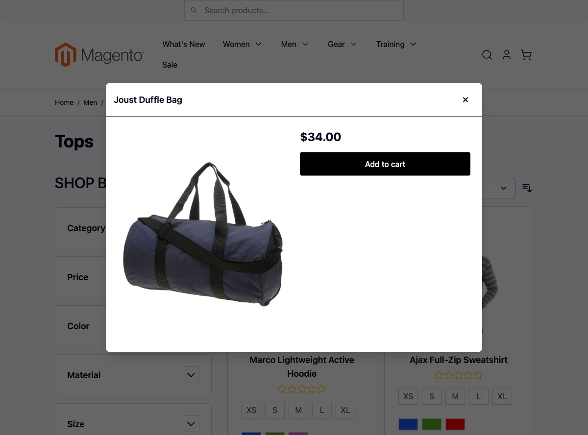
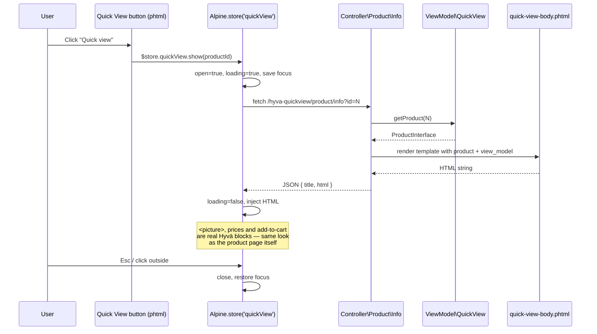

# Hyvä Quick View

AJAX quick-view modal for Magento 2 + Hyvä. One click on a product card opens a lightweight modal with image, price and add-to-cart — no full page reload, no jQuery, no RequireJS, no KnockoutJS.

Built as a complete Magento 2 module: routed PHP controller returning JSON, dedicated ViewModel for presentation logic, Hyvä-style `.phtml` templates, and an Alpine.js modal driven by a global `$store`.

## Why this exists

Quick view is well-trodden ground — Luma had a (jQuery-heavy) one, and community modules like `siteation/magento2-hyva-quick-view` already cover the Hyvä side. This module is in the portfolio for one reason: **to walk through a full Magento 2 + Hyvä request lifecycle** end-to-end, written the way I'd write it in a real project — minimal dependencies, modern PHP, declarative wiring, accessible UI.

## What's interesting (and what's just baseline)

| Choice | Why | Honest classification |
|---|---|---|
| Controller returns **rendered HTML** in JSON, not raw fields | Avoids duplicating Magento's price/swatch/stock rendering on the client — server is the single source of truth for display | Architectural — saves real maintenance |
| Alpine `$store` instead of `x-data` on the modal | Any button anywhere on the page can call `$store.quickView.show(id)` — one modal serves the whole page | Standard Hyvä pattern, but correct application |
| ViewModel implements `ArgumentInterface`, injected via layout XML `<arguments>` | The declarative Magento convention — no constructor wiring noise in templates | Baseline Magento |
| `HttpGetActionInterface` directly, no `extends Action` | Magento 2.4+ modern controller style — explicit method intent | Modern, not novel |
| Focus trap + `Esc` close + `aria-modal` + restored focus | Baseline a11y — nothing fancy, just done right | Baseline (often skipped) |

## Live in the demo storefront



Modal opens with a real Magento product (Joust Duffle Bag, id=1 from sample data) — the body HTML is rendered server-side by `Controller\Product\Info` using the actual Hyvä-themed `quick-view-body.phtml`, so prices/images/CTAs match the rest of the storefront.

## Architecture



## UI preview

```text
 ┌────────────────────────────────────────────────────────┐
 │                                                        │
 │   ╔══════════════════════════════════════════╗  [x]   │
 │   ║                                          ║         │
 │   ║   ┌──────────┐   Product name            ║         │
 │   ║   │          │                           ║         │
 │   ║   │  image   │   $129.00                 ║         │
 │   ║   │          │                           ║         │
 │   ║   │          │   Short description …     ║         │
 │   ║   └──────────┘                           ║         │
 │   ║                                          ║         │
 │   ║                  [ Add to cart ]         ║         │
 │   ║                                          ║         │
 │   ╚══════════════════════════════════════════╝         │
 │                                                        │
 │           (dimmed page behind, scroll locked)          │
 └────────────────────────────────────────────────────────┘
```

A screenshot from a live install belongs here — left as a TODO until a demo storefront is set up.

## What gets shipped

```
src/
├── registration.php              # Magento module entry
├── composer.json                 # type: magento2-module
├── etc/
│   ├── module.xml                # depends on Magento_Catalog + Hyva_Theme
│   └── frontend/routes.xml       # /hyva-quickview frontName
├── Controller/Product/
│   └── Info.php                  # JSON action — fetch product, render body, return
├── ViewModel/
│   └── QuickView.php             # presentation logic — price formatting, urls
└── view/frontend/
    ├── layout/
    │   ├── default.xml           # always-injected modal shell + ViewModel argument
    │   └── catalog_category_view.xml  # button on every product card
    └── templates/
        ├── modal/
        │   ├── quick-view.phtml       # modal shell, Alpine store, focus trap
        │   └── quick-view-body.phtml  # rendered by controller per request
        └── product/list/
            └── quick-view-button.phtml
```

## Install

```bash
composer require scr1be/hyva-quick-view
bin/magento module:enable Scr1be_HyvaQuickView
bin/magento setup:upgrade
bin/magento setup:di:compile
cd app/design/frontend/<Vendor>/<theme>/web/tailwind && npm run build:prod
```

## Usage

### Auto-injection (default)

After `setup:upgrade`, every product on a category page gets a "Quick view" button in the top-right corner — see `catalog_category_view.xml`. No further wiring needed.

### Manual trigger

Anywhere in your `.phtml` templates:

```html
<button type="button"
        @click.prevent="$store.quickView.show(<?= (int) $productId ?>)">
    Quick view
</button>
```

The store is registered globally by `view/frontend/layout/default.xml` → `quick-view.phtml`, so it's available on every page.

## API reference

### Alpine store: `$store.quickView`

| Property | Type | Description |
|---|---|---|
| `open` | bool | Modal visibility |
| `loading` | bool | Spinner state during fetch |
| `title` | string | Product name shown in header |
| `html` | string | Rendered body HTML (sanitized server-side) |
| `lastFocused` | Element | Saved focus target — restored on close |

| Method | Description |
|---|---|
| `show(productId: number)` | Open modal, fetch product info |
| `close()` | Close modal, restore focus |

### PHP ViewModel: `\Scr1be\HyvaQuickView\ViewModel\QuickView`

| Method | Returns | Description |
|---|---|---|
| `getProduct(int $id)` | `ProductInterface` | Loads product via repository (throws `NoSuchEntityException`) |
| `formatPrice(ProductInterface $p)` | `string` | Currency-aware final price via `PriceHelper` |
| `getAddToCartUrl(ProductInterface $p)` | `string` | Add-to-cart URL |

## Notes on Hyvä CSP compatibility

The modal template (`modal/quick-view.phtml`) contains an inline `<script>` registering the Alpine store. On Hyvä storefronts with strict Content Security Policy, register the inline block for the nonce/hash list — typically by appending after the closing `</script>` tag:

```php
<?php
/** @var \Hyva\Theme\Model\ViewModelRegistry $viewModels */
$hyvaCsp = $viewModels->require(\Hyva\Theme\ViewModel\HyvaCsp::class);
$hyvaCsp->registerInlineScript();
?>
```

(Available via `\Hyva\Theme\Model\ViewModelRegistry` since Hyvä 1.3.4+.) The current template intentionally omits this so the module installs on stock Hyvä without forcing a `ViewModelRegistry` dependency; on CSP-strict storefronts, copy the template into your theme and add the hook.

## Compatibility

| | Version |
|---|---|
| PHP | 8.2, 8.3, 8.4 |
| Magento 2 | 2.4.6, 2.4.7, 2.4.8 |
| Hyvä Theme | 1.3.x, 1.4.x |
| Alpine.js | 3.x |
| Browsers | Last 2 versions of Chrome, Firefox, Safari, Edge |

## Troubleshooting

**Button doesn't show on category page** → `catalog_category_view.xml` extends `category.products.list`. If you use a custom category template, copy that layout override into your theme.

**Modal opens but renders nothing** → check the network panel for the `/hyva-quickview/product/info?id=…` response. A 404 means the product is disabled, out of stock or scoped to a different store view.

**`setup:di:compile` fails** → make sure `Magento_Catalog` is enabled before this module (handled by `<sequence>` in `module.xml`, but verify in `app/etc/config.php`).

## License

MIT — see [LICENSE](LICENSE).
