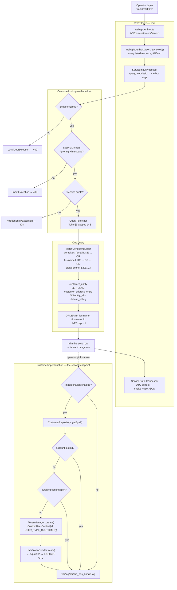

# POS Bridge

A shopper walks up to a till in a shop that also sells online. They want the price their account is
entitled to, the addresses already on file, and the order to land in the same history as everything
they have bought on the website. The person behind the counter has a terminal, a keyboard, and
whatever the shopper says out loud — a first name, a surname that might be the one on the card rather
than the one on the account, an email, or seven digits of a phone number.

Magento can already do all of the second half. `POST /V1/carts/mine`, `PUT
/V1/carts/mine/items`, `POST /V1/carts/mine/payment-information` — every one of them works for a
customer, given a customer token. What it has no answer for is the first half: turning "Jane, I think
Smith, or maybe that's her married name" into a customer id, and then turning a customer id into a
credential a terminal can transact with without knowing the shopper's password.

Two endpoints, then. One that finds people the way people are described, and one that hands back a
real customer token so everything already built for shoppers keeps working unchanged.

| Part | What it covers |
|---|---|
| `Api\CustomerLookupInterface` · `Api\CustomerImpersonationInterface` | The two service contracts, named in `webapi.xml` and nowhere bound to REST |
| `Model\Search\QueryTokenizer` · `Model\Search\Token` | The search grammar — pure, no database, no configuration |
| `Model\Search\MatchConditionBuilder` | One token → one parenthesised SQL condition, escaping delegated to core |
| `Model\ResourceModel\CustomerMatchQuery` | The one query: two tables, nine columns, one round trip |
| `Model\CustomerLookup` | The decision ladder, the cap, and the mapping onto the response contract |
| `Model\CustomerImpersonation` | The guards a password check would have applied, and core's token framework |
| `Model\ImpersonationLog` | Who acted as whom, from where, in a file of its own |

## Why this exists

The interesting half is not the token. It is the search, and specifically the mismatch between how
Magento indexes customers and how a human being identifies one.

Core's `GET /V1/customers/search` takes `searchCriteria` — filter groups, fields, conditions. It is
an excellent tool for a program that already knows what it is looking for: "customers created after
this date, in this group, on this website". It is close to useless for a person who has been handed
three words and has to decide which of them is a first name.

What an operator actually types is an unordered bag of fragments, some of which are names, some of
which are digits, and any of which might belong to a *different field than the one the shopper thinks
it belongs to* — the surname they gave you is on the card, and the account was opened under a maiden
name. The rule that matches that behaviour is not "field X contains Y". It is:

> **every word must appear somewhere, and the somewheres do not have to be the same.**

That is one line to state and a specific shape in SQL — an AND of ORs — and it is the whole reason
this module has a hand-built query rather than a `SearchCriteria` translation layer.

## What's interesting (and what's just baseline)

| Choice | Why | Honest classification |
|---|---|---|
| AND across words, OR across columns | Matches how a person is described rather than how a record is stored. `jane smith` finds a `Jane Doe` whose card says `Smith` — the case a per-field search gets wrong and looks correct doing | The actual insight |
| A hand-built two-table `Select`, not the customer collection | Everything needed is a static column on `customer_entity` or `customer_address_entity`. Going through `CustomerRepositoryInterface::getList()` would buy seven joins this screen does not use and a hydrated data model per row | Architectural, and measured in joins |
| The phone branch only fires for terms of 3+ **digits** | Stripping separators from the stored number makes that half of the condition unindexable. Gating it on digit count, not term length, is what keeps `Apartment-4B-2` out of it | Architectural, and the cost is stated rather than hidden |
| `escapeLikeValue()` is called, not reimplemented | A hand-rolled LIKE escape looks right for years and then lets someone search for `%` and receive the customer table | Baseline, and routinely skipped |
| `has_more`, not a total count | One over-fetched row instead of a second `COUNT` over the same join. A till queue is not paginated: the answer to "too many" is another word, not page 2 | Opinionated, and cheap |
| The response is a purpose-built DTO, not `CustomerInterface` | A match list is a disambiguation aid. Returning the customer object would put date of birth, tax number and every custom attribute on a device that lives on a shop counter | Architectural, and a privacy decision |
| Impersonation mints a **core** customer token | Every existing validator, revocation path and customer endpoint already understands it. A bespoke token would have needed all of that reimplemented and would rot first | Baseline done deliberately |
| Locked and unconfirmed accounts are refused | The endpoint skips the password, so it inherits everything the password check was enforcing. Without these two it is a documented way around the lockout policy | The decision an impersonation endpoint cannot omit |
| The expiry is read back out of the minted token | Recomputing it from the TTL setting means holding a second copy of core's expiry rule, and a copy that drifts reports a lifetime the token does not have | Easy to get wrong invisibly |
| Two ACL resources per route, not one | Looking a shopper up is reading; acting as them is writing. A shop that wants the first on every terminal and the second only at the service desk needs two ticks | Architectural |
| Both switches default to **off** | Enabling a module is not the same decision as opening a customer-search endpoint on an installation | Baseline, and often the opposite |

## Architecture



### 1. The search grammar

Three rules, and all three live in classes with no database in them.

**Words are AND-ed, columns are OR-ed.** Each whitespace-separated term becomes one parenthesised
group of `LIKE` alternatives, and the groups are added as separate `Select::where()` calls, which
Zend's builder joins with `AND`. The parentheses are not cosmetic: without them the outer `AND` would
bind tighter than the inner `OR`s and a two-word search would quietly return everything matching the
last word. That is the failure mode that produces a bug report reading "search works, but sometimes
returns the whole shop".

**Which columns.** Account `email`, `firstname`, `lastname`; default-billing `firstname`, `lastname`.
`middlename` is deliberately absent from both sides — it is not what an operator types when they are
looking at someone, and every column widens *every* token's OR block, so the cost is paid on every
search for a field that is empty on almost every row.

**Terms are capped at eight, and the surplus is dropped rather than rejected.** Each term is another
AND-ed block, so an unbounded term count is an unbounded query. Dropping the tail only removes
restrictions, which makes the result a superset — the operator gets a slightly wider list and picks
from it. A validation error in front of someone holding a card reader is a dead end.

The minimum query length is three characters, counted **after** whitespace is removed. `"a b"` is
three characters of raw string and two one-letter terms; accepting it because the string is long
enough would defeat the rule it exists to enforce.

### 2. Why the query is hand-built

This is the decision a reviewer should push on, so here is the whole reasoning.

Everything the search reads is a plain column. `customer_entity` carries `email`, `firstname`,
`lastname`, `website_id`, `group_id` and `default_billing` as real columns; `customer_address_entity`
carries `firstname`, `lastname` and `telephone` the same way. Neither of them lives in an EAV value
table on a stock install.

`CustomerRepositoryInterface::getList()` does not know that, or rather it knows more than that: it
calls `addNameToSelect()` and then joins billing `postcode`, `city`, `telephone`, `region`,
`country_id` and `company` as six separate attribute joins, because its contract is "any filter a
caller might express". Then it hydrates a full customer data model per row. This screen shows four
fields, filters on five columns, and still would not have got what it needed — core's `getList()`
does not join billing *name*, which is exactly the column the "surname on the card" case depends on.

So: one `LEFT JOIN`, nine selected columns, one round trip. The join is against the **default**
billing address specifically. Joining every address a customer owns would multiply rows, need a
`DISTINCT`, and let a search succeed against an address the shop has no reason to consider current.
The consequence is stated rather than hidden: a customer with no default billing address is findable
by account name and email, and not by the name or number on an address they never made default.

### 3. The phone rule

`(555) 229-3326` is how a phone number gets typed into an address book. `2293326` is how it gets read
out at a counter. Neither `LIKE` finds the other, so the stored value has its separators stripped
before comparison — a nest of `REPLACE()` calls over a named list of characters (space, dash, both
parentheses, dot, plus, slash, tab).

`REPLACE` rather than `REGEXP_REPLACE` because the latter is a MySQL 8 / MariaDB 10.0 function and
the former is not; the nested form runs anywhere the rest of the module does.

Wrapping a column in an expression makes that comparison unindexable, and that is a real cost. It is
why the branch is gated on the token containing **three or more digits** rather than on the token's
length, why the result set is capped, and why this endpoint sits behind an admin ACL instead of being
exposed to shoppers. `Apartment-4B-2` holds two digits and never reaches the telephone expression;
`(555)` holds three and does.

### 4. The cap, and why it is not pagination

The query fetches `limit + 1` rows. If that extra row arrives, it is dropped and `has_more` comes
back `true`.

There is no page number and no total count, and that is a product decision rather than a shortcut. A
queue at a till is not paginated. An operator faced with "more than twenty matches" does not page
through the customer table; they ask for a surname, or the last four digits. `has_more` is the signal
that asking is worth it, and it costs one row rather than a second `COUNT` over the same join.

The configured cap is clamped to 1–100 in PHP regardless of what is stored. It is the only thing
between a three-letter query and a response carrying the customer table, so it is not something a
typo in `core_config_data` gets to switch off.

Because there is a `LIMIT`, there is an `ORDER BY`: surname, then first name, then entity id. Without
one, two identical searches can disagree about which rows they cut, which is the kind of bug that
gets reported as "it found her yesterday".

### 5. Impersonation, and why it uses core's token framework

`Magento\Integration\Api\TokenManager` is the composition core's own
`CustomerTokenService::createCustomerAccessToken()` uses after it has verified a password: it pairs
`UserTokenIssuerInterface` with a `UserTokenParameters` instance and calls `create()` with a
`CustomUserContext` carrying the customer id and `USER_TYPE_CUSTOMER`. On a stock 2.4.8 install
`Magento_JwtUserToken`'s `di.xml` binds that interface to `Magento\JwtUserToken\Model\Issuer`, which
writes `uid`, `utypid`, `iat` and an `exp` derived from the customer TTL.

This module calls the same seam with the same context. The result is therefore not "a token like the
one a login produces" — it is the same token, and every validator, every revocation path and every
customer endpoint already understands it. A bespoke credential would have needed all of that
reimplemented, and would have been the first thing to rot.

The expiry is reported by reading the minted token back through `UserTokenReaderInterface` and taking
the `exp` claim. The alternative — recomputing it from the customer TTL setting, its fallback and its
unit — is a second copy of core's expiry rule, and a copy that drifts reports a lifetime the token
does not have.

What that read costs is worth being exact about, because the obvious assumption is wrong.
`UserTokenReaderInterface` is bound to `Magento\Integration\Model\CompositeTokenReader`, which tries
each configured reader in turn and returns the first that succeeds. A stock install configures
**two**: `Magento\Integration\Model\OpaqueToken\Reader` from `Magento_Integration` and
`Magento\JwtUserToken\Model\Reader`. The opaque reader loads a row from the token table and throws
when it finds none — so reading a JWT back is not free, and can cost one indexed lookup before the
JWT reader answers. It is a small fixed price paid once per issued token, and what it buys is an
expiry taken off the credential instead of re-derived beside it.

The read is also not a validity check. The JWT reader verifies the signature and requires `uid`,
`utypid`, `iat` and `exp` to be present; **expiry and revocation are checked by separate validators**
(`ExpirationValidator` and, from `Magento_JwtUserToken`, `RevokedValidator`, both wired into
`CompositeUserTokenValidator`) which run when a token is *used*. So a failure here means the token
could not be parsed at all, which is why the module treats it as a failure to issue rather than as a
refusal.

### 6. The guards a password check would have applied

The one thing this endpoint skips is the password. Everything the password check was implicitly
enforcing therefore has to be enforced here instead, or the bridge becomes the documented way around
it.

- **Locked accounts.** `Magento\Customer\Model\AuthenticationInterface::isLocked()`. An account that
  core has locked out after failed logins must not be reachable through a side door that never asks
  for a password in the first place.
- **Accounts awaiting confirmation.** `AccountManagementInterface::getConfirmationStatus()`, refused
  only on `ACCOUNT_CONFIRMATION_REQUIRED`. The third status —
  `ACCOUNT_CONFIRMATION_NOT_REQUIRED`, returned on installations that do not require confirmation at
  all — is not a refusal, and conflating the two would break impersonation everywhere confirmation is
  switched off.

Both refusals carry the same neutral message. There is no attacker to leak account state to behind an
admin ACL, but a message naming the reason is a message an operator will read out across a counter,
and neither reason is the shopper's business. The reason goes to the log instead, where it belongs.

### 7. What "never anonymous" actually costs

Both routes list two ACL resources, and core's `Webapi\Authorization::isAllowed()` requires **all**
of them — it returns false on the first resource the consumer lacks. So:

- `Magento_Customer::manage` — the resource an administrator already uses to decide who may see and
  edit customers, which is where a permission to read every customer's phone number belongs.
- `Scr1be_PosBridge::terminal` on the lookup, `Scr1be_PosBridge::impersonate` on the token route —
  the module's own resources, nested under `Magento_Customer::manage`, which is what makes the two
  endpoints separately revocable.

The consequence is deliberate and worth knowing before the first deploy: **installing this module
grants nothing to an integration that already existed.** Its role has to be re-saved with the new
resources ticked before either endpoint answers anything but a 401. Deny-by-default is the right side
to fail on for an endpoint that mints customer credentials, but it does look like a broken install if
you are not expecting it.

The token route is additionally declared `secure="true"`, so core refuses it over plain HTTP. It
hands back a bearer credential for a real shopper; one that crossed the wire in clear is one to treat
as already leaked. Note that "secure" here means `Request::isSecure()`, which is satisfied either by
a direct HTTPS connection or by the configured SSL-offload header (`web/secure/offloader_header`,
`X-Forwarded-Proto` by default) — so a terminal behind a TLS-terminating proxy works, provided that
header is configured. The lookup route is deliberately *not* marked secure, so a terminal on a
hardened internal network can be brought up before TLS is terminated in front of it.

## Design decisions

- **A custom base path, `/V1/pos/`.** Core already owns `GET /V1/customers/search` and answers a
  different question with different semantics. Hanging a second, looser search off the same noun
  leaves two endpoints whose names promise the same thing and whose results differ — an ambiguity an
  integrator discovers at the till. `/V1` is kept because it is what clients and Magento's own schema
  grouping expect; the REST router compares path segments literally and would have matched anything.
- **Configuration is read at default scope only.** A REST call arrives at `/rest/<store>/…`, and a
  terminal that is not told otherwise sends `/rest/all/…`, which resolves to the admin store. A
  store-scoped switch would be one an integrator could set, see saved, and never see take effect.
- **The lookup takes free text, not structured fields.** A terminal's only input is what the operator
  types. Splitting it into `firstName` / `lastName` / `phone` would move the parsing problem out of
  this module and into every terminal that talks to it, and each of them would solve it differently.
- **Impersonation gets its own log file.** `var/log/scr1be_pos_bridge.log`, wired as a virtual type in
  `di.xml`. The question "who transacted as this shopper, and when" has to be answerable months later
  by someone who is not looking at Magento; interleaved with cron warnings in `system.log`, it is a
  trail nobody follows. Refusals are recorded too — a run of them is the shape a stolen terminal
  credential makes, and it is invisible if only successes are written down.
- **No customer-side session is created.** The token *is* the session, as far as the web API is
  concerned. Nothing here touches `Magento\Customer\Model\Session`, so there is no frontend session to
  leak, expire or clean up, and the terminal's access ends exactly when the token does.
- **No revocation endpoint.** Core already publishes one:
  `POST /V1/integration/customer/revoke-customer-token`, whose ACL resource is `self` and whose
  `customerId` is forced from the calling token, so a shopper revokes their own. On the admin side
  the customer edit page carries a **Force Sign-In** button, gated on core's own
  `Magento_Customer::invalidate_tokens` resource, which revokes that customer's tokens. Shipping a
  third way to revoke would mean a merchant has to know which of three to use.
- **The search reports no total.** See section 4 — but the honest summary is that a total is a second
  query for a number nobody at a till acts on.

## What gets shipped

```
src/
├── registration.php
├── composer.json                                    # scr1be/pos-bridge
├── etc/
│   ├── module.xml
│   ├── di.xml                                       # contracts, DTO preferences, audit logger
│   ├── webapi.xml                                   # the two routes, ACL refs, secure flag
│   ├── acl.xml                                      # two resources under Magento_Customer::manage
│   ├── config.xml                                   # defaults — both switches off
│   └── adminhtml/system.xml                         # default scope only
├── Api/
│   ├── CustomerLookupInterface.php
│   ├── CustomerImpersonationInterface.php
│   └── Data/
│       ├── CustomerMatchInterface.php
│       ├── CustomerSearchResultInterface.php
│       └── ImpersonationTokenInterface.php
├── Model/
│   ├── Config.php                                   # switches + the clamped result cap
│   ├── CustomerLookup.php                           # the ladder, the trim, the mapping
│   ├── CustomerImpersonation.php                    # the guards + core's token framework
│   ├── ImpersonationLog.php                         # who acted as whom, from where
│   ├── Data/                                        # three immutable value objects
│   ├── Search/
│   │   ├── QueryTokenizer.php                       # free text → Token[], pure
│   │   ├── Token.php                                # term + digit form, pure
│   │   ├── CustomerColumns.php                      # the shared vocabulary of aliases and row keys
│   │   └── MatchConditionBuilder.php                # one token → one SQL condition
│   └── ResourceModel/
│       └── CustomerMatchQuery.php                   # two tables, nine columns, one round trip
├── i18n/en_US.csv
└── Test/Unit/                                       # 7 PHPUnit classes
```

## Install

```bash
# from your Magento 2 root
composer config repositories.scr1be path /path/to/Magento/pos-bridge/src
composer require scr1be/pos-bridge:@dev
bin/magento module:enable Scr1be_PosBridge
bin/magento setup:upgrade
bin/magento setup:di:compile
```

No schema and no data patches — the module adds no columns, no attributes and no tables. It reads
two of core's own tables and calls core's token framework.

Then, before anything answers:

1. **Stores → Configuration → scr1be → POS Bridge** → *Enable the POS bridge* → **Yes** (and *Allow
   acting as a customer* → **Yes** if you want the second endpoint). Both are off by default.
2. **System → Integrations** (or **System → User Roles** for an admin-token client) → the role your
   terminal authenticates as → **Resources** → tick **Customers → All Customers → POS Bridge:
   customer lookup**, and its child **POS Bridge: act as customer** if impersonation is wanted → save
   and re-activate the integration. Existing integrations are *not* granted the new resources
   automatically; see section 7.
3. Flush the config cache.

## Configuration

**Stores → Configuration → scr1be → POS Bridge**

| Setting | Scope | Default | Notes |
|---|---|---|---|
| Enable the POS bridge | default | No | Master switch for both endpoints. Off, every call is refused before the query is looked at |
| Allow acting as a customer | default | No | The impersonation endpoint alone. Off leaves the lookup working — the right setting for a shop that wants terminals to find shoppers but wants act-as-customer to stay a service-desk operation |
| Maximum matches returned | default | 20 | A safety cap, not a page size. Clamped to 1–100 in PHP whatever is stored |

## API reference

Both routes live under `/rest/<store>/V1/pos/`. Field names in the responses are what core's
`DataObjectProcessor` derives from the DTO getters — `getBillingTelephone()` becomes
`billing_telephone`. Getters that return `null` are omitted from the JSON entirely.

### `GET /V1/pos/customers/search`

ACL: `Magento_Customer::manage` **and** `Scr1be_PosBridge::terminal`.

| Parameter | Type | Required | Notes |
|---|---|---|---|
| `query` | string | yes | Whitespace-separated terms. Minimum three characters ignoring whitespace; at most eight terms are used |
| `websiteId` | int | no | Restrict to one website. Also accepted as `website_id` |

```json
{
  "items": [
    {
      "customer_id": 1,
      "name": "Veronica Costello",
      "email": "roni_cost@example.com",
      "billing_name": "Veronica Costello",
      "billing_telephone": "(555) 229-3326",
      "website_id": 1,
      "group_id": 1
    }
  ],
  "has_more": false
}
```

| Situation | Status |
|---|---|
| The caller lacks either ACL resource | 401 |
| The bridge is switched off | 400 |
| Fewer than three characters | 400 |
| `websiteId` names no website | 404 |
| Nothing matched | 200, `items: []` |

### `POST /V1/pos/customers/:customerId/impersonation-token`

ACL: `Magento_Customer::manage` **and** `Scr1be_PosBridge::impersonate`. HTTPS only.

```json
{
  "customer_id": 1,
  "token": "eyJhbGciOiJIUzI1NiJ9…",
  "expires_at": "2026-08-13T21:30:00+00:00"
}
```

| Situation | Status |
|---|---|
| The caller lacks either ACL resource | 401 |
| Called over plain HTTP | 400, `Operation allowed only in HTTPS` |
| Impersonation is switched off | 400 |
| No such customer | 404 |
| The account is locked, or awaiting confirmation | 400 |

Send the returned token as `Authorization: Bearer <token>` on any customer endpoint.

## Demo notes

On a stock **Magento 2.4.8 + Hyvä 1.4 + Luma sample data** storefront. Worth knowing before you
start: Luma's customer fixture ships exactly **one** customer — Veronica Costello,
`roni_cost@example.com`, phone `(555) 229-3326`, in Calder, Michigan. That is enough to demonstrate
every matching rule, and step 6 creates a second customer so the disambiguation behaviour has
something to disambiguate.

Set up a shell first. The bridge authenticates as an admin, so an admin token is the quickest way in
(an integration token works identically, and is what a real terminal would hold):

```bash
BASE=https://magento.test/rest/all
TOKEN=$(curl -s -X POST "$BASE/V1/integration/admin/token" \
  -H 'Content-Type: application/json' \
  -d '{"username":"admin","password":"…"}' | tr -d '"')
```

1. **It is off, and says so.** Before touching the configuration:

   ```bash
   curl -s "$BASE/V1/pos/customers/search?query=roni" -H "Authorization: Bearer $TOKEN"
   ```

   → `The POS bridge is switched off.` Enable it (Stores → Configuration → scr1be → POS Bridge) and
   flush the config cache.

2. **It is also not yours yet.** If the same call now returns *"The consumer isn't authorized to
   access Magento_Customer::manage, Scr1be_PosBridge::terminal"*, the admin role has not been re-saved
   with the new resources. System → User Roles → Administrators → Role Resources → tick **POS Bridge:
   customer lookup** → Save. This is section 7 in practice.

3. **Find her by email fragment.**

   ```bash
   curl -s "$BASE/V1/pos/customers/search?query=roni" -H "Authorization: Bearer $TOKEN"
   ```

   One item: `customer_id: 1`, `name: "Veronica Costello"`, `has_more: false`.

4. **Find her by phone, the way it is read out.** The stored number is `(555) 229-3326`; nobody says
   the parentheses:

   ```bash
   curl -s --get "$BASE/V1/pos/customers/search" --data-urlencode 'query=2293326' \
     -H "Authorization: Bearer $TOKEN"
   ```

   Same row. This is the `REPLACE()` nest doing its job — a plain `LIKE '%2293326%'` against
   `telephone` finds nothing.

5. **Two words, two different columns.**

   ```bash
   curl -s --get "$BASE/V1/pos/customers/search" --data-urlencode 'query=veronica 3326' \
     -H "Authorization: Bearer $TOKEN"
   ```

   `veronica` matches the first name, `3326` matches the stripped phone. Neither term matches both
   columns, and the row still comes back — that is the AND-of-ORs. Now try
   `query=veronica 9999`: nothing, because *every* term has to find a home.

6. **The case a per-field search gets wrong.** In the admin, create a second customer: first name
   `Jane`, last name `Doe`, any email — then give her a default billing address with last name
   `Smith`. Search `query=jane smith`. She comes back, because `jane` matched the account first name
   and `smith` matched the billing surname. A search that required both words in the same field would
   have found nobody, which is precisely the shopper who says "it's under my maiden name".

7. **Too short is refused, not answered.** `query=ro` → 400 with *"Enter at least 3 characters to look
   up a customer."* `query=r o` is refused too: whitespace does not buy length.

8. **The cap and `has_more`.** Set *Maximum matches returned* to `1`, flush the config cache, and
   search for something both customers match — `query=a` is too short, so use `query=example.com` if
   both emails share the domain. One item, `has_more: true`. Set it back to 20 and the flag goes
   false.

9. **Website scoping.** `?query=roni&websiteId=1` returns her; `?query=roni&websiteId=99` returns a
   404 rather than an empty list, because an empty list reads as "no such customer" and an operator
   told that stops looking.

10. **Impersonate her.** Turn *Allow acting as a customer* on, tick **POS Bridge: act as customer** on
    the role, flush the config cache, then:

    ```bash
    CUSTOMER_TOKEN=$(curl -s -X POST "$BASE/V1/pos/customers/1/impersonation-token" \
      -H "Authorization: Bearer $TOKEN" -H 'Content-Type: application/json' -d '{}' \
      | php -r 'echo json_decode(stream_get_contents(STDIN))->token;')
    ```

    The response also carries `expires_at`. Compare it with **Stores → Configuration → Services →
    OAuth → Access Token Expiration → Customer Token Lifetime (minutes)**: change that value, mint
    another token, and the reported expiry moves with it — because it is read out of the token, not
    computed here.

11. **The token is an ordinary customer token.** Nothing in this module is involved from here on:

    ```bash
    curl -s "$BASE/V1/customers/me" -H "Authorization: Bearer $CUSTOMER_TOKEN"
    curl -s -X POST "$BASE/V1/carts/mine" -H "Authorization: Bearer $CUSTOMER_TOKEN"
    ```

    Her account, her cart, her order history. That is the whole argument for minting a core token
    rather than inventing one.

12. **HTTPS only.** Repeat step 10 against an `http://` base URL: *"Operation allowed only in HTTPS"*.
    Behind a TLS-terminating proxy this depends on `web/secure/offloader_header` being configured —
    which is the same setting that makes secure cookies work, so a storefront that is fine will be
    fine here too.

13. **The refusals.** Lock the account (fail the storefront login enough times, or set
    `customer_entity.lock_expires` to a future timestamp) and repeat step 10: *"This account cannot be
    used right now."* Then `tail -f var/log/scr1be_pos_bridge.log` and repeat once more — the line
    carries `customer_id`, `acting_user_id`, `acting_user_type`, `ip` and the real reason, which the
    HTTP response deliberately does not.

14. **The kill-switches.** *Allow acting as a customer* → No leaves the lookup working and refuses the
    token route. *Enable the POS bridge* → No closes both, and the refusal happens before the query is
    parsed — `query=x` and `query=veronica` fail identically.

## Tests

```bash
# from your Magento 2 root — path follows the install method above (Composer path repository)
vendor/bin/phpunit -c dev/tests/unit/phpunit.xml.dist vendor/scr1be/pos-bridge/Test/Unit

# …or, if you copied the module into app/code instead:
vendor/bin/phpunit -c dev/tests/unit/phpunit.xml.dist app/code/Scr1be/PosBridge/Test/Unit
```

Seven classes, aimed at the parts that can be wrong without looking wrong:

- **`QueryTokenizerTest` / `TokenTest`** — the grammar, where the bugs would be silent. Whitespace
  runs, the non-breaking space that arrives with every pasted phone number, the surplus-term cap, the
  digit threshold counting *digits* rather than characters, and the length rule refusing to count
  padding. The non-breaking space is normalised explicitly rather than left to `\s`: PHP's `/u`
  modifier enables Unicode properties, so `\s` does match U+00A0, but that is a property of the regex
  engine rather than of this module's rules — and the split and the length check have to agree on
  what a separator is.
- **`MatchConditionBuilderTest`** — the seam against the database layer. That a text token consults
  every text column and *only* those, that the group is parenthesised, that a long-enough digit run
  adds exactly one more alternative, that the telephone expression strips each separator once, and
  that escaping is delegated to core rather than improvised. The last one is the test that matters: if
  it is ever replaced by string concatenation, searching for `%` returns the customer table.
- **`CustomerMatchQueryTest`** — the assembly rather than the SQL text. One `WHERE` per token, the
  website filter added only when asked for (and website `0` counting as asked-for), the cap
  over-fetched by exactly one row, and an `ORDER BY` existing at all.
- **`CustomerLookupTest`** — the ladder in order, including that a switched-off bridge refuses
  *before* it validates the query; the trim of the over-fetched row; and the null-handling for a
  customer with no default billing address.
- **`CustomerImpersonationTest`** — that the minted context carries `USER_TYPE_CUSTOMER` and not
  something else, that the expiry is normalised to UTC from whatever the token carries, all four
  refusals, and that `ACCOUNT_CONFIRMATION_NOT_REQUIRED` is *not* one of them.
- **`ImpersonationLogTest`** — the audit line's field set, which is a contract with whoever reads the
  file six months later.

The tokenizer is used for real inside `CustomerLookupTest` rather than stubbed: it is pure, it has its
own test, and stubbing it would mean asserting the ladder against a splitting rule the module does not
use. `webapi.xml`, `acl.xml` and `di.xml` are configuration — they are covered by the walkthrough
above, not by mocks.

## Compatibility

| | Version |
|---|---|
| PHP | 8.2, 8.3, 8.4 |
| Magento 2 | 2.4.6, 2.4.7, 2.4.8 |
| Hyvä Theme | not required — this module has no storefront surface |
| Database | MySQL and MariaDB. The phone match uses `REPLACE()` rather than `REGEXP_REPLACE()` specifically to avoid a version floor |

Impersonation depends on `Magento_Integration`'s token framework and, for a JWT, on
`Magento_JwtUserToken` being enabled — which it is on a stock install, and which is what binds
`UserTokenIssuerInterface`. Nothing in this module assumes the token is a JWT: it asks
`TokenManager` for a token and asks the reader when it expires, so an installation that has bound a
different issuer keeps working.

Written for Magento Open Source. Nothing here touches an entity's link field, so the Commerce staging
caveat that applies to catalog modules does not apply to this one.

## License

MIT — see [LICENSE](LICENSE).
