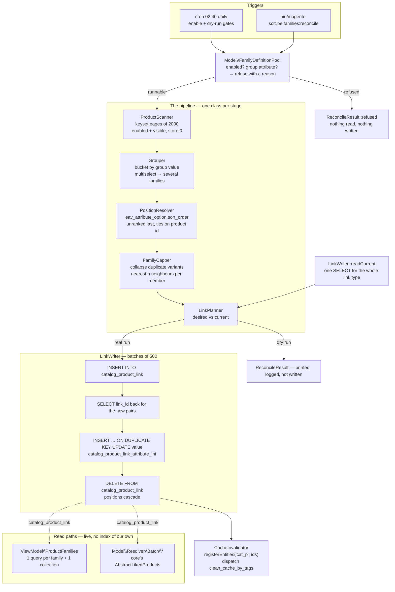

# Product Families

"This jacket also comes in navy" is a sentence a catalogue already knows how to say. The colour is on
the product, the style is on the product, the size is on the product — and yet the usual way to get
that row onto a product page is for somebody to open each of eleven products in the admin and add the
other ten as related products. Then a twelfth colour arrives.

This module derives the row instead. A **family** is a set of products that share the value of one
configured attribute and differ in another; every member links to its nearest neighbours in that
family, positioned by the option sort order a merchant already set; and the whole thing is rebuilt
from the catalogue by a diff that writes only what changed.

The links live in three custom `catalog_product_link` types, which means they are ordinary Magento
product links: the product page reads them, GraphQL exposes them next to `related_products`, and the
REST link-type endpoint lists them. Nothing about them is a private table.

| Part | What it covers |
|---|---|
| `Model\FamilyDefinition` | A family is two attributes — the key, and the one that orders the row |
| `Model\ResourceModel\ProductScanner` | One keyset-paginated pass over the catalogue, three columns out |
| `Model\Grouper` | Buckets, including the multiselect case where one product is in several |
| `Model\PositionResolver` | `eav_attribute_option.sort_order`, and a total order with no ties left over |
| `Model\FamilyCapper` | Duplicate variants collapsed, then the nearest *n* neighbours per member |
| `Model\LinkPlanner` | The diff: insert, re-rank, delete, and the ids whose page cache is now wrong |
| `Model\ResourceModel\LinkWriter` | Batched raw SQL, because the service contract is one statement per link |
| `Model\CacheInvalidator` | `cat_p_<id>` eviction for exactly the products that changed |
| `Setup\Patch\Data\InstallFamilyLinkTypes` | Reserved link type ids, and the collision it refuses to guess through |
| `Model\Resolver\Batch\*` | Three fields on `ProductInterface`, sharing core's batch plumbing |

## Why this exists

Three problems, in the order they bite.

**Writing product links through the service contract is one statement per link.** Look at what core
actually does. `Magento\Catalog\Model\ResourceModel\Product\Link::saveProductLinks()` reads the
product's existing links, then hands off to `prepareProductLinksData()`, which loops over the new
ones and for each link that does not already exist issues `$connection->insert()` immediately
followed by `$connection->lastInsertId()` — a round trip per link, before the position rows are
written at all. That is a perfectly reasonable shape for the admin product form, where a person is
saving one product with six related products on it. It is the wrong shape for a nightly job that
touches ten thousand products with twelve links each: the same work becomes six figures of
statements, executed one product at a time. Batched, it is 240 inserts, 20 read-back selects and 240
position upserts.

**A derived relationship that is rebuilt is a relationship that flaps.** The obvious implementation
of "rebuild the links" is `DELETE FROM catalog_product_link WHERE link_type_id = ?` followed by a
bulk insert. It is one line shorter and wrong three times over: it burns
`catalog_product_link.link_id` — an unsigned int auto-increment — once per link per night; it puts
every product in the catalogue into the page-cache invalidation set whether or not anything about it
changed; and between the delete and the insert there is a window, however short, in which a live
product page renders with no row on it at all.

**A row nobody chose the order of reads like a database dump.** Sorting a size row by product id
gives you the order the SKUs were created in. Sorting it alphabetically gives you L, M, S, XL, XS.
The only ordering in the system that a human being actually chose is the option sort order on the
attribute, and it is sitting in `eav_attribute_option.sort_order` waiting to be asked.

## What's interesting (and what's just baseline)

| Choice | Why | Honest classification |
|---|---|---|
| A family is two attributes, not one | "Other colours" needs a key that says *which* product and a variant that says *which colour*. One attribute can only express one of those, and the second is what the row is ordered by | The design decision everything else follows from |
| The cap is nearest-*n* per member, not first-*n* per family | On a coarse family key, "keep the first twelve" leaves the other four hundred members with no links at all and gives the twelve survivors an identical row | Opinionated, and the thing most implementations get wrong quietly |
| The stored position is the member's position in the family, not its rank in the window | Otherwise the same product renders at a different place in every row it appears in | Baseline, and easy to get backwards |
| Link type ids are reserved, not resolved | `AbstractLikedProducts::getLinkType()` is declared `: int`, and `LinkTypeProvider`'s di.xml argument is read before a database exists. Both want a constant | Forced by core, and the reason the patch has a collision guard |
| The install patch refuses instead of relocating | The reserved id is compiled into three GraphQL resolvers. A patch that silently moved to the next free id would leave them addressing someone else's links | The interesting half of an otherwise dull patch |
| A re-rank is an UPDATE of one integer | The link's identity did not change, only its position did. Delete-and-insert would churn the primary key and put the pair through the changelog twice | Baseline, and cheap to get wrong |
| Link ids are read back after the bulk insert | `lastInsertId()` after a multi-row insert reports the *first* row. Assuming the rest are contiguous is assuming `innodb_autoinc_lock_mode` and no concurrency | Baseline, and a real bug in the wild |
| Explicit `cat_p_<id>` invalidation despite the mview subscriptions | The link table *is* subscribed, so a scheduled installation would evict eventually — but eventually is the next index cron, and on Update on Save it is never | The section with the caveat |
| Empty variant values are never collapsed together | An empty value is "unknown", not "the same unknown". Folding them would delete the family down to one chip on any catalogue where the attribute is mostly unset | The bug the naive `array_unique` ships with |
| No JavaScript on the storefront at all | The row is a list of links decided at reconcile time. An Alpine component would add a hydration step and a frame of delay and nothing else | Opinionated |
| Nothing is configured by default | Which attribute is a family key is a fact about a catalogue, not about a module. A shipped default would cross-link a few thousand products the first time cron ran | Baseline, and the reason there is a dry-run gate |

## Architecture



### 1. Two attributes, not one

A family definition is a **group attribute** and a **variant attribute**.

The group attribute is the key: products sharing a non-empty value of it are one family. The variant
attribute is what separates them inside it, and it is the one that orders the row — positions come
from the sort order the merchant gave that attribute's options, so a size row reads XS · S · M · L
rather than in whatever order the option ids happen to fall.

One attribute cannot express both. Grouping by `color` gives you "other products that are also
black", which is a different row with a different name. Grouping by `style_general` and ordering by
`color` gives you "the same style in other colours", which is the row this module is named after.

The variant attribute is optional, and that is what the third family is. With none configured, the
family degenerates to "everything sharing the group value", ordered by product id and labelled with
product names — which is "similar products", implemented by leaving a field blank rather than by a
third code path.

`FamilyDefinitionPool` is where "enabled" turns into "runnable", and it resolves one combination
rather than letting it reach the pipeline: *one chip per variant value* with no variant attribute
would collapse every family to a single chip, so it is switched off there, once, instead of
surprising the capper later.

### 2. The window, not the first twelve

Every family has a cap, and the reading of it matters more than the number.

The obvious reading is per family: keep the first twelve members and link them to each other. On a
narrow key that is fine. On a coarse one — grouping by material, say, where a family can have four
hundred members — it means member thirteen and everything after it carries **no links at all**, and
the twelve that survived all render an identical row.

The reading used here is per source product. Every member keeps a row, and the row holds the twelve
members nearest to it *in family order*:

```php
// FamilyCapper::buildLinks()
$neighbours[] = [
    'distance' => abs($candidate['position'] - $source['position']),
    'position' => $candidate['position'],
    'id'       => $candidate['id'],
];
```

Nearest rather than first, because family order is meaningful: the neighbours of M are S and L, which
is what somebody reaching for a different size wants. Equidistant neighbours — two places below and
two above — resolve towards the lower position, so a row leans towards the start of its family
instead of depending on iteration order.

What is written as the link's position is the **linked member's position in the family**, not its
rank inside the window. That is the difference between every page rendering the family in the same
order and every page rendering its own.

### 3. Reserved link type ids, and the patch that refuses

`catalog_product_link_type.link_type_id` is an auto-increment, so a module adding a type can either
let MySQL choose and resolve the id by code at runtime, or reserve one. Core reserves:
`Magento\Catalog\Setup\Patch\Data\InstallDefaultCategories` writes its three rows with
`insertForce()` against `Magento\Catalog\Model\Product\Link::LINK_TYPE_RELATED` (1),
`LINK_TYPE_UPSELL` (4) and `LINK_TYPE_CROSSSELL` (5), then adds one `catalog_product_link_attribute`
row per type with code `position` and data type `int`.
`Magento\GroupedProduct\Setup\Patch\Data\InitializeGroupedProductLinks` reserves 3 for `super` the
same way — with `insertOnDuplicate` rather than `insertForce`, and with the same
check-before-you-write approach to its attribute rows.

Reserving is not a stylistic preference here, it is forced twice over. `AbstractLikedProducts::getLinkType()`
— the method the GraphQL resolvers implement — is declared `: int`. And the di.xml argument that
registers the aliases with `LinkTypeProvider` is an `xsi:type="const"`, which
`Magento\Framework\Data\Argument\Interpreter\Constant` resolves by calling `constant()` on the value
and nothing else. Both want a compile-time constant; neither can take a lookup.

The price of reserving is a possible collision, and that is what `InstallFamilyLinkTypes` is really
about. It checks both directions and stops rather than guessing:

- our code present under a *different* id → the module's constants would address the wrong link type
  on every GraphQL query, so the upgrade fails with the id it found;
- our id present under a *different* code → another extension reserved it first, and forcing it would
  take over that extension's links, so the upgrade fails with the code it found.

Everything is checked for presence before it is written, which is what makes re-running free — the
case that matters when a `patch_list` row is lost with a partial database restore.

The three ids are 21, 22 and 23: clear of core's 1, 3, 4 and 5, and a unit test asserts they stay
that way.

### 4. Three statements per batch instead of one per link

`LinkWriter` is the only class in the module that writes, and it takes a whole plan at a time:

```sql
INSERT INTO catalog_product_link (product_id, linked_product_id, link_type_id) VALUES …;   -- 500 rows

SELECT link_id, product_id, linked_product_id
FROM catalog_product_link
WHERE link_type_id = ? AND product_id IN (…);                                              -- read back

INSERT INTO catalog_product_link_attribute_int (product_link_attribute_id, link_id, value)
VALUES … ON DUPLICATE KEY UPDATE value = …;               -- insertOnDuplicate(…, ['value']), 500 rows

DELETE FROM catalog_product_link WHERE link_id IN (…);                                     -- 500 ids
```

The read-back is the part that looks removable and is not. `lastInsertId()` after a multi-row insert
reports the id of the **first** row; treating the rest as contiguous means assuming
`innodb_autoinc_lock_mode` is 0 or 1 *and* that nothing else is inserting into the table at the same
time. One indexed SELECT per batch of product ids is cheaper than being wrong about that.

The upsert leans on a key that is already there: `catalog_product_link_attribute_int` carries a
unique constraint over `(product_link_attribute_id, link_id)`, so `ON DUPLICATE KEY UPDATE value`
corrects a position in place instead of growing a second value row for the same link.

The delete touches only the link table. `catalog_product_link_attribute_int`'s foreign key on
`link_id` is declared `onDelete="CASCADE"` in `Magento_Catalog`'s `db_schema.xml`, so the position
rows go with them — a second delete here would be dead code that looked load-bearing.

Deletes run last on purpose: the position upsert must not be able to address a link that has already
been removed.

### 5. The diff, and why nothing is wiped

`LinkPlanner` compares two arrays of the same shape — what the catalogue implies, and what
`readCurrent()` found — and produces three lists:

- **insert**: pairs the catalogue wants and the table does not have;
- **update**: pairs in both whose position differs, keyed by the `link_id` that already exists;
- **delete**: pairs the table has and the catalogue no longer wants, including every link belonging
  to a product that left its families entirely.

Everything else is counted as unchanged and generates no statement. That is the property the nightly
schedule stands on: a second run over an unchanged catalogue writes nothing, invalidates nothing, and
finishes in the time it takes to scan.

It is also why `PositionResolver` goes to the trouble of being *total* — unranked members after
ranked ones, every tie broken on product id. If two runs over identical data could produce different
positions, every night would be a full re-rank of the catalogue and a full page-cache eviction with
it.

### 6. The cache, and the five changelogs

Writing `catalog_product_link` behind the repository's back means owing the system whatever the
repository would have done about the cache. It is worth being precise about what is already handled.

The link table is not unwatched. Five views subscribe to it with `entity_column="product_id"`:

| View | Declared in |
|---|---|
| `catalog_product_price` | `Magento_Catalog/etc/mview.xml` |
| `catalog_product_attribute` | `Magento_Catalog/etc/mview.xml` |
| `catalogsearch_fulltext` | `Magento_CatalogSearch/etc/mview.xml` |
| `cataloginventory_stock` | `Magento_CatalogInventory/etc/mview.xml` |
| `catalogrule_product` | `Magento_CatalogRule/etc/mview.xml` |

So under Update on Schedule the write does reach a changelog, and the partial reindex that eventually
follows would clean those products' cache tags. Two things make that insufficient. "Eventually" is
the next `cron:run --group=index`, and the family row is rendered live from the link table on every
product-page render — so in between, the cached page and the database disagree. And under Update on
Save there is no changelog at all, and nothing evicts anything, ever.

So the module does it itself, the way core does it from an indexer:

```php
$this->cacheContext->registerEntities(Product::CACHE_TAG, $productIds);
$this->eventManager->dispatch('clean_cache_by_tags', ['object' => $this->cacheContext]);
```

`CacheContext::getIdentities()` turns each registered id into `<cache tag>_<id>`, so registering
under `Magento\Catalog\Model\Product::CACHE_TAG` (`'cat_p'`) produces exactly the `cat_p_42` tag a
product save would have produced. Every listener on that event evicts by it: the built-in full page
cache through `Magento\PageCache\Observer\FlushCacheByTags`, Varnish through
`Magento\CacheInvalidate\Observer\InvalidateVarnishObserver`, and the GraphQL resolver cache through
its own observer in `Magento_GraphQlResolverCache`.
`Magento\Catalog\Plugin\Model\Product\Action\UpdateAttributesFlushCache` is the smallest example of
the same two lines in core.

The ids come from the plan, not from the catalogue: only products whose row actually changed are
registered, so a run that moved forty products costs forty evictions rather than a flush.

**The caveat, stated plainly.** Those five mview subscriptions cut the other way too. A first run over
a large catalogue inserts a link row per product per chip, and every one of those rows lands in five
changelogs — which means the next index cron does real price, EAV, search, stock and catalogue-rule
work that has nothing to do with a swatch row. It is survivable because it happens once and then the
diff goes quiet, but it is the reason the first run belongs on a maintenance window and the reason
the cron ships with a dry-run gate switched on.

### 7. The storefront read, and why there is no JavaScript

`ViewModel\ProductFamilies` costs one query per configured family plus one product collection for all
of them together — not one collection each, because the same product is frequently in more than one
row and the EAV joins are the expensive part.

The read is live, straight off `catalog_product_link`, with no index of the module's own in between.
Adding one would buy a marginally cheaper query and pay for it with a second thing that can be stale,
on data that a nightly reconcile changes at most once a day. What the view model does guard against
is the opposite staleness: a member the collection did not return — disabled, hidden or deleted since
the reconcile — is dropped from the row rather than rendered as a dead chip.

The template has no JavaScript at all, and that is the design rather than an omission. The row is a
list of links whose contents were decided at reconcile time; an Alpine component would add a
hydration step, a frame of delay and nothing else. What Hyvä contributes here is the markup
vocabulary — utility classes, `sr-only`, the focus ring — not a runtime.

The one inline `style` is the swatch colour, which is data and cannot live in a stylesheet. It is an
attribute rather than a `<script>` or an `onclick`, so it falls under `style-src`, which
`Magento_Csp`'s default policy declares with `<inline>1</inline>` — and it is precisely what Hyvä's
own `Magento_Swatches/templates/product/layered/renderer.phtml` does for a visual swatch. The value
is validated against `#rrggbb` in the view model before it reaches the template; anything else falls
back to a text chip rather than being escaped into CSS and hoped for.

Placement is not a free choice either. Hyvä 1.4's `Magento_Catalog::product/view/product-info.phtml`
renders its children by explicit name — `product.info.title`, `product.info.review`,
`product.info.form`, `product.info.price` — so a block simply added under `product.info` renders
nowhere at all. `product.info.additional` is the one child that template pulls generically, and Hyvä
declares it as a `<container>`. Hence `referenceContainer` in the layout, and hence the row sitting
below the price block rather than above it.

### 8. GraphQL for free

The three resolvers are two methods each:

```php
class OtherColors extends AbstractLikedProducts
{
    protected function getNode(): string { return 'scr1be_other_colors'; }
    protected function getLinkType(): int { return FamilyLinkType::LINK_TYPE_OTHER_COLORS; }
}
```

Everything else is `Magento\RelatedProductGraphQl\Model\Resolver\Batch\AbstractLikedProducts`, and it
is worth naming what that gets you, because it is not a thin wrapper. It implements
`BatchResolverInterface`, so it is handed every product in the query at once rather than being called
per product. It asks `RelatedProductDataProvider::getRelations()` for the links of the given type,
which reads them ordered by `position`. It narrows the result to the current website through
`RelatedProductsByStoreId`. It works out which product fields the query actually selected with
`ProductFieldsSelector` and loads exactly those with one `ProductDataProvider::getList()` call. Then
it maps the loaded products back onto the requests.

None of that is specific to `relation`, `up_sell` or `cross_sell` — it is generic over the link type,
which is what makes three subclasses the honest amount of code to write here.

The same reasoning applies to `di.xml`, where the three types are appended to
`Magento\Catalog\Model\Product\LinkTypeProvider`'s `linkTypes` argument alongside core's `related`,
`crosssell` and `upsell`. That map is what `ProductLinkTypeListInterface::getItems()` returns, so
registering there is what makes the families visible to everything in Magento that asks which link
types exist — the `V1/products/links/types` REST endpoint included — rather than only to this
module's own code.

## Install

```bash
# from your Magento 2 root
composer config repositories.scr1be-product-families path /path/to/Magento/product-families/src
composer require scr1be/product-families:@dev
bin/magento module:enable Scr1be_ProductFamilies
bin/magento setup:upgrade
bin/magento cache:flush
```

With no `installer-paths` configured, Composer puts the package in `vendor/scr1be/product-families/`
— that is the path the Tests section below assumes. If you would rather copy the module in by hand,
`src/` goes to `app/code/Scr1be/ProductFamilies/` and everything else is the same.

`setup:upgrade` runs `InstallFamilyLinkTypes`, which seeds three rows in `catalog_product_link_type`
and their `position` attributes. If it stops with a message about a reserved id, read section 3 — it
found something it was not willing to overwrite.

Nothing renders and nothing runs until the module is switched on and at least one family has a group
attribute.

## Configuration

**Stores → Configuration → scr1be → Product Families**

| Setting | Scope | Default | Notes |
|---|---|---|---|
| Enabled | default | No | Master switch. Off: no reconcile, no row, and the existing links stay untouched |
| Rebuild nightly | default | No | Runs every enabled family at 02:40. The CLI works either way |
| Cron dry run | default | Yes | The scheduled run computes the whole plan and logs it without writing. Leave it on until the logged plan looks right |
| *(per family)* Enabled | default | No | |
| *(per family)* Family attribute | default | — | Products sharing a non-empty value are one family. A multiselect puts a product in every family its values name |
| *(per family)* Variant attribute | default | — | Orders the row and labels the chips. `select` only, because the order comes from the option sort order. Blank: ordered by product id, labelled by product name |
| *(per family)* Chips per product | default | 12 (8 for Similar) | 1–50; outside that it falls back to 12. This is the nearest-neighbour window of section 2 |
| *(per family)* One chip per variant value | default | Yes (No for Sizes) | Keeps the first member of each variant value. Products with no variant value are never collapsed. Ignored with no variant attribute |
| *(per family)* Row heading | **store view** | *e.g.* `Other colours` | Blank renders the row without a heading |

Everything except the heading is default scope, and deliberately: `catalog_product_link` has no store
column, so a store-scoped family key could not be represented in the table even if it were read.

```bash
bin/magento scr1be:families:reconcile                      # every family
bin/magento scr1be:families:reconcile other_sizes          # one of them
bin/magento scr1be:families:reconcile --dry-run            # plan only, nothing written
```

Exit codes are for the pipeline: zero when every selected family completed, one when any threw. A
*refused* family — switched off, or missing its group attribute — prints its reason and still exits
zero, because the guards doing their job is not a failure.

## GraphQL

```graphql
{
  products(filter: { sku: { eq: "MH01" } }) {
    items {
      sku
      scr1be_other_colors { sku name }
      scr1be_other_sizes  { sku name }
      scr1be_similar      { sku name }
    }
  }
}
```

All three are batch-resolved: asking for them across twenty products in one query costs the same
number of round trips as asking for one.

## Demo notes

On a stock **Magento 2.4.8 + Hyvä 1.4 + Luma sample data** storefront. Two facts about that data are
worth knowing before you start, because they decide which family demos well:

- The only `select` attributes the sample data adds are `color` and `size`; every other interesting
  one it adds (`style_general`, `material`, `pattern`, `activity`, `category_gear`, `style_bags`,
  `climate`, `sleeve`, `collar`) is a multiselect, and a handful (`eco_collection`, `new`, `sale`)
  are booleans. So those are the family keys, and `color`/`size` are the variant attributes.
- **No individually visible Luma product has `color` or `size` set.** On the configurables both live
  on the variants — the parent row's `additional_attributes` in
  `vendor/magento/module-configurable-sample-data/fixtures/products.csv` carries `material`,
  `pattern` and `climate`, and the colours and sizes are inside `configurable_variations`. The only
  simple products that carry them are the Sprite Stasis Ball and Sprite Yoga Strap rows in
  `module-catalog-sample-data/fixtures/SimpleProduct/products_gear_fitness_equipment_{ball,strap}.csv`,
  and those set `visibility` to `1` — Not Visible Individually — which
  `Magento\CatalogSampleData\Model\Product` passes straight through. The scanner excludes them, on
  the grounds that a link to a page the storefront will not serve is not a link.

So a colour or size family over a *stock* Luma catalogue finds nothing, and it is the data saying so
rather than the module. The family that works out of the box is **Similar products** — which is also
the one that demonstrates the multiselect behaviour, so start there; step 5 sets up the variant
ordering in about a minute.

1. **The dry run, before anything is written.** Enable the module, enable *Similar products*, set
   *Family attribute* to `material`, leave *Variant attribute* empty, set *Chips per product* to 6.
   Then:

   ```bash
   bin/magento scr1be:families:reconcile similar --dry-run
   ```

   The table prints the number of families found, the memberships across them, and what it would
   insert. Nothing is written. If Families is `0`, the attribute you picked is unset on every visible
   product — pick another and run it again; that is the intended way to find a key, not a defect.
2. **The real run, and the page.** Drop `--dry-run`, then open any Luma clothing product — *Chaz
   Kangeroo Hoodie* is a good one. Below the price block there is a **Similar products** row of
   chips carrying product names, and every product with the same material is one click away. Then:

   ```bash
   tail -n 1 var/log/product_families.log
   ```

   One `INFO` line with the counts and the affected product ids.
3. **The multiselect split.** `material` is a multiselect, so *Chaz Kangeroo Hoodie* (Wool) and
   *Teton Pullover Hoodie* (Wool, Fleece, Nylon) are in the Wool family together while Teton is also
   in two more. Its row is the union of all three, capped at six, with each pair at the lowest
   position any of its families gave it — the rule in `Reconciler`, and the reason a product in three
   families does not get three different orderings.
4. **Nothing changed, so nothing happened.** Run the same command twice more:

   ```bash
   bin/magento scr1be:families:reconcile similar
   bin/magento scr1be:families:reconcile similar
   ```

   The second run reports Added, Moved, Removed all `0` and Invalidated `0`. That is section 5's
   whole argument, and it is the difference between a nightly job and a nightly cache flush.
5. **The order coming from the admin.** Now the variant attribute. Pick three visible products —
   *Gear → Fitness Equipment* is the easiest place — and set **Size** on them by hand to three
   different values, then give them a shared value of some attribute to be their family key. Enable
   *Other sizes* with that key and *Variant attribute* `size`, and reconcile. The row renders in
   option order, not id order. Now go to **Stores → Attributes → Product → size**, drag one option to
   the top of the list, save, and reconcile again: the run reports Moved rather than Added, the row
   re-orders, and exactly those products are invalidated.
6. **What a swatch looks like.** Luma's sample data converts `color` into a *visual* swatch with hex
   values and `size` into a *text* swatch — `Magento\SwatchesSampleData\Model\Swatches` does both on
   install. So a family whose variant attribute is `color` renders colour circles, one whose variant
   is `size` renders the swatch's own text (which is why an option called "Extra Small" can still
   show "XS"), and an attribute with no swatch at all renders the option label. All three paths are
   in `ViewModel\ProductFamilies::readSwatch()`.
7. **The refusals.** Blank the family attribute on an enabled family and reconcile: it prints
   `family "similar" has no group attribute configured`, writes nothing, and exits zero. Set the
   attribute to something that does not exist and reconcile: the run for *that* family fails with
   `Product attribute "nonsense" does not exist.`, the other families still run, and the command exits
   one.
8. **The cache behaviour, measured.** With the built-in full page cache enabled, warm a product page
   that has a row on it, then change the catalogue so its row changes — set a different Size on one
   of its family members — and reconcile. That page comes back uncached on the next request, with no
   `cache:flush` and no index cron in between. Warm an unrelated product page first and check it is
   still cached afterwards: that is the difference between `registerEntities` and a flush.
9. **The GraphQL side.** Run the query from the section above against a SKU you have just linked. The
   arrays come back in the same order the storefront row renders them, because both read the same
   `position`.

## Tests

```bash
# from your Magento 2 root
# path follows your install method — Composer package:
vendor/bin/phpunit -c dev/tests/unit/phpunit.xml.dist vendor/scr1be/product-families/Test/Unit

# …or, if you copied the module into app/code instead:
vendor/bin/phpunit -c dev/tests/unit/phpunit.xml.dist app/code/Scr1be/ProductFamilies/Test/Unit
```

113 tests over 17 classes, 249 assertions, aimed at the parts that can actually be wrong.

The four pure stages get the most of it, because they are where the behaviour lives: the grouper's
multiselect split and its singleton filter; the resolver's total order — ranked before unranked,
every tie on product id, positions contiguous from one; the capper's two guarantees, that an empty
variant value is never collapsed with another and that every member of a large family still gets a
full row of its nearest neighbours; and the planner's four outcomes, including a product that left
every family and the "nothing changed" case the nightly schedule depends on.

The reconciler is tested end to end with only the two resource models stubbed — mocking the middle
stages there would test the wiring against itself. That is where the dry run is shown to take the
same path, where the refusal is shown to read nothing at all, and where the multiselect
lowest-position merge is pinned down.

Then the seams, which is where third-party contracts drift: `LinkWriter` for the exact insert column
set, the `['value']` update-field list that makes the position statement an upsert, the 500-row
chunking on both the insert and the delete, and the read-back matching new link ids to planned
positions by pair rather than by row order; `LinkPositionAttribute` for the memoisation and for
failing loudly rather than writing positionless links; `FamilyLinkReader` for the `position, link_id`
ordering that keeps a row from shuffling between page loads.

`InstallFamilyLinkTypes` gets a class of its own for the two collision cases and for being free to
re-run. `ViewModel\ProductFamilies` for the swatch ladder, the `#rrggbb` rejection (including a CSS
declaration smuggled into the value), and dropping a member the collection no longer returns. The
cron and the CLI for their policies: the two gates, one failure not stopping the next family, and a
refusal exiting zero while a throw exits one.

The layout XML, the `di.xml` and the template are configuration — covered by the demo walkthrough
above, not by mocks.

## Design decisions

**Identifiers are `entity_id` throughout.** `Magento_Catalog`'s `db_schema.xml` declares
`catalog_product_link.product_id` and `linked_product_id` with foreign keys onto
`catalog_product_entity.entity_id`, and the EAV value tables the scanner reads are keyed the same
way, so on the schema this module targets the two are the same column. A Commerce installation
redefines that relationship in terms of `row_id`, which is why core's own
`RelatedProductDataProvider::getRelations()` translates through `MetadataPool` — porting this module
there would mean doing the same in the scanner, the writer and the cache invalidator.

**Values are read in the default scope only.** The link table has no store column. A store-scoped
family key could not be represented in the output even if it were read, so the scanner reads
`store_id = 0` and the configuration offers no store switcher for anything except the row heading.

**Family membership excludes not-visible-individually products.** They are the largest group of
products a catalogue has, they carry the most interesting variant values, and a link to one points at
a page the storefront will not serve. Filtering at the source keeps them out of the table rather than
out of the page.

**The colour and size demo needs a minute of setup on Luma, and that is the data's doing.** The
intended showcase for this module is a colour or size row across a real catalogue, and Luma cannot
supply one: as the demo notes work through, `color` and `size` exist in the sample data only on
products that are Not Visible Individually. The closest honest equivalent — the same pipeline, the
same option-sort-order ordering, the same swatch rendering — is a `material` family on the
configurables for the shape of the thing, plus three Gear products given a Size by hand for the
ordering and the swatches. Making the scanner include invisible variants would produce the screenshot
and a row of links to pages that 404, which is not a trade worth making for a demo.

**Chips are text and colour, not cards.** A card row costs an image resize and a price render per
member; that shape is what a product slider is for, and there is one of those elsewhere in this
repository. A family row's job is to answer "does this come in blue" in the width of a thumb.

**No admin grid, no manual override.** The links are ordinary `catalog_product_link` rows, so the
admin product form's Related Products section can already see and edit them — but the next reconcile
will remove anything the catalogue does not imply. A module that is the source of truth for a link
type should say so rather than offer an override that quietly expires.

## Compatibility

| | Version |
|---|---|
| PHP | 8.2, 8.3, 8.4 |
| Magento 2 | 2.4.6, 2.4.7, 2.4.8 |
| Hyvä Theme | 1.4 for the product-page row; the reconcile, the CLI and GraphQL have no theme surface |

The product-page row is inserted into `product.info.additional`, a container Hyvä 1.4 declares inside
`product.info` in its own `Magento_Catalog/layout/catalog_product_view.xml`. On a Luma storefront that
name belongs to a core block instead, so the row will not appear there — Hyvä 1.4 does not merge those
core declarations at all, generating a block-free base layout through `Hyva_BaseLayoutReset`. Nothing
else in the module is theme-specific: the markup is semantic HTML with Tailwind utility classes and no
Alpine, and there is nothing in it for a strict CSP to reject beyond the swatch colour discussed in
section 7.

`Magento_Swatches` is a hard requirement because the chips read swatch data; `Magento_CatalogGraphQl`
and `Magento_RelatedProductGraphQl` because the three fields extend `ProductInterface` and the
resolvers extend that module's batch base class. All three ship with Magento — there are no paid or
third-party dependencies.

## License

MIT — see [LICENSE](LICENSE).
