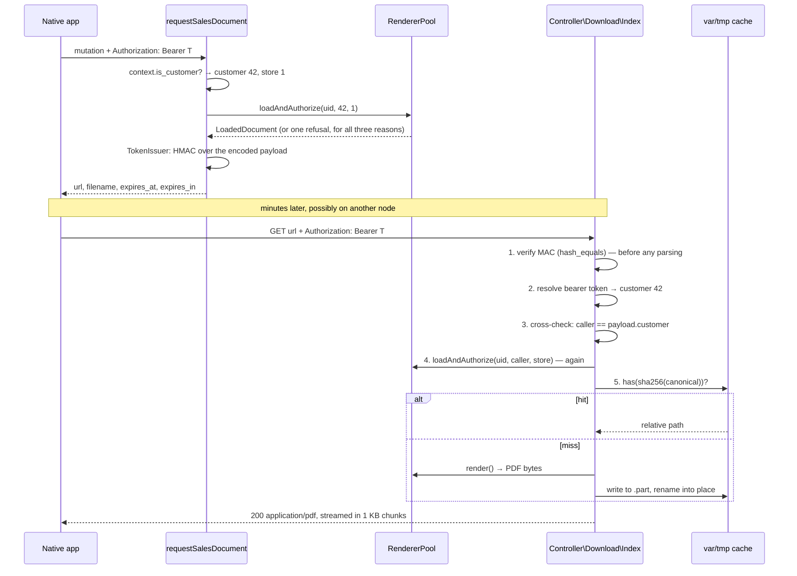

# Signed Document Delivery

A native app shows a customer their order history and, next to each order, a button that says
**Download invoice**. On a storefront that button is trivial: the customer has a session, the
controller has `Magento\Customer\Model\Session`, and core has been printing invoices since 2.0. On
a headless storefront there is no session, no cookie and no controller — there is a GraphQL endpoint
that returns JSON, and JSON is not a PDF.

The usual answer is to base64 the PDF into the GraphQL response. That makes the query as slow as the
slowest document in the catalogue, inflates the payload by a third, and puts a customer's paperwork
into every GraphQL log, proxy buffer and client-side cache between here and the phone.

This module does the other thing: a mutation that **authorizes now and signs a URL**, and a
controller that **authorizes again and streams the file**. The URL is short-lived, and — this is the
part that is usually missing — it is not a capability. Fetching it also requires the customer's own
bearer token, so a URL that leaks through a screenshot, a referrer header or a support ticket is
worth nothing on its own.

| Part | What it covers |
|---|---|
| `Model\Renderer\*` | Four renderers over three core PDF models and one this module had to write |
| `Model\Renderer\ShipmentRenderer` | The UID that encodes an increment ID while its three siblings encode entity IDs |
| `Model\Pdf\Order` | The order PDF Magento does not ship, and the two `AbstractPdf` methods that cannot be inherited for it |
| `Model\Token\*` | HMAC-SHA256 over the transmitted bytes, constant-time verify *before* the payload is parsed |
| `Model\Token\SigningKey` | A key derived one-way from `crypt/key`, selected the way `Encryptor` selects it |
| `Model\Token\CustomerTokenAuthenticator` | The second lock, and the reason a leaked URL is not a leak |
| `Model\Cache\*` | Content-addressed PDFs under `var/tmp`, written atomically, swept hourly |
| `Controller\Download\Index` | Five steps in an order that is the design |

## Why this exists

**A signed URL is the standard answer, and the standard implementation of it is wrong in the same
two ways.**

The first is that the signature is checked *after* the payload is read. It is the natural way to
write it — decode the token, look at the expiry, bail if stale, then verify — and it means a JSON
parser, an enum lookup and a handful of type coercions have all run over bytes an attacker chose
before anything has established that the installation ever issued them. Verifying first is not
harder. It just has to be a decision rather than an accident.

The second is that the URL *is* the credential. That is what "signed URL" means in most
implementations, and it is why signed URLs keep turning up in bug bounty reports: they end up in
browser history, in `Referer` headers, in screenshots pasted into support tickets, in analytics
beacons, in the CDN's access log. A short TTL narrows the window but does not close it, and every
minute you shave off the TTL is a minute of real-world flakiness — a phone that handed over between
networks, an app resumed from the background, a user who tapped download and then took a call.

The way out is to stop making the URL a credential. The token says *what was asked for and by
whom*; the caller still has to prove they are that person, with the same bearer token they called
the mutation with. Now a five-minute TTL is generous rather than nervous, and a leaked URL is a
leaked *statement about a request*, which is not interesting.

**And then there is the shipment UID.** Magento_SalesGraphQl encodes the primary key for orders,
invoices and credit memos:

```php
// Model/Formatter/Order.php:48
'id' => base64_encode((string)$orderModel->getEntityId()),
// Model/Resolver/Invoices.php:54
'id' => base64_encode($invoice->getEntityId()),
// Model/Resolver/CreditMemos.php:43
'id' => base64_encode($creditMemo->getEntityId()),
```

and then, for shipments:

```php
// Model/Resolver/Shipments.php:55
'id' => base64_encode($shipment->getIncrementId()),
```

Write the shipment renderer the way you wrote the other three and it will work perfectly in
development, because on a fresh install shipment `000000001` *is* entity 1. Increment IDs are
zero-padded digit strings, so `ctype_digit()` cannot tell the two apart, and `(int) '000000001'` is
`1` — a valid entity ID that a repository will happily return. There is no exception, no warning and
no log line. The customer downloads somebody else's packing slip.

## What's interesting (and what's just baseline)

| Choice | Why | Honest classification |
|---|---|---|
| The URL is not a capability — the download also needs the customer's bearer token | Turns "a leaked URL is a breach" into "a leaked URL is a fact about a request". Costs one header the app is already sending | The decision the rest of the design hangs off |
| The signature is verified before the payload is decoded | Unsigned input never reaches a JSON parser. The MAC is computed over the *transmitted* bytes, which is what makes that possible at all | Baseline, and usually got backwards |
| `hash_equals()` and not `===` | The comparison is against attacker-supplied data that can be varied one byte at a time | Baseline |
| The download re-runs the full authorization | The token is a claim about the past. Orders get reassigned and customers get deleted inside five minutes | Opinionated, and the thing "stateless token" designs skip |
| Increment-ID lookup first, entity-ID second — not the other way round | Ordering is load-bearing, not a preference: both forms are digit strings, so entity-first returns the wrong shipment rather than failing | The bug this module exists to not have |
| The signing key is HKDF'd from `crypt/key`, not equal to it | The crypt key protects password hashes and encrypted config. A signing key that *is* it makes any future weakness in one a weakness in all | Baseline cryptographic hygiene, rarely done |
| Key selection copies `Encryptor` exactly | `crypt/key` can hold several keys after a rotation; the last is current. Signing with any other one signs with a retired key | The detail you only find by reading the constructor |
| Rendered PDFs are files, not cache entries | `Magento\Framework\App\Response\File` streams a file in 1 KB chunks. A cache backend hands you a 400 KB string in PHP memory first | Architectural |
| Writes are `write-temp` + `rename` | Two requests miss the cache at once and both render. Without the rename, one reader gets a truncated PDF and no error anywhere | Baseline, and easy to leave out |
| The cache key is one canonical string with a version prefix | Cache keys assembled ad hoc are cache keys whose collisions nobody can reason about | Baseline |
| Not found, not yours and wrong store are one message | Otherwise the mutation is an oracle for walking the invoice table | Baseline, commonly leaked |
| A guest order is refused by an explicit `null` branch | `(int) null` happens to be safe here. Accidents are not security controls | Opinionated |
| The document's store must match the request's store | A customer account spans every store view of a website, so ownership alone hands store A the paperwork rendered for store B | The check most implementations do not have |
| The mutation authorizes but does not render | An interactive mutation should not be as slow as the biggest PDF in the shop, and the client may never follow the URL | Opinionated |
| It is a mutation despite changing nothing | Queries get cached by the client. A short-lived credential in Apollo's normalised store is the wrong place for it | Argued below |
| An order PDF built on `AbstractPdf`, not a second PDF stack | Same fonts, same page geometry, same `insertOrder()` header — and a new `order` page type in the existing renderer pool | The workaround for a genuine core gap |

## Architecture



Every failure on the download path — bad signature, expired link, no bearer token, the wrong
customer, a document that has since been deleted, a full disk — leaves by the same door:
`NotFoundException`, which `Magento\Framework\App\FrontController` catches and forwards to
`noroute`. The reason is written to `var/log/scr1be_signed_documents.log` and never to the response.

### 1. The registry, and the fourth document type

`Model\Renderer\DocumentRendererInterface` has two methods and the split between them is the point:

```php
public function loadAndAuthorize(string $uid, int $customerId, int $storeId): LoadedDocument;
public function render(LoadedDocument $document): string;
```

`loadAndAuthorize()` is cheap and has no side effects, so the mutation can run it and refuse
immediately. `render()` is the expensive half and only ever runs on a cache miss inside the
controller. Both halves run on the download path.

Three of the four implementations are thin. `InvoiceRenderer`, `ShipmentRenderer` and
`CreditmemoRenderer` load through the corresponding `Magento\Sales\Api\*RepositoryInterface`, hand
the parent order to the ownership guard, and delegate drawing to
`Magento\Sales\Model\Order\Pdf\{Invoice,Shipment,Creditmemo}` — each obtained from a **factory**,
never shared. Those models are stateful: `AbstractPdf` keeps the page cursor in a public `$y` and
the document in `$_pdf`, so a shared instance would carry the previous render's cursor into the
next one.

The fourth is not thin, because there is no fourth core model. `Magento\Sales\Model\Order\Pdf` ships
exactly three concrete PDF models — `Invoice`, `Shipment` and `Creditmemo` — beside `AbstractPdf`,
the renderer config and the item/total renderer trees. The closest core comes to an order document
is the `sales/order/print` route, and
`Magento\Sales\Controller\AbstractController\PrintAction::execute()` returns a `Result\Page` with
the `print` layout handle — an HTML page, not a file. So `Model\Pdf\Order` extends the same
`AbstractPdf` the other three do, reuses `insertLogo()`, `insertAddress()`, `insertOrder()`,
`insertDocumentNumber()` and `drawLineBlocks()`, and registers an `order` page type in
`etc/pdf.xml` beside core's three. `pdf.xsd` types `page/@type` as a plain `xs:string`, so it slots
in without touching anything core declares.

Two things could not be inherited, and both are worth naming.

`AbstractPdf::_drawItem()` picks the renderer with `$item->getOrderItem()->getProductType()` — how
an *invoice* line finds the order line behind it. An order line has no `getOrderItem()`; the magic
getter returns null and the next arrow is a fatal. Overridden to read the product type off the item.

`AbstractPdf::insertTotals()` is subtler, and the failure is data-dependent. It opens with
`$order = $source->getOrder()` and hands that to every total model, and
`Magento\Sales\Model\Order\Pdf\Total\DefaultTotal::getTitleDescription()` then calls
`$this->getSource()->getOrder()->getData(...)`. When the source *is* the order, `getOrder()` is an
unset magic getter returning null. Nothing breaks on an order without a discount, because
`getTitleDescription()` is only reached for a total that declares `title_source_field` and passes
`canDisplay()` — and in Magento_Sales' `pdf.xml` exactly one does: `discount`, with `display_zero`
false. The inherited version would render every order in testing and fatal on the first one with a
coupon on it. `Model\Pdf\Order` draws its own totals block.

### 2. The UID that is not an ID

Covered under *Why this exists*; here is what the renderer actually does about it.

```php
$shipment = $this->findByIncrementId($decoded, $storeId) ?? $this->findByEntityId($decoded);
```

Increment first, always. The fallback exists for clients that built their UID from a REST payload
rather than from the GraphQL order history, and it is second because putting it first is the bug.

The increment lookup is scoped to the store, and that is not defence in depth — it is correctness.
`sales_shipment` is unique on (`increment_id`, `store_id`), not on `increment_id` alone (the
`SALES_SHIPMENT_INCREMENT_ID_STORE_ID` constraint in Magento_Sales' `db_schema.xml`). Two store
views with independent increment sequences can genuinely hold the same number.

Both forms resolve to the same shipment and therefore to the same cache entry: the canonical key is
built from the resolved entity ID, never from the UID.

### 3. The token

`base64url(payload) . '.' . base64url(hmac_sha256(key, base64url(payload)))`, and the payload is
seven short keys:

```json
{"v":1,"t":"INVOICE","d":"NA==","c":42,"s":1,"x":1775000300,"n":"…"}
```

The MAC covers the **encoded** payload, not the decoded one. That single decision is what allows the
verifier to check the signature before parsing anything, and it removes a whole class of
canonicalisation bug on the way: there is exactly one byte string being signed and it is the one
that travels.

Verification, in order:

1. Split on `.` — exactly two non-empty parts, or nothing else happens.
2. Recompute the MAC and compare with `hash_equals()`.
3. *Only then* base64url-decode, JSON-parse, validate the field types, check the expiry.

The MACs are compared in their base64url form. They are fixed-length — 43 characters for 32 raw
bytes — and character-for-character equal exactly when the raw bytes are, so nothing is lost, and a
malformed MAC never has to be decoded to be rejected.

The signing key comes from `Model\Token\SigningKey`, which is
`hash_hkdf('sha256', $cryptKey, 32, 'scr1be/signed-document-delivery:url-signing:v1')`. The crypt
key is not used directly: it is the key behind `Magento\Framework\Encryption\Encryptor`, and a
signing key equal to it makes any future weakness in one construction a weakness in all of them.
Which crypt key is a detail worth copying rather than guessing — `Encryptor::__construct()` does
`preg_split('/\s+/s', trim($deploymentConfig->get('crypt/key')))` and treats the **last** entry as
current, because `app/etc/env.php` may hold several after a `setup:config:set --key` rotation. This
module does the same. The consequence is that rotating the crypt key invalidates every outstanding
URL, which at a five-minute TTL is a five-minute window of 404s during a rotation — the right trade
against carrying a key list and verifying against all of it.

The nonce is not checked on the way back. It is there so two requests for the same document in the
same second produce different URLs, which keeps one leaked URL from being interchangeable with
another and stops intermediaries treating the two as the same cacheable resource.

### 4. Two locks

The signed token says *"customer 42 asked for invoice 7"*. That is a claim by this installation
about the past, and a claim is all it is — anyone holding the URL holds the claim. So the download
also has to be **made by** customer 42:

```php
$payload  = $this->tokenVerifier->verify($token);                                  // lock one
$callerId = $this->authenticator->resolveCustomerId($request->getHeader('Authorization')); // lock two
if ($callerId !== $payload->customerId) { /* 404 */ }
$document = $pool->get($payload->type)->loadAndAuthorize($payload->uid, $callerId, $payload->storeId);
```

The bearer token is resolved through Magento_Integration's own
`UserTokenReaderInterface` / `UserTokenValidatorInterface` — the same pair
`Magento\Webapi\Model\Authorization\TokenUserContext` uses — so token expiry, revocation and the
admin-configurable lifetime keep working exactly as they do for the Web API. A token whose user type
is not `USER_TYPE_CUSTOMER` is refused: an admin token is a valid credential for something else, and
treating an admin ID as a customer ID would compare it against `sales_order.customer_id` and
occasionally match.

Then the fourth step, which is the one "stateless token" designs skip: **the document is authorized
again, from scratch, with the authenticated customer ID and not the payload's.** The payload decides
what to look for. It never decides who may have it. Five minutes is short, but it is not zero: an
order can be reassigned, a customer deleted, a document moved to another store view, and a token
that authorized rather than merely described would sail through all three.

The trade is stated plainly because it shapes the client: **pasting the URL into a browser address
bar returns 404.** It has to be fetched by the app with the header attached. For the headless case
this module targets, that is a feature.

### 5. The cache

`Model\Cache\CanonicalKeyBuilder` produces one string, then one sha256 of it:

```
v1|1|INVOICE|4|1|42|2026-08-01 10:00:00|2026-08-01 09:00:00
 │  │    │    │ │  │            └── fingerprint: document updated_at | order updated_at
 │  │    │    │ │  └───────────────── customer id
 │  │    │    │ └──────────────────── store id
 │  │    │    └────────────────────── entity id
 │  │    └─────────────────────────── document type
 │  └──────────────────────────────── renderer revision, bumped by hand
 └─────────────────────────────────── key version
```

Two timestamps because one is not enough: the document's own `updated_at` misses everything the PDF
borrows from the order. The billing and shipping addresses, the payment block and the shipping
description are all drawn from the order by `AbstractPdf::insertOrder()`, so an address correction
saved against the order alone would otherwise keep serving the stale invoice.

The customer ID is in the key even though a document has exactly one owner. It is cheap insurance:
a cached file can only ever be served back to the identity it was authorized for, whatever else
goes wrong upstream.

Files live under `var/tmp/scr1be/signed-documents/ab/cd/<key>.pdf` — outside the document root, so
unreachable except through the controller, and sharded two levels deep so a shop rendering a few
thousand documents a day does not end up with a directory that takes a second to list.

Writes go to `<final>.<random>.part` and are then `rename()`d into place. Two requests missing the
cache at the same time is the ordinary case, not the edge case: without the rename, the second
writer's first bytes land while the first writer's reader is halfway through the file, and the
reader gets a truncated PDF with no error anywhere. Rename within a filesystem is atomic, so a
reader sees either the old complete file or the new complete file. No lock is needed because the
content is a pure function of the key — the losing writer's bytes are replaced by identical bytes.

`Cron\SweepDocumentCache` runs on the hour and deletes anything older than the configured lifetime,
including abandoned `.part` files, which are the one thing in that directory that is not
reproducible. Age comes from mtime, and reads do not refresh it: this is an expiry, not an LRU. A
document downloaded every hour is still re-rendered once a lifetime, which is deliberate — see
*Design decisions*.

## Install

```bash
# from your Magento 2 root
composer config repositories.scr1be-signed-document-delivery path /path/to/Magento/signed-document-delivery/src
composer require scr1be/signed-document-delivery:@dev
bin/magento module:enable Scr1be_SignedDocumentDelivery
bin/magento setup:upgrade
bin/magento cache:flush
```

With no `installer-paths` configured, Composer puts the package in
`vendor/scr1be/signed-document-delivery/` — that is the path the Tests section below assumes. If you
would rather copy the module in by hand, `src/` goes to `app/code/Scr1be/SignedDocumentDelivery/`
and everything else is the same.

There is no database schema. The module owns one directory under `var/tmp`, one cron job and one
GraphQL mutation, and uninstalling it leaves nothing behind but that directory.

Nothing works until `crypt/key` is present in `app/etc/env.php`, which it is on every installed
Magento. On a copied database with a stripped `env.php` the mutation raises *"Signed document
delivery needs an encryption key in app/etc/env.php."*

## Configuration

**Stores → Configuration → scr1be → Signed Document Delivery**

| Setting | Scope | Default | Notes |
|---|---|---|---|
| Signed URLs → Link lifetime (seconds) | store view | 300 | 30–3600; outside that it falls back to 300. Store-scoped because a native app and a kiosk in the same website can reasonably want different windows |
| Rendered PDF Cache → Keep rendered files for (seconds) | default only | 86400 | 300–2592000; outside that it falls back to 86400. Default scope only, because the sweep is a cron job with no store context — a per-store lifetime could not be honoured, so offering one would be a setting that silently does nothing |

Both are clamped rather than trusted. A TTL of zero is a module that does not work and a TTL of a
week is the security property thrown away; an admin text field can produce either.

## Using it

### The mutation

```graphql
mutation {
  requestSalesDocument(input: { document_type: INVOICE, uid: "NA==" }) {
    url
    filename
    content_type
    expires_in
    expires_at
  }
}
```

```json
{
  "data": {
    "requestSalesDocument": {
      "url": "https://example.test/signeddocument/download/index/?token=eyJ2Ijox….rL8n…",
      "filename": "invoice-000000004.pdf",
      "content_type": "application/pdf",
      "expires_in": 300,
      "expires_at": "2026-08-14T09:05:00+00:00"
    }
  }
}
```

`expires_in` and `expires_at` are both there because clients want different ones: the first for a
countdown that does not care about clock skew, the second for a cache entry that does.

The `uid` is whatever the customer order query returned. For invoices, credit memos and the order
itself that is `base64(entity_id)`; for shipments core gives you `base64(increment_id)` and this
module takes it as-is.

### The download

```bash
curl -L -o invoice.pdf \
     -H "Authorization: Bearer $CUSTOMER_TOKEN" \
     "https://example.test/signeddocument/download/index/?token=eyJ2Ijox….rL8n…"
```

Same `$CUSTOMER_TOKEN` as the mutation. Drop the header and you get the 404 page.

## Demo notes

On a stock **Magento 2.4.8 + Hyvä 1.4 + Luma sample data** storefront. The module has no storefront
surface at all — everything below is `curl`, which is the honest way to demo a headless feature.

1. **Have an order with documents.** Place an order as a registered customer (Luma's checkout is
   fine), then in the admin invoice it and ship it. Two minutes, and it gives you all four document
   types except the credit memo; refund the invoice offline if you want that one too.
2. **Get a customer token.**

   ```bash
   curl -s -X POST https://example.test/graphql -H 'Content-Type: application/json' \
        -d '{"query":"mutation{generateCustomerToken(email:\"jane@example.com\",password:\"…\"){token}}"}'
   ```
3. **Read the UIDs out of core's own query.** This is the step that makes the shipment quirk
   visible rather than theoretical:

   ```bash
   curl -s -X POST https://example.test/graphql \
        -H "Authorization: Bearer $T" -H 'Content-Type: application/json' \
        -d '{"query":"{customer{orders{items{id number invoices{id} shipments{id} credit_memos{id}}}}}"}'
   ```

   Base64-decode the four IDs. The order, invoice and credit memo decode to small integers. The
   shipment decodes to `000000001`.
4. **Ask for the invoice.** Run the mutation above with the invoice UID. You get a URL back in a few
   milliseconds — nothing has been rendered yet.
5. **Fetch it with the header.** `curl -L -o invoice.pdf -H "Authorization: Bearer $T" "<url>"`.
   A real PDF, with the logo and address from *Stores → Configuration → Sales → Sales → Invoice and
   Packing Slip Design* (`sales/identity/logo` and `sales/identity/address`, which is what
   `AbstractPdf::insertLogo()` and `insertAddress()` read), and the same layout as the admin's own
   invoice print — it goes through the same `Magento\Sales\Model\Order\Pdf\Invoice` that
   `Magento\Sales\Controller\Adminhtml\Invoice\AbstractInvoice\PrintAction` uses.
6. **Fetch it without the header.** Same URL, no `Authorization`. The 404 page. This is the whole
   design in one command, and it is the one to run in front of a reviewer.
7. **Fetch it as somebody else.** Get a second customer's token and use it against the first
   customer's URL. Still a 404 — the cross-check, not the signature, is what stops this one.
8. **Tamper.** Change one character in the token. 404, and
   `var/log/scr1be_signed_documents.log` says `signature does not match`. Change nothing and wait
   out the TTL: 404, and the log says `link expired at …`.
9. **Watch the cache.** `find var/tmp/scr1be -type f` after step 5 shows one file two directories
   deep. Fetch the same URL again inside the TTL and the mtime does not change: that is the hit
   path, and nothing was re-rendered. Then edit the order's billing address in the admin, ask for a
   new URL, fetch it — a second file appears, because the order's `updated_at` moved and the
   fingerprint moved with it.
10. **Sweep.** Set the cache lifetime to its 300-second floor, wait, and run
    `bin/magento cron:run --group=default`. The files go, and the log says how many.
11. **The order document.** Repeat with `document_type: ORDER` for the type core has no PDF for.
    Luma's sample products are simple, so the default item renderer draws every line; a bundle would
    render as its parent line only, which is the documented limit of shipping one renderer.

## Tests

```bash
# from your Magento 2 root
# path follows your install method — Composer package:
vendor/bin/phpunit -c dev/tests/unit/phpunit.xml.dist vendor/scr1be/signed-document-delivery/Test/Unit

# …or, if you copied the module into app/code instead:
vendor/bin/phpunit -c dev/tests/unit/phpunit.xml.dist app/code/Scr1be/SignedDocumentDelivery/Test/Unit
```

172 tests over 15 classes, 234 assertions, aimed at the parts that can actually be wrong.

The token gets the most of them, because it is the only thing standing between a URL and a
stranger's paperwork. A tampered payload carrying its original MAC; a token signed with a different
key; the expiry boundary in both directions; six shapes of malformed input, each asserted to fail at
the *split* or the *signature* rather than at the parser; and — the interesting group — payloads that
are correctly signed and still refused, because a version bump, a string where an integer belongs or
a missing nonce all mean the same thing as garbage. `Base64UrlTest` pins the round trip over every
byte value and the 43-character MAC length the verifier's comparison depends on.

`SigningKeyTest` covers the derivation being one-way, deterministic across nodes, and — the part
that took reading `Encryptor`'s constructor — selecting the last key out of a rotated set, in four
whitespace shapes.

Then the seams, which is where third-party contracts drift. `ShipmentRendererTest` is the one to
read: it asserts that a core-shaped UID resolves as an increment ID with the entity-ID lookup never
reached, that the increment lookup carries the store filter, that a non-numeric UID never reaches
the repository at all, and that an unpadded base64 UID is refused — `Uid::isValidBase64()` catches
that where a bare `base64_decode($s, true)` would not. `DocumentCacheTest` covers the shard layout
and the three calls that make a write atomic, in order, plus the fact that two writers get different
temporary names. `CacheSweeperTest` covers the mtime boundary, `.part` files, and the two things a
cron job must not do: delete somebody else's file, or abort because one file vanished mid-sweep.

`OwnershipGuardTest` and `IndexTest` both end with the same test — that every refusal is
byte-identical from outside. That is a property, not an example, and it is the kind of thing that
regresses the first time somebody adds a helpful error message.

`IndexTest` also pins the order of operations directly: an unsigned request must not cost a
token-table read, and a request whose caller does not match the payload must not cost a document
load.

The XML — `di.xml`, `pdf.xml`, `crontab.xml`, `system.xml` — is configuration, covered by the demo
walkthrough rather than by mocks. Two cross-file contracts are asserted from the files themselves,
because they fail silently: `RendererPoolTest` reads `etc/di.xml` and checks the wired renderer keys
against the PHP enum, and reads `etc/schema.graphqls` and checks the GraphQL enum's members against
the same. A case added on one side only would otherwise be accepted by the schema and rejected by
the resolver.

## Design decisions

**It is a mutation even though it changes nothing.** REST-shaped reasoning says query. GraphQL
clients say otherwise: Apollo and friends normalise and cache query results keyed by their
arguments, and a short-lived signed credential is the last thing that should be sitting in a
client-side store, being replayed after it expires and shared between components. Declaring it a
mutation puts it on the side of the contract that is never cached and never batched. The cost is a
sentence of explanation; the alternative cost is a support ticket about stale URLs.

**The order PDF is a workaround for a missing core API, and it is a partial one.** `etc/pdf.xml`
registers only a `default` item renderer for the new `order` page type, so a bundle or downloadable
line on an order document renders as its parent line without the child breakdown —
`AbstractPdf::_getRenderer()` substitutes `default` for any product type it has no entry for.
Registering order-page renderers for those product types is a few lines in somebody's `pdf.xml`, and
that is deliberately the extension point rather than four more classes in here. Invoices, shipments
and credit memos are unaffected: they go through core's models and core's full renderer set.

**Store configuration is not in the cache key, and that is a known staleness window.** Changing the
PDF logo or the store address does not move any `updated_at`, so files already rendered keep their
old header until the sweep removes them. The honest fix is an observer on config saves that clears
the directory; the honest default is a bounded lifetime, which is what ships. Bumping
`CanonicalKeyBuilder::RENDERER_REVISION` is the immediate escape hatch and is also the documented
way to deploy a template change without waiting the cache out.

**Reads do not refresh the cache entry's mtime.** Expiry, not LRU — so a document downloaded every
hour is still re-rendered once a lifetime. Touching a file on every read turns a read-only path into
a write, and the whole reason the lifetime is bounded is that stale store configuration eventually
has to drop out. Re-rendering a popular document once a day is the mechanism, not a shortcoming of
it.

**Guest orders are not supported.** `sales_order.customer_id` is null on them, so there is nothing
to compare a bearer token against; guest document delivery needs an order-token flow of its own
(email plus increment ID, or core's `GuestOrder` token), which is a different feature with a
different threat model. The guard refuses them by an explicit `null` branch rather than by letting
`(int) null` be zero and never matching — the outcome is the same and only one of them is a control.

**The bearer token has to be a header, not a query parameter.** It would be more convenient to
accept `&customer_token=…` so the URL works in a browser. It would also put a long-lived credential
into every access log and `Referer` header on the path — exactly the exposure the signed URL was
designed to survive, reintroduced through the door marked convenience. A headless client can set a
header; that is what makes it a client.

**The log is a file of its own.** Every refusal is silent to the customer by design, so the log is
the only place the reason exists. Following Magento_Cron's `VirtualLogger` pattern, the `system`
handler is replaced by name, which leaves the platform's `debug` and `syslog` handlers inherited —
so in developer mode the same records also reach `debug.log`.

**No `db_schema.xml`.** There is no state to keep. Tokens are self-describing and verified
cryptographically; the cache is content-addressed on disk. A `signed_document_token` table would
buy single-use tokens and would cost a write on every issue, a read on every download, and a second
sweep — for a credential that already expires in five minutes and is already bound to a second,
independently-verified identity.

## Compatibility

| | Version |
|---|---|
| PHP | 8.2, 8.3, 8.4 |
| Magento 2 | 2.4.6, 2.4.7, 2.4.8 |
| Hyvä Theme | Not applicable — the module has no theme surface |

`ext-hash` for `hash_hkdf()` and `hash_hmac()`, `ext-json` for the payload. Both are standard on any
Magento host, and `hash_hkdf()` has been in PHP core since 7.1.

There is no frontend template, no layout XML and no JavaScript: the module's entire surface is one
GraphQL mutation and one controller that returns a file, so it behaves identically on Luma, on Hyvä
and on a storefront that is a phone.

The GraphQL side depends on Magento_CustomerGraphQl and Magento_StoreGraphQl for the `is_customer`
and `store` context extension attributes, and on Magento_SalesGraphQl only in the sense that its
`OrderShipment.id` is the UID shape the shipment renderer is built to accept — nothing here
overrides or patches it.

## License

MIT — see [LICENSE](LICENSE).
