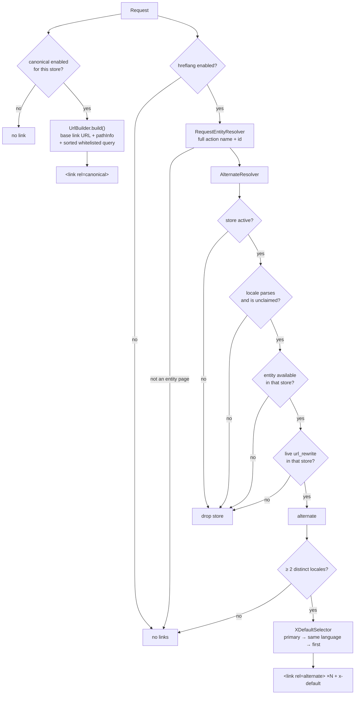
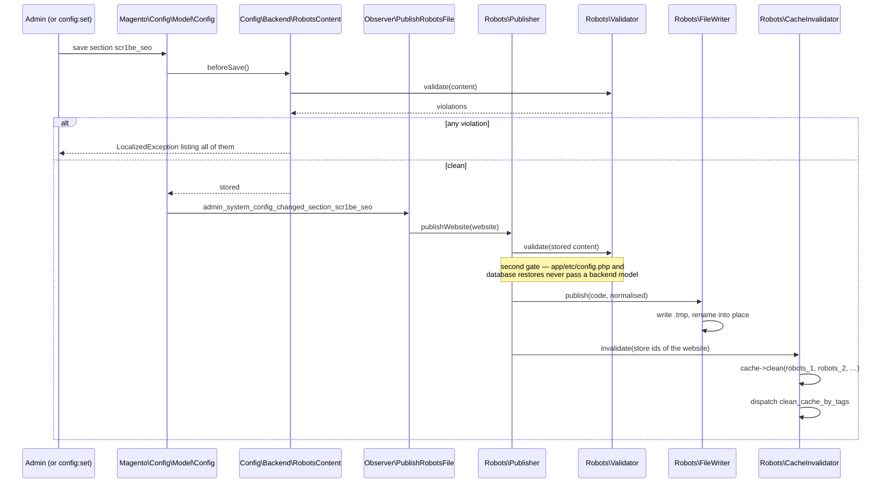

# Store Toolkit

Three modules for the parts of Magento that stop being simple the moment there is more than one
store view: telling search engines which of your near-identical pages is the real one, letting a
visitor move between stores without landing on a home page, and taking one store off sale without
taking the website down.

They ship as a suite rather than as one module because they have three different blast radii. The
SEO module writes to `<head>` and to a file on disk. The switcher module owns a control in the
header. The closure module can stop a storefront taking money. A project that wants only the first
should not have to install the third, and an admin role that may edit canonicals should not
automatically be able to close a store.

| Module | What it owns |
|---|---|
| `Scr1be_StoreSeo` | Canonical, entity-aware hreflang with a documented `x-default` ladder, per-website robots.txt published to disk |
| `Scr1be_StoreSwitcher` | Same-page store switching — a server-rendered desktop `<select>`, a URL-agnostic cacheable payload for the mobile drawer, an inline SVG flag sprite |
| `Scr1be_StoreClosure` | One store-scoped flag that closes a store for sales, enforced on the storefront, in REST and in GraphQL |

## Why this exists

Multi-store is where a Magento build stops being a catalogue and starts being a system. The three
problems below all have the same shape: core gives you a mechanism, the mechanism is correct, and
the thing you actually need sits one layer above it and is left to you.

**Canonicals and hreflang are the cheapest SEO work with the worst failure mode.** Core has a
canonical for categories (`Magento\Catalog\Block\Category\View::_prepareLayout()`) and for products
(`Magento\Catalog\Helper\Product\View::preparePageMetadata()`), both of them a
`pageConfig->addRemotePageAsset(..., 'canonical', ...)` behind a `canUseCanonicalTag()` check —
and nothing at all for the rest of the storefront or for hreflang. Meanwhile a Luma-sized catalogue
with layered navigation produces tens of thousands of URLs that are the same page seen through a
filter, and a canonical that copies the query string back into itself is not a canonical — it is a
sitemap of duplicates. Getting hreflang wrong is worse, because the failure is silent: a group
advertising a page that 404s in the target store, or two stores claiming the same locale, is simply
ignored, and nothing tells you.

**Store switching is a redirect with three moving parts, and the obvious implementation caches
wrong.** Core's switcher (`Magento\Store\Block\Switcher::getTargetStorePostData()`) builds a POST
payload containing `___store`, `___from_store` and a `uenc` of `$store->getCurrentUrl(false)`, and
Hyvä's templates use `Magento\Store\ViewModel\SwitcherUrlProvider` to do the same as a GET. Both
bake the *current request* into the markup. That is fine inside a page the full page cache stores
per URL, and it is a bug the moment anyone block-caches the switcher — one warm entry then sends
every visitor on the site back to whichever page happened to warm it. The switcher here has two
renderers for exactly that reason, and each one says in its class docblock which of the two
assumptions it is relying on.

**"Close the store" is four holes, and most implementations find two.** Redirecting the checkout
controller covers the storefront. It does not cover `POST /rest/V1/carts/mine/payment-information`,
it does not cover the `placeOrder` GraphQL mutation, and it does not cover a guest cart submitted
against the store from a native app. Those three converge on one interface, which is where the
closure is enforced.

## What's interesting (and what's just baseline)

| Choice | Why | Honest classification |
|---|---|---|
| Canonical is a whitelist, not a blacklist | A denylist of tracking parameters is a list you lose. `p` survives because page 2 of a category is a different document; everything else is a view of one | Opinionated, and the version that stays correct |
| `___store`, `___from_store`, `uenc` and `SID` can never be whitelisted | The store echo is what a canonical must never carry, and an admin typing it into the box should not be able to break the site | Baseline, and rarely enforced |
| Whitelisted parameters are sorted | `?p=2&limit=36` and `?limit=36&p=2` are one page. Two canonicals for them would reintroduce the problem one level up | The bug the naive version ships |
| hreflang alternates need a rewrite **and** a store-scoped entity load | Rewrites outlive the thing they point at — disabling a product does not delete its `url_rewrite` row — so a group built from rewrites alone advertises 404s | The distinction that makes it correct |
| Two stores on one locale: first wins, and the group is dropped if fewer than two locales remain | A duplicated `hreflang` value invalidates the whole group; a group of one says nothing | Opinionated |
| `x-default` has a three-rung ladder | Primary → same language → first available. Hardcoding "the default store" fails on exactly the pages where it matters: the ones the default store does not carry | The part most implementations skip |
| The alternate URL comes out of `url_rewrite`, not the URL model | The URL model answers for the *current* store; getting a per-store answer out of it means store emulation per alternate, for a string already sitting in an indexed table | Architectural |
| robots.txt is written to disk **and** core's route is left alone | A tuned nginx serves a matching static file without touching PHP, and a physical file survives PHP being down. Core's controller stays as the fallback, so nothing breaks without a webserver rule | Opinionated |
| The file goes in the media directory, not `pub/` | Media is the only directory Magento guarantees writable at runtime. A module that writes to `pub/` works on a laptop and fails on the first read-only deploy | The one people get wrong |
| Validate, then write, then invalidate | Invalidating first opens a window where a crawler repopulates the cache from the old file; writing first leaves a broken file behind a failed validation | Baseline, and order-sensitive |
| The desktop switcher is deliberately **not** block-cached | Its option values contain a `uenc` of the current request. `AbstractBlock::getCacheLifetime()` returns null unless `cache_lifetime` is set, so not setting it *is* the protection | The trap, made explicit |
| The drawer payload is deliberately **URL-agnostic** | Store codes and base URLs only; the browser composes the target on change. One cache entry per store then serves the whole catalogue, and is also right on pages the FPC never sees | The design decision the suite is named for |
| A native `<select>`, enhanced with Alpine | Keyboard navigation, type-ahead, the mobile OS picker and the combobox ARIA pattern arrive correct and stay correct. A div-based listbox reimplements all of them and usually gets four wrong | Baseline, commonly skipped |
| Flags are drawn from data, and unsupported ones become a globe | Only pure-geometry flags ship. A hand-approximated national flag is worse than none | Honest about its limits |
| `placeOrder` is guarded at `CartManagementInterface`, not at a controller | REST, GraphQL, guest REST and the storefront checkout all converge there. Four doors, one lock | The reason the closure actually closes |
| The closure reads the **quote's** store, not the current one | An API client picks its store with a URL segment (REST) or a header (GraphQL); a cart created against the closed store and submitted under another store's scope would otherwise walk straight through | The hole in the obvious version |
| Account links go, the store switcher stays | A closed store is a dead end, and the switcher is the way out of it | Opinionated, and the point |
| The closure banner has a content-addressed URL | Magento's cache tags stop at the edge of Magento. A CDN holding `banner.png` keeps holding it; a URL that is a hash of the bytes has never been seen before | The problem tag invalidation cannot solve |
| Price hiding is an `around`, everything else is a `before` | `around` here skips the whole render tree rather than discarding it; `before` elsewhere can only refuse, which is what a guard should be able to do | Deliberate, and explained per plugin |

## Architecture

### The SEO module, per request



The three gates are in cost order on purpose: a store check is free, an availability check is a
scoped entity load, and a URL lookup is an indexed query. Each gate removes work from the next.

### robots.txt, on config save



The tag is `robots_<storeId>` because that is what `Magento\Robots\Block\Data::getIdentities()`
returns (`Magento\Robots\Model\Config\Value::CACHE_TAG . '_' . $storeId`). Purging our own invented
tag would purge nothing, and would do it silently.

### The switcher's two renderers

```
            ┌──────────────────────────── page ────────────────────────────┐
            │                                                              │
  desktop   │  <select>                                     drawer         │
            │    <option value="https://…/stores/store/       <select>     │
            │      redirect?___store=de&…&uenc=…">              <option    │
            │                                                     value="de">
            │    ▲ contains THIS request                        ▲ contains │
            │    ✗ must never be block-cached                     a store  │
            │    ✓ safe inside the FPC (cached per URL)           code only│
            │                                                   ✓ cached,  │
            │                                                     one entry│
            │                                                     per store│
            └──────────────────────────────────────────────────────────────┘
                                        │
                          <script type="application/json"
                                data-scr1be-store-switcher-config>
                          { currentBaseUrl, redirectUrl, stores[…] }
                                        │
                          store-switcher.js composes on change:
                            target  = store.baseUrl + (href − currentBaseUrl)
                            uenc    = base64(target) with +/= → -_~
                            goto      redirectUrl?___store=…&___from_store=…&uenc=…
```

The `+/=` → `-_~` mapping is `Magento\Framework\Url\Encoder::encode()`. It is asserted against the
real file by `Test/Unit/TemplateContractTest.php` rather than trusted, because getting the third
pair wrong produces a `uenc` that decodes to nothing and core then quietly drops the visitor on the
target store's home page.

### Closure enforcement points

| Surface | Enforced by | Note |
|---|---|---|
| `/checkout`, `/multishipping` | `Observer\RedirectClosedRoutes` | `controller_action_predispatch` + `FLAG_NO_DISPATCH` + redirect |
| Sign-in and registration | same observer, action list in `di.xml` | A signed-in customer keeps their dashboard and order history |
| REST `POST /V1/carts/mine/payment-information` | `Plugin\BlockPlaceOrder` | Reaches `CartManagementInterface::placeOrder()` via `PaymentInformationManagement` |
| REST guest checkout | same plugin | `GuestCartManagement::placeOrder()` unmasks and delegates to the same interface |
| GraphQL `placeOrder` | same plugin | `Magento\QuoteGraphQl\Model\Cart\PlaceOrder::execute()` calls the same interface |
| Prices across the storefront | `Plugin\HidePriceRender` | One `around` on `Magento\Framework\Pricing\Render::render()` |
| Header account menu | `Observer\HideAccountLinks` | `layout_generate_blocks_after` + `unsetElement()`, because the flag is runtime |
| Store switcher | *deliberately not blocked* | The route out of a closed store |

## What gets shipped

```
src/
├── composer.json                     # metapackage: installs all three
├── StoreSeo/
│   ├── registration.php · composer.json
│   ├── etc/
│   │   ├── module.xml · config.xml · di.xml · acl.xml · events.xml
│   │   └── adminhtml/system.xml
│   ├── Model/
│   │   ├── Config.php                        # canonical + hreflang settings, denied-param list
│   │   ├── Config/Backend/RobotsContent.php  # validation on save, core's robots cache identity
│   │   ├── Canonical/UrlBuilder.php          # pure: base URL + path + sorted whitelist
│   │   ├── Entity/EntityContext.php · EntityTypes.php · RequestEntityResolver.php
│   │   ├── Entity/StoreUrlResolver.php       # url_rewrite lookup, live rows only
│   │   ├── Entity/StoreAvailability/*        # per-type checkers + di-wired pool
│   │   ├── Hreflang/AlternateLink.php · LocaleFormatter.php
│   │   ├── Hreflang/AlternateResolver.php    # the three gates and the dedup
│   │   ├── Hreflang/XDefaultSelector.php     # the ladder
│   │   └── Robots/                           # Config · Validator · FileWriter · Publisher
│   │       └──                               # CacheInvalidator · CacheIdentity(+Factory)
│   ├── Observer/PublishRobotsFile.php
│   ├── Console/Command/PublishRobotsCommand.php
│   ├── ViewModel/Canonical.php · Hreflang.php
│   ├── i18n/en_US.csv
│   ├── view/frontend/layout/                 # default + five removals
│   ├── view/frontend/templates/head/         # canonical.phtml · hreflang.phtml
│   └── Test/Unit/                            # 13 classes
├── StoreSwitcher/
│   ├── registration.php · composer.json · etc/module.xml
│   ├── Block/DesktopSwitcher.php             # never block-cached, and says why
│   ├── Block/DrawerPayload.php               # URL-agnostic cache key, and says why
│   ├── Block/FlagSpriteBlock.php · SwitcherScripts.php
│   ├── Model/StoreOption.php · StoreListProvider.php · FlagSprite.php
│   ├── i18n/en_US.csv
│   ├── view/frontend/layout/default.xml      # + removes Hyvä's footer switchers
│   ├── view/frontend/templates/switcher/     # desktop · drawer · flags · scripts
│   ├── view/frontend/web/js/store-switcher.js
│   └── Test/Unit/                            # 5 classes, incl. the cross-file contract
└── StoreClosure/
    ├── registration.php · composer.json
    ├── etc/                                  # module · config · di · acl
    │   ├── adminhtml/system.xml
    │   └── frontend/di.xml · frontend/events.xml
    ├── Model/ClosureState.php · ClosedRouteRegistry.php
    ├── Model/Banner/BannerUrlProvider.php    # content-addressed publishing
    ├── Observer/RedirectClosedRoutes.php · HideAccountLinks.php
    ├── Plugin/BlockPlaceOrder.php · HidePriceRender.php
    ├── ViewModel/Closure.php
    ├── i18n/en_US.csv
    ├── view/frontend/layout/default.xml · templates/banner.phtml
    └── Test/Unit/                            # 7 classes
```

## Install

The three modules are independent; install the ones you want. Both methods below are complete —
pick one and use its paths throughout, including for the test commands further down.

### From this repository (what the demo storefront does)

```bash
mkdir -p app/code/Scr1be
cp -R /path/to/Magento/store-toolkit/src/StoreSeo      app/code/Scr1be/StoreSeo
cp -R /path/to/Magento/store-toolkit/src/StoreSwitcher app/code/Scr1be/StoreSwitcher
cp -R /path/to/Magento/store-toolkit/src/StoreClosure  app/code/Scr1be/StoreClosure

bin/magento module:enable Scr1be_StoreSeo Scr1be_StoreSwitcher Scr1be_StoreClosure
bin/magento setup:upgrade
bin/magento setup:di:compile
bin/magento cache:flush
```

### With Composer

The metapackage pulls in all three. This repository sets no `installer-paths`, so the packages land
under `vendor/scr1be/`:

```bash
composer require scr1be/store-toolkit
# -> vendor/scr1be/store-toolkit-seo, -switcher, -closure

bin/magento module:enable Scr1be_StoreSeo Scr1be_StoreSwitcher Scr1be_StoreClosure
bin/magento setup:upgrade
bin/magento setup:di:compile
bin/magento cache:flush
```

Rebuild Tailwind after enabling the switcher, since its templates introduce classes your theme's
build has not seen:

```bash
cd app/design/frontend/<Vendor>/<theme>/web/tailwind && npm run build:prod
```

## Configuration

Everything lives under **Stores → Configuration → scr1be**.

### Store Toolkit: SEO

| Setting | Scope | Default | Notes |
|---|---|---|---|
| `Canonical → Enabled` | Store view | Yes | Turn off Magento's own canonical settings under *Catalog → Search Engine Optimization* if you turn this on — two canonicals on one page is worse than none |
| `Canonical → Query parameters kept` | Store view | `p` | Comma separated. `___store`, `___from_store`, `uenc` and `SID` are dropped whatever you type |
| `Hreflang → Enabled` | Store view | Yes | Emitted on product, category, CMS page and home pages only |
| `Hreflang → Primary store code` | Default only | *(blank)* | The `x-default` ladder's first rung. Blank means the first alternate always wins |
| `robots.txt → Publish a file` | Website | No | Switching it off deletes the file rather than emptying it |
| `robots.txt → Content` | Website | *(blank)* | Validated on save; see below |

Publishing writes `pub/media/scr1be/robots/<website_code>.txt`. Serving it as `/robots.txt` needs
one webserver rule; without it nothing breaks, because `Magento_Robots` still answers the route
from PHP. For nginx, with one website per host:

```nginx
map $host $scr1be_robots {
    default          /media/scr1be/robots/base.txt;
    shop.example.de  /media/scr1be/robots/germany.txt;
}

location = /robots.txt {
    try_files $scr1be_robots @magento_robots;   # fall back to the PHP route
}
```

Regenerate every file — after a deploy onto an empty media volume, or after importing a production
database:

```bash
bin/magento scr1be:seo:robots:publish
```

### Store Toolkit: Closure

| Setting | Scope | Default | Notes |
|---|---|---|---|
| `Close this store for sales` | Store view | No | Store view, so one market can go quiet while its siblings keep selling |
| `Hide prices while closed` | Store view | No | Separate, so a closed store can stay browsable as a lookbook |
| `Notice headline` / `Notice text` | Store view | set | Rendered escaped |
| `Notice banner` | Store view | *(none)* | Served under a content-addressed URL |

`Scr1be_StoreSwitcher` has no settings. It reads the store tree, and it is either installed or it
is not.

## Design decisions

**The switcher offers every active store, not only the current website's.** Core's
`Magento\Store\Block\Switcher::getRawStores()` scopes to `$this->_storeManager->getWebsite()`. This
one does not, and the departure is deliberate: a store cluster with one website per country is the
shape this suite is for, and a website-scoped switcher could not reach the stores the hreflang tags
on the very same page advertise. If you want the core behaviour, filter in
`Model\StoreListProvider::getOptions()`.

**Hyvä's own footer switchers are removed.** Hyvä's `Magento_Store/layout/default.xml` adds
`store-switcher` and `store-language-switcher` under `footer-content`. Leaving them would give a
storefront two switchers that disagree about where they send you, so this module takes the job
rather than sitting beside it. Two lines in `view/frontend/layout/default.xml` bring them back.

**Flags are countries, languages are not.** The sprite ships only flags that are pure geometry —
horizontal or vertical bands of flat colour — and resolves everything else to a neutral globe, so
`en_US` and `en_GB` get the globe rather than an approximation of a flag with stars or a saltire in
it. Beyond the artwork question there is a real one: a flag beside a language name tells a Swiss
visitor which market they are in, not which language they will get. The switcher therefore always
labels options with the store's own name and renders the flag `aria-hidden`, as decoration. A
project with proper flag assets overrides
`view/frontend/templates/switcher/flags.phtml` in its theme and keeps the rest.

**re-enabling a store does not undo anything.** Closing is a read of one flag on every request;
there is no state written anywhere, no queue drained, and nothing to reconcile when the flag goes
back. Orders that were refused were refused — a customer who hit `placeOrder` during the closure
has an error, not a pending anything. This is a property worth keeping rather than an omission: a
closure that had to be *un*-done would be a closure nobody would dare use.

**robots.txt is published, not served.** This module deliberately does not plug into
`Magento_Robots`. Core's dynamic route keeps working exactly as it did, and the published file is
an additional, optional artefact that a webserver may prefer. That means the feature is safe to
enable on a storefront whose nginx nobody wants to touch — the file simply sits there — and it
means the PHP route remains the fallback when the static file is missing.

**Prices hidden by an `around`, orders refused by a `before`.** Both are stated in the plugin
docblocks with the reasoning. The short version: hiding a price should skip the render tree rather
than build and discard it, so it needs `around`; refusing an order only ever needs to veto, and a
`before` cannot accidentally not call core.

**No `db_schema.xml`.** Nothing here has entities. Three configuration sections, a file on disk and
a hash — a table would be state to keep in sync with configuration that is already the source of
truth.

## Tests

158 unit tests, 334 assertions. Every behaviour class has one: the canonical builder, the whitelist
filter, the locale formatter, the `x-default` ladder, the three hreflang gates, the entity
resolver, the URL resolver, the robots validator, publisher, cache invalidator and observer, both
view models, the store list provider, the flag sprite, the drawer's cache key, and every closure
plugin and observer.

Two of them are worth calling out.

`StoreSwitcher/Test/Unit/TemplateContractTest.php` checks the cross-file promises nothing else
covers: that the component name in `x-data` is the one the JavaScript registers, that the config
selector matches the attribute the template writes, that every `@change` handler exists on the
component, that both templates expose the `x-ref` the component reads, that the sprite's symbol ids
match the `<use>` references — and that the base64 alphabet in the JavaScript is the one
`Magento\Framework\Url\Encoder` actually uses, read out of `vendor/` at test time rather than
remembered. Each of those is a string in one file that has to equal a string in another, and all of
them fail silently.

`StoreSwitcher/Test/Unit/Block/DrawerPayloadTest.php` asserts the cache key contains the store and
the scheme and nothing request-derived. That claim is the module's whole reason for existing in two
halves, and if it quietly became false the block would get slower rather than broken — so nothing
would notice.

Run them. The suite is not installed as a Magento module in this repository, so use a throwaway
bootstrap that registers the PSR-4 roots:

```php
<?php
// bootstrap.php
require __DIR__ . '/vendor/autoload.php';

$roots = [
    'Scr1be\\StoreSeo\\'      => __DIR__ . '/Magento/store-toolkit/src/StoreSeo/',
    'Scr1be\\StoreSwitcher\\' => __DIR__ . '/Magento/store-toolkit/src/StoreSwitcher/',
    'Scr1be\\StoreClosure\\'  => __DIR__ . '/Magento/store-toolkit/src/StoreClosure/',
];

spl_autoload_register(static function (string $class) use ($roots): void {
    foreach ($roots as $prefix => $dir) {
        if (str_starts_with($class, $prefix)) {
            $path = $dir . str_replace('\\', '/', substr($class, strlen($prefix))) . '.php';
            if (is_file($path)) {
                require $path;
            }
            return;
        }
    }
});
```

```bash
vendor/bin/phpunit --bootstrap bootstrap.php \
    Magento/store-toolkit/src/StoreSeo/Test/Unit \
    Magento/store-toolkit/src/StoreSwitcher/Test/Unit \
    Magento/store-toolkit/src/StoreClosure/Test/Unit
```

Once the modules are installed, Magento's own unit bootstrap resolves them and the paths are
whichever install method you used:

```bash
# copied into app/code
vendor/bin/phpunit -c dev/tests/unit/phpunit.xml.dist app/code/Scr1be/StoreSeo/Test/Unit

# installed with Composer
vendor/bin/phpunit -c dev/tests/unit/phpunit.xml.dist vendor/scr1be/store-toolkit-seo/Test/Unit
```

## Demo notes

On a Magento 2.4.8 + Hyvä 1.4 storefront with Luma sample data (2,040 products), one website, one
store group:

**Set up a second store view** — *Stores → All Stores → Create Store View*, code `de`, on the same
store group, and set *Stores → Configuration → General → Locale Options → Locale* to German for it.
That is enough for everything below; no second website and no second domain are needed.

**Canonical.** Open *Women → Tops* and add a layered-navigation filter and a sort:
`/women/tops-women.html?color=58&product_list_order=name&p=2`. View source — the canonical is
`/women/tops-women.html?p=2`. Add `?___store=de` to any URL and check that it is absent from the
canonical. Then open the cart, the checkout, `/customer/account` and a deliberately broken URL, and
confirm there is no canonical on any of them.

**hreflang.** With both store views on the same product, view source on
`/joust-duffle-bag.html` — two `<link rel="alternate">` and one `x-default`. Now assign the product
to only one store view (*Product → Product in Websites* / set *Enable Product* to No at the German
store scope) and reload: the group disappears entirely, because one locale is not a group. Set the
German store's locale back to `en_US` and reload a page both stores carry — the group disappears
again, this time because both alternates claim the same locale. Set `Hreflang → Primary store code`
to `de` and check that `x-default` moves.

**robots.txt.** Enable it at website scope, paste something with a deliberate mistake — a bare
`/checkout/` line, or `Sitemap: sitemap.xml` — and save: the section refuses with one message
listing every violation. Fix it, save, and `ls pub/media/scr1be/robots/`. Change one character and
save again; the file changes and the `robots_*` tags are purged. Delete the file by hand and run
`bin/magento scr1be:seo:robots:publish` to get it back.

**Switcher.** With two store views the control appears in the header. On desktop, inspect the
`<select>` — every option value is a full `stores/store/redirect` URL containing a `uenc` of the
page you are on; switch from deep inside the catalogue and confirm you land on the same product in
the other store rather than on its home page. Then narrow the viewport below `md`, and inspect the
mobile control: its option values are bare store codes, and the `<script type="application/json">`
next to it contains base URLs and no page address at all. Turn the block cache on
(`bin/magento cache:enable block_html`), warm the drawer on the home page, then switch stores from
a product page — the drawer is served from cache and still switches to the right product, which is
the entire claim.

**Closure.** Close the German store view. Visiting `/de/checkout/` redirects to `/de/` with a
notice; the account menu is gone from the header while the switcher is still there; switching to
the open store still works. Turn on *Hide prices* and reload a category — the product cards render
without prices. Then try the REST call directly, which is the part a storefront click cannot
demonstrate:

```bash
curl -s -X POST 'https://<host>/rest/de/V1/carts/mine/payment-information' \
     -H 'Authorization: Bearer <customer token>' -H 'Content-Type: application/json' \
     -d '{"paymentMethod":{"method":"checkmo"}}'
# {"message":"This store is not accepting orders at the moment."}
```

The same message comes back from the `placeOrder` GraphQL mutation with `Store: de`. Finally,
upload a banner, note the hashed file name in the page source, replace the image with a different
one and reload: the URL changes, which is what makes it safe behind a CDN.

Screenshots from the live storefront belong here, and land with the rest of wave 2.

## Compatibility

| | Version |
|---|---|
| PHP | 8.2, 8.3, 8.4 |
| Magento 2 | 2.4.6, 2.4.7, 2.4.8 |
| Hyvä Theme | 1.3.x, 1.4.x (`Scr1be_StoreSwitcher` only) |
| Alpine.js | 3.x |
| Browsers | Last 2 versions of Chrome, Firefox, Safari, Edge |

`Scr1be_StoreSeo` and `Scr1be_StoreClosure` have no theme dependency beyond the containers their
blocks are added to; on a Luma storefront, move the two blocks in each module's
`view/frontend/layout/default.xml` to whichever containers your theme provides.

## Troubleshooting

**No canonical anywhere** → Magento's own canonical settings and this module's are independent. If
you see two, turn Magento's off (*Catalog → Search Engine Optimization → Use Canonical Link Meta
Tag*); if you see none, check that `Canonical → Enabled` is on at the store view you are looking at,
not only at default scope.

**hreflang renders nothing on a page you expect it on** → in order of likelihood: the page is not
one of the four supported types; only one store carries the entity; two stores share a locale; the
target store has no live `url_rewrite` row for the entity. There is no URL-rewrite indexer to run —
rewrites are generated on save by `Magento\CatalogUrlRewrite\Observer\ProductProcessUrlRewriteSavingObserver`
and its category counterpart — so the fix for a missing row is to re-save the entity, or to check
*Marketing → URL Rewrites* for a `redirect_type` other than `No` on the row you expected.

**robots.txt is published but `/robots.txt` still shows the old content** → the webserver rule is
missing, so core's PHP route is answering. That is the designed fallback; add the `map`/`try_files`
snippet above, or edit core's *Design → Search Engine Robots* field instead.

**The switcher sends everyone to the same page** → something has block-cached
`scr1be.store.switcher.desktop`. It must not be. Check for a layout override setting
`cache_lifetime` or a `ttl` attribute on it.

**A closed store still takes orders through an integration** → confirm the plugin is active
(`bin/magento dev:di:info 'Magento\Quote\Api\CartManagementInterface'`). If a third-party module
creates orders through `OrderRepositoryInterface::save()` rather than through `placeOrder`, it
bypasses the quote layer entirely and needs its own guard — that is outside what this module can
see.

## License

MIT — see [LICENSE](LICENSE).
