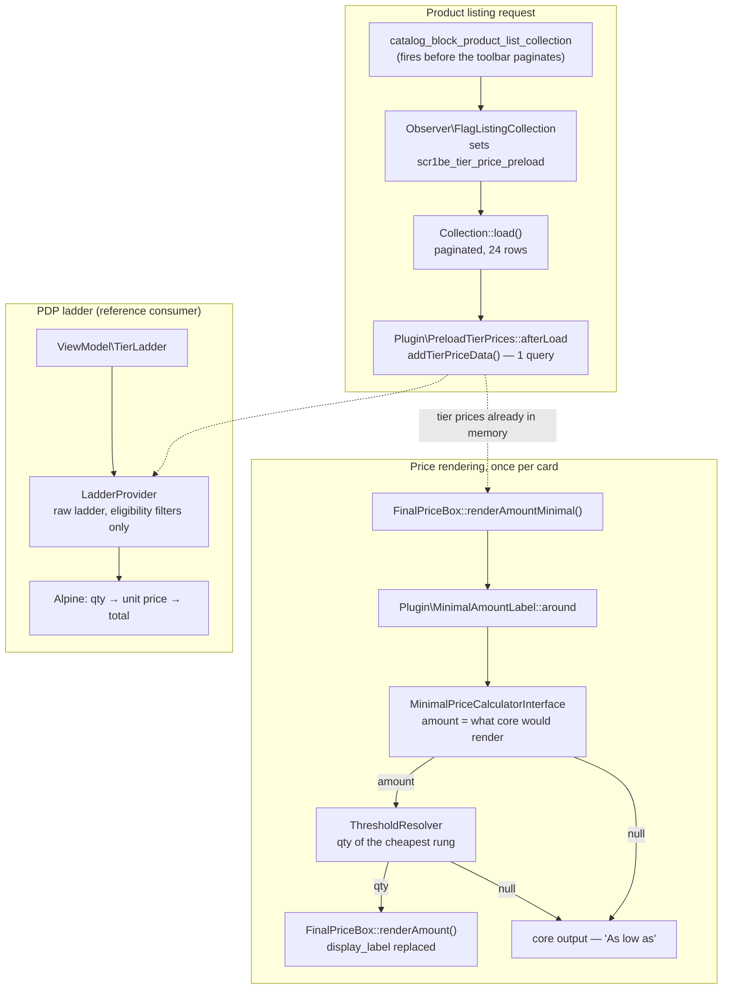

# Tier Price Label

Magento tells a shopper "As low as $9.00" and then refuses to say the one thing that would
make the sentence useful: **how many** do they have to buy. This module answers it —
"From 5 pcs — $9.00" — without adding a single query to the page. On a product grid it
*removes* queries.

Three moving parts, each solving a different half of the same problem:

| Part | Problem it solves |
|---|---|
| `around` plugin on the minimal-amount render | The label itself — rebuilt, never string-patched |
| `TierLadder` ViewModel | Gives Hyvä templates the *raw* ladder so a qty → price calculator can run client-side |
| Observer + collection plugin | One tier-price query per listing page instead of one per card |

## Why this exists

"As low as" is a rendering bug with a business cost. The price is real, the condition behind
it is invisible, and the shopper finds out at the cart — which is the worst possible moment to
learn that the number they remembered needed a quantity attached. Every merchant with tier
prices eventually files this ticket.

It is also a small, sharp example of a category of Magento work that is easy to do badly:
decorating core rendering. The obvious implementations — `after` plugin with a `str_replace`,
or a template override copied out of `vendor/` — both work on the demo store and both rot.
This module is what the careful version looks like.

## What's interesting (and what's just baseline)

| Choice | Why | Honest classification |
|---|---|---|
| `around` on `FinalPriceBox::renderAmountMinimal()`, re-issuing the *same public* `renderAmount()` call with one argument changed | The alternatives are a regex over rendered HTML (`after`) or nothing to intercept (`before`) | Architectural — this is the only version that survives translation and theme changes |
| Threshold picked by **cheapest price**, not highest qty | Ladders are not monotonic: percentage rungs move with the base price, and merchandisers add rows out of order | The actual insight in the module |
| Every uncertainty returns `$proceed()` | A decoration plugin must degrade to stock wording, never to a broken line | Baseline discipline, frequently skipped |
| Observer selects collections, `afterLoad` plugin loads them | The listing event fires *before* the toolbar paginates — loading there would pull the whole category | Architectural — see [Design decisions](#design-decisions) |
| ViewModel bypasses core's tier filtering on purpose | Core's list is a *rendering* list; a client-side calculator needs the rungs core hides | Architectural |
| Customer group read from the HTTP context, never the session | Anything session-derived is invisible to the FPC cache key | Baseline Magento, routinely got wrong |
| Copy lives in `i18n/`, not in a `system.xml` field | The only variable here is wording, and wording belongs where translators already look | Opinionated |

## Architecture



### 1. The label

`Magento\Catalog\Pricing\Render\FinalPriceBox::renderAmountMinimal()` takes no arguments and
builds its label internally, so `before` has nothing to grab and `after` only sees finished
HTML. `around` is the only hook that can do the safe thing: call the same public
`renderAmount()` core would have called, with `display_label` replaced and the other three
arguments core passes — `price_id`, `include_container`, `skip_adjustments` — reproduced
verbatim.

`price_id` matters more than it looks, and it is the easiest thing here to get wrong by
guessing. Core does not compose a special id for the minimal price: it asks the block
(`PriceBox::getPriceId()`, which builds `price_id`, or `price_id_prefix` + product id +
`price_id_suffix` from block data) and only when that yields nothing does it fall back to
`product-minimal-price-<id>`. So this module delegates to `getPriceId()` and mirrors that one
fallback, rather than reconstructing an id of its own.

The consequence is visible on Hyvä specifically. The theme's amount template
(`Magento_Catalog/templates/product/price/amount/default.phtml`) emits its `x-id` scope and the
`:id="$id(...)"` binding **only when the id is truthy**. An id that came out empty — which is
what any "rebuild it from the prefix" approach produces on a normal PDP, since core sets no
`price_id_prefix` there — leaves the price node outside Alpine's id scope, and configurable
swatch selection quietly stops updating the line.

The amount itself comes from `MinimalPriceCalculatorInterface` — the same service core uses —
so the number never diverges from what core would have printed. Only the words change.

**The fall-through is a feature.** No minimal amount, no quantity worth naming, an exotic price
pool that has no `tier_price` model: each returns `$proceed()`. A grouped product whose minimal
price comes from an associated simple, a product whose only tier starts at qty 1, a gift-card
type from some vendor — all of them keep stock Magento wording. The module's failure mode is
"unchanged", never "wrong" and never "empty".

### 2. Cheapest price, not highest quantity

The naive threshold is `max(qty)`. It is wrong whenever the ladder is not monotonic, and
ladders stop being monotonic often:

| qty | price | naive label | this module |
|---|---|---|---|
| 5 | $9.00 | From 10 pcs — $9.00 ❌ | From 5 pcs — $9.00 ✔ |
| 10 | $9.50 | | |

`ThresholdResolver` walks the rungs core is about to consider, keeps the cheapest, and breaks
ties toward the **lowest** quantity — so if 5 and 10 both land on $9.00, the label advertises 5,
which is both true and better for conversion. If the cheapest rung is reachable at a single
unit, it returns `null`: "From 1 pcs" is not a quantity story, it is just a lower price, and
core's wording is the right answer there.

### 3. One query instead of twenty-four

The first time a product is asked for its ladder, the tier-price attribute backend runs an
`afterLoad()` for that single product — one `SELECT` per card, invisible until you look at the
query log.

The brief-obvious fix is to call the bulk loader from
`catalog_block_product_list_collection`. That event is dispatched by
`ListProduct::initializeProductCollection()`, which runs *before* `_beforeToHtml()` hands the
collection to the toolbar — so at that moment the collection has no page size. Calling
`addTierPriceData()` there loads the entire category (2,040 rows on Luma sample data) to render
24 cards. It replaces N small queries with one enormous one, which is not the trade you wanted.

So the responsibility is split:

- **`Observer\FlagListingCollection`** — decides *which* collections deserve preloading. The
  event is perfect for that: it is dispatched by exactly the blocks that render grids of
  product cards, including `Magento\CatalogWidget`'s.
- **`Plugin\PreloadTierPrices::afterLoad`** — decides *when*: immediately after the paginated
  `load()`, the only moment where the item set is both complete and no larger than the page.

The plugin is attached to `Magento\Catalog\Model\ResourceModel\Product\Collection` in the
**frontend** area, so admin grids, imports and cron never enter it; for unflagged storefront
collections the body is two `getFlag()` calls and a return.

### 4. The ViewModel, and why it ignores core's filtering

`Magento\Catalog\Pricing\Price\TierPrice::getTierPriceList()` is a *rendering* list: it drops
every rung that is not cheaper than the product's current final price. Correct for printing a
discount table, wrong for a calculator.

Consider a product at $32.00 with rungs at 5 → $29.00 and 10 → $27.00, and a special price of
$28.00 running this week. Core's list hides the 5-rung. A calculator built on that list tells a
shopper typing "6" that they pay $28.00 — right — and a shopper typing "5" the same, then
$27.00 at 10. Fine so far. Take the special price off and the hidden rung reappears mid-session
from a cached payload, and the unit price appears to jump *up* as the quantity grows.

`LadderProvider` therefore goes back to the stored ladder and applies only the filters that are
about **eligibility** — customer group (`ALL` or the current one) and website — leaving the
"is this actually a discount today?" decision to the consumer, which compares against the live
final price. Same reason the JSON payload carries `basePrice`: the client needs it to make that
comparison itself.

Duplicate quantities (legal: one row per group and per website) collapse to the cheapest row,
because that is what the cart will charge.

## Design decisions

- **No `system.xml`.** The only variable in this module is wording, and a merchant who wants
  "From 5 units" is better served by `i18n/en_US.csv` than by an admin field nobody can find.
  Everything else — which products, which quantities — is already catalogue data.
- **No caching layer.** The ladder read is memoised per request inside the ViewModel (the PDP
  asks three times) and nothing else. Tier prices already ride the product's own cache; adding
  a second cache would mean inventing an invalidation story for data that has one.
- **Inline Alpine registration rather than a bundled ES module.** The PDP component is ~50 lines
  and the module ships no build step; requiring integrators to add a path alias to their theme's
  esbuild config to get a price table would be a bad trade. It is registered with
  `HyvaCsp::registerInlineScript()`, so strict-CSP storefronts are covered. Modules with enough
  JS to justify a bundle should take the alias route instead.
- **The PDP ladder table is optional.** It exists as the reference consumer of the ViewModel.
  Delete `view/frontend/layout/catalog_product_view.xml` and the label — the actual point of the
  module — is untouched.

## What gets shipped

```
src/
├── registration.php
├── composer.json                     # scr1be/tier-price-label, type magento2-module
├── etc/
│   ├── module.xml
│   └── frontend/
│       ├── di.xml                    # both plugins, frontend-scoped on purpose
│       └── events.xml                # catalog_block_product_list_collection
├── Model/
│   ├── ThresholdResolver.php         # cheapest rung → the qty the label advertises
│   ├── LadderProvider.php            # raw ladder, eligibility filters only
│   ├── CustomerGroupResolver.php     # HTTP context, never the session
│   ├── QtyFormatter.php              # locale-aware, DECIMAL(12,4) → "5"
│   └── TierRung.php                  # immutable value object
├── Plugin/
│   ├── Pricing/Render/MinimalAmountLabel.php        # around renderAmountMinimal()
│   └── Catalog/ResourceModel/PreloadTierPrices.php  # afterLoad, flag-gated
├── Observer/
│   └── FlagListingCollection.php
├── ViewModel/
│   └── TierLadder.php                # the module's public surface for templates
├── i18n/en_US.csv
├── view/frontend/
│   ├── layout/catalog_product_view.xml
│   └── templates/product/view/tier-ladder.phtml
└── Test/Unit/                        # 6 test classes, one per behaviour class
```

## Install

```bash
# from your Magento 2 root
composer config repositories.scr1be path /path/to/Magento/tier-price-label/src
composer require scr1be/tier-price-label:@dev
bin/magento module:enable Scr1be_TierPriceLabel
bin/magento setup:upgrade
bin/magento setup:di:compile
```

No configuration follows. The label changes wherever Magento renders a minimal price; the
preload starts on the next listing page.

To change the copy, add a row to your own `i18n/en_US.csv`:

```csv
"From %1 pcs —","Buy %1 or more —"
```

## Using the ViewModel

```php
/** @var \Scr1be\TierPriceLabel\ViewModel\TierLadder $tierLadder */
$tierLadder = $block->getData('tier_ladder_view_model');

$tierLadder->hasLadder($product);              // bool
$tierLadder->getLadder($product);              // TierRung[], ascending qty
$tierLadder->getThresholdQty($product);        // float|null — the qty the label advertises
$tierLadder->formatQty(5.0);                   // '5'
$tierLadder->getCalculatorPayload($product);   // JSON for the Alpine component
```

The payload is deliberately small and self-sufficient:

```json
{
  "basePrice": 32,
  "currency": "USD",
  "locale": "en-US",
  "rungs": [
    {"qty": 5, "value": 29, "formatted": "$29.00", "percentage": null},
    {"qty": 10, "value": 27, "formatted": "$27.00", "percentage": null}
  ]
}
```

`currency` + `locale` are there so `Intl.NumberFormat` on the client produces the same string
the server would have — no second money-formatting implementation to keep in sync.

## Demo notes

On a stock **Magento 2.4.8 + Hyvä 1.4 + Luma sample data** storefront:

1. **Give a product a ladder.** Catalog → Products → *Chaz Kangeroo Hoodie* → Advanced Pricing →
   Customer Group Price. Add `qty 5 → 45.00` and `qty 10 → 42.00`, group `ALL GROUPS`. Save,
   then reindex (`bin/magento indexer:reindex catalog_product_price`) and flush the FPC.
2. **Before / after.** The category page card and the PDP both read
   ~~"As low as $42.00"~~ → **"From 10 pcs — $42.00"**.
3. **The non-monotonic case** — the one that separates this from a `str_replace`: change the
   ladder to `qty 5 → 42.00`, `qty 10 → 45.00`. A `max(qty)` implementation now says
   "From 10 pcs — $42.00", which is a price the shopper cannot get at that quantity. This module
   says **"From 5 pcs — $42.00"**.
4. **Query count.** `bin/magento dev:query-log:enable` (Magento_Developer, dev mode only), load
   a category page, then count the tier-price lookups:

   ```bash
   grep -c 'catalog_product_entity_tier_price' var/debug/db.log
   ```

   With the module disabled, expect one lookup per card whose price box asks for a ladder — on a
   24-per-page grid that is 24, and 48 once a second consumer (the ladder ViewModel, a
   card-level badge) asks as well. With it enabled the same page shows **one**. The absolute
   numbers depend on your page size and on how many products actually carry tier prices; the
   shape does not. Re-run with the FPC off, or the second page load measures nothing at all.
5. **PDP calculator.** On the product page, the ladder table renders under the price. Type a
   quantity into the add-to-cart field: the "Your price at this quantity" line and the active row
   follow along, formatted in the store's own currency and locale.

The layout file targets `product.info.main`, which Hyvä 1.4 keeps from core. If your theme
renamed it, move the block — the ViewModel does not care where it is rendered.

## Tests

```bash
# from your Magento 2 root
# path follows your install method — Composer package:
vendor/bin/phpunit -c dev/tests/unit/phpunit.xml.dist vendor/scr1be/tier-price-label/Test/Unit

# …or, if you copied the module into app/code instead:
vendor/bin/phpunit -c dev/tests/unit/phpunit.xml.dist app/code/Scr1be/TierPriceLabel/Test/Unit
```

Six classes covering the behaviour that can actually break: the threshold ladder walk (including
non-monotonic and tie cases), both plugin fall-through paths, the argument rebuild, the
flag-gated preload, and the eligibility filtering in the ladder provider. Layout XML, the
registration file and the value object are wiring — they are covered by the storefront, not by
mocks.

## Compatibility

| | Version |
|---|---|
| PHP | 8.2, 8.3, 8.4 |
| Magento 2 | 2.4.6, 2.4.7, 2.4.8 |
| Hyvä Theme | 1.3.x, 1.4.x |
| Alpine.js | 3.x |

The label and the preload are pure backend — they work on Luma too. Only the PDP ladder template
assumes Hyvä (Tailwind classes, `HyvaCsp`); drop the layout file to run the rest anywhere.

## License

MIT — see [LICENSE](LICENSE).
